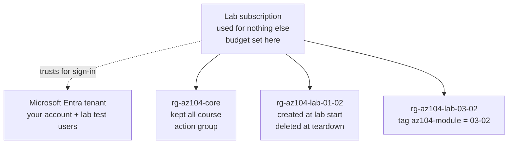

# Your Lab Subscription and Conventions

> **Safe lab foundation.** Not exam content: it sets up the place every AZ-104 lab in this Academy runs, and the
> habits that keep it cheap and tidy.

## The problem

Every lab in this Academy creates real Azure resources in a real subscription, and you pay for them. Before the first
lab, four decisions need making once, because getting them wrong later is expensive or confusing to undo: **which
subscription** the labs run in, **which region** they use, **what everything is called**, and **who holds which
access**. Without those decisions, resources end up in the wrong place, nobody can tell lab leftovers from real work,
and a forgotten resource keeps billing for weeks.

## In plain English

You'll do all the labs in **one subscription used for nothing else**, in **one home region**. Each lab builds
inside **its own resource group**, named after the lab, so finishing a lab means deleting one container. Every
resource also carries a **tag** naming the lab that created it, so anything that escapes its resource group can still
be found. One small resource group, `rg-az104-core`, stays for the whole course: it holds the alert plumbing you
build in [00-01](./00-01-cost-guardrails-and-budgets.md).

Your own account is usually the **Owner** of a subscription you signed up for yourself. Least privilege, for you, means
something specific: every role a lab gives to *someone or something else* (a test user, a group, a managed identity)
is the narrowest role at the narrowest scope that does the job, and the lab's teardown removes it.

## Words you need to know

| Term | In plain English |
| --- | --- |
| **Lab subscription** | A subscription that holds nothing but your study labs, so deleting things in it is never risky. |
| **Context** | The account, subscription and tenant your PowerShell or CLI commands will act on right now. |
| **Home region** | The one Azure region you deploy every lab into, unless a lab needs a second one. |
| **Naming convention** | An agreed pattern for names, so a name tells you what a thing is and which lab made it. |
| **Tag** | A name-value label on a resource, such as `az104-module = 03-02`, used to find, group and report on resources. |
| **Quota** | A per-subscription, per-region cap, such as how many vCPUs you can run, that a deployment can hit. |
| **Least privilege** | Giving an identity only the permissions it needs, at the smallest scope, for as long as it needs them. |

## Mental model



Solid arrows show containment; the dotted arrow is trust. This is the Academy's teaching layout, not a design for a
production estate, where subscriptions usually sit under management groups and resource groups follow applications.

| Everyday idea | Azure name |
| --- | --- |
| A workshop you only use for practice | Lab subscription |
| One labelled box per project, binned when the project ends | One resource group per lab |
| A sticker on every part saying which project it came from | The `az104-module` tag |
| The smoke alarm you never take down | `rg-az104-core` and the budget |

## Choosing the subscription

Use a subscription that exists only for this study: never one that runs anything real. Labs delete resource groups,
assign roles and policies at subscription scope, and the budget in [00-01](./00-01-cost-guardrails-and-budgets.md)
watches a whole subscription. Before every lab, confirm where your commands will land; the wrong context is the
most common way a lab ends up somewhere it shouldn't:

```powershell
Get-AzContext | Select-Object Account, Subscription, Tenant      # Azure PowerShell
az account show --query "{user:user.name, subscription:name, tenant:tenantId}" -o table   # Azure CLI

Set-AzContext -Subscription '<lab-subscription-id>'              # switch if it's wrong
az account set --subscription '<lab-subscription-id>'
```

## Choosing the region

Pick one region close to you and use it for every lab, so resources can reach each other and nothing is left behind
in a region you forgot about. Check three things before you commit:

- **Availability zones.** Several labs place resources in zones or use zone-redundant storage. Choose a region that
  supports zones ([0A-02](../0A-foundations/0A-02-regions-and-availability.md)).
- **VM sizes.** Small sizes aren't offered in every region, and a size can be restricted for your subscription:

  ```powershell
  az vm list-skus --location <region> --size Standard_B --output table
  ```

- **Quota.** vCPU quotas are set per subscription, per region and per VM family, and they count deallocated VMs as
  well as running ones. Check the region before a compute lab:

  ```powershell
  az vm list-usage --location <region> --output table
  ```

Labs that need a second region, such as the Site Recovery lab in 05-02, say so in their prerequisites.

## Naming and tagging

| Thing | Pattern | Example |
| --- | --- | --- |
| Lab resource group | `rg-az104-lab-<moduleId>` | `rg-az104-lab-03-02` |
| Long-lived resource group | `rg-az104-core` | — |
| Resource | `<abbrev>-az104-<moduleId>-<n>` | `vm-az104-03-02-1` |
| Microsoft Entra object | `az104-<moduleId>-<purpose>` | `az104-01-01-sales-dynamic` |
| Policy assignment | `az104-<moduleId>-<policy>` | `az104-01-03-allowed-loc` |
| Tag on every lab resource | `az104-module = <moduleId>` | `az104-module = 03-02` |

The prefixes (`rg`, `vm` and so on) follow the abbreviations in Microsoft's Cloud Adoption Framework naming guidance.
The resource group name finds most resources; the tag finds the ones that end up somewhere unexpected. Tags aren't
inherited: a resource doesn't get its resource group's tags, which is why each lab tags resources directly.

```powershell
# Find anything a lab created that is no longer in a lab resource group
Get-AzResource -TagName 'az104-module' |
    Where-Object ResourceGroupName -notlike 'rg-az104-lab-*' |
    Select-Object Name, ResourceType, ResourceGroupName, @{n='Module';e={$_.Tags['az104-module']}}
```

## Least-privilege access in the labs

- **Your account.** If you created the subscription yourself, you're its Owner, and if you created the tenant, you're
  its Global Administrator. Each lab's **Prerequisites** names the Azure or Microsoft Entra role it needs, so you can
  tell when a lab relies on that access.
- **Everything a lab grants.** Test users, groups and managed identities get the narrowest built-in role at the
  narrowest scope that makes the lab work, usually a resource group rather than the subscription.
- **Teardown removes it.** Role assignments live outside the resource group they point at, so deleting the group
  doesn't always clean them up ([00-02](./00-02-teardown-checklist-template.md)).
- **Studying in someone else's subscription?** Ask its owner for a role scoped to your lab resource groups rather than
  Owner of the subscription, and check each lab's prerequisites against what you were given.

## The one thing Global Administrator doesn't give you

New tenant admins usually trip over this in the first hour: **Global Administrator is a Microsoft Entra role and grants
no access to Azure resources.** The two are separate authorization systems: Microsoft Entra roles control the
directory; Azure RBAC controls subscriptions and everything in them ([0A-05](../0A-foundations/0A-05-identity-authn-authz.md)).

If a subscription was created under a different account, a Global Administrator can grant themselves access from the
directory side. In the Azure portal, go to **Microsoft Entra ID** > **Manage** > **Properties** and set **Access
management for Azure resources** to **Yes**. That gives your account User Access Administrator at root scope (`/`):
enough to assign yourself a normal Azure role on the subscription. Then set the toggle back to **No**; it's root-scope
access, and leaving it on is exactly the kind of over-privileged assignment [01-02](../01-identities-governance/01-02-azure-rbac.md)
teaches you to find.

```powershell
# What do I actually hold in this subscription?
Get-AzRoleAssignment -ObjectId (Get-AzADUser -SignedIn).Id |
    Select-Object RoleDefinitionName, Scope
```

## Where this shows up in AZ-104

- **Manage resource groups** and **Manage subscriptions** ([01-03 Subscriptions and Governance](../01-identities-governance/01-03-subscriptions-and-governance.md)): the lab layout is a small version of what the exam asks you to organize.
- **Apply and manage tags on resources** ([01-03](../01-identities-governance/01-03-subscriptions-and-governance.md)): the `az104-module` tag is the same mechanism, used for cleanup and cost reporting.
- **Manage role assignments at different scopes** ([01-02 Azure Role-Based Access Control](../01-identities-governance/01-02-azure-rbac.md)): every lab that grants a role is practice in choosing the scope.
- **Regions, zones and VM sizes** ([03-02 Virtual Machines](../03-compute/03-02-virtual-machines.md)): the region checks above are the same ones a VM deployment depends on.

## Check yourself

1. You run a lab command and it creates a resource group in your employer's production subscription. Which single check
   at the start of the lab would have caught it?
2. A lab resource carries the tag `az104-module = 03-02` but sits in `rg-az104-core`. How would you find it, and why did
   the resource group naming alone not catch it?
3. You're Global Administrator, but `Get-AzResource` returns nothing. What's wrong, and what are two ways to fix it?
4. A lab asks you to give a test user permission to start VMs in one resource group. What scope should the role
   assignment have, and when should it be removed?

## Teach it back

- Explain why the labs use one subscription, one region and one resource group per lab, as if to a colleague who
  wants to run them in their team's shared subscription.
- Explain the difference between being Global Administrator and being Owner of a subscription.

## Key takeaways

- One lab-only subscription, one home region, one resource group per lab, and a tag on every lab resource.
- Check your context before every lab: account, subscription and tenant.
- Least privilege in the labs means narrow roles for everything a lab grants, removed at teardown.
- Microsoft Entra roles and Azure RBAC are separate; Global Administrator alone can't see Azure resources.

## Sources

- Microsoft Learn: [What is Azure Resource Manager?](https://learn.microsoft.com/en-us/azure/azure-resource-manager/management/overview)
- Microsoft Learn: [Define your naming convention](https://learn.microsoft.com/en-us/azure/cloud-adoption-framework/ready/azure-best-practices/resource-naming)
- Microsoft Learn: [Use tags to organize your Azure resources](https://learn.microsoft.com/en-us/azure/azure-resource-manager/management/tag-resources)
- Microsoft Learn: [Best practices for Azure RBAC](https://learn.microsoft.com/en-us/azure/role-based-access-control/best-practices)
- Microsoft Learn: [Elevate access to manage all Azure subscriptions and management groups](https://learn.microsoft.com/en-us/azure/role-based-access-control/elevate-access-global-admin)
- Microsoft Learn: [Check vCPU quotas](https://learn.microsoft.com/en-us/azure/virtual-machines/quotas)
