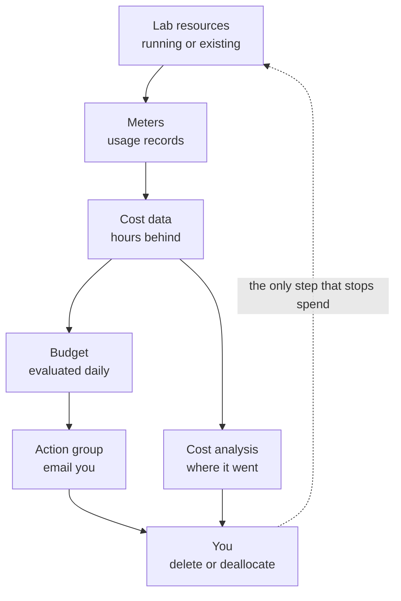

# Budgets and Cost Alerts

> **Safe lab foundation.** Do this before you create anything billable. The same skills, budgets and alerts, are also
> part of the AZ-104 governance objectives, taught properly in [01-03](../01-identities-governance/01-03-subscriptions-and-governance.md).

## The problem

Azure charges for resources as they run or exist, whether or not you're looking at them. A pay-as-you-go
subscription has no spending limit, and cost data reaches you hours after the spend happened. A lab VM you forgot
on Friday is still billing on Monday. You need two things before the first lab: an **alarm** that tells you when
spending heads past what you're willing to pay, and a **habit** of checking where the money went.

## In plain English

A **budget** is a spending target you set on a subscription or resource group. When actual or forecast cost crosses
a percentage of it, Azure sends a notification. It is an alarm, not a limit: **a budget never stops or deletes
anything**.

An **action group** is a reusable list of who, or what, to notify when an alert fires: email addresses, text
messages, and automated actions. Budgets can send to one.

**Cost analysis** is the view in Cost Management that shows where the money went, grouped by service, resource
group, resource or tag.

In this Academy, what actually stops spend is **you, deleting what you no longer need**. The alarm exists so that,
when you forget, you find out in hours rather than at the end of the month. (Azure can also be automated to shut
resources down when a budget fires, but that's beyond AZ-104, and the labs don't rely on it.)

## Words you need to know

| Term | In plain English |
| --- | --- |
| **Budget** | A spending target for a scope and period, with alert conditions. It notifies; it never enforces. |
| **Alert condition (threshold)** | A percentage of the budget that triggers a notification, such as 90%. |
| **Actual vs forecasted** | Actual fires on cost already incurred; forecasted fires when Azure projects you'll cross the threshold. |
| **Action group** | A named list of notifications and actions that alerts, including budgets, can call. |
| **Cost analysis** | The Cost Management view that breaks spend down by service, resource group, resource or tag. |
| **Meter** | One billable measure, such as VM compute hours or GB of disk, that turns usage into cost. |
| **Spending limit** | A cap that exists only on free-credit offers; when the credit runs out, resources are disabled. |
| **Deallocated** | A VM stopped through Azure, which releases its compute so compute billing stops. Disks still bill. |

## Mental model

Every arrow takes time, and the money is already spent before the first email arrives. That's why the Academy pairs
the alarm with same-day teardown ([00-02](./00-02-teardown-checklist-template.md)).

| Everyday idea | Azure name |
| --- | --- |
| A spending target on a bank card that texts you | Budget with alert conditions |
| The phone list for who gets the text | Action group |
| The itemized statement | Cost analysis |
| A prepaid card that stops working at zero | Spending limit on a free-credit offer |

## What bills, and when it stops

Knowing *how* each kind of resource bills tells you what teardown has to remove.

| Cost category | Lab examples | Stops when |
| --- | --- | --- |
| **Billed while it runs** | VM compute | The VM is **deallocated** or deleted. A VM shut down from inside its operating system shows *Stopped* and still bills for compute. |
| **Billed while it exists** | Managed disks (by provisioned size), Standard public IP addresses (hourly), storage account data, Azure Bastion's dedicated SKUs (hourly from deployment; the Developer SKU is free) | The resource is deleted. Deallocating a VM doesn't stop its disks or a static public IP. |
| **Billed while protected** | Azure Backup: a protected-instance fee plus backup storage | Protection is stopped **and** the backup data is deleted. Stopping protection alone keeps billing. |
| **Billed by volume** | Data sent into a Log Analytics workspace, data transfer across virtual network peering | No more data flows. Log data kept past the retention included in the price also bills until it ages out or the workspace is deleted. |
| **No charge of its own** | Resource groups, virtual networks, Azure Policy on Azure resources, budgets | Nothing to stop; what they contain or govern is what bills. |

Each lab's **Estimated cost** line names the meters it creates, and labs with an hourly meter say so at the top. The
Academy's cost planner groups every lab by that line.

## How budgets behave

- **Scope.** A budget can be set on a management group, a subscription or a resource group. The Academy uses one on
  the lab subscription, so it covers every lab resource group at once.
- **Timing.** Cost and usage data typically becomes available within 8 to 24 hours, budgets are evaluated against it
  every 24 hours, and a notification is usually sent within an hour of an evaluation that crosses a threshold. A new
  subscription can take up to 48 hours before Cost Management features are available.
- **Alert conditions.** Each is a percentage of the budget, from 0.01% to 1,000%, of type **Actual** or **Forecasted**.
  A budget can carry up to five, and send to up to five email addresses.
- **Action groups.** Budgets on a subscription or resource group scope can call an action group; budgets on other
  scopes send email only.
- **Who can create one.** Owner, Contributor or Cost Management Contributor on the scope.
- **Create it in the portal.** Microsoft documents that budgets created with PowerShell don't send notifications, so
  the lab creates the budget in the portal and uses PowerShell or the CLI only to read it.
- **Make sure the email arrives.** Budget emails come from `azure-noreply@microsoft.com`; action group emails can also
  come from `azureemail-noreply@microsoft.com` and `alerts-noreply@mail.windowsazure.com`. Add all three to your safe
  senders list. A new email address in an action group must also be verified with a one-time passcode within 30
  minutes, or it receives nothing.

### Spending limits are a different thing

Some offers, such as the Azure free account and subscriptions that come with monthly credit, have a **spending limit**
equal to the credit. When the credit is used up, deployed resources are disabled and VMs are deallocated for the rest
of the billing period. Pay-as-you-go subscriptions have no spending limit. A spending limit also doesn't cover
everything: some Marketplace services and support plans are billed separately even while it's on. Neither kind is a
substitute for teardown: when the limit is hit, your labs simply stop working.

## Hands-on

[Lab 00-01](../../labs/00-lab-safety/00-01-lab.md) creates `rg-az104-core`, an action group that emails you, a monthly
budget on the lab subscription with three alert conditions, and a cost analysis view grouped by the `az104-module` tag.
Nothing in it costs money.

## Where this shows up in AZ-104

- **Manage costs by using alerts, budgets, and Azure Advisor recommendations** is an exam skill in the governance
  functional group ([01-03 Subscriptions and Governance](../01-identities-governance/01-03-subscriptions-and-governance.md)). This lesson is your first practice of it.
- **Action groups** come back in Azure Monitor alerting ([05-01 Monitor Resources](../05-monitor/05-01-monitor-resources.md)), where metric and log alerts call them the same way budgets do.
- **Apply and manage tags on resources** ([01-03](../01-identities-governance/01-03-subscriptions-and-governance.md)): grouping cost by a tag is one of the reasons tags exist.
- **VM power states** ([03-02 Virtual Machines](../03-compute/03-02-virtual-machines.md)): *stopped* versus *deallocated* is a billing question as much as a compute one.

## Check yourself

1. Your $50 monthly budget sends its 100% actual alert. What happens to the VM that's still running?
2. You get the budget email at 09:00. Roughly how old might the spend that triggered it be, and why?
3. A lab VM shows **Stopped** after you shut it down from inside Windows. Is it still billing for compute? What would
   you do instead?
4. You deallocate a lab VM and leave it for a week. Which parts of it are still billing?
5. Why does this Academy create the budget in the portal rather than with `New-AzConsumptionBudget`?

## Teach it back

- Explain to a friend starting their first Azure subscription why a budget won't protect them on its own, and what
  will.
- Explain the difference between a budget, an action group and cost analysis in one sentence each.

## Key takeaways

- A budget is an alarm, never a limit: it notifies and stops nothing.
- Cost data lags by hours and budgets are evaluated daily, so teardown is the real control.
- Compute stops billing when a VM is deallocated; disks, public IPs and stored data bill until deleted.
- Create budgets in the portal, send them to an action group, and check cost analysis at the end of each session.

## Sources

- Microsoft Learn: [Tutorial: Create and manage budgets](https://learn.microsoft.com/en-us/azure/cost-management-billing/costs/tutorial-acm-create-budgets)
- Microsoft Learn: [Action groups](https://learn.microsoft.com/en-us/azure/azure-monitor/alerts/action-groups)
- Microsoft Learn: [Azure Bastion SKU comparison](https://learn.microsoft.com/en-us/azure/bastion/bastion-sku-comparison)
- Microsoft Learn: [Understand Cost Management data](https://learn.microsoft.com/en-us/azure/cost-management-billing/costs/understand-cost-mgt-data)
- Microsoft Learn: [Customize views in cost analysis](https://learn.microsoft.com/en-us/azure/cost-management-billing/costs/customize-cost-analysis-views)
- Microsoft Learn: [Azure spending limit](https://learn.microsoft.com/en-us/azure/cost-management-billing/manage/spending-limit)
- Microsoft Learn: [Power states and billing for Azure virtual machines](https://learn.microsoft.com/en-us/azure/virtual-machines/states-billing)
- Microsoft Learn: [Understand Azure Disk Storage billing](https://learn.microsoft.com/en-us/azure/virtual-machines/disks-understand-billing)
- Microsoft Learn: [An overview of Azure VM backup: backup costs](https://learn.microsoft.com/en-us/azure/backup/backup-azure-vms-introduction#backup-costs)
- Microsoft Learn: [Azure Monitor Logs cost calculations and options](https://learn.microsoft.com/en-us/azure/azure-monitor/logs/cost-logs)
- Microsoft Learn: [Azure Virtual Network cost optimization principles](https://learn.microsoft.com/en-us/azure/virtual-network/virtual-network-cost-optimization)
