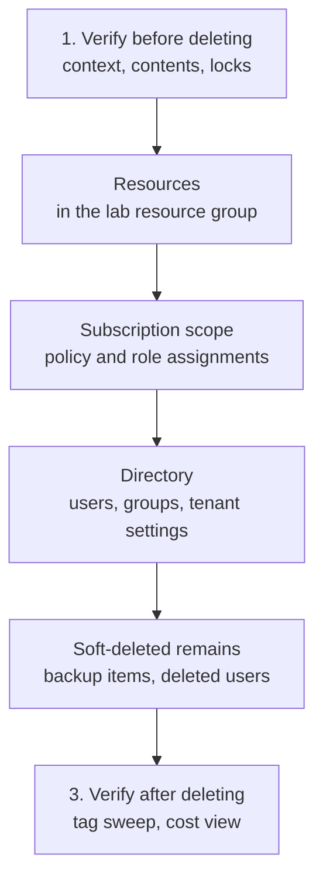

# Teardown and Verification

> **Safe lab foundation.** Every lab in this Academy ends with a `## Teardown` section built from this lesson. Read it
> once here, so the pattern is familiar every time you meet it.

## The problem

Deleting the lab's resource group feels like the end of a lab, and for most resources it is. But a lab also touches
places a resource group doesn't contain: role and policy assignments at subscription scope, users and groups in the
directory, and data that Azure keeps in a **soft-deleted** state for days after you delete it. Left behind, they keep
granting access, keep billing if they escaped the resource group, or block the next lab with an error you've
forgotten the source of.
And a delete aimed at the wrong subscription or the wrong resource group can't be taken back.

## In plain English

Teardown has three moves, in this order:

1. **Verify before you delete.** Confirm you're in the lab subscription, look at what's inside the resource group,
   and check for locks. Deletion is the one lab step you can't undo.
2. **Delete by bucket.** Remove the resources, then what the lab created outside the resource group: subscription
   settings, directory objects, and anything soft-deleted that matters.
3. **Verify after you delete.** Prove that nothing tagged for the lab remains and that nothing is still billing.
   A teardown you believe you did and a teardown you checked are different things.

## Words you need to know

| Term | In plain English |
| --- | --- |
| **Teardown** | Removing everything a lab created, then proving it's gone. |
| **Resource lock** | A setting (CanNotDelete or ReadOnly) that blocks deletion or changes, at a resource, group or subscription. |
| **Soft delete** | Azure keeps a deleted item recoverable for a retention period instead of removing it at once. |
| **Purge** | Permanently removing a soft-deleted item before its retention period ends, where that's allowed. |
| **Orphaned role assignment** | A role assignment whose user, group or identity no longer exists. It shows no display name. |
| **What-if run** | Running a script with `-WhatIf`, so it reports what it would delete without deleting anything. |

## Mental model



Only the first bucket goes away when the resource group does. The template below is ordered the same way.

| Bucket | Lives at | Survives deleting the resource group? |
| --- | --- | --- |
| **Resources** | Resource group | No, unless a lock or a dependency stops the delete |
| **Subscription-scope configuration** | Subscription or management group | **Yes**: policy assignments, role assignments, budgets, diagnostic settings |
| **Directory objects and settings** | Microsoft Entra tenant | **Yes**: users, groups, guests, and tenant-wide settings such as SSPR |
| **Soft-deleted remains** | Varies | **Yes**: backup items, deleted users, Log Analytics workspaces, key vaults |

## Verify before you delete

```powershell
# 1. Am I where I think I am?
Get-AzContext | Select-Object Account, Subscription, Tenant

# 2. What is actually in this resource group? Anything you don't recognise is a reason to stop.
Get-AzResource -ResourceGroupName 'rg-az104-lab-03-02' | Format-Table Name, ResourceType, Tags

# 3. Will a lock block the delete? First the locks within the group, then any on the group itself
#    or on the subscription above it.
Get-AzResourceLock -ResourceGroupName 'rg-az104-lab-03-02' | Select-Object Name, @{ n = 'Level'; e = { $_.Properties.level } }
Get-AzResourceLock -ResourceGroupName 'rg-az104-lab-03-02' -AtScope | Select-Object Name, @{ n = 'Level'; e = { $_.Properties.level } }

# 4. Rehearse the whole teardown without deleting anything
.\scripts\teardown\Remove-LabResourceGroup.ps1 -LabId '03-02' -WhatIf
```

Locks are an AZ-104 skill in their own right ([01-03](../01-identities-governance/01-03-subscriptions-and-governance.md)).
In teardown, remove the lab's own locks deliberately and then delete; never delete a lock you didn't create.

## The traps, specifically

**Recovery Services vaults.** A vault can't be deleted while it holds protected items or backup data, and that
includes backup items in the **soft-deleted** state. Soft delete is on by default, and soft-deleted backup items are
kept for 14 days unless the vault is set to keep them longer. Until then the vault blocks its own deletion, and with it
the resource group. Billing for a protected
VM continues while its backup data exists, even after protection stops ([05-02](../05-monitor/05-02-backup-and-recovery.md)).

**Deallocated isn't deleted.** A deallocated VM stops billing for compute, but its disks keep billing until they're
deleted. A VM shut down from inside its operating system bills for compute as well.

**Azure Policy assignments.** Usually scoped to the subscription, not the resource group. They keep evaluating and can
deny a later lab's deployment.

**Role assignments.** Deleting a user, group or managed identity leaves its role assignments behind as orphans with no
display name. Clean them up; reading and removing assignments is part of [01-02](../01-identities-governance/01-02-azure-rbac.md).

**Microsoft Entra objects and settings.** Users, groups and guests are never in a resource group. A deleted user waits
30 days in **Deleted users** and can be restored until then. Its user principal name is free for a new user in the
meantime, but restoring the old user then conflicts with the new one and needs a different name.
Tenant-wide settings, such as self-service password reset, apply to every user: record their values before a lab
changes them, and restore them in teardown.

**Log Analytics workspaces.** Deleting one puts it in a soft-delete state for 14 days. Creating a workspace with the
same name in the same resource group and region during that time recovers the old one, data and all.

**Key vaults.** No lab here creates one. Soft delete is on by default, so a deleted vault's name stays reserved for
its retention period. Customer-managed keys for storage also need **purge protection**, which can't be turned off
once it's on and keeps a deleted vault from being purged until its retention ends; that's why
[02-02](../02-storage/02-02-storage-accounts.md) teaches them as a walkthrough. If you create a vault yourself, leave
purge protection off unless you need it.

**Diagnostic settings.** Settings on the subscription's activity log survive resource group deletion.

## The template

Every lab's `## Teardown` uses this shape. Lines that don't apply are left out; the headings stay, so the shape is
the same in every lab.

```markdown
## Teardown

**Mandatory.** Run before closing the session.

### 1. Resources
- [ ] Confirm the context and the resource group's contents (verify before deleting)
- [ ] Remove any resource locks this lab created
- [ ] Delete the lab resource group `rg-az104-lab-<moduleId>`

### 2. Subscription scope
- [ ] Remove Azure Policy assignments created by this lab
- [ ] Remove role assignments created by this lab
- [ ] Remove subscription-level diagnostic settings created by this lab

### 3. Directory scope
- [ ] Delete users, groups and guests created by this lab
- [ ] Restore any tenant-wide setting this lab changed, to the value you recorded

### 4. Soft-deleted remains
- [ ] Note any soft-deleted backup items and the date the vault becomes deletable
- [ ] Permanently delete lab users from Deleted users, or note the date they expire

### 5. Access
- [ ] Remove any role you assigned to your own account only for this lab

### 6. Verify
- [ ] `Get-AzResource -TagName 'az104-module' -TagValue '<moduleId>'` returns nothing
- [ ] Cost analysis shows no new daily cost for the lab tomorrow
```

## The verification sweep

Run this at the end of any study session, whichever labs you did. The scripted version,
[`scripts/teardown/Remove-LabResourceGroup.ps1`](../../scripts/teardown/Remove-LabResourceGroup.ps1), runs the same
checks with `-SweepOnly`.

```powershell
$SubId = (Get-AzContext).Subscription.Id

# 1. Anything tagged for a lab but outside a lab resource group
Get-AzResource -TagName 'az104-module' |
    Where-Object ResourceGroupName -notlike 'rg-az104-lab-*' |
    Format-Table Name, ResourceType, ResourceGroupName

# 2. Lab resource groups still standing
Get-AzResourceGroup -Name 'rg-az104-lab-*' | Format-Table ResourceGroupName, Location

# 3. VMs that still bill for compute (anything not deallocated)
Get-AzVM -Status | Where-Object PowerState -ne 'VM deallocated' | Format-Table Name, ResourceGroupName, PowerState

# 4. Policy assignments the labs created at subscription scope
Get-AzPolicyAssignment -Scope "/subscriptions/$SubId" |
    Where-Object { $_.Name -like 'az104-*' } | Format-Table Name, Scope

# 5. Orphaned role assignments, at any scope in the subscription
Get-AzRoleAssignment | Where-Object { -not $_.DisplayName } | Format-Table RoleDefinitionName, ObjectId, Scope
```

Once a week, compare the sweep with cost analysis grouped by the `az104-module` tag. Anything you can't account for is
either something you missed or something you didn't create, and both are worth knowing about.

## Where this shows up in AZ-104

- **Configure resource locks** and **Manage resource groups** ([01-03 Subscriptions and Governance](../01-identities-governance/01-03-subscriptions-and-governance.md)): why a delete fails, and what a lock does about it.
- **Manage role assignments** ([01-02 Azure Role-Based Access Control](../01-identities-governance/01-02-azure-rbac.md)): finding and removing assignments, including orphans.
- **Back up and restore** ([05-02 Backup and Recovery](../05-monitor/05-02-backup-and-recovery.md)): soft delete and why a vault won't delete.
- **Manage users and groups** ([01-01 Entra Users and Groups](../01-identities-governance/01-01-entra-users-and-groups.md)): deleted users, their 30-day restore window, and name conflicts on restore.

## Check yourself

1. `Remove-AzResourceGroup` fails on a lab resource group. Name two causes this lesson predicts, and how you'd tell
   them apart.
2. You stopped protection and deleted the backup data for the only item in a Recovery Services vault. Why can't you
   delete the vault today, and when can you?
3. Which items in the verification sweep would deleting the resource group never catch?
4. You deleted a lab user yesterday, created a new user with the same user principal name today, and now want the
   old user back. What happens when you restore it, and how do you get past it?
5. Before deleting `rg-az104-lab-03-02`, which three things do you check, and why?

## Teach it back

- Explain the four teardown buckets to someone who thinks deleting the resource group is enough.
- Explain why this Academy verifies before deleting as well as after.

## Key takeaways

- Verify the context, the contents and the locks before any delete: deletion can't be undone.
- Deleting the resource group clears only the first of four buckets.
- Soft-deleted items (backup data, users, workspaces, key vaults) can block a deletion, or a name you want to reuse,
  after you've deleted them.
- Prove the teardown with a sweep: a tag search, the VM power states and tomorrow's cost view.

## Sources

- Microsoft Learn: [Azure Resource Manager resource group and resource deletion](https://learn.microsoft.com/en-us/azure/azure-resource-manager/management/delete-resource-group)
- Microsoft Learn: [Lock your resources to protect your infrastructure](https://learn.microsoft.com/en-us/azure/azure-resource-manager/management/lock-resources)
- Microsoft Learn: [Delete an Azure Backup Recovery Services vault](https://learn.microsoft.com/en-us/azure/backup/backup-azure-delete-vault)
- Microsoft Learn: [Soft delete for Azure Backup, FAQ](https://learn.microsoft.com/en-us/azure/backup/soft-delete-azure-backup-faq)
- Microsoft Learn: [Power states and billing for Azure virtual machines](https://learn.microsoft.com/en-us/azure/virtual-machines/states-billing)
- Microsoft Learn: [Restore or remove a recently deleted user](https://learn.microsoft.com/en-us/entra/fundamentals/users-restore)
- Microsoft Learn: [Restore deleted item (directory object)](https://learn.microsoft.com/en-us/graph/api/directory-deleteditems-restore)
- Microsoft Learn: [Delete and recover an Azure Monitor Log Analytics workspace](https://learn.microsoft.com/en-us/azure/azure-monitor/logs/delete-workspace)
- Microsoft Learn: [Azure Key Vault soft-delete overview](https://learn.microsoft.com/en-us/azure/key-vault/general/soft-delete-overview)
