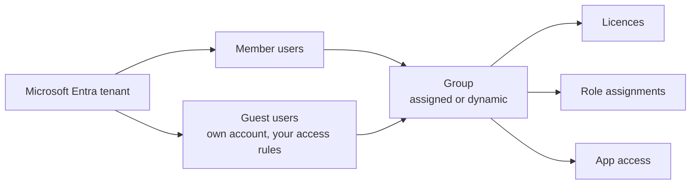
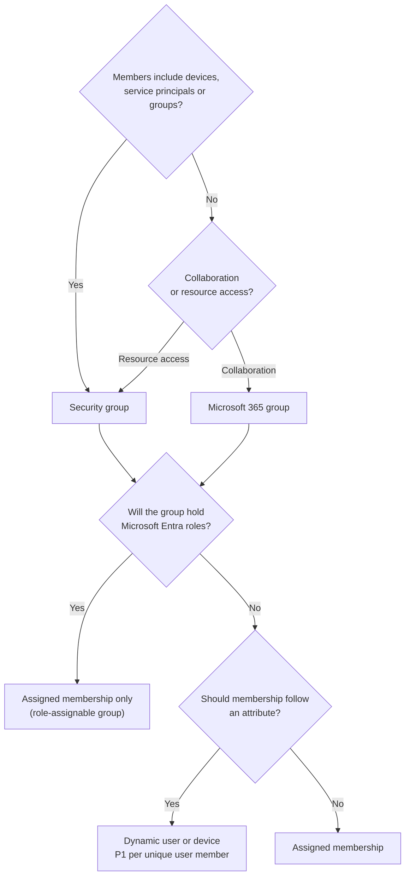

# Microsoft Entra Users and Groups

> **Objective:** Manage Microsoft Entra users and groups
> **Domain:** Manage Azure identities and governance (20-25%)

## Sub-objectives covered

- Create users and groups
- Manage user and group properties
- Manage licenses in Microsoft Entra ID
- Manage external users
- Configure self-service password reset (SSPR)

## The administrative problem

A new employee starts on Monday. They need an account to sign in with, a Microsoft 365 licence, and the
same access as the rest of their team. A consultant from a partner company needs to reach one application, and you
don't want to manage their password. Meanwhile, the help desk spends hours every week resetting forgotten passwords.
Every one of these is an identity task, and none of them can wait until someone needs a VM.

Every access decision in Azure starts with an identity. Before you can grant a
role, assign a licence or let a partner into a resource, the person has to exist
as an object in Microsoft Entra ID, the directory your Azure subscription trusts.

Administrators rarely grant access to people one at a time. They grant it to
**groups**, and put people in groups. That one habit is what this module is really
about: once access flows through groups, onboarding becomes "add to the right
group" and offboarding becomes "remove from the group", and both are auditable.
Licences, role assignments and application access can all target a group.

The remaining two bullets are the edges of the directory. **External users** are
people from outside your organisation who need access to your resources without
you managing their passwords. **Self-service password reset** removes the most
common help-desk request by letting users prove who they are and reset their own
password.

> **Exam note.** Microsoft Entra ID is the current name. Older material says Azure
> Active Directory or Azure AD; the exam uses the new name. The AzureAD and
> MSOnline PowerShell modules are deprecated; use Microsoft Graph PowerShell
> (`Microsoft.Graph`) for everything in this module.

## In plain English

Microsoft Entra ID is the directory your Azure subscription trusts. Everything that signs in has an object there.

- A **user** is one person's account. **Members** belong to your organization; **guests** are people from outside
  who sign in with their own organization's or personal account, so you never hold their password.
- A **group** is a list of users (and sometimes devices or other identities). You grant access, licences and roles
  to the group once, then manage who is in it. That one habit is what keeps access manageable.
- A group's membership is either **assigned** (you add people) or **dynamic** (a rule such as "department equals
  Sales" adds and removes people automatically).
- A **licence** turns on a paid product, such as Microsoft 365, for a user. It can be assigned to a user or to a group.
- **Self-service password reset (SSPR)** lets users prove who they are with methods they registered earlier, then
  reset their own password without calling anyone.

## Words you need to know

| Term | In plain English |
| --- | --- |
| **User** | An account for one person in the directory. Members belong to your organization. |
| **Guest user** | Someone from outside your organization who signs in with their own account. You manage their access, not their password. |
| **Security group** | A group used to grant access to resources and apps. It can contain users, devices, service principals and other groups. |
| **Microsoft 365 group** | A collaboration group with a shared mailbox, calendar and files. Its members can only be users. |
| **Assigned membership** | An administrator adds and removes members by hand. |
| **Dynamic membership** | A rule on user or device attributes decides who is in the group. Needs Microsoft Entra ID P1. |
| **Usage location** | The country set on a user. A licence can't be assigned until it's set. |
| **Licence** | A paid product, such as Microsoft 365 E3 or Microsoft Entra ID P1, assigned to users or groups. |
| **SSPR** | Self-service password reset: users reset their own password after proving who they are. |
| **Authentication method** | Something a user registers to prove identity, such as the Authenticator app, a phone or email. |

## Mental model



Grant to the group, manage the membership: joining and leaving become one change each, and every grant is
auditable in one place. This is a conceptual teaching model, not a complete architecture.

**Azure translation**

| Everyday idea | Azure name |
| --- | --- |
| The company staff directory | Microsoft Entra tenant |
| An employee badge | Member user |
| A visitor badge for a partner | Guest user (B2B collaboration) |
| A team mailing list you add people to | Group with assigned membership |
| "Everyone in Sales, automatically" | Group with dynamic membership |
| A software seat from the IT budget | Licence |
| A forgotten-password kiosk | Self-service password reset |

## Where it fits

The ten questions to ask about any resource ([0A-13](../0A-foundations/0A-13-how-resources-fit-together.md)), answered for the main resource in this lesson.

| Question | Users and groups |
| --- | --- |
| What contains it? | The Microsoft Entra tenant. Users and groups aren't Azure resources and don't live in a subscription or resource group. |
| What does it depend on? | The tenant. A licence needs the user's usage location; dynamic membership needs Microsoft Entra ID P1. |
| What depends on it? | Role assignments, licences, application access and SSPR scope that target the user or group. |
| Who can manage it? | Microsoft Entra roles such as User Administrator and Groups Administrator; Guest Inviter can invite guests. |
| How is it networked? | Not networked. Sign-in happens against Microsoft Entra ID. |
| How is it monitored? | Microsoft Entra sign-in logs and audit logs. |
| How is it protected? | MFA, SSPR registration, least-privilege admin roles, external collaboration settings. |
| How is it recovered? | Deleted users and Microsoft 365 groups can be restored for 30 days. |
| What does it cost? | Users, groups and invitations are free; licences, and features such as dynamic groups, are paid. |
| How is it removed safely? | Before deleting a group, check what it grants: roles, licences and apps disappear for every member. |

See it with its neighbours on the [resource map](#/map/user-group).

## How it works under the hood

### Users: members and guests

A user object is either a **member** (someone who belongs to your organisation) or
a **guest** (someone invited from outside). Members are usually created directly in
the tenant or synchronised from on-premises Active Directory. Guests arrive through
B2B collaboration, covered below.

The properties you set on a user are not decoration. **Usage location** decides
whether a licence can be assigned at all. **Department**, **job title**, **city**,
**country** and similar attributes are what dynamic membership rules read. A
missing or misspelled department is a missing group membership.

For many users at once, the admin center offers **bulk operations** driven by a CSV
template: bulk create, bulk invite, bulk delete, bulk restore, and download.
Download the template for the specific operation. Some templates start with a
`version:v1.0` row and some don't, and a template with altered header rows is
rejected.

**Deleting a user is reversible for 30 days.** The account is suspended with all its
properties, and appears under **Deleted users**. Restoring it also restores the
licences it held, even if that puts the organisation over its purchased count.
After 30 days, or if you choose **Delete permanently**, nobody can restore it,
Microsoft Support included. A user synchronised from on-premises is managed at
the source: delete it in the cloud and the next sync can bring it back.

### Groups: two types, three membership models

| | Security group | Microsoft 365 group |
| --- | --- | --- |
| Purpose | Access to shared resources | Collaboration |
| Members | Users, devices, service principals, other groups | Users only (including people outside the organisation) |
| Owners | Users and service principals | Users and service principals |
| Can contain other groups | Yes (nested groups) | No: members are users only |

Membership is set independently of type:

- **Assigned**: an administrator or group owner adds and removes members.
- **Dynamic user**: a rule on user attributes adds and removes members automatically.
- **Dynamic device**: a rule on device attributes adds and removes devices.

A dynamic group holds users **or** devices, never both, and a device rule can't
read the device owner's attributes. Because a Microsoft 365 group can only contain
users, a device-based dynamic group has to be a security group.

The same choices as a decision flow. Every box restates a rule from the table
and list above; nothing here is additional behaviour.



### Dynamic membership rules

A rule is an expression over one object type, for example
`user.department -eq "Sales"`. Operators include `-eq`, `-ne`, `-startsWith`,
`-contains`, `-in`, `-notIn` and `-match`. Whenever a user's or device's attributes
change, Microsoft Entra ID re-evaluates the rules and adds or removes the object.

Three consequences matter in scenario questions:

1. **You can't add or remove a member of a dynamic group by hand.** To change
   membership, change the rule or change the attribute on the user.
2. **The rule builder in the admin center handles user rules of up to five
   expressions.** Device rules, and anything more complex, go in the rule text box.
3. **Licensing is counted, not assigned.** Each unique user who is a member of any
   dynamic group needs a Microsoft Entra ID P1 licence in the organisation. You
   don't assign it to them, but you must own enough. Devices need no licence.

A group can be switched between static and dynamic by changing its group types.
Setting the processing state to **Paused** freezes a dynamic group's current
membership.

### Licences

A licence (a product such as Microsoft 365 E3 or Microsoft Entra ID P1) is made
of **service plans**. Assigning one to a user turns those services on for them.

- **Usage location first.** Some services aren't available in every country, so a
  licence can't be assigned to a user whose usage location is not set. With
  group-based licensing, a user without one inherits the tenant's location.
- **Group-based licensing** assigns a licence to a group, and every member gets it.
  It works with security groups, mail-enabled groups and Microsoft 365 groups, and
  pairs naturally with dynamic groups.
- **Nested groups are not supported for licensing.** Only first-level members of
  the licensed group receive the licence; members of a group inside it do not.
- **Errors are per user.** The documented causes are: not enough licences,
  conflicting service plans (two products that both contain plans that can't
  coexist, reported as `MutuallyExclusiveViolation` in PowerShell), missing
  dependencies, proxy address conflicts, and usage location problems.
- **Moving a user between licensed groups:** add them to the new group first,
  confirm the licence landed, then remove them from the old one. Doing it the other
  way round leaves them briefly unlicensed.

> **Exam note.** The skill says "in Microsoft Entra ID", and Microsoft's current
> documentation performs user and group licence assignment in the **Microsoft 365
> admin center** (Billing > Licenses). Older material shows a Licenses page in the
> Entra portal. The rules above are the same wherever you click; learn the rules,
> not the blade.

### External users: B2B collaboration

B2B collaboration is **on by default**. Inviting someone creates a user object in
your tenant for that external identity, and they sign in with their own
credentials. Their home organisation, or their email provider, keeps their
password. The account is a **guest** by default.

Two separate sets of controls decide whether collaboration happens:

- **External collaboration settings** decide who in *your* tenant may invite, which
  domains may be invited, and what guests can see.
- **Cross-tenant access settings** apply to collaboration with other Microsoft
  Entra organisations. They set inbound and outbound rules, can scope them to
  users, groups and applications, and can trust the other tenant's MFA and device
  claims.

When both sets apply, **the most restrictive setting wins**. If the external
collaboration settings block a domain, invitations to it fail even when the
cross-tenant access settings allow that organisation.

External collaboration settings, from least to most restrictive:

| Setting | Options |
| --- | --- |
| Guest user access | Same access as members · **Limited access to properties and memberships of directory objects (default)** · Restricted to their own directory objects |
| Guest invite settings | Anyone, including guests (default) · Members and specific admin roles · Only users with specific admin roles (User Administrator or Guest Inviter) · No one, including admins |
| Collaboration restrictions | Allow invitations to any domain, or to an allow list only, or to all except a deny list |
| External user leave settings | Whether guests can remove themselves. Available only once privacy information is set on the tenant |

The **Guest Inviter** role lets a specific user send invitations even when
invitations are limited to admin roles, without giving them a broader
administrator role.

### Self-service password reset

SSPR is scoped per tenant to **None**, **Selected** or **All** users. In the admin
center, **Selected** takes **one** group; nested groups inside it are supported.
Configuring SSPR takes at least the **Authentication Policy Administrator** role.

The settings that decide whether a user can reset:

- **Number of methods required to reset:** one or two.
- **Methods available**, from the Authentication methods policy: Microsoft
  Authenticator notifications, software OATH tokens (hardware OATH tokens are in
  preview), SMS, voice call, and email one-time passcode. Authenticator can't be the
  only method when one is required.
- **Registration:** optionally require users to register when they sign in, and ask
  them to reconfirm their details every 0 to 730 days. 0 means never.
- **Notifications:** notify users when their own password is reset, and notify all
  admins when another admin resets theirs.

Two rules decide most SSPR scenario questions:

1. **Administrators get a different, fixed policy.** Accounts holding an
   administrator role are enabled for SSPR by default under a **two-gate** policy:
   two pieces of authentication data, and security questions are prohibited. You
   can't change it, and it ignores your user policy. So always test SSPR with a
   non-administrator account.
2. **Hybrid users need writeback.** If a user's password is managed on-premises, SSPR
   only works when password writeback is configured through Microsoft Entra Connect
   or cloud sync.

Licensing:

| Scenario | Entra ID Free | M365 Business Standard | M365 Business Premium | Entra ID P1 or P2 |
| --- | --- | --- | --- | --- |
| Cloud user changes a known password | Yes | Yes | Yes | Yes |
| Cloud user resets a forgotten password | No | Yes | Yes | Yes |
| Hybrid user change or reset with writeback | No | No | Yes | Yes |

> **Dated change.** Since September 30, 2025, authentication methods can no longer
> be managed in the legacy MFA and SSPR policies; they live in the **Authentication
> methods policy**. Walkthroughs that pick methods on the SSPR blade are out of date.

## Configuration surface

Defaults are listed only where Microsoft documents them; "not stated" means the
documentation this lesson was checked against doesn't give one.

| Setting | Documented default | Where | Exam angle |
| --- | --- | --- | --- |
| Group type | not stated | New group | Devices or nested groups mean security |
| Membership type | not stated | New group | Dynamic needs P1 per unique user member |
| Usage location | not stated | User > Properties | Required before a licence can be assigned |
| Group-based licence | none | M365 admin center > Billing > Licenses | Nested groups not supported |
| B2B collaboration | On | External Identities | Governed by two settings sets together |
| Guest user access | Limited access | External collaboration settings | Most restrictive: own objects only |
| Guest invite settings | Anyone, including guests | External collaboration settings | Guest Inviter role for delegated inviting |
| SSPR for administrators | On, two-gate policy | Fixed by Microsoft | Can't be changed; test as a non-admin |
| SSPR enabled (users) | not stated | Password reset > Properties | None, Selected (one group) or All |
| Methods required to reset | not stated | Password reset > Authentication methods | One or two; admins always two |
| Require registration at sign-in | not stated (Microsoft recommends Yes) | Password reset > Registration | Reconfirm window 0-730 days |
| Password writeback | not stated | Password reset > On-premises integration | Hybrid users; P1 or Business Premium |

## Worked example

**Requirement.** Every user whose department is Sales must get a Microsoft 365 licence and read access to the sales
resource group, automatically, including people hired next year.

1. **Decide.** "Automatically" by attribute means **dynamic membership** (Microsoft Entra ID P1). Access to resources
   is the goal, so a **security group** fits; Microsoft 365 groups are for collaboration.
2. **Configure.** Create the group with the rule `user.department -eq "Sales"`. Make sure each user's **usage location**
   is set. Assign the licence to the group, and assign **Reader** on the resource group to the group (01-02).
3. **Observe.** New Sales users appear in the group after the rule processes; licences follow.
4. **Validate.** Check the group's members and one user's licences, as below.

## Validate the result

Prove the directory says what you intended, rather than assuming the portal saved it:

```powershell
# Members of the dynamic group: everyone in Sales, nobody else
Get-MgGroupMember -GroupId <group-id> | ForEach-Object { $_.AdditionalProperties.displayName }

# The properties licensing and rules depend on
Get-MgUser -UserId <upn> -Property DisplayName,Department,UsageLocation,UserType |
    Select-Object DisplayName, Department, UsageLocation, UserType
```

- A guest shows **UserType = Guest**; a licence won't assign while **UsageLocation** is empty.
- In the portal, the dynamic group's **Members** can't be edited by hand: that's how you know the rule is in charge.
- For SSPR, sign in as a test user in scope and complete the reset at the password reset portal.

## Common failure modes

1. **"The licence won't assign."** Usage location is empty. Set it on the user, or
   rely on tenant inheritance for group-based licensing.
2. **"I can't add this person to the group."** The group is dynamic. Membership comes
   from the rule; change the rule or the person's attribute.
3. **"The licence reached the group but not the people in it."** The people are in a
   group nested inside the licensed group. Licensing only reaches first-level
   members.
4. **"SSPR works in my test, fails for users"** or the reverse. The test used an
   administrator account, which follows the fixed two-gate policy. Test as a user
   with no admin role.
5. **"I added a second group to SSPR and the first one stopped working."** The admin
   center accepts one group for **Selected**. Nest the groups under one parent, or
   use **All**.
6. **"The partner's invitation fails, but cross-tenant access allows them."** A deny
   list in the external collaboration settings blocks the domain, and the most
   restrictive setting wins.
7. **"Guests can browse our whole directory."** Guest user access was set to the same
   as members. The default is limited access, and the strictest option restricts
   guests to their own objects.
8. **"A deleted user came back."** Either it was restored within 30 days, or it is
   synced from on-premises and the next sync recreated it.
9. **"The script fails with AzureAD cmdlets."** Those modules are deprecated. Use
   `Microsoft.Graph` cmdlets (`New-MgUser`, `New-MgGroup`, `New-MgInvitation`).

## How this is tested

AZ-104 questions in this area are usually decided by one word in the scenario.
The mappings that recur:

| Phrase in the question | What it steers you to |
| --- | --- |
| "added and removed automatically when the department changes" | Dynamic user membership (P1) |
| "the group must contain devices" | Security group; Microsoft 365 groups hold users only |
| "you can't add the user to the group" | The group is dynamic |
| "licence assignment fails for a new user" | Set usage location |
| "licence every member of a department" | Group-based licensing on a dynamic group |
| "members of a nested group did not receive licences" | Nesting isn't supported for group licensing |
| "partner users sign in with their own credentials" | B2B collaboration invitation (guest) |
| "allow one non-admin to invite guests" | Guest Inviter role |
| "prevent invitations to a specific domain" | Collaboration restrictions deny list |
| "guests must not see other users or groups" | Guest user access restricted to own objects |
| "pilot SSPR with a subset of users" | SSPR **Selected**, one group |
| "on-premises synchronised users must reset in the cloud" | Password writeback |
| "restore a user deleted last week" | Deleted users, within 30 days |

Least-privilege roles are tested directly. **User Administrator** creates users and
groups, restores deleted users and can invite guests. **Groups Administrator**
manages groups. **License Administrator** assigns licences, as can Groups and User
Administrators. **Authentication Policy Administrator** configures SSPR.
**Guest Inviter** only invites. **External Identity Provider Administrator** can
change external collaboration settings in the portal. Global Administrator can do
all of it, which is exactly why it's almost never the answer to a "least privilege"
question.

## Hands-on

See [01-01 lab](../../labs/01-identities-governance/01-01-lab.md). No Azure
resources are created, so the lab costs nothing to run. Steps that need a P1-level
licence are marked optional.

## Check yourself

1. A security group `Sales` is licensed for a product. Group `Sales-EMEA` is a member
   of `Sales`. A user in `Sales-EMEA` reports missing services. Explain why, and give
   two different fixes.
2. You change SSPR from one required method to two. Which users can still reset the
   next morning, and which can't? Why doesn't this affect your Global
   Administrator?
3. A dynamic group rule is `user.department -eq "Sales"`. A new hire's department is
   `sales ` with a trailing space. Predict whether they join, and name the property
   of the rule syntax that decides it.
4. Cross-tenant access settings allow B2B collaboration with every Microsoft Entra
   organisation. External collaboration settings deny `fabrikam.com`. A user tries to
   invite someone at `fabrikam.com`. What happens, and what principle decides it?
5. You delete a user who held an E3 licence, reassign the freed licence, then restore
   the user 10 days later. What is the licence count afterwards, and is anything
   blocked?

## Teach it back

Answer out loud or in writing, without notes, as if to someone who has never used Azure. Where you hesitate is what to re-read.

- Explain to a new colleague why access is granted to groups instead of to people.
- Explain the difference between a member and a guest, and what you do and don't manage for a guest.
- Explain why a licence can fail to assign even though the user exists.

## Key takeaways

- Grant access and licences to **groups**. Pick the type by what the members are,
  and the membership model by whether it should follow an attribute.
- Dynamic membership is automatic and can't be edited by hand, and it counts one P1
  licence per unique user member.
- Licences need **usage location**, and group-based licensing doesn't pass through
  nested groups.
- Guest access is shaped by **external collaboration settings** and **cross-tenant
  access settings** together; the most restrictive wins.
- SSPR scope is None, Selected (one group) or All. Administrators always get the
  fixed two-gate policy, and hybrid users need writeback.

## Sources

- Microsoft Learn: [Study guide for Exam AZ-104](https://learn.microsoft.com/en-us/credentials/certifications/resources/study-guides/az-104)
- Microsoft Learn: [Learn about group types, membership types, and access management](https://learn.microsoft.com/en-us/entra/fundamentals/concept-learn-about-groups)
- Microsoft Learn: [Manage rules for dynamic membership groups](https://learn.microsoft.com/en-us/entra/identity/users/groups-dynamic-membership)
- Microsoft Learn: [Change static group membership to dynamic](https://learn.microsoft.com/en-us/entra/identity/users/groups-change-type)
- Microsoft Learn: [Assign or unassign licenses to a group in the Microsoft 365 admin center](https://learn.microsoft.com/en-us/microsoft-365/admin/manage/manage-group-licenses)
- Microsoft Learn: [Product names and service plan identifiers for licensing](https://learn.microsoft.com/en-us/entra/identity/users/licensing-service-plan-reference)
- Microsoft Learn: [Configure external collaboration settings](https://learn.microsoft.com/en-us/entra/external-id/external-collaboration-settings-configure)
- Microsoft Learn: [What is Microsoft Entra B2B collaboration?](https://learn.microsoft.com/en-us/entra/external-id/what-is-b2b)
- Microsoft Learn: [How it works: Microsoft Entra self-service password reset](https://learn.microsoft.com/en-us/entra/identity/authentication/concept-sspr-howitworks)
- Microsoft Learn: [Password policies and account restrictions: administrator reset policy differences](https://learn.microsoft.com/en-us/entra/identity/authentication/concept-sspr-policy)
- Microsoft Learn: [Licensing requirements for self-service password reset](https://learn.microsoft.com/en-us/entra/identity/authentication/concept-sspr-licensing)
- Microsoft Learn: [Tutorial: Enable self-service password reset](https://learn.microsoft.com/en-us/entra/identity/authentication/tutorial-enable-sspr)
- Microsoft Learn: [Restore or remove a recently deleted user](https://learn.microsoft.com/en-us/entra/fundamentals/users-restore)
- Microsoft Learn: [Bulk restore deleted users](https://learn.microsoft.com/en-us/entra/identity/users/users-bulk-restore)
