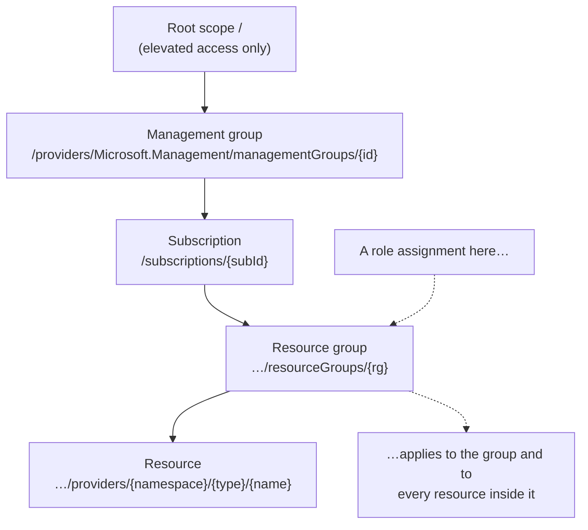

# Azure Role-Based Access Control

> **Objective:** Manage access to Azure resources
> **Domain:** Manage Azure identities and governance (20-25%)

## Sub-objectives covered

- Manage built-in Azure roles
- Assign roles at different scopes
- Interpret access assignments

## Why this exists

Module 01-01 put people into the directory and into groups. That alone lets them do
nothing to a virtual machine or a storage account. Reaching Azure resources takes a
second, separate grant: an **Azure role assignment**.

The reason is that there are two authorization systems. **Microsoft Entra roles**
govern the directory: users, groups, licences, domains. **Azure roles** govern
resources: subscriptions and everything inside them. By default neither grants
anything in the other. A Global Administrator can't see a single virtual machine
until they are given an Azure role.

Azure role-based access control (Azure RBAC) answers one question for every request:
*may this identity perform this action on this resource?* It answers from role
assignments, and reading those assignments correctly is what the third bullet of
this objective tests.

## How it works under the hood

### The three parts of a role assignment

Every grant is one role assignment, and every role assignment has exactly three
parts:

| Part | What it is | Examples |
| --- | --- | --- |
| **Security principal** | Who | A user, a group, a service principal, a managed identity |
| **Role definition** | What they may do | Reader, Contributor, Virtual Machine Contributor |
| **Scope** | Where | A management group, subscription, resource group or resource |

You grant access by creating an assignment and revoke it by removing one. There is no
other switch.

### Scope and inheritance

Scopes form a parent-child hierarchy, and an assignment applies to its scope **and
everything below it**:



The scope is written as a resource ID path. A narrower scope is a longer path. Assign
at the **narrowest scope that still does the job**: a role that is needed on one
resource group has no business at subscription scope.

### How Azure decides: additive, with deny first

Azure RBAC is **additive**. A principal's effective permissions are the union of every
role assignment that applies to them: their own, their groups', inherited from parent
scopes. If you hold Contributor on a subscription and Reader on a resource group inside
it, you are effectively a Contributor in that resource group. The Reader assignment
adds nothing.

Group assignments are **transitive**. If a user belongs to group B, and group B is a
member of group A, and group A holds a role, the user holds it too.

For each request, Azure Resource Manager:

1. Gathers every **role assignment and deny assignment** that applies to the resource,
   including the caller's transitive group memberships from their token.
2. If a **deny assignment** applies, blocks the request. Nothing overrides it.
3. Otherwise checks whether any applicable role includes the requested action.
4. Evaluates any **conditions** on that assignment.

**Deny assignments** block actions even where a role grants them, and unlike role
assignments they can exclude principals and stop inheritance to child scopes. **You
can't create one directly.** Azure creates and manages them, for example when a
deployment stack is created with deny settings. You'll see them on the **Deny
assignments** tab of Access control (IAM).

### Role definitions

A role definition is a list of permissions:

| Property | Meaning |
| --- | --- |
| `Actions` | Control-plane operations allowed, such as `Microsoft.Compute/virtualMachines/start/action` |
| `NotActions` | Control-plane operations subtracted from a wildcard in `Actions` |
| `DataActions` | Data-plane operations allowed, such as reading blob contents |
| `NotDataActions` | Data-plane operations subtracted from a wildcard in `DataActions` |
| `AssignableScopes` | Where the role may be assigned |

Operation strings read `{Company}.{Provider}/{resourceType}/{action}`, ending in
`read`, `write`, `action` or `delete`, with `*` as a wildcard.

**`NotActions` is not a deny.** It only trims a wildcard *within one role*. If a second
role grants the same action, the principal has it. Only a deny assignment denies.

**Control plane is not data plane.** Managing a storage account is a control-plane
action; reading the blobs in it is a data action. Owner, Contributor and Reader have no
`DataActions` at all. A subscription Reader can see that a storage account exists but,
by default, can't read its data when access uses Microsoft Entra authorization rather
than access keys. Storage access is covered in module 02-01.

### The built-in roles that matter most

Azure has well over a hundred built-in roles. Five are fundamental, and Microsoft marks
the first four here, plus Reservations Administrator, as **privileged**:

| Role | Manage resources | Assign roles | Notes |
| --- | --- | --- | --- |
| **Owner** | All | Yes | `Actions: *`; the only fundamental role that does both |
| **Contributor** | All | **No** | `NotActions` removes `Microsoft.Authorization/*/Write` and `*/Delete`, so it can't create role *or policy* assignments. It also can't elevate access, manage Blueprints assignments, share image galleries, or cancel the subscription |
| **User Access Administrator** | Read only | Yes | `Microsoft.Authorization/*` plus `*/read`: all of authorization, including other access-management settings |
| **Role Based Access Control Administrator** | Read only | Yes | Only `roleAssignments/write` and `/delete` plus `*/read`. Can't manage access in other ways, such as Azure Policy |
| **Reader** | Read only | No | Views everything, changes nothing |

Both access-administrator roles can assign **Owner**, including to themselves. That's
why Microsoft recommends adding a **condition** when you delegate role assignment:
a condition constrains the role assignments the delegate can create, such as which
roles they may assign.

Everything else is a **job function role** scoped to a service, such as Virtual
Machine Contributor. Least privilege means preferring a job function role to a
privileged one, and a narrow scope to a broad one.

> **Context - not a measured skill.** If no built-in role fits, you can create a
> custom role with the same properties. The current AZ-104 outline measures built-in
> roles only.

### Azure roles and Microsoft Entra roles

| | Azure roles | Microsoft Entra roles |
| --- | --- | --- |
| Govern | Azure resources | Directory objects: users, groups, licences, domains |
| Scopes | Management group, subscription, resource group, resource | Tenant, administrative unit, or a single object such as an app |
| Where managed | Access control (IAM), Azure CLI, Azure PowerShell, ARM templates | Microsoft Entra admin center, Microsoft 365 admin center, Microsoft Graph |

The one bridge is **elevate access**. A Global Administrator can turn on **Access
management for Azure resources** under Microsoft Entra ID > Properties. That assigns
*that user* User Access Administrator at **root scope** (`/`): every subscription and
management group in the tenant. It is per-user, meant for recovering access, and
should be turned off afterwards. It can't be removed from the Access control (IAM)
page, only by switching the toggle back or with PowerShell, the CLI or the REST API.

> **Dated change.** Classic subscription administrators (Service Administrator and
> Co-Administrator) were retired on August 31, 2024, and are fully retired as of May
> 2026. Access is granted only through Azure RBAC now. Older material that mentions
> Co-Administrators describes something that no longer exists.

### Reading who has access

Three views, each answering a slightly different question:

| Tool | Shows | Doesn't show |
| --- | --- | --- |
| **Access control (IAM) > Check access**, at a scope | One principal's role and deny assignments at that scope **and inherited from above** | Assignments at child scopes |
| **Microsoft Entra ID > Users or Groups > (principal) > Azure role assignments** | That principal's roles at every scope you can read, one subscription at a time | Other subscriptions until you switch the Subscriptions list |
| **Access control (IAM) > Role assignments** | The scope's role assignments, a count against the limit, and a **Privileged** tab | — |

From the command line, the defaults are narrower than people expect:

- `az role assignment list --assignee <user>` lists **direct** assignments in the current
  subscription only. Add `--all` for child scopes, `--include-inherited` for parent
  scopes, and `--include-groups` for assignments that reach the user through groups.
- `Get-AzRoleAssignment -SignInName <user> -ExpandPrincipalGroups` lists the user's
  assignments **and** their groups'. With `-Scope`, it lists what is effective at that
  scope: assigned there or above.

A change can take **up to 10 minutes** to take effect. Signing out and back in forces a
refresh.

### Limits

- **5,000** role assignments per subscription. That counts subscription,
  resource-group and resource scopes, but not management groups. The limit is fixed.
- **500** role assignments per management group.

Eligible assignments and assignments scheduled for the future don't count. The
practical defence is the same as in 01-01: **assign roles to groups, not users**.

## Configuration surface

Portal steps were checked against Microsoft Learn on 2026-09-30. At any scope, go to
**Access control (IAM)** > **Add** > **Add role assignment**. Choose the role on the
**Job function roles** or **Privileged administrator roles** tab, then the members, an
optional condition, and **Review + assign**.

```bash
# Azure CLI: assign at resource-group scope, then read back what a user can do
az role assignment create --assignee "<user-or-group-object-id>" \
  --role "Reader" \
  --scope "/subscriptions/<subscription-id>/resourceGroups/<resource-group>"

az role assignment list --assignee "<user@domain>" --all --include-inherited --include-groups \
  --query "[].{role:roleDefinitionName, scope:scope}" -o table
```

```powershell
# Azure PowerShell
New-AzRoleAssignment -ObjectId '<group-object-id>' -RoleDefinitionName 'Contributor' `
    -ResourceGroupName '<resource-group>'

Get-AzRoleAssignment -SignInName '<user@domain>' -ExpandPrincipalGroups |
    Select-Object RoleDefinitionName, Scope, DisplayName

# What a role actually allows
Get-AzRoleDefinition -Name 'Contributor' | Select-Object -ExpandProperty NotActions
```

In scripts, refer to roles by **ID** rather than name. Built-in role IDs are the same in
every cloud and don't change if a role is renamed.

| Setting | Documented default | Where | Exam angle |
| --- | --- | --- | --- |
| Listing scope | Current subscription (`az role assignment list`, `Get-AzRoleAssignment`) | `--all`, `--include-inherited`, `-Scope` | Defaults hide inherited and child-scope access |
| Assignment scope | not stated | `--scope`, `-Scope`, `-ResourceGroupName` | Narrowest scope that works |
| Principal type | not stated | Members tab | Prefer groups: manageability and the 5,000 limit |
| Condition on a privileged assignment | none | Conditions tab | Constrain which roles a delegate can assign |
| Elevate access | Off | Microsoft Entra ID > Properties | Per-user, root scope, turn it off afterwards |

## Common failure modes

1. **"I'm Global Administrator but see no subscriptions."** Entra roles grant nothing in
   Azure. Elevate access, grant a proper Azure role, then turn elevation off.
2. **"She's a Contributor but can't give her colleague access."** Contributor can't write
   `Microsoft.Authorization`. She needs Owner, User Access Administrator, or Role Based
   Access Control Administrator at that scope.
3. **"The Contributor can't assign an Azure Policy."** Same cause: policy assignments are
   under `Microsoft.Authorization` too, and Role Based Access Control Administrator can't
   do it either.
4. **"I removed his Reader role on the resource group, but he can still see it."** An
   assignment higher up, on the subscription or a management group, or through a group,
   still applies. Check access at the resource group, or list with `--include-inherited`
   and `--include-groups`.
5. **"`NotActions` should have blocked that."** It only trims one role's wildcard. Another
   role granted the action. Only deny assignments deny.
6. **"He's Owner of the storage account but can't read blobs with his Entra identity."**
   Owner has no `DataActions`. Data access needs a data role such as Storage Blob Data
   Reader.
7. **"I just assigned the role and it doesn't work."** Allow up to 10 minutes, or sign out
   and back in.
8. **"`az role assignment list` says he has nothing."** By default it shows direct
   assignments in the current subscription only.
9. **"`RoleAssignmentLimitExceeded`."** 5,000 per subscription, fixed. Consolidate user
   assignments into group assignments.

## How this is tested

| Phrase in the question | What it steers you to |
| --- | --- |
| "manage resources but not grant access to others" | Contributor |
| "grant access to others, without managing resources" | User Access Administrator, or Role Based Access Control Administrator for assignments only |
| "only assign roles, not manage Azure Policy" | Role Based Access Control Administrator |
| "least privilege" with a named service | That service's job function role, not Contributor |
| "all resource groups in the subscription" | Assign at subscription scope; inheritance does the rest |
| "multiple subscriptions" | Management group scope |
| "Global Administrator can't see the subscription" | Elevate access, then assign an Azure role |
| "user still has access after the assignment was removed" | Inherited or group-based assignment elsewhere |
| "block an action even for Owners" | Deny assignment. You can't create one directly; for example, deployment stack deny settings create one |
| "which assignments apply to this user at this resource group" | Check access, or list with inherited and group assignments included |
| "read data in the storage account" | A data role; Owner, Contributor and Reader aren't enough on their own |

Scenario questions often show two or three assignments at different scopes and ask
what the principal can do. Work it the way Azure does: collect every assignment at the
resource and above, including groups, check for a deny assignment, then take the union.

## Hands-on

See [01-02 lab](../../labs/01-identities-governance/01-02-lab.md). It creates only an
empty resource group, a test user and role assignments, so it costs nothing.

## Check yourself

1. A user holds Reader at subscription scope through group G1, and Contributor on
   resource group RG1 directly. What can they do in RG1, and in RG2? Which single change
   removes their ability to modify RG1?
2. Why can a User Access Administrator make themselves Owner, and what does Microsoft
   recommend when you delegate that ability?
3. `az role assignment list --assignee avery@contoso.com` returns nothing, yet Avery can
   restart VMs in RG1. Give three commands or flags that would reveal why.
4. A role's `Actions` contain `Microsoft.Compute/*` and its `NotActions` contain
   `Microsoft.Compute/virtualMachines/delete`. The same user also holds Virtual Machine
   Contributor. Can they delete a VM? What would it take to prevent it?
5. Your Global Administrator elevated access last month to fix a subscription. What does
   that account hold now, at what scope, and how do you remove it?

## Key takeaways

- An Azure role assignment is **principal + role + scope**. Nothing else grants resource
  access, and Microsoft Entra roles grant none.
- Assignments **inherit downwards**. Evaluation is **additive**, **deny assignments** win,
  and `NotActions` is not a deny.
- **Owner** manages and assigns. **Contributor** manages but can't assign roles or
  policies. **User Access Administrator** and **Role Based Access Control Administrator**
  assign but don't manage.
- Management roles don't grant **data** access.
- To read access correctly, include **inherited** and **group** assignments. The CLI's
  defaults don't.

## Sources

- Microsoft Learn: [Study guide for Exam AZ-104](https://learn.microsoft.com/en-us/credentials/certifications/resources/study-guides/az-104)
- Microsoft Learn: [What is Azure role-based access control?](https://learn.microsoft.com/en-us/azure/role-based-access-control/overview)
- Microsoft Learn: [Understand Azure role definitions](https://learn.microsoft.com/en-us/azure/role-based-access-control/role-definitions)
- Microsoft Learn: [Azure built-in roles](https://learn.microsoft.com/en-us/azure/role-based-access-control/built-in-roles)
- Microsoft Learn: [Azure built-in roles for Privileged](https://learn.microsoft.com/en-us/azure/role-based-access-control/built-in-roles/privileged)
- Microsoft Learn: [Steps to assign an Azure role](https://learn.microsoft.com/en-us/azure/role-based-access-control/role-assignments-steps)
- Microsoft Learn: [Azure roles, Microsoft Entra roles, and classic subscription administrator roles](https://learn.microsoft.com/en-us/azure/role-based-access-control/rbac-and-directory-admin-roles)
- Microsoft Learn: [Elevate access to manage all Azure subscriptions and management groups](https://learn.microsoft.com/en-us/azure/role-based-access-control/elevate-access-global-admin)
- Microsoft Learn: [List Azure deny assignments](https://learn.microsoft.com/en-us/azure/role-based-access-control/deny-assignments)
- Microsoft Learn: [List Azure role assignments using the Azure portal](https://learn.microsoft.com/en-us/azure/role-based-access-control/role-assignments-list-portal)
- Microsoft Learn: [List Azure role assignments using Azure CLI](https://learn.microsoft.com/en-us/azure/role-based-access-control/role-assignments-list-cli)
- Microsoft Learn: [Get-AzRoleAssignment](https://learn.microsoft.com/en-us/powershell/module/az.resources/get-azroleassignment)
- Microsoft Learn: [Troubleshoot Azure RBAC](https://learn.microsoft.com/en-us/azure/role-based-access-control/troubleshooting)
- Microsoft Learn: [Troubleshoot Azure RBAC limits](https://learn.microsoft.com/en-us/azure/role-based-access-control/troubleshoot-limits)
- Microsoft Learn: [Best practices for Azure RBAC](https://learn.microsoft.com/en-us/azure/role-based-access-control/best-practices)
