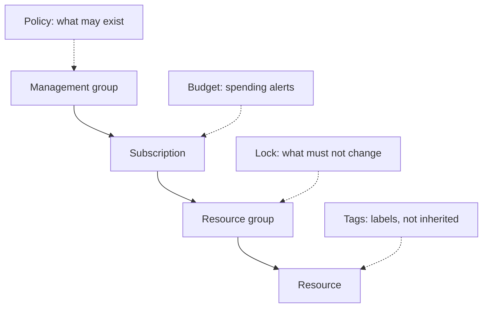
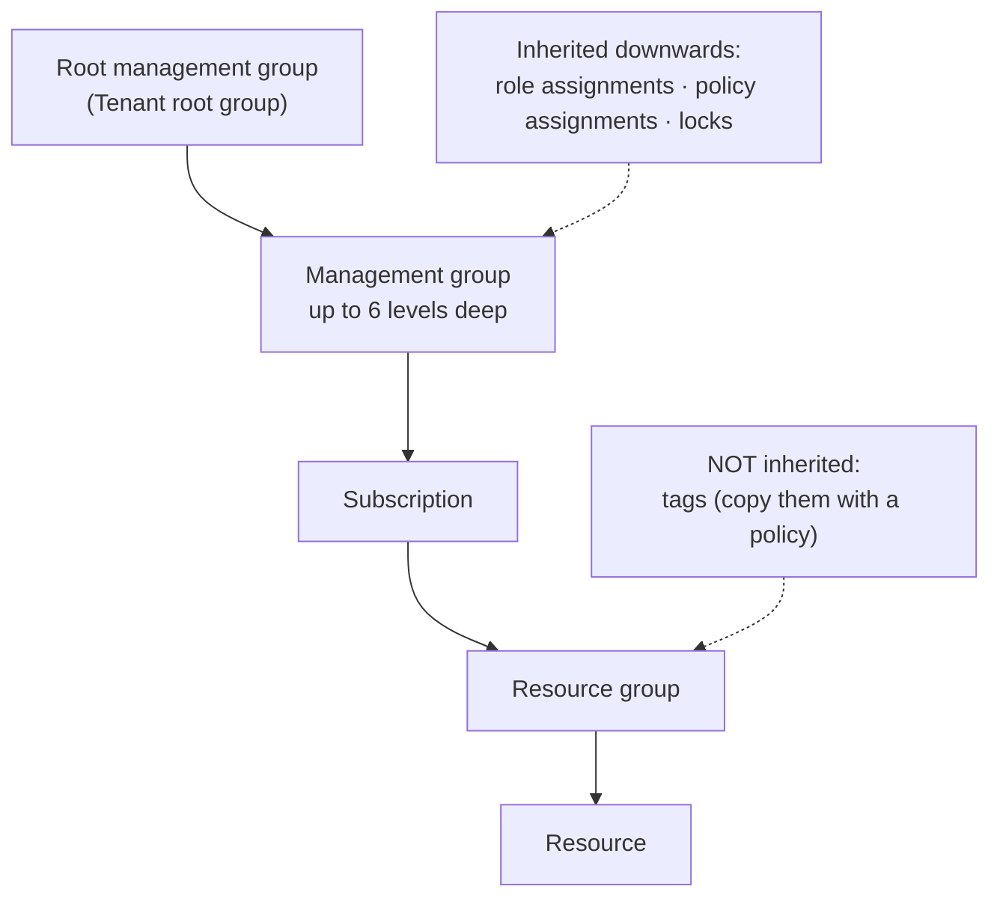

# Subscriptions and Governance

> **Objective:** Manage Azure subscriptions and governance
> **Domain:** Manage Azure identities and governance (20-25%)

## Sub-objectives covered

- Implement and manage Azure Policy
- Configure resource locks
- Apply and manage tags on resources
- Manage resource groups
- Manage subscriptions
- Manage costs by using alerts, budgets, and Azure Advisor recommendations
- Configure management groups

## The administrative problem

An organization with dozens of subscriptions needs rules that hold no matter who deploys: resources only in
approved regions, every resource tagged with its cost center, production databases that nobody can delete by
accident, and a warning before the monthly bill runs over budget. Access control alone can't do this: an Owner is
allowed to do almost anything, including the wrong thing.

Module 01-02 answered *who may act*. Governance answers three different questions:

- **What is allowed to exist, and how must it be configured?** Azure Policy.
- **Can this be changed or deleted at all, by anyone?** Resource locks.
- **What is it, who owns it, and what does it cost?** Tags, Cost Management and Advisor.

All three are applied to the same hierarchy you met in 01-02: management groups,
subscriptions, resource groups, resources. Most scenario questions in this module come
down to two things: **which control** answers the requirement, and **what inherits** down
the hierarchy.

## In plain English

Governance adds controls that apply to *what* exists, not *who* acts:

- **Azure Policy** describes how resources must look ("only these regions", "must have a CostCenter tag") and acts
  when they're created or changed: deny them, audit them, or fix them.
- **Resource locks** stop deletion (**CanNotDelete**) or any change (**ReadOnly**), even for an Owner, until someone
  removes the lock.
- **Tags** are name-value labels such as `CostCenter=42`. They help with cost reports and ownership, and they
  **aren't inherited**: a resource group's tags stay on the group.
- **Resource groups, subscriptions and management groups** are the containers these controls attach to. Policy, role
  assignments and locks set at one level flow down to everything below.
- **Budgets, cost alerts and Advisor** watch spending and suggest savings. A budget alert warns; it doesn't stop
  anything.

## Words you need to know

| Term | In plain English |
| --- | --- |
| **Azure Policy** | Rules about what resources may exist and how they must be configured, enforced on create and update. |
| **Policy definition** | One rule, with an effect such as deny, audit or modify. |
| **Initiative** | A group of policy definitions assigned together. |
| **Policy assignment** | A definition or initiative applied at a scope. |
| **Remediation task** | Fixes existing non-compliant resources for modify and deployIfNotExists policies, using a managed identity. |
| **Resource lock** | CanNotDelete or ReadOnly protection that applies to everyone, including Owners. |
| **Tag** | A name-value label on a resource, resource group or subscription. Not inherited. |
| **Management group** | A container of subscriptions, so governance can be assigned once for many of them. |
| **Budget** | A spending threshold for a scope that sends alerts. It doesn't stop resources. |
| **Azure Advisor** | A service that recommends changes for cost, reliability, security, performance and operations. |

## Mental model



RBAC answers *who may act*; governance answers *what is allowed* and *what must not change*. A scenario
usually names one of these three, and the matching control is the answer. This is a conceptual teaching model, not a complete architecture.

**Azure translation**

| Everyday idea | Azure name |
| --- | --- |
| A building code every builder must follow | Azure Policy |
| A "do not remove" seal on a fire extinguisher | CanNotDelete lock |
| Asset labels with a cost-center number | Tags |
| A division with many departments | Management group with subscriptions |
| A spending alert from your bank | Budget alert |

## Where it fits

The ten questions to ask about any resource ([0A-13](../0A-foundations/0A-13-how-resources-fit-together.md)), answered for the main resource in this lesson.

| Question | Policy assignment |
| --- | --- |
| What contains it? | A scope: management group, subscription or resource group (or a single resource). |
| What does it depend on? | A policy definition or initiative; a managed identity for modify and deployIfNotExists effects. |
| What depends on it? | Every create and update request in scope is evaluated against it. |
| Who can manage it? | Resource Policy Contributor or Owner at the scope. |
| How is it networked? | Not networked. |
| How is it monitored? | Policy compliance results and the activity log. |
| How is it protected? | Exemptions are explicit, time-bound and auditable. |
| How is it recovered? | Re-assign it; remediation tasks fix existing resources. |
| What does it cost? | Free for Azure resources. |
| How is it removed safely? | Delete it where it was assigned: deleting a resource group doesn't remove a subscription-scope assignment. |

See it with its neighbours on the [resource map](#/map/policy-assignment).

## How it works under the hood

### The hierarchy, and what inherits down it



The same thing as a table, which is the form most questions use:

| Applied at | Inherited by children? | Can be set on a management group? |
| --- | --- | --- |
| Azure role assignment | Yes | Yes |
| Azure Policy assignment | Yes | Yes |
| Resource lock | Yes, and the most restrictive lock in the chain applies | **No** |
| Tag | **No** | **No** |

### Azure Policy

A **policy definition** is a rule in JSON: an `if` condition and a `then` effect. An
**initiative** (also called a policy set) groups several definitions so you assign them
together. Neither does anything until it is **assigned** to a scope: a management group,
subscription, resource group or resource. The assignment applies to everything under that
scope, and it is where you set parameters, such as *which* locations are allowed.

**Policy is not access control.** RBAC decides whether *you* may create a storage account.
Policy decides whether a storage account *configured that way* may exist, whoever creates
it. An Owner is denied by a `deny` policy exactly like anyone else.

#### Effects

| Effect | What it does | When |
| --- | --- | --- |
| `deny` | Rejects the create or update request | At request time |
| `audit` | Allows it, logs a warning, marks it non-compliant | At request time |
| `append` | Adds fields to the request, for example a tag | At request time |
| `modify` | Adds, replaces or removes properties or tags on the request | At request time |
| `auditIfNotExists` | Flags a resource whose related resource is missing | After the resource is created |
| `deployIfNotExists` | Deploys the missing related resource | After the resource is created |
| `denyAction` | Blocks specific actions, such as delete | At request time |
| `manual` | Compliance is attested by a person | — |
| `disabled` | The rule isn't evaluated | — |

Two further effects, `addToNetworkGroup` and `mutate`, belong to specific services and
aren't needed here.

**Existing resources are never changed or deleted by a `deny`.** When you assign a `deny`
policy, resources that already break it are only marked **non-compliant**. New and updated
resources are denied. To fix existing resources, `modify` and `deployIfNotExists` policies
use a **remediation task**, which runs with the **managed identity** of the assignment.
When you assign in the portal, that identity is granted its roles automatically; with an
SDK you grant them yourself.

Microsoft's own advice is to start with `audit` or `auditIfNotExists` and move to enforcement
once you've seen the results.

#### Scope, exclusions and exemptions

- **Exclusion** (`notScopes`): part of the scope isn't evaluated at all, and doesn't count
  towards compliance.
- **Exemption**: the resource is still in scope but shows as **Exempted**, with a category,
  **Waiver** (non-compliance accepted for now) or **Mitigated** (the intent is met another
  way), and an optional expiry date.
- **Enforcement mode `DoNotEnforce`**: the assignment evaluates and reports compliance but
  doesn't enforce the effect. This is the safe way to test a new assignment.

A policy assigned at a management group evaluates only resources in its subscriptions and
resource groups.

#### When compliance appears

- A new or updated assignment takes about **5 minutes** to apply, then evaluation starts.
- A created or updated resource shows its result about **15 minutes** later.
- A full compliance scan runs every **24 hours**.
- You can trigger an on-demand scan with `Start-AzPolicyComplianceScan` or
  `az policy state trigger-scan`.

### Resource locks

A lock protects a subscription, resource group or resource from change, **for every user
and every role, Owner included**. There are two levels:

| Portal name | CLI and PowerShell name | Allows | Blocks |
| --- | --- | --- | --- |
| **Delete** | `CanNotDelete` | Read and modify | Delete |
| **Read-only** | `ReadOnly` | Read | Modify and delete; like restricting everyone to Reader |

What trips people up:

- **Locks are inherited, including by resources created later.** The most restrictive lock
  in the chain wins.
- **One locked resource blocks deleting its resource group.** The whole delete fails; there's
  no partial delete.
- **Locks cover the control plane only.** A lock on a storage account doesn't protect the data
  in it from deletion through the data plane.
- **`ReadOnly` blocks POST operations too**, which covers more than it sounds. On a storage
  account it blocks listing the access keys. On a resource group it blocks starting or
  restarting a VM and scaling an App Service plan. It also blocks moving resources in or out
  of the group.
- **A `CanNotDelete` lock blocks deleting role assignments** on that resource or group.
- **You can't lock a management group.**
- **Only some roles can create or delete locks.** It takes `Microsoft.Authorization/locks/*`,
  which **Owner** and **User Access Administrator** have. **Contributor doesn't**: its
  `NotActions` exclude `Microsoft.Authorization` writes (01-02).
- A lock doesn't block cancelling a subscription.

### Tags

Tags are name-value pairs such as `CostCenter = 1234` on subscriptions, resource groups and
resources.

- **Tags aren't inherited.** A resource group's tags don't appear on its resources, and they
  don't appear on the resources' usage records in Cost Management. To copy them, use the
  built-in policies **Inherit a tag from the resource group** or **…from the subscription**
  (`modify`), plus a remediation task for existing resources. Cost Management also has a
  separate tag inheritance setting for cost reporting.
- **Limits:** 50 tags on each resource, resource group or subscription. Names up to 512
  characters and values up to 256; storage accounts allow only 128-character names. Some
  resource types don't support tags, and **management groups can't be tagged**.
- **Tag names are case-insensitive, and tag values are case-sensitive.**
- **Tags are plain text.** They show up in cost reports, exports and logs, so never put
  secrets in them.
- **Who can tag:** anyone with write access to the resource, such as Contributor, or the
  **Tag Contributor** role, which can manage tags without access to the resource itself.
- **Requiring tags** is a policy job: **Require a tag on resources** (`deny`), or
  **Append a tag…** (`append`), which only acts on new or updated resources.

### Resource groups

A resource group is a container for resources that share a **lifecycle**: deployed, updated
and deleted together.

- Each resource belongs to **exactly one** resource group.
- The group's **location is where its metadata is stored**. Resources inside can be in other
  regions, though Microsoft recommends keeping them together to reduce the impact of a
  regional outage.
- **Deleting a resource group deletes everything in it**, unless a lock blocks it.
- A subscription holds up to **980** resource groups.

**Moving resources** to another resource group or subscription:

- Across subscriptions, both must be in the **same Microsoft Entra tenant**.
- The **source and target resource groups are locked** for the duration, up to **four hours**.
  Resources keep running, but nothing in either group can be created, deleted or updated.
- The **resource ID changes**; the **region doesn't**. Scripts and dashboards that use the old
  ID need updating.
- Dependent resources must move together. For example, a VM's disks and network interfaces
  go with it, or the request fails with `MissingMoveDependentResources`.
- A policy at the target can block the move (`RequestDisallowedByPolicy`), and so can a
  **read-only lock** on the source, target or subscription.
- **You can't move a resource group** to another subscription, only its resources. Tags, role
  assignments and policies on the old group don't follow.
- Not every resource type supports moving. Validate first.

### Subscriptions

A subscription is a **billing boundary** and a **management boundary**, trusted by exactly
**one** Microsoft Entra tenant.

- **Change directory** moves the subscription to another tenant. It needs **Owner**, and it
  **permanently deletes every role assignment and custom role**. It also deletes Azure Policy
  objects, and managed identities must be re-enabled or re-created. It doesn't change billing
  ownership, which is a separate transfer.
- **Billing ownership transfer** moves who pays. If the subscription also moves to the new
  owner's tenant, everyone else loses access until the new owner grants it again.
- A subscription can have only one parent management group.

### Management groups

Management groups organise subscriptions so that roles and policies are applied once, above
them.

- Every tenant has one **root management group**, shown as **Tenant root group**. Its ID is the
  tenant ID, and it can't be moved or deleted. **No one has access to it by default**: a Global
  Administrator must elevate access first (01-02).
- **New subscriptions land under the root** by default. You can set a different **default
  management group**, such as a sandbox.
- Up to **10,000** management groups per tenant, and **six levels deep**, not counting the root
  or the subscription level. Each management group and subscription has **one parent**.
- By default, **any user can create management groups** under the root. The hierarchy
  settings can require authorization instead.
- **Moving a subscription** between management groups needs write access on the child, the
  target parent and the current parent. There's an exception when either parent is the root.
- The hierarchy is **cached for up to 30 minutes**, so the portal may lag behind a move.
- Management groups can't be tagged or locked.

### Costs: alerts, budgets and Advisor

**Budgets** are introduced in Module 0B, [00-01](../00-lab-safety/00-01-cost-guardrails-and-budgets.md).
In summary:

- **A budget notifies; it doesn't cap.** Resources keep running.
- A notification fires on a whole-number percentage threshold of **Actual** or
  **Forecasted** cost.
- To *do* something, a notification triggers an **action group**, which can run automation.
- Cost data lags usage by hours, so alerts arrive after the spend.

**Cost alerts** also include **anomaly alerts** (unexpected changes in spending) and
alerts on commitment use.

**Azure Advisor** analyses your resources and makes recommendations in five categories,
matching the Well-Architected Framework pillars: **Cost**, **Security**, **Reliability**,
**Operational excellence** and **Performance**. It sums them into an **Advisor score**. For
cost, the key recommendation is **right-size or shut down underutilized virtual machines**
and scale sets.

- It looks back **7 days** by default. You can change that to 14, 21, 30, 60 or 90 days.
- Per subscription, you can set an **average CPU utilization** filter. It filters which
  recommendations you see; it doesn't change how they're generated, and it can take up to
  24 hours to apply.
- Savings figures use **retail prices** and don't account for reservations or savings plans.
  Treat them as an upper bound.
- Other cost recommendations include buying **reservations** or a **savings plan**.

## Configuration surface

Portal steps were checked against Microsoft Learn on 2026-09-30.

```powershell
# Azure Policy: assign a built-in definition with a parameter, then force a scan
$def = Get-AzPolicyDefinition | Where-Object { $_.DisplayName -eq 'Allowed locations' }
New-AzPolicyAssignment -Name 'allowed-locations' -PolicyDefinition $def `
    -Scope "/subscriptions/<subscription-id>/resourceGroups/<resource-group>" `
    -PolicyParameterObject @{ listOfAllowedLocations = @('<region>') }
Start-AzPolicyComplianceScan -ResourceGroupName '<resource-group>'

# Locks
New-AzResourceLock -LockName 'no-delete' -LockLevel CanNotDelete -ResourceGroupName '<resource-group>'
Get-AzResourceLock -ResourceGroupName '<resource-group>'

# Tags: merge adds without removing existing tags
Update-AzTag -ResourceId '<resource-id>' -Tag @{ CostCenter = '1234' } -Operation Merge

# Move resources
Move-AzResource -DestinationResourceGroupName '<target-rg>' -ResourceId '<resource-id>'

# Management groups
New-AzManagementGroup -GroupName 'az104-sandbox' -DisplayName 'AZ-104 sandbox'
New-AzManagementGroupSubscription -GroupId 'az104-sandbox' -SubscriptionId '<subscription-id>'
```

```bash
az policy assignment create --name allowed-locations \
  --policy "<definition-name-or-id>" --scope "<scope>" \
  --params '{ "listOfAllowedLocations": { "value": ["<region>"] } }'
az policy state trigger-scan --resource-group "<resource-group>"
az lock create --name no-delete --lock-type CanNotDelete --resource-group "<resource-group>"
az resource move --destination-group "<target-rg>" --ids "<resource-id>"
az account management-group subscription add --name az104-sandbox --subscription "<subscription-id>"
```

| Setting | Documented default | Where | Exam angle |
| --- | --- | --- | --- |
| Policy enforcement mode | Default (enforced) | Assignment > Basics | `DoNotEnforce` to test safely |
| Remediation identity | not stated | Assignment > Remediation | `modify` and `deployIfNotExists` need one |
| Lock level | — | Locks > Add | Delete vs Read-only; Owner is not exempt |
| Tag inheritance | Tags never inherit on their own | Inherit-tag policy (`modify`), or Cost Management's tag inheritance setting | Remediate existing resources |
| Default management group for new subscriptions | Root | Management groups > Settings | Send new subscriptions to a sandbox |
| Require authorization to create management groups | Off: anyone can create | Management groups > Settings | Restrict who can change the hierarchy |
| Advisor lookback | 7 days | Advisor > Configuration | 14–90 days for monthly workloads |

## Worked example

**Requirement.** Every resource in the Finance subscription must carry a `CostCenter` tag. Existing resources must
get it from their resource group, and nobody may delete the `rg-ledger` resource group.

1. **Decide.** "Must carry a tag" is **Policy**, not RBAC. Copying from the resource group means a **modify** effect,
   such as the built-in *Inherit a tag from the resource group*, because tags aren't inherited on their own. "Nobody may
   delete" is a **CanNotDelete lock**.
2. **Configure.** Assign the policy at the subscription with a managed identity, then create a **remediation task** for
   existing resources. Add a CanNotDelete lock on `rg-ledger`.
3. **Observe.** New resources get the tag at creation; existing ones only after remediation runs.
4. **Validate.** Check compliance, a resource's tags and the lock, as below.

## Validate the result

Check each control on its own, because each fails differently:

```powershell
# Policy assignments at the subscription and below
Get-AzPolicyAssignment -Scope "/subscriptions/<sub-id>" -IncludeDescendent | Select-Object Name, Scope

# A remediated resource now has the tag
(Get-AzResource -ResourceGroupName <rg> -Name <resource>).Tags

# The lock and its level
Get-AzResourceLock -ResourceGroupName rg-ledger | Select-Object Name, @{ n = 'Level'; e = { $_.Properties.level } }
```

- **Policy > Compliance** (or `az policy state summarize`) shows what's still non-compliant.
- Try the blocked action: deleting the locked resource group must fail, even as Owner.
- A budget is validated when its alert reaches the action group; a test email is not proof that thresholds are set.

## Common failure modes

1. **"The deny policy didn't delete my non-compliant VMs."** A deny never touches existing
   resources. It marks them non-compliant; fix them manually, or use `modify` or
   `deployIfNotExists` with remediation.
2. **"Compliance still says 'Not started'."** Allow about 5 minutes for a new assignment, 15 for
   a changed resource, or trigger a scan.
3. **"The Owner couldn't delete the resource group."** A lock on the group, or on any resource
   in it, blocks the delete for everyone.
4. **"After adding a Read-only lock, nobody can restart VMs, and the app can't list storage keys."**
   Those operations are POSTs, and Read-only blocks them.
5. **"Contributor can't add a lock."** Locks need `Microsoft.Authorization/locks/*`: Owner or User
   Access Administrator.
6. **"We tagged the resource group, but cost reports by tag are empty."** Tags don't inherit. Use
   an inherit-tag policy with remediation, or Cost Management's tag inheritance setting.
7. **"The move failed."** A dependent resource wasn't included, a policy denies the resource at
   the target, a read-only lock exists, or the type doesn't support moving.
8. **"After changing directory, nobody can manage the subscription."** Change directory deletes
   all role assignments. Plan to re-create them.
9. **"The new subscription ignored our management group policies."** It landed under the root.
   Set a default management group, or move it.
10. **"The budget alert fired, but the VMs are still running."** Budgets notify. Attach an action
    group with automation if something must stop.

## How this is tested

| Phrase in the question | What it steers you to |
| --- | --- |
| "prevent resources being created outside approved regions" | Azure Policy, **Allowed locations**, `deny` |
| "identify but don't block" | `audit` / `auditIfNotExists` |
| "automatically add a missing tag or setting to existing resources" | `modify` or `deployIfNotExists` with a remediation task |
| "every resource must have a tag" | Policy: Require a tag (`deny`) |
| "resources should get the resource group's tag" | Inherit a tag from the resource group (`modify`) |
| "prevent accidental deletion, allow changes" | `CanNotDelete` (Delete) lock |
| "nobody may change it, including admins" | `ReadOnly` lock |
| "apply to all subscriptions in a department" | Management group scope |
| "new subscriptions must be governed automatically" | Default management group, with policy assigned there |
| "exclude one resource group from a policy" | Exclusion (`notScopes`), or an exemption if it must stay visible |
| "temporarily accept non-compliance and track it" | Exemption, category **Waiver**, with an expiry |
| "reduce cost of idle VMs" | Advisor: right-size or shut down |
| "notify when spending is projected to exceed" | Budget with a **Forecasted** threshold |
| "move resources to another subscription in a different tenant" | Not possible with move; change the subscription's directory, or re-create |

## Hands-on

See [01-03 lab](../../labs/01-identities-governance/01-03-lab.md). It uses only policy
assignments, locks, tags, a management group and an empty virtual network, so it costs
nothing.

## Check yourself

1. A `deny` policy for **Allowed locations** is assigned to a subscription that already has VMs
   in a disallowed region. What happens to those VMs, to the compliance report, and to an
   attempt to resize one of them?
2. A resource group holds a `CanNotDelete` lock, and one of its resources has a `ReadOnly` lock.
   What can an Owner do to that resource, and to the group?
3. You need all resources to carry the `CostCenter` tag of their resource group, including
   resources that already exist. Name the policy, its effect, and the extra step for existing
   resources.
4. A subscription must move to another Microsoft Entra tenant after an acquisition. What will
   break, and what should you export first?
5. Why would you exempt a resource from an assignment rather than exclude it, and what does the
   compliance report show in each case?

## Teach it back

Answer out loud or in writing, without notes, as if to someone who has never used Azure. Where you hesitate is what to re-read.

- Explain RBAC, Policy and locks as three different questions.
- Explain why tagging a resource group doesn't tag the resources in it, and how to fix that.
- Explain what a budget does and doesn't do when spending crosses it.

## Key takeaways

- **Policy** governs what may exist and how, for everyone. **RBAC** governs who may act. **Locks**
  stop change or deletion for everyone, Owner included.
- Role assignments, policy assignments and locks **inherit**; **tags don't**.
- A `deny` doesn't fix existing resources. `modify` and `deployIfNotExists` do, through a
  **remediation task** and a **managed identity**.
- A move changes the resource ID and locks both resource groups; **change directory** deletes
  every role assignment.
- The **root management group** takes new subscriptions unless you set a default. Hierarchies go
  up to **six levels**.
- **Budgets notify, Advisor recommends**; neither stops anything on its own.

## Sources

- Microsoft Learn: [Study guide for Exam AZ-104](https://learn.microsoft.com/en-us/credentials/certifications/resources/study-guides/az-104)
- Microsoft Learn: [What is Azure Policy?](https://learn.microsoft.com/en-us/azure/governance/policy/overview)
- Microsoft Learn: [Azure Policy definitions effect basics](https://learn.microsoft.com/en-us/azure/governance/policy/concepts/effect-basics)
- Microsoft Learn: [Azure Policy compliance states](https://learn.microsoft.com/en-us/azure/governance/policy/concepts/compliance-states)
- Microsoft Learn: [Azure Policy assignment structure](https://learn.microsoft.com/en-us/azure/governance/policy/concepts/assignment-structure)
- Microsoft Learn: [Understand scope in Azure Policy](https://learn.microsoft.com/en-us/azure/governance/policy/concepts/scope)
- Microsoft Learn: [Azure Policy exemption structure](https://learn.microsoft.com/en-us/azure/governance/policy/concepts/exemption-structure)
- Microsoft Learn: [Get compliance data of Azure resources](https://learn.microsoft.com/en-us/azure/governance/policy/how-to/get-compliance-data)
- Microsoft Learn: [Remediate non-compliant resources with Azure Policy](https://learn.microsoft.com/en-us/azure/governance/policy/how-to/remediate-resources)
- Microsoft Learn: [Lock your Azure resources to protect your infrastructure](https://learn.microsoft.com/en-us/azure/azure-resource-manager/management/lock-resources)
- Microsoft Learn: [Use tags to organize your Azure resources and management hierarchy](https://learn.microsoft.com/en-us/azure/azure-resource-manager/management/tag-resources)
- Microsoft Learn: [Assign policy definitions for tag compliance](https://learn.microsoft.com/en-us/azure/azure-resource-manager/management/tag-policies)
- Microsoft Learn: [Understand Cost Management data](https://learn.microsoft.com/en-us/azure/cost-management-billing/costs/understand-cost-mgt-data)
- Microsoft Learn: [What is Azure Resource Manager?](https://learn.microsoft.com/en-us/azure/azure-resource-manager/management/overview)
- Microsoft Learn: [Move Azure resources to a new resource group or subscription](https://learn.microsoft.com/en-us/azure/azure-resource-manager/management/move-resource-group-and-subscription)
- Microsoft Learn: [Azure subscription and service limits](https://learn.microsoft.com/en-us/azure/azure-resource-manager/management/azure-subscription-service-limits)
- Microsoft Learn: [Associate or add an Azure subscription to your Microsoft Entra tenant](https://learn.microsoft.com/en-us/entra/fundamentals/how-subscriptions-associated-directory)
- Microsoft Learn: [Transfer an Azure subscription to a different Microsoft Entra directory](https://learn.microsoft.com/en-us/azure/role-based-access-control/transfer-subscription)
- Microsoft Learn: [What are Azure management groups?](https://learn.microsoft.com/en-us/azure/governance/management-groups/overview)
- Microsoft Learn: [Manage your Azure subscriptions at scale with management groups](https://learn.microsoft.com/en-us/azure/governance/management-groups/manage)
- Microsoft Learn: [Optimize VM or VMSS spend by resizing or shutting down underutilized instances](https://learn.microsoft.com/en-us/azure/advisor/advisor-cost-recommendations)
- Microsoft Learn: [Advisor score](https://learn.microsoft.com/en-us/azure/advisor/advisor-score)
- Microsoft Learn: [Tutorial: Create and manage Azure budgets](https://learn.microsoft.com/en-us/azure/cost-management-billing/costs/tutorial-acm-create-budgets)
