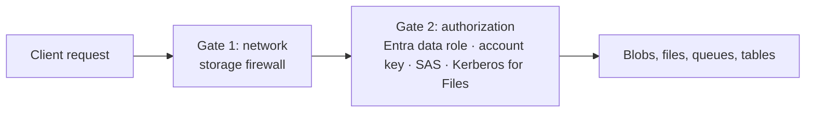
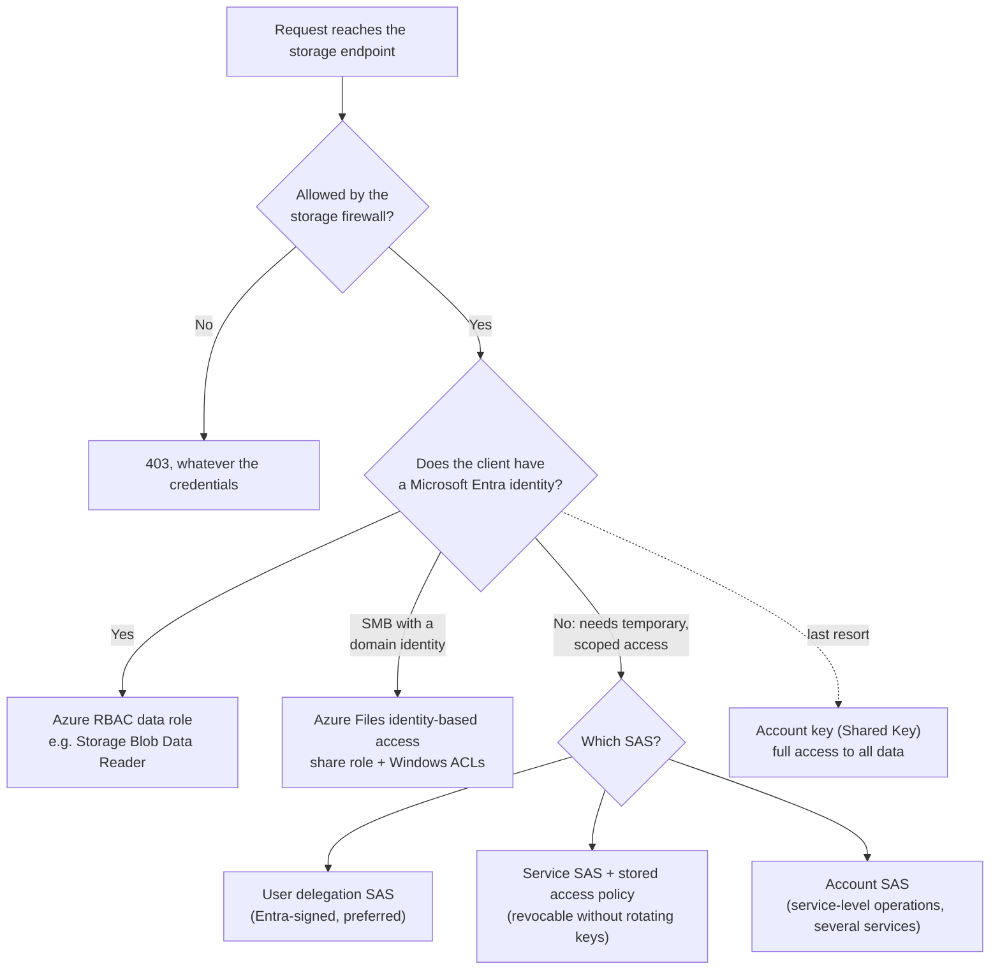

# Configuring Access to Storage

> **Objective:** Configure access to storage
> **Domain:** Implement and manage storage (15-20%)

## Sub-objectives covered

- Configure Azure Storage firewalls and virtual networks
- Create and use shared access signature (SAS) tokens
- Configure stored access policies
- Manage access keys
- Configure identity-based access for Azure Files

## The administrative problem

A storage account holds data that a web app, a partner and a batch job all need, each in a different way. The
partner should be able to upload for one week and no longer. The batch job runs in your own virtual network. Nothing
from the internet at large should get in. And when a key leaks, you need to take access back without breaking
everything else.

Every request to data in a storage account has to pass **two independent gates**:

1. **The network gate.** Is this request allowed to reach the account's endpoint at all?
   That's the storage **firewall**: IP rules, virtual network rules and exceptions.
2. **The authorization gate.** Is the caller allowed to do *this* to *this* data? That's
   one of the authorization methods: **Microsoft Entra ID** with a data role, the **account
   keys** (Shared Key), a **shared access signature**, or, for Azure Files over SMB,
   **identity-based access** with Kerberos.

Passing one gate says nothing about the other. A request from an allowed IP address still
needs valid authorization, and a perfectly valid SAS is still refused from a blocked
network. Most questions in this module come down to picking the right mechanism for each
gate, and knowing how to take access *back* when something leaks.

## In plain English

Every request to the data in a storage account passes two separate checks:

1. **Can it reach the account?** The storage **firewall** allows or refuses requests by network: selected public IP
   ranges, selected virtual network subnets, or nothing public at all.
2. **Is it allowed to do this?** The caller proves permission in one of four ways:
   - a **Microsoft Entra identity** with a data role, such as Storage Blob Data Reader (the preferred way);
   - an **account key**, which is like the account's master password;
   - a **shared access signature (SAS)**, a signed link with limited permissions and an expiry time;
   - for **Azure Files** over SMB, **identity-based access** with Kerberos, like a Windows file server.

Passing one check says nothing about the other. A valid SAS used from a blocked network is still refused.

## Words you need to know

| Term | In plain English |
| --- | --- |
| **Storage firewall** | Network rules on the account: which IP ranges and subnets may reach it, or none. |
| **Account key** | One of two master keys for the whole account. Anyone holding it has full access. |
| **Shared Key authorization** | Authorizing requests with an account key. It can be disallowed on the account. |
| **Shared access signature (SAS)** | A signed token granting limited permissions, for a limited time, to part of the account. |
| **User delegation SAS** | A SAS signed with Microsoft Entra credentials instead of an account key. Preferred for blobs. |
| **Stored access policy** | Settings on a container or share that a service SAS can refer to, so you can change or revoke many SAS at once. |
| **Data role** | An Azure role with data actions, such as Storage Blob Data Contributor, for reading or writing the data itself. |
| **Identity-based access** | Azure Files over SMB authorizing users with Kerberos from an identity source such as AD DS. |

## Mental model



Solve each gate separately. A scenario that says "from the internet" or "only from this subnet" is about
gate 1; one that says "for one week" or "without sharing the key" is about gate 2. This is a conceptual teaching model, not a complete architecture.

**Azure translation**

| Everyday idea | Azure name |
| --- | --- |
| A building's gate guard who checks where you came from | Storage firewall |
| The building's master key | Account key |
| A visitor pass valid until Friday for one room | Shared access signature |
| A rulebook the passes refer to, which you can tear up | Stored access policy |
| An employee badge with the right clearance | Microsoft Entra identity with a data role |

## Where it fits

The ten questions to ask about any resource ([0A-13](../0A-foundations/0A-13-how-resources-fit-together.md)), answered for the main resource in this lesson.

| Question | Storage account (access) |
| --- | --- |
| What contains it? | A resource group, in one region. Its name is globally unique. |
| What does it depend on? | For subnet rules, a service endpoint on the subnet; for private access, a private endpoint. |
| What depends on it? | Every app, user and SAS holder that reads or writes its data. |
| Who can manage it? | Storage Account Contributor configures it; data roles such as Storage Blob Data Contributor grant data access. |
| How is it networked? | Public endpoints filtered by its firewall, or private endpoints. |
| How is it monitored? | Transaction metrics, and resource logs through a diagnostic setting. |
| How is it protected? | Firewall default deny, Shared Key disallowed, user delegation SAS, key rotation reminders. |
| How is it recovered? | For access: revoke a SAS through its stored access policy, or rotate the key that signed it. |
| What does it cost? | Capacity and transactions; network rules themselves are free. |
| How is it removed safely? | Rotate or revoke what you handed out before deleting anything, and find what still uses the keys. |

See it with its neighbours on the [resource map](#/map/storage).

## How it works under the hood

### Choosing how a client gets access



### Gate 1: the storage firewall

By default a storage account accepts connections from any network. The **Networking** page
sets **Public network access** to one of three values:

- **Enabled from all networks.**
- **Enabled from selected virtual networks and IP addresses.** This is where the four rule
  types apply.
- **Disabled.** Public access is closed; use private endpoints, which are covered in module 04-02. Resource
  instance rules and trusted-service exceptions configured earlier **remain in effect**.

The four rule types:

| Rule | Allows | Notes |
| --- | --- | --- |
| **Virtual network rule** | Traffic from a specific subnet | The subnet needs a **`Microsoft.Storage` service endpoint** (same region) or **`Microsoft.Storage.Global`** (any region), one or the other. The portal creates it when you add the rule. Up to **400** per account |
| **IP network rule** | Traffic from public IPv4 ranges | Up to **400** per account |
| **Resource instance rule** | Specific Azure resource instances that can't be isolated by network | Same tenant; what they can do still depends on their role assignments |
| **Trusted service exception** | Listed Azure services outside your network boundary | Takes precedence over the other restrictions |

The restrictions questions are built from:

- **IP rules are for public IPv4 addresses only.** Private ranges (RFC 1918: `10.x`,
  `172.16–31.x`, `192.168.x`) aren't allowed. Neither are `/31` or `/32` prefixes; enter a
  single address instead.
- **IP rules have no effect on clients in the same Azure region** as the storage account. Those
  requests use private Azure addresses, so allow them with a **virtual network rule** instead.
- Once a subnet has a service endpoint, its traffic uses private source addresses, so IP rules
  that mention its public address stop applying to it.
- **The firewall covers the data plane only.** Management operations such as changing settings
  aren't blocked. But reading blobs **in the portal, Storage Explorer or AzCopy** is data plane,
  so your own machine must be inside the allowed boundary too.
- Rules apply to **every protocol**, REST and SMB alike.
- A SAS that restricts the client IP (`sip`) narrows access further. It never grants access the
  firewall denies.

### Gate 2: authorization

| Method | Signed or proven by | Scope | Revoke by |
| --- | --- | --- | --- |
| **Microsoft Entra ID + RBAC data role** | The caller's identity | Account, container or share, per role assignment | Removing the role assignment |
| **Shared Key (account key)** | One of the two account keys | **Everything** in the account | Regenerating the key |
| **User delegation SAS** | A user delegation key obtained with Entra credentials | What the SAS names, limited by the signer's own permissions | Revoking the user delegation keys, or removing the signer's roles |
| **Service SAS** | An account key | One resource in one service | Its stored access policy, or regenerating the key |
| **Account SAS** | An account key | One or more services, including service-level operations | Regenerating the key |

The management roles you met in 01-02 have no `DataActions`: Owner can't read a blob **with
their Entra identity** without a data role such as **Storage Blob Data Reader** or
**Contributor**. Owner and Contributor *can* list the account keys, though, which is a
control-plane action covered by their wildcard, and a key gives full data access. That's one
reason to disallow Shared Key.

### Shared access signatures

A SAS is a token appended to a resource URI. It carries permissions, a start and expiry time,
optionally allowed IPs and protocol, and a signature. Azure Storage **doesn't track or record
issued tokens**, and generating one isn't audited. Anyone holding the URL can use it until it
expires or is revoked.

**Three types:**

- **User delegation SAS.** Signed with a user delegation key that a Microsoft Entra principal
  obtains. It needs a role with the `generateUserDelegationKey` action, assigned at account,
  resource group or subscription scope. Storage Blob Data Reader, Contributor and Owner, the
  Storage *Delegator* roles, and Contributor all qualify. It **grants no more than its signer can
  do**, so a Contributor with no data role signs a token that reads nothing. It's supported for
  **Blob, Queue, Table and Azure Files**. It's valid for at most
  **7 days**. It's **unaffected by key rotation**, and it's **Microsoft's recommendation** wherever
  a SAS is needed.
- **Service SAS.** Signed with an account key, for one resource in one service. It's the only
  type that can use a **stored access policy**.
- **Account SAS.** Signed with an account key, for one or more services, including
  service-level operations a service SAS can't do.

Every SAS is either **ad hoc** (constraints inside the token) or a **service SAS with a stored
access policy** (constraints on the container). User delegation and account SAS are always ad
hoc.

Practical rules from Microsoft's guidance:

- Use **HTTPS** only.
- Set the **start time about 15 minutes in the past**, or omit it, to avoid clock-skew failures.
- Keep ad hoc expiry **short**.
- Grant the **least** permission to the fewest resources.
- A **SAS expiration policy** on the account sets a recommended maximum validity. Microsoft's
  overview describes exceeding it as producing a warning, plus a log entry when logging is on.

### Stored access policies

A stored access policy lives on a **blob container, file share, queue or table**. It holds a
start time, expiry and permissions, and a **service SAS** can reference it by name instead of
carrying those values itself.

- Up to **five** stored access policies per container.
- To revoke every SAS that references a policy: **delete it**, **rename it**, or **set its expiry
  in the past**. Microsoft states that deleting or modifying a policy immediately affects all the
  SAS tokens associated with it.
- **Re-creating a deleted policy with the same name revives its old tokens**, if they haven't
  otherwise expired. Use a new name.
- Not available for user delegation or account SAS.

### Access keys

Each account has **two 512-bit keys**, `key1` and `key2`. Either grants **full access to all
data**, and either can sign service and account SAS tokens.

Two keys exist so you can rotate without downtime:

1. Point applications at the **secondary** key.
2. Regenerate the **primary** key.
3. Point applications back at the primary key.
4. Regenerate the secondary key.

Microsoft recommends keeping keys in **Azure Key Vault**.

- **Regenerating a key immediately invalidates every service and account SAS signed with it.**
  That's the *only* way to immediately revoke an ad hoc key-signed SAS. User delegation SAS
  tokens aren't affected.
- Regenerating a key needs `regeneratekey/action`, which **Owner**, **Contributor** and **Storage
  Account Key Operator Service Role** have.
- A **key expiration policy** (**Set rotation reminder**) sets a rotation interval. It is a
  **reminder, not automatic rotation**: once the interval passes, a reminder appears, and Azure
  Policy can report accounts whose keys weren't rotated. If `keyCreationTime` is empty on an
  older account, you must rotate both keys before you can set it.
- **Disallowing Shared Key** (`AllowSharedKeyAccess = false`) makes every request authorized with
  an account key fail with **403**, **including service and account SAS tokens**. User delegation
  SAS and Entra authorization keep working. It's also required before **Conditional Access** can
  protect the storage account.

### Identity-based access for Azure Files

Over **SMB**, Azure Files can authenticate users with **Kerberos** from one identity source, so
people use their normal credentials instead of an account key. It isn't available for NFS
shares, and it has no extra charge.

| Identity source | Identities | Clients | Notes |
| --- | --- | --- | --- |
| **On-premises AD DS** | Hybrid identities, synced to Microsoft Entra ID | Domain-joined, with a line of sight to domain controllers | Sync is needed for per-user or per-group share permissions |
| **Microsoft Entra Domain Services** | Cloud-only or hybrid | Joined to the managed domain | Azure VMs; non-Azure clients can't join the managed domain |
| **Microsoft Entra Kerberos** | Hybrid or cloud-only | Microsoft Entra joined or hybrid joined; **no domain controller line of sight needed** | Linux isn't supported; hybrid identities need an AD DS synced to Entra |

**Only one identity source per storage account**, and it applies to every file share in it.
The **Kerberos** authentication method must be enabled in the account's SMB security settings.

Access then takes **two layers**, and a user needs both:

1. **Share-level permission**, through Azure RBAC on the share or account:
   - **Storage File Data SMB Share Reader**: read.
   - **Storage File Data SMB Share Contributor**: read, write, delete.
   - **Storage File Data SMB Share Elevated Contributor**: also changes ACLs.

   There's also a **default share-level permission** for **all authenticated identities**. It is
   **None** until you set it, it applies to every share in the account, and it needs no
   identity sync, so it's the answer for unsynced accounts, including computer accounts, which
   can't hold RBAC roles. When a user has both, the **higher** permission wins.
2. **Directory and file permissions**: standard **Windows ACLs**, including on the root directory.
   A share-level permission alone doesn't even open the root.

For keyless SMB access from applications and Azure compute, a managed identity is a separate
option that can coexist with user identity sources.

## Configuration surface

Portal steps were checked against Microsoft Learn on 2026-09-30.

```powershell
# Firewall: deny by default, then allow one public IP and one subnet
Update-AzStorageAccountNetworkRuleSet -ResourceGroupName '<rg>' -Name '<account>' -DefaultAction Deny
Add-AzStorageAccountNetworkRule -ResourceGroupName '<rg>' -Name '<account>' -IPAddressOrRange '<public-ip>'

# Keys: rotate one, set a rotation reminder, and disallow Shared Key
New-AzStorageAccountKey -ResourceGroupName '<rg>' -Name '<account>' -KeyName key1
Set-AzStorageAccount -ResourceGroupName '<rg>' -Name '<account>' -KeyExpirationPeriodInDay 60
Set-AzStorageAccount -ResourceGroupName '<rg>' -Name '<account>' -AllowSharedKeyAccess $false

# User delegation SAS: an Entra-authenticated context, no key involved
$ctx = New-AzStorageContext -StorageAccountName '<account>' -UseConnectedAccount
New-AzStorageBlobSASToken -Context $ctx -Container '<container>' -Blob '<blob>' `
    -Permission r -ExpiryTime (Get-Date).AddHours(1) -FullUri
Revoke-AzStorageAccountUserDelegationKeys -ResourceGroupName '<rg>' -StorageAccountName '<account>'
```

```bash
az storage account network-rule add --resource-group "<rg>" --account-name "<account>" \
  --vnet-name "<vnet>" --subnet "<subnet>"
az storage account update --name "<account>" --resource-group "<rg>" --allow-shared-key-access false
az storage account revoke-delegation-keys --name "<account>" --resource-group "<rg>"
```

| Setting | Documented default | Where | Exam angle |
| --- | --- | --- | --- |
| Public network access | All networks | Networking | Selected networks to apply rules |
| Virtual network rules | None: all subnets blocked once rules apply | Networking | Needs a Microsoft.Storage service endpoint |
| Default share-level permission | **None** | File shares > Identity-based access | For all authenticated identities; no sync needed |
| Key expiration policy | not stated | Access keys > Set rotation reminder | A reminder, not rotation |
| User delegation SAS maximum | **7 days** | — | Longer expiration policies don't extend it |
| Stored access policies per container | Up to **5** | Container > Access policy | Service SAS only |

## Worked example

**Requirement.** A partner must upload files to the `inbox` container for seven days. You must be able to cancel
that access early without affecting anyone else. The account must refuse traffic except from the `apps` subnet and the
partner's public IP range.

1. **Decide.** Time-limited access for someone without an identity in your tenant: a **SAS**. Early, isolated
   revocation: a **service SAS tied to a stored access policy** on `inbox`. Network restriction: the **firewall** with
   a virtual network rule for `apps` and an IP rule for the partner.
2. **Configure.** Create the stored access policy (write, add, create; seven-day expiry), issue the SAS from it, set
   the firewall's default action to **Deny** and add the two rules.
3. **Observe.** The partner uploads; the same SAS from any other network is refused.
4. **Validate.** Check the settings, then test the access from both sides, as below.

## Validate the result

Prove each gate with a real request, not just a setting:

```powershell
$a = Get-AzStorageAccount -ResourceGroupName <rg> -Name <account>
$a.NetworkRuleSet.DefaultAction                      # Deny
$a.NetworkRuleSet.VirtualNetworkRules.VirtualNetworkResourceId   # ends in /subnets/apps
$a.AllowSharedKeyAccess                              # False, if keys are disallowed
```

- Use the SAS from an allowed network: the upload succeeds. Use it from anywhere else: it's refused by the firewall.
- Delete or change the stored access policy: the same SAS stops working immediately, and other access is unaffected.
- After a key rotation, anything still signing with the old key fails. That failure list is your inventory of
  dependents.

## Common failure modes

1. **"The firewall allows our office IP, but the app on a VM in the same region is blocked,"** or
   **"…is allowed despite no rule."** IP rules don't apply to same-region traffic. Use a virtual
   network rule for the VM's subnet.
2. **"I added `10.0.1.0/24` as an IP rule and it was rejected."** Private ranges aren't allowed in
   IP rules. Use a virtual network rule.
3. **"After enabling the firewall, I can't see blobs in the portal."** The portal reads blobs over
   the data plane. Add your client IP.
4. **"We rotated key1 and three integrations broke."** Everything signed with or using key1 fails,
   including service and account SAS tokens. Switch integrations to key2 before rotating key1.
5. **"A service SAS leaked. We deleted the stored access policy and later re-created it,
   and the leaked link works again."** A re-created policy with the same name revives tokens. Use a
   new name.
6. **"A leaked ad hoc account SAS must stop now."** Regenerate the key that signed it. Nothing else
   revokes it immediately.
7. **"After disallowing Shared Key, the partner's SAS returns 403."** Service and account SAS tokens
   are Shared Key. Issue a user delegation SAS instead.
8. **"I'm Owner of the account, but the portal won't list blobs with my Entra account."** Owner
   has no data role. Assign Storage Blob Data Reader or Contributor, or switch
   the portal to key access if Shared Key is allowed.
9. **"The user has Storage File Data SMB Share Contributor but can't open the share root."**
   Windows ACLs on the root directory must also grant access.
10. **"We want to add Entra Kerberos to a storage account already using AD DS."** One identity
    source per account. Changing it interrupts access to all its shares.

## How this is tested

| Phrase in the question | What it steers you to |
| --- | --- |
| "only from subnet X" | Virtual network rule, with a Microsoft.Storage service endpoint on the subnet |
| "only from the on-premises office" | IP network rule with the office's **public** IP |
| "allow Azure Backup / Monitor to reach a locked-down account" | Trusted service exception |
| "time-limited access for an external partner without sharing keys" | SAS; **user delegation SAS** when possible |
| "revoke a SAS without regenerating keys" | Service SAS tied to a **stored access policy** |
| "SAS for service-level operations or across services" | Account SAS |
| "maximum validity 7 days" | User delegation SAS |
| "rotate keys without downtime" | Switch to the secondary key, regenerate primary, switch back, regenerate secondary |
| "remind administrators to rotate keys" | Key expiration policy |
| "prevent any use of account keys" | Disallow Shared Key (`AllowSharedKeyAccess = false`) |
| "users access file shares with their AD credentials" | Identity-based access (AD DS or Entra Kerberos) + share role + ACLs |
| "all authenticated users get read access, identities aren't synced" | Default share-level permission |
| "users need to change NTFS permissions on the share" | Storage File Data SMB Share **Elevated** Contributor, plus ACL rights |

## Hands-on

See [02-01 lab](../../labs/02-storage/02-01-lab.md). It creates one storage account holding a
few kilobytes and deletes it the same day. The Azure Files identity section is a walkthrough,
because it needs a directory service most learners don't have in a lab tenant.

## Check yourself

1. A request arrives from an allowed IP address with an expired SAS. Another arrives from a
   blocked IP with a valid user delegation SAS. What happens to each, and which gate decides?
2. You issued three ad hoc service SAS tokens, one service SAS tied to stored access policy
   `readers`, and one user delegation SAS. You regenerate the key that signed the service SAS
   tokens. Which tokens still work?
3. Why might an IP rule for your office work from the office but fail to restrict a VM in the same
   region?
4. A user holds Storage File Data SMB Share Reader, and the default share-level permission is
   Elevated Contributor. What share-level access do they get, and what still controls file access?
5. What does disallowing Shared Key break, what keeps working, and what does it enable?

## Teach it back

Answer out loud or in writing, without notes, as if to someone who has never used Azure. Where you hesitate is what to re-read.

- Explain the two gates using a building's front gate and its room keys.
- Explain three ways to take back a SAS, and which one breaks the least.
- Explain why an Owner of the subscription may still be unable to read a blob.

## Key takeaways

- **Two gates**: the **firewall** decides whether a request may reach the account; **authorization**
  decides what it may do. Each is configured separately.
- IP rules take **public IPv4 only** and **don't govern same-region clients**. Use **virtual network
  rules** with a service endpoint for Azure subnets.
- Prefer **Entra authorization**; when a SAS is needed, prefer a **user delegation SAS** (7 days
  maximum, unaffected by key rotation).
- Only a **service SAS** can use a **stored access policy**, which is the way to revoke without
  rotating keys. Regenerating a key revokes everything signed with it.
- A **key expiration policy** only reminds. **Disallowing Shared Key** blocks keys and key-signed SAS.
- Azure Files identity access is **one identity source**, a **share-level role** (or default) **and**
  **Windows ACLs**.

## Sources

- Microsoft Learn: [Study guide for Exam AZ-104](https://learn.microsoft.com/en-us/credentials/certifications/resources/study-guides/az-104)
- Microsoft Learn: [Azure Storage firewall rules and network access control](https://learn.microsoft.com/en-us/azure/storage/common/storage-network-security)
- Microsoft Learn: [Guidelines and limitations for the Azure Storage firewall](https://learn.microsoft.com/en-us/azure/storage/common/storage-network-security-limitations)
- Microsoft Learn: [Grant limited access with shared access signatures](https://learn.microsoft.com/en-us/azure/storage/common/storage-sas-overview)
- Microsoft Learn: [Create a service SAS: lifetime and revocation](https://learn.microsoft.com/en-us/rest/api/storageservices/create-service-sas)
- Microsoft Learn: [Create a user delegation SAS](https://learn.microsoft.com/en-us/rest/api/storageservices/create-user-delegation-sas)
- Microsoft Learn: [Create a user delegation SAS with PowerShell](https://learn.microsoft.com/en-us/azure/storage/blobs/storage-blob-user-delegation-sas-create-powershell)
- Microsoft Learn: [Define a stored access policy](https://learn.microsoft.com/en-us/rest/api/storageservices/define-stored-access-policy)
- Microsoft Learn: [Configure an expiration policy for shared access signatures](https://learn.microsoft.com/en-us/azure/storage/common/sas-expiration-policy)
- Microsoft Learn: [Manage storage account access keys](https://learn.microsoft.com/en-us/azure/storage/common/storage-account-keys-manage)
- Microsoft Learn: [Prevent Shared Key authorization for an Azure Storage account](https://learn.microsoft.com/en-us/azure/storage/common/shared-key-authorization-prevent)
- Microsoft Learn: [Overview of Azure Files identity-based authentication for SMB access](https://learn.microsoft.com/en-us/azure/storage/files/storage-files-active-directory-overview)
- Microsoft Learn: [Assign share-level permissions for Azure file shares](https://learn.microsoft.com/en-us/azure/storage/files/storage-files-identity-assign-share-level-permissions)
- Microsoft Learn: [Overview of Azure Files authorization and access control](https://learn.microsoft.com/en-us/azure/storage/files/storage-files-authorization-overview)
