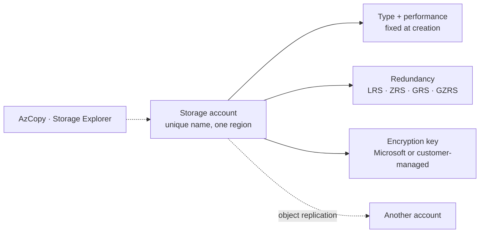
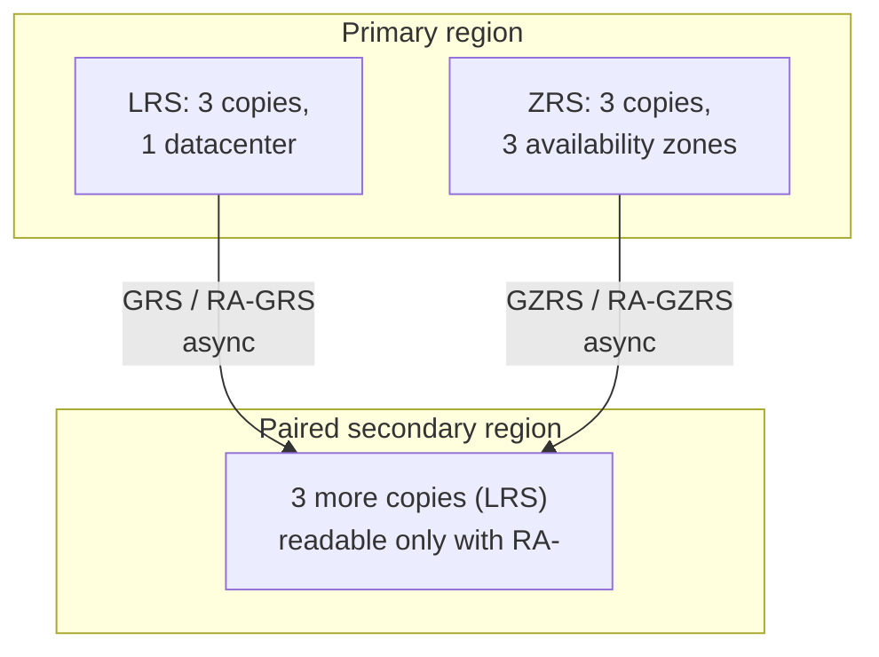

# Storage Accounts

> **Objective:** Configure and manage storage accounts
> **Domain:** Implement and manage storage (15-20%)

## Sub-objectives covered

- Create and configure storage accounts
- Configure Azure Storage redundancy
- Configure object replication
- Configure storage account encryption
- Manage data by using Azure Storage Explorer and AzCopy

## The administrative problem

A team needs somewhere to keep application data, reports and file shares. Before anyone uploads a byte, an
administrator has to make choices that are hard or impossible to change later: what kind of account, how many copies
in how many places, who holds the encryption key, and how data will be moved in and out by the people and scripts that
use it.

A storage account is the container for blobs, files, queues and tables, and most of its
important decisions are made **when you create it**. The type can never change afterwards.
Some choices, such as infrastructure encryption, exist only at creation. Others, such as
redundancy, can change later but take time and sometimes cost money.

This module is about those decisions, and about the two tools administrators use to move data
in and out: **AzCopy** from the command line and **Storage Explorer** on the desktop.

## In plain English

A **storage account** is a named container for Azure Storage data: blobs, file shares, queues and tables. Its
name becomes part of every address (`https://<name>.blob.core.windows.net`), so it must be unique across all of Azure.

When you create one you decide:

- its **type and performance**: Standard general-purpose v2 for most needs, or a Premium type for low latency. The
  type can never change;
- its **redundancy**: how many copies Azure keeps, and where: one datacenter (**LRS**), three zones (**ZRS**), or a
  second region as well (**GRS**, **GZRS**, with read-access variants);
- its **encryption**: data is always encrypted at rest; you choose whether Microsoft or you (in Azure Key Vault)
  manages the key.

**Object replication** copies new blobs from containers in one account to containers in another, asynchronously. And
two tools move data: **AzCopy** on the command line and **Storage Explorer** on the desktop.

## Words you need to know

| Term | In plain English |
| --- | --- |
| **Storage account** | A named, regional container for blobs, file shares, queues and tables, with its own endpoints and settings. |
| **General-purpose v2** | The standard account type for blobs, files, queues and tables. |
| **Redundancy** | How many copies Azure keeps of your data, and where: LRS, ZRS, GRS, GZRS and read-access variants. |
| **Primary / secondary region** | Where data is written first, and the paired region that holds the geo-redundant copy. |
| **Object replication** | Asynchronous copying of block blobs from a source account's container to a destination account's container. |
| **Microsoft-managed key** | The default: Azure creates and rotates the encryption key. |
| **Customer-managed key** | A key you keep in Azure Key Vault, which the account reaches through a managed identity. |
| **AzCopy** | A command-line tool for copying data to, from and between storage accounts. |
| **Storage Explorer** | A desktop app for browsing and managing storage data. |

## Mental model



Make the creation-time decisions on purpose. Redundancy can change later, sometimes slowly; the account
type can't change at all. This is a conceptual teaching model, not a complete architecture.

**Azure translation**

| Everyday idea | Azure name |
| --- | --- |
| A self-storage unit with your company's name on the door | Storage account |
| Copies in one building, across town, or in another city | LRS, ZRS, GRS |
| Using the facility's lock or bringing your own | Microsoft-managed or customer-managed key |
| A moving van and a hand cart | AzCopy and Storage Explorer |

## Where it fits

The ten questions to ask about any resource ([0A-13](../0A-foundations/0A-13-how-resources-fit-together.md)), answered for the main resource in this lesson.

| Question | Storage account |
| --- | --- |
| What contains it? | A resource group, in one region. The name is globally unique, 3 to 24 lowercase letters and numbers. |
| What does it depend on? | A unique name; Key Vault and a managed identity for customer-managed keys; a second account for object replication. |
| What depends on it? | Containers, shares, apps, backups and logs written to it, and replication policies. |
| Who can manage it? | Storage Account Contributor or Contributor for configuration; data roles for the data. |
| How is it networked? | Public endpoints behind its firewall, or private endpoints (02-01, 04-02). |
| How is it monitored? | Capacity and transaction metrics; resource logs through a diagnostic setting; Storage insights. |
| How is it protected? | Encryption at rest, firewall, a delete lock, soft delete and versioning (02-03). |
| How is it recovered? | Redundancy for hardware, zone or regional failures; soft delete and versioning for deletions. |
| What does it cost? | Capacity by redundancy and tier, plus operations and data transfer. |
| How is it removed safely? | Deleting the account deletes all its data. Check locks, replication policies and anything still writing to it. |

See it with its neighbours on the [resource map](#/map/storage).

## How it works under the hood

### Account types and names

| Type | Services | Redundancy | Use |
| --- | --- | --- | --- |
| **Standard general-purpose v2** | Blob (including Data Lake Storage), Queue, Table, Azure Files | LRS, ZRS, GRS, RA-GRS, GZRS, RA-GZRS | The default for most scenarios |
| **Premium block blobs** | Block and append blobs | LRS, ZRS | High transaction rates, small objects, low latency |
| **Premium file shares** | Azure Files only | LRS, ZRS | High performance; SMB **and** NFS shares |
| **Premium page blobs** | Page blobs only | LRS, ZRS | Page blob workloads |

- **You can't change an account's type after creation.** To change type, create a new account and
  copy the data.
- Premium types offer **no geo-redundancy**.
- Names are **3–24 characters, numbers and lowercase letters only**, and **unique across all of
  Azure**, because the name becomes the endpoint, `https://<account>.blob.core.windows.net`.
- By default, a subscription can hold **250** storage accounts with standard endpoints per region
  (**500** with a quota increase).
- **Moving an account** to another resource group or subscription is a normal resource move
  (01-03). **Moving it to another region** means creating a new account and copying the data.
- General-purpose v1 and legacy Blob Storage accounts are retired types; upgrading v1 to v2 can't
  be undone.

### Redundancy: where the copies live



| Option | Survives | Secondary readable? |
| --- | --- | --- |
| **LRS** | Drive and rack failures in one datacenter | — |
| **ZRS** | Loss of a datacenter or zone | — |
| **GRS** | Loss of the whole primary region, after failover | Only after failover |
| **RA-GRS** | Same as GRS | **Yes, always** |
| **GZRS** | Zone loss *and* region loss | Only after failover |
| **RA-GZRS** | Same as GZRS | **Yes, always** |

- The secondary region is **the paired region**. It's decided by the primary region, and you
  can't choose it.
- Replication to the secondary is **asynchronous**, so recent writes may not have arrived when
  the primary fails.
- With geo-redundancy, you can **fail over** to the secondary. Its endpoints become the primary
  endpoints, and clients then write there.
- From least to most expensive: **LRS, ZRS, GRS, RA-GRS, GZRS, RA-GZRS**.

#### Changing redundancy later

- **Geo conversions** add or remove the secondary: LRS ↔ GRS, ZRS ↔ GZRS.
  - **Adding** geo-redundancy incurs a **data transfer charge** for replicating the whole account.
  - **Removing** it is free, but the secondary copy is deleted.
- **Zonal conversions** add or remove zones: LRS ↔ ZRS, GRS ↔ GZRS, RA-GRS ↔ RA-GZRS.
  - They usually **start within about 72 hours** and can take **weeks**. There's **no SLA** for
    completion.
  - **No downtime:** endpoints, keys and SAS tokens stay the same.
- **Some changes take two steps**, with **at least 24 hours** between them. LRS → GZRS means
  adding zones, then adding geo. ZRS → GRS has **no direct path**.
- Removing **read access** (RA-GRS → GRS) is still **billed as RA for 30 days**.
- A **manual migration** means copying to a new account yourself. It gives you control of the
  timing, but it involves downtime.

### Object replication

Object replication **asynchronously copies block blobs** from containers in a **source** account to
containers in a **destination** account. The accounts can be in any region or subscription, and
optionally in another tenant. It's used to reduce read latency, distribute results, or feed
compute in another region.

It requires:

- **Blob versioning on both** accounts, and the **change feed on the source**. Configuration is free;
  the transactions, versions and egress aren't.
- General-purpose v2 or premium block blob accounts, with **block blobs only**. No append or page
  blobs, no snapshots, and **no accounts with a hierarchical namespace**.

How it behaves:

- You create the **policy on the destination first**. Azure assigns a policy ID. You then apply the
  same policy to the source.
- A policy holds up to **1,000 rules**, each mapping one source container to one destination
  container, optionally filtered by prefix or creation time.
- A source can replicate to at most **two** destination accounts, with one policy per pair.
- **Existing blobs aren't copied by default**, only new ones, unless the rule says otherwise.
- **The destination container becomes read-only:** writes fail with **409 (Conflict)**. Reads and
  deletes are allowed.
- Blobs in the **archive** tier can't be replicated. Changing a source blob's tier doesn't change
  the destination's tier.
- **Cross-tenant replication is disallowed by default** on accounts created since December 15,
  2023 (`AllowCrossTenantReplication`). With it disallowed, the policy must identify accounts by
  **full resource ID**, not name.

**Object replication is not redundancy.** Redundancy (GRS and the rest) copies the *whole account*
to the *paired* region, which you don't choose. Object replication copies *chosen containers* to an
*account you choose*.

### Encryption

**All data in a storage account is encrypted at rest** with 256-bit AES, with nothing to enable. What
you control is **who manages the key**:

| | Microsoft-managed keys | Customer-managed keys | Customer-provided keys |
| --- | --- | --- | --- |
| Default | **Yes** | — | — |
| Services | All | Blob Storage and Azure Files (queues and tables only on accounts created to support it) | Blob Storage only |
| Key stored in | Microsoft | **Azure Key Vault or Managed HSM** | The client, sent with each request |
| Rotation by | Microsoft | You | You |

**Customer-managed keys (CMK):**

- The key vault needs **soft delete and purge protection** enabled.
- The key must be **RSA or RSA-HSM, 2048, 3072 or 4096 bits**.
- The storage account reaches the vault with a **managed identity** that has **get, wrapkey and
  unwrapkey** on the key. Configuring CMK **while creating** an account requires a
  **user-assigned** identity.
- Azure Storage uses the key to wrap the account's root encryption key, so switching takes effect
  immediately without re-encrypting data. You can switch between Microsoft-managed and
  customer-managed keys **at any time**.

Two related options:

- **Encryption scopes** use a separate key per **container or blob**, for example to separate
  customers in one account. Each scope uses Microsoft-managed or customer-managed keys. A container's
  default scope is set **when the container is created**. **A scope can't be deleted**, only
  disabled, after which reads and writes with it fail with 403.
- **Infrastructure encryption** encrypts data a **second** time, at the infrastructure level, with a
  different algorithm and a Microsoft-managed key. It must be enabled **when the account (or scope)
  is created**. Microsoft recommends it only where compliance requires double encryption.

### Moving data: AzCopy and Storage Explorer

**AzCopy** (v10) is a command-line tool for copying data to, from, and **between** storage accounts.

- **Authorization:** either **Microsoft Entra ID**, via `azcopy login` or by reusing an Azure CLI or
  PowerShell sign-in, or a **SAS token** appended to each URL.
- **Being Owner isn't enough** for Entra authorization. As in 02-01, you need a data role, such as
  **Storage Blob Data Reader** to download and **Storage Blob Data Contributor** to upload.
- For Azure Files, commands that target only a **share or the account** still need a SAS.
- `azcopy copy`: one-off copies. Between accounts it uses **server-to-server** APIs, so data doesn't
  pass through your machine. It can also copy between Blob and Azure Files, and
  `--preserve-permissions` carries file ACLs.
- `azcopy sync`: **one-way** synchronisation, between local storage and Blob Storage, or between blob
  containers and virtual directories. It doesn't sync Azure Files or other clouds.
- `azcopy make`: creates a container or share.
- For migrations above about 1 TB, Microsoft points to **Azure Storage Mover** instead.

**Storage Explorer** is a desktop app for browsing and managing storage data.

- **Signing in with Microsoft Entra ID is the recommended method**, because it respects RBAC and ACLs.
- It can also **attach** a single resource with an **account name and key**, a **SAS connection
  string**, or a **SAS URL**. Entra is the preferred way to attach a resource you have data access to
  but no management access for.
- Like the portal, it reads data over the data plane, so the storage **firewall** (02-01) applies to
  the machine it runs on.

## Configuration surface

Portal steps were checked against Microsoft Learn on 2026-09-30.

```powershell
# Create, with the choices that can't be made later
New-AzStorageAccount -ResourceGroupName '<rg>' -Name '<account>' -Location '<region>' `
    -SkuName Standard_LRS -Kind StorageV2 -RequireInfrastructureEncryption

# Change redundancy: a geo conversion
Set-AzStorageAccount -ResourceGroupName '<rg>' -Name '<account>' -SkuName Standard_RAGRS

# Object replication prerequisites, then the policy: destination first, then source
Update-AzStorageBlobServiceProperty -ResourceGroupName '<rg>' -StorageAccountName '<src>' `
    -EnableChangeFeed $true -IsVersioningEnabled $true
Update-AzStorageBlobServiceProperty -ResourceGroupName '<rg>' -StorageAccountName '<dst>' -IsVersioningEnabled $true
$rule = New-AzStorageObjectReplicationPolicyRule -SourceContainer '<src-container>' -DestinationContainer '<dst-container>'
$src  = Get-AzStorageAccount -ResourceGroupName '<rg>' -Name '<src>'
$pol  = Set-AzStorageObjectReplicationPolicy -ResourceGroupName '<rg>' -StorageAccountName '<dst>' `
    -PolicyId default -SourceAccount $src.Id -Rule $rule
Set-AzStorageObjectReplicationPolicy -ResourceGroupName '<rg>' -StorageAccountName '<src>' -InputObject $pol
```

```bash
# AzCopy: sign in with Entra, then copy and sync
azcopy login --tenant-id=<tenant-id>
azcopy make 'https://<account>.blob.core.windows.net/<container>'
azcopy copy './report.csv' 'https://<account>.blob.core.windows.net/<container>/report.csv'
azcopy copy 'https://<src>.blob.core.windows.net/<container>' 'https://<dst>.blob.core.windows.net/<container>' --recursive
azcopy sync './reports' 'https://<account>.blob.core.windows.net/<container>' --recursive
```

| Setting | Documented default | Where | Exam angle |
| --- | --- | --- | --- |
| Account type | — | Create only | Can't change later |
| Redundancy | not stated | Redundancy | Premium: LRS or ZRS only |
| Encryption key | **Microsoft-managed** | Encryption | CMK needs Key Vault with purge protection |
| Infrastructure encryption | Off | Create only | Can't be enabled later |
| Cross-tenant object replication | **Disallowed** (accounts since Dec 15, 2023) | Configuration | Use full resource IDs |
| Object replication copy scope | **New blobs only** | Replication rule | Choose "everything" to include existing blobs |

## Worked example

**Requirement.** Reports must survive the loss of an entire region, and a reporting app in that second region must
be able to read them at any time without waiting for a failover.

1. **Decide.** Surviving a region means **geo-redundant** storage. Reading the secondary *without a failover* means the
   **read-access** variant: **RA-GRS**, or **RA-GZRS** if the primary must also survive a zone outage.
2. **Configure.** Set the account's redundancy (or create it with that setting).
3. **Observe.** The account shows a secondary endpoint with a `-secondary` suffix.
4. **Validate.** Check the SKU, and read a blob from the secondary endpoint, as below.

## Validate the result

```powershell
(Get-AzStorageAccount -ResourceGroupName <rg> -Name <account>).Sku.Name        # Standard_RAGRS
(Get-AzStorageAccount -ResourceGroupName <rg> -Name <account>).Encryption.RequireInfrastructureEncryption
Get-AzStorageObjectReplicationPolicy -ResourceGroupName <rg> -StorageAccountName <destination> |
    Select-Object PolicyId, SourceAccount
```

- For redundancy, the SKU name is the proof: `Standard_LRS`, `Standard_ZRS`, `Standard_GRS`, `Standard_RAGRS`,
  `Standard_GZRS` or `Standard_RAGZRS`.
- For object replication, upload a new blob to the source container and confirm it appears in the destination after a
  short delay. Existing blobs aren't copied unless the rule says so.
- For AzCopy, list the destination after the copy: a command that exited without error is not the same as data that
  arrived.

## Common failure modes

1. **"We need to change our Premium account to Standard."** Types can't change. Create a new account
   and copy the data, for example with AzCopy.
2. **"We need geo-redundancy on a Premium block blob account."** Premium supports LRS and ZRS only.
3. **"The LRS → ZRS conversion has been pending for two days."** Zonal conversions usually start within
   about 72 hours and have no completion SLA.
4. **"ZRS → GRS isn't offered."** There's no direct path. Go through GZRS or LRS, waiting at least
   24 hours between steps.
5. **"We removed RA and the bill didn't drop."** Removing read access is billed as RA for 30 more days.
6. **"Object replication won't enable."** Versioning is off on one account, or the change feed is off on
   the source, or the account has a hierarchical namespace.
7. **"Uploads to the destination container fail with 409."** The destination of an object replication
   rule is read-only.
8. **"Nothing old was replicated."** Rules copy only new blobs unless configured to copy existing ones.
9. **"Setting customer-managed keys fails."** The key vault lacks soft delete or purge protection, or the
   identity lacks get, wrapkey or unwrapkey.
10. **"AzCopy says 403 even though I'm Owner."** Owner has no data role. Assign Storage Blob Data
    Contributor, or use a SAS.

## How this is tested

| Phrase in the question | What it steers you to |
| --- | --- |
| "lowest cost; losing one datacenter is acceptable" | LRS |
| "survive loss of an availability zone" | ZRS, or GZRS if a region too |
| "survive a regional outage" | GRS or GZRS |
| "read data from the secondary region at any time" | **RA-GRS** or **RA-GZRS** |
| "premium performance, zone-redundant" | Premium account with ZRS (no geo option) |
| "copy new blobs from container A to an account in another region you choose" | Object replication |
| "object replication prerequisites" | Versioning on both, change feed on source |
| "control and rotate the encryption key yourself" | Customer-managed key in Key Vault (soft delete + purge protection) |
| "encrypt each customer's data with a different key in one account" | Encryption scopes |
| "double encryption for compliance" | Infrastructure encryption, set at creation |
| "copy data between two accounts without routing it through the admin's PC" | `azcopy copy` (server-to-server) |
| "keep a container updated from a local folder" | `azcopy sync` (one-way) |
| "GUI access with Entra identities, respecting RBAC" | Storage Explorer, signed in with Entra ID |

## Hands-on

See [02-02 lab](../../labs/02-storage/02-02-lab.md). It uses two small general-purpose v2 accounts,
deleted the same day. Customer-managed keys are a walkthrough, because the required purge protection
would leave a key vault you can't purge for weeks.

## Check yourself

1. A company needs a premium file share that survives the loss of an availability zone, and asks for
   geo-redundancy too. What can you offer, and what must they give up?
2. An account is LRS. The requirement is RA-GZRS. List the steps, the waits between them, and which
   step incurs a data transfer charge.
3. Object replication is configured, yet blobs that existed before the policy are missing at the
   destination, and a nightly job that writes there fails. Explain both.
4. Why must you enable infrastructure encryption when creating the account, while customer-managed keys
   can be enabled later?
5. You must copy 200 GB between two storage accounts from a laptop on a slow network. Which tool and
   command, and why doesn't the laptop's bandwidth matter?

## Teach it back

Answer out loud or in writing, without notes, as if to someone who has never used Azure. Where you hesitate is what to re-read.

- Explain LRS, ZRS and GRS using where you'd keep copies of an important document.
- Explain why the account type and some encryption options must be right at creation.
- Explain the difference between geo-redundancy and object replication.

## Key takeaways

- **Type and infrastructure encryption are fixed at creation.** Redundancy can change, but zonal
  conversions are slow and some paths take two steps.
- **LRS** one datacenter, **ZRS** three zones, **GRS or GZRS** plus a paired secondary. Only **RA-**
  variants read the secondary without failover. **Premium means LRS or ZRS.**
- **Object replication** copies block blobs from chosen containers to an account you choose. It needs
  **versioning on both** accounts and the **change feed on the source**, and it makes the destination
  read-only.
- Data is **always encrypted**. You choose Microsoft-managed keys, **customer-managed keys** (Key Vault
  with purge protection and a managed identity), or per-request **customer-provided keys**.
- **AzCopy** authorizes with Entra ID or a SAS: `copy` is server-to-server between accounts, `sync` is
  one-way, for Blob Storage only. **Storage Explorer** should sign in with Entra ID.

## Sources

- Microsoft Learn: [Study guide for Exam AZ-104](https://learn.microsoft.com/en-us/credentials/certifications/resources/study-guides/az-104)
- Microsoft Learn: [Storage account overview](https://learn.microsoft.com/en-us/azure/storage/common/storage-account-overview)
- Microsoft Learn: [Azure Storage redundancy](https://learn.microsoft.com/en-us/azure/storage/common/storage-redundancy)
- Microsoft Learn: [Change how a storage account is replicated](https://learn.microsoft.com/en-us/azure/storage/common/redundancy-migration)
- Microsoft Learn: [Changing Azure Storage redundancy configuration: FAQs](https://learn.microsoft.com/en-us/azure/storage/common/storage-redundancy-change-faq)
- Microsoft Learn: [Azure storage disaster recovery planning and failover](https://learn.microsoft.com/en-us/azure/storage/common/storage-disaster-recovery-guidance)
- Microsoft Learn: [Object replication for block blobs](https://learn.microsoft.com/en-us/azure/storage/blobs/object-replication-overview)
- Microsoft Learn: [Configure object replication](https://learn.microsoft.com/en-us/azure/storage/blobs/object-replication-configure)
- Microsoft Learn: [Azure Storage encryption for data at rest](https://learn.microsoft.com/en-us/azure/storage/common/storage-service-encryption)
- Microsoft Learn: [Customer-managed keys for Azure Storage encryption](https://learn.microsoft.com/en-us/azure/storage/common/customer-managed-keys-overview)
- Microsoft Learn: [Encryption scopes for Blob storage](https://learn.microsoft.com/en-us/azure/storage/blobs/encryption-scope-overview)
- Microsoft Learn: [Enable infrastructure encryption for double encryption of data](https://learn.microsoft.com/en-us/azure/storage/common/infrastructure-encryption-enable)
- Microsoft Learn: [Get started with AzCopy](https://learn.microsoft.com/en-us/azure/storage/common/storage-use-azcopy-v10)
- Microsoft Learn: [Authorize access for AzCopy with a user identity](https://learn.microsoft.com/en-us/azure/storage/common/storage-use-azcopy-authorize-user-identity)
- Microsoft Learn: [Synchronize with Azure Blob storage by using AzCopy](https://learn.microsoft.com/en-us/azure/storage/common/storage-use-azcopy-blobs-synchronize)
- Microsoft Learn: [Copy blobs between Azure storage accounts by using AzCopy](https://learn.microsoft.com/en-us/azure/storage/common/storage-use-azcopy-blobs-copy)
- Microsoft Learn: [Get started with Storage Explorer](https://learn.microsoft.com/en-us/azure/storage/storage-explorer/vs-azure-tools-storage-manage-with-storage-explorer)
