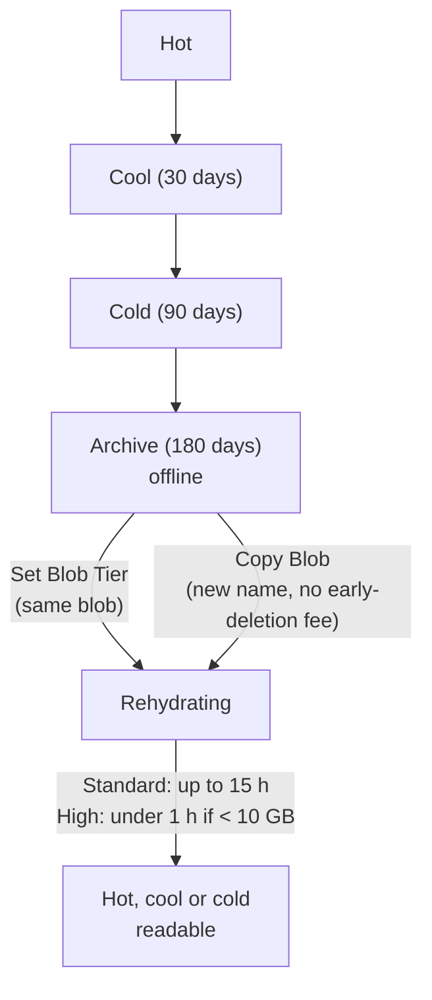

# Azure Files and Blob Storage

> **Objective:** Configure Azure Files and Azure Blob Storage
> **Domain:** Implement and manage storage (15-20%)

## Sub-objectives covered

- Create and configure a file share in Azure Files
- Create and configure a container in Azure Blob Storage
- Configure storage tiers
- Configure soft delete for blobs and containers
- Configure snapshots and soft delete for Azure Files
- Configure blob lifecycle management
- Configure blob versioning

## Why this exists

02-01 controlled who reaches the data, and 02-02 chose where it lives. This module is about the
data itself over time: **where** it sits (containers and file shares), **how much it costs to
keep** (tiers and lifecycle rules), and **how you get it back** after someone deletes or
overwrites it (soft delete, versioning and snapshots).

Most questions here are about **which protection covers which mistake**. Blob soft delete doesn't
bring back a deleted container. Share soft delete doesn't bring back a deleted file. Nothing on
this page protects against deleting the storage account itself; that's a lock (01-03).

## How it works under the hood

### Azure Files: shares and billing models

An Azure file share is a fully managed file share, reached over **SMB**, **NFS** (SSD shares only)
or REST. SMB uses **TCP port 445**, so a client whose network blocks outbound 445 can't mount the
share.

How a share is billed decides most of its settings:

| Billing model | Media | You pay for | Notes |
| --- | --- | --- | --- |
| **Provisioned v2** | SSD or HDD | The storage, IOPS and throughput you provision | **Microsoft's recommendation for new deployments.** Decreases are allowed only 24 hours after an increase |
| **Provisioned v1** | SSD | Provisioned storage; IOPS and throughput follow from it | Use v2 unless you have a reason |
| **Pay-as-you-go** | HDD | Used storage, transactions and data transfer | Access tiers: **transaction optimized**, **hot**, **cool** |

- **Pay-as-you-go access tiers** trade storage price against transaction price. Transaction
  optimized is cheapest per transaction and most expensive per GB; cool is the reverse. Microsoft
  suggests starting a migration in transaction optimized.
  - You can change a share's tier **up to five times in 30 days**, and **not again within 24 hours**
    of a change. Moving out of cool incurs a data retrieval charge.
- **NFS** needs **SSD** with a **provisioned** model.
- SSD (premium) shares support **LRS and ZRS**. HDD SMB shares also support GRS and GZRS.
- The **quota** (or provisioned size) caps how much a share can hold.

### Blob containers

A container groups blobs, and its name becomes part of each blob's URL. Container names are **3–63
characters**: lowercase letters, numbers and hyphens, starting with a letter or number, with no
consecutive hyphens.

**Anonymous read access** has two switches, and both must allow it:

1. The **account** setting that allows or disallows anonymous blob access.
2. The **container's anonymous access level**:
   - **Private**: no anonymous access.
   - **Blob**: anonymous read of blobs only.
   - **Container**: anonymous read of the blobs **and** the listing of the container.

If the account disallows anonymous access, no container can be made public, whatever its level.

### Access tiers

Tiers apply to **block blobs**, and let you trade storage price against access price:

| Tier | Minimum stay | Online? | Notes |
| --- | --- | --- | --- |
| **Hot** | — | Yes | Highest storage cost, lowest access cost |
| **Cool** | **30 days** | Yes | |
| **Cold** | **90 days** | Yes | |
| **Archive** | **180 days** | **No: offline** | Lowest storage cost; hours to read back |

- Leaving a tier before its minimum stay, by deleting, overwriting or re-tiering, incurs a
  **prorated early-deletion charge**. A blob archived and deleted after 45 days is charged for the
  remaining 135.
- Each account has a **default access tier**: **hot**, **cool** or **cold**, never archive. New
  general-purpose v2 accounts default to **hot**. Blobs without an explicit tier inherit it, and the
  portal shows them as *(inferred)*.
- **Archive is supported only on LRS, GRS and RA-GRS accounts**, not ZRS, GZRS or RA-GZRS. You also
  can't archive a blob that uses an **encryption scope** (02-02).
- **Premium block blob accounts don't use tiers.**
- Moving to a cooler tier, or from cool or cold to hot, is **instant**.

### Archive rehydration

An archived blob can't be read or modified; only its metadata can be read. To read it, **rehydrate**
it to an online tier:



- **Standard** priority is the default. **High** priority costs more; you can raise a pending
  request from Standard to High, but not lower it.
- High-priority rehydration is limited **per storage account** (about 10 GiB an hour), so bulk
  rehydrations take longer than the per-blob figures suggest.
- **Lifecycle policies can't rehydrate.** They only move blobs towards cooler tiers or delete them.

### Blob lifecycle management

A lifecycle policy is a set of **rules** on the storage account, each with **filters** and
**actions**. Azure runs the policy **once a day**.

- **Filters:** blob type (block blob, append blob), a **prefix**, or blob index tags. A prefix
  **starts with the container name**, such as `reports/logs/`.
  A rule can target **current versions**, **previous versions** or **snapshots**.
- **Run conditions:**
  - `daysAfterModificationGreaterThan` and `daysAfterCreationGreaterThan`.
  - `daysAfterLastAccessTimeGreaterThan`, which needs **access time tracking** turned on.
  - `daysAfterLastTierChangeGreaterThan`, which applies to `tierToArchive` only.
- **Actions:**
  - `tierToCool`, `tierToCold` and `tierToArchive`. None of them work on append or page blobs, or in
    premium block blob accounts.
  - `enableAutoTierToHotFromCool` moves a cool blob back to hot when it's accessed, at most once
    every 30 days.
  - `delete`.
- When several actions apply to the same blob, **the cheapest wins**: delete beats archive, and
  archive beats cool.
- **The re-archiving trap.** Rehydrating a blob doesn't reset its modification or access time, so a
  `tierToArchive` rule can send it straight back to archive. Add `daysAfterLastTierChangeGreaterThan`
  to the archive action, or rehydrate by copying to a new blob.

### Blob soft delete, container soft delete and versioning

Three separate settings, which Microsoft recommends enabling **together**:

| Protection | Protects against | Retention | Restore with |
| --- | --- | --- | --- |
| **Blob soft delete** | Deleting or overwriting a blob, version or snapshot | 1–365 days | **Undelete** |
| **Container soft delete** | Deleting a **whole container** | 1–365 days (default 7) | **Restore**, under the **original name** |
| **Blob versioning** | Overwriting or deleting a blob | Until you delete the versions | Promote a previous version |

- **Blob soft delete doesn't restore a deleted container**, and **container soft delete doesn't
  restore a single deleted blob**. Each covers its own level.
- A soft-deleted container can be restored only under its **original name**, and not if a new
  container with that name has been created.
- A **retention change** applies only to data deleted **after** the change.
- **Turning off** soft delete keeps already soft-deleted data until its retention ends.
- **None of these protects the storage account.** Use a lock.

**Versioning:**

- Every write automatically keeps the previous state as a **version** with its own version ID. The
  latest is the **current version**.
- **Deleting a blob** turns its current version into a previous version, so there's no current
  version any more.
- **To restore a deleted or overwritten blob**, promote a previous version: **Make current version**
  in the portal, which copies it back over the base blob.
  - With versioning on, **Undelete doesn't restore the current version**. It only restores
    soft-deleted previous versions and snapshots.
- **Versions are kept until you delete them**, so storage grows with every overwrite. A lifecycle
  rule that deletes old previous versions keeps costs in check.
- Versioning isn't available on accounts with a **hierarchical namespace**. It's required on both
  accounts for object replication (02-02).

> **Context - not a measured skill.** **Point-in-time restore** returns a whole range of block blobs
> to an earlier moment. It requires versioning, blob soft delete and the change feed.

### Azure Files: share snapshots and share soft delete

| Protection | Level | Restores |
| --- | --- | --- |
| **Share snapshot** | The **whole share**, at a point in time | **Individual files** or the whole share, in the portal or through **Previous Versions** in File Explorer |
| **Share soft delete** | A **deleted share** | The share **with its snapshots** |

**Share snapshots:**

- **Read-only** and **incremental**: each stores only what changed since the previous one.
- Up to **200 per share**, kept for up to **10 years**. A 201st returns 409; delete old ones first.
- They protect against changes to files, **not** against deleting the share, because deleting the
  share deletes its snapshots.
- Azure Backup for file shares schedules them for you (module 05-02).

**Share soft delete:**

- An **account-level** setting for all shares, **enabled by default on new storage accounts**, with a
  retention of **7 days** by default (1–365).
- It works at **share level only**: a deleted file comes back from a snapshot, not from share soft
  delete.
- **To permanently delete a soft-deleted share early:** undelete it, disable soft delete, delete the
  share again, then re-enable soft delete.

## Configuration surface

Portal steps were checked against Microsoft Learn on 2026-09-30.

```powershell
# Blob data protection: soft delete, container soft delete, versioning
Enable-AzStorageBlobDeleteRetentionPolicy      -ResourceGroupName '<rg>' -StorageAccountName '<account>' -RetentionDays 7
Enable-AzStorageContainerDeleteRetentionPolicy -ResourceGroupName '<rg>' -StorageAccountName '<account>' -RetentionDays 7
Update-AzStorageBlobServiceProperty -ResourceGroupName '<rg>' -StorageAccountName '<account>' -IsVersioningEnabled $true

# Azure Files: share soft delete, and a pay-as-you-go share with a tier and quota
Update-AzStorageFileServiceProperty -ResourceGroupName '<rg>' -StorageAccountName '<account>' `
    -EnableShareDeleteRetentionPolicy $true -ShareRetentionDays 7
New-AzRmStorageShare -ResourceGroupName '<rg>' -StorageAccountName '<account>' -Name '<share>' `
    -AccessTier TransactionOptimized -QuotaGiB 10
```

```bash
# Tiers: archive, then rehydrate with a priority
az storage blob set-tier --account-name "<account>" --container-name "<container>" --name "<blob>" \
  --tier Archive --auth-mode login
az storage blob set-tier --account-name "<account>" --container-name "<container>" --name "<blob>" \
  --tier Hot --rehydrate-priority Standard --auth-mode login
```

```json
{
  "rules": [
    {
      "enabled": true,
      "name": "age-out-logs",
      "type": "Lifecycle",
      "definition": {
        "filters": { "blobTypes": [ "blockBlob" ], "prefixMatch": [ "reports/logs/" ] },
        "actions": {
          "baseBlob": {
            "tierToCool":    { "daysAfterModificationGreaterThan": 30 },
            "tierToArchive": { "daysAfterModificationGreaterThan": 90, "daysAfterLastTierChangeGreaterThan": 7 },
            "delete":        { "daysAfterModificationGreaterThan": 365 }
          },
          "version": { "delete": { "daysAfterCreationGreaterThan": 90 } }
        }
      }
    }
  ]
}
```

| Setting | Documented default | Where | Exam angle |
| --- | --- | --- | --- |
| Default access tier (general-purpose v2) | **Hot** | Configuration | Hot, cool or cold; never archive |
| Container soft delete retention | **7 days** when enabled | Data protection | 1–365 days; original name only |
| Blob soft delete retention | not stated | Data protection | 1–365 days |
| Share soft delete | **Enabled**, 7 days, on new accounts | File shares | Share-level only |
| Share snapshots | — | File share > Snapshots | Up to 200; read-only; incremental |
| Rehydration priority | **Standard** | Change tier | High is faster, costs more |
| Lifecycle policy frequency | Once a day | Lifecycle management | Can't rehydrate |

## Common failure modes

1. **"Blob soft delete is on, but the deleted container is gone for good."** Blob soft delete doesn't
   cover containers. Container soft delete is a separate setting that must also be on.
2. **"Undelete ran, but the blob is still gone."** With versioning on, Undelete restores soft-deleted
   versions, not the current one. Promote a previous version.
3. **"The rehydrated blob went back to archive overnight."** A `tierToArchive` rule matched it again.
   Add `daysAfterLastTierChangeGreaterThan`, or rehydrate by copying.
4. **"We can't archive blobs in this account."** The account is ZRS, GZRS or RA-GZRS, or the blob uses
   an encryption scope, or it's a premium block blob account.
5. **"Moving 1 TB out of archive with High priority is taking many hours."** High-priority throughput is
   limited per account; the under-one-hour figure is per blob under 10 GB.
6. **"The storage bill spiked after enabling versioning."** Every overwrite keeps a version. Add a
   lifecycle rule to delete old previous versions.
7. **"Deleting the cool blob early still cost 30 days."** That's the prorated early-deletion charge.
8. **"A user deleted one file from the share; share soft delete didn't help."** Share soft delete
   restores deleted shares only. Restore the file from a share snapshot.
9. **"We can't delete the soft-deleted share to free its name."** Undelete it, disable soft delete,
   delete again, then re-enable.
10. **"The share won't mount from the office."** Outbound TCP 445 is blocked by the network.

## How this is tested

| Phrase in the question | What it steers you to |
| --- | --- |
| "rarely accessed, kept 7 years, retrieval within hours is acceptable" | **Archive** tier |
| "must be read immediately, accessed a few times a year" | **Cold** (or cool) tier, not archive |
| "read an archived blob urgently" | Rehydrate with **High** priority |
| "rehydrate without an early-deletion fee" | **Copy Blob** to a new name |
| "move blobs to cool after 30 days and delete after a year, automatically" | Lifecycle management rule |
| "move blobs not **read** for 60 days" | `daysAfterLastAccessTimeGreaterThan`, with access time tracking on |
| "recover a blob deleted yesterday" | Blob soft delete (or versioning) |
| "recover a deleted container" | Container soft delete |
| "recover a previous version of an overwritten blob" | Blob versioning: promote the version |
| "recover a file deleted from an Azure file share" | Share snapshot |
| "recover a deleted file share" | Share soft delete |
| "cheapest pay-as-you-go share for a write-heavy workload" | **Transaction optimized** tier |
| "NFS file share" | SSD, provisioned billing |
| "anonymous users can list and read blobs" | Container access level **Container**, with anonymous access allowed on the account |

## Hands-on

See [02-03 lab](../../labs/02-storage/02-03-lab.md). It uses one small storage account deleted the
same day. The archived blob in the lab is a few kilobytes, so its prorated early-deletion charge is
negligible.

## Check yourself

1. Blob soft delete (14 days) and versioning are on. A user overwrites `report.docx` three times, then
   deletes it. What exists now, and how do you get the second version back as the current blob?
2. A lifecycle rule archives `logs/` blobs 90 days after modification. You rehydrate one on Monday; on
   Tuesday it's archived again. Why, and name two fixes.
3. Container soft delete is on at 7 days. Someone deletes container `invoices` and a colleague
   immediately creates a new, empty `invoices`. Can you restore the old one?
4. A user deleted a folder on an Azure file share that has share soft delete enabled and nightly
   snapshots. Which feature restores the folder, and which would matter if the whole share had been
   deleted?
5. Why can't you archive blobs in a GZRS account, and what would you have to do before converting an
   LRS account that holds archived blobs to ZRS?

## Key takeaways

- **Tiers:** hot, cool (30 days), cold (90), archive (180, **offline**). Leaving early costs a prorated
  fee. Archive needs **LRS, GRS or RA-GRS**, and the default tier can never be archive.
- **Rehydrate** with Set Blob Tier or **Copy Blob** (no fee), Standard (up to 15 hours) or High. Lifecycle
  rules **can't** rehydrate, and can **re-archive** unless you add `daysAfterLastTierChangeGreaterThan`.
- **Lifecycle** rules run **daily**, filter by prefix and type, and the **cheapest** matching action wins.
- **Blob soft delete, container soft delete and versioning** each cover a different mistake; turn on all
  three. With versioning, restore by **promoting a version**.
- **Azure Files:** **snapshots** restore files (200 per share); **share soft delete** restores shares and is
  **on by default**. Neither protects the account; locks do.

## Sources

- Microsoft Learn: [Study guide for Exam AZ-104](https://learn.microsoft.com/en-us/credentials/certifications/resources/study-guides/az-104)
- Microsoft Learn: [Understand Azure Files billing](https://learn.microsoft.com/en-us/azure/storage/files/understanding-billing)
- Microsoft Learn: [Plan an Azure Files deployment](https://learn.microsoft.com/en-us/azure/storage/files/storage-files-planning)
- Microsoft Learn: [Naming and referencing containers, blobs, and metadata](https://learn.microsoft.com/en-us/rest/api/storageservices/naming-and-referencing-containers--blobs--and-metadata)
- Microsoft Learn: [Configure anonymous read access for containers and blobs](https://learn.microsoft.com/en-us/azure/storage/blobs/anonymous-read-access-configure)
- Microsoft Learn: [Access tiers for blob data](https://learn.microsoft.com/en-us/azure/storage/blobs/access-tiers-overview)
- Microsoft Learn: [Blob rehydration from the archive tier](https://learn.microsoft.com/en-us/azure/storage/blobs/archive-rehydrate-overview)
- Microsoft Learn: [Rehydrate an archived blob to an online tier](https://learn.microsoft.com/en-us/azure/storage/blobs/archive-rehydrate-to-online-tier)
- Microsoft Learn: [Lifecycle management policy structure](https://learn.microsoft.com/en-us/azure/storage/blobs/lifecycle-management-policy-structure)
- Microsoft Learn: [Archive a blob](https://learn.microsoft.com/en-us/azure/storage/blobs/archive-blob)
- Microsoft Learn: [Soft delete for blobs](https://learn.microsoft.com/en-us/azure/storage/blobs/soft-delete-blob-overview)
- Microsoft Learn: [Soft delete for containers](https://learn.microsoft.com/en-us/azure/storage/blobs/soft-delete-container-overview)
- Microsoft Learn: [Manage and restore soft-deleted blobs](https://learn.microsoft.com/en-us/azure/storage/blobs/soft-delete-blob-manage)
- Microsoft Learn: [Blob versioning](https://learn.microsoft.com/en-us/azure/storage/blobs/versioning-overview)
- Microsoft Learn: [Data protection overview](https://learn.microsoft.com/en-us/azure/storage/blobs/data-protection-overview)
- Microsoft Learn: [Use share snapshots with Azure Files](https://learn.microsoft.com/en-us/azure/storage/files/storage-snapshots-files)
- Microsoft Learn: [Azure file share soft delete](https://learn.microsoft.com/en-us/azure/storage/files/storage-files-prevent-file-share-deletion)
