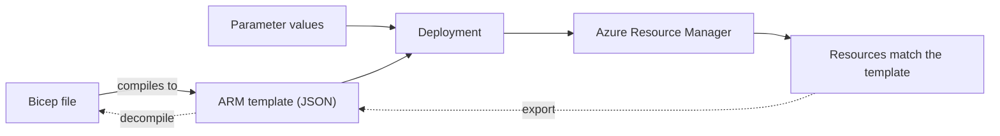
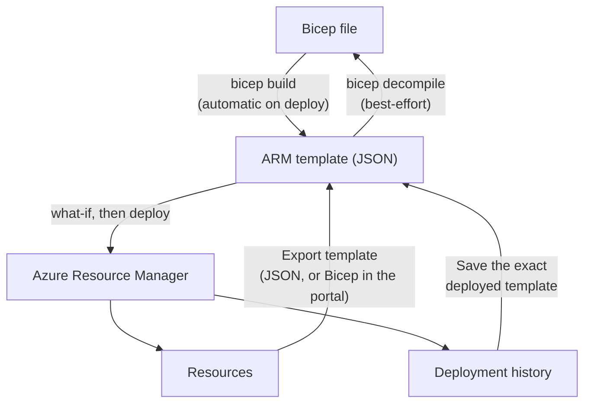

# ARM Templates and Bicep

> **Objective:** Automate deployment of resources by using Azure Resource Manager (ARM) templates or Bicep files
> **Domain:** Deploy and manage Azure compute resources (20-25%)

## Sub-objectives covered

- Interpret an Azure Resource Manager template or a Bicep file
- Modify an existing Azure Resource Manager template
- Modify an existing Bicep file
- Deploy resources by using an Azure Resource Manager template or a Bicep file
- Export a deployment as an Azure Resource Manager template or convert an Azure Resource Manager template to a Bicep file

## The administrative problem

A team builds the same environment again and again: for development, for testing, for each new customer. Built
by hand, no two are quite the same, and nobody can say exactly what was clicked. An administrator needs a way to
describe an environment once, review it, deploy it the same way every time, and read what someone else deployed.

Every change to an Azure resource, whether it comes from the portal, the CLI or PowerShell, is a
request to **Azure Resource Manager**. A template is simply that request written down: which
resources should exist, with which properties. Writing it down makes the deployment repeatable,
reviewable and consistent across environments.

There are two languages for the same thing:

- **ARM templates** are JSON, the format Resource Manager itself accepts.
- **Bicep** is a cleaner language that **compiles to an ARM template**. When you deploy a Bicep file
  with the Azure CLI or PowerShell, the tooling builds the JSON for you, and Resource Manager never
  sees Bicep.

The exam doesn't ask you to write a template from nothing. It asks you to **read** one (what does it
deploy, and where do the values come from?), **change** one (add a parameter, a resource, a
dependency), **deploy** one safely, and **get** one, by export or conversion.

## In plain English

A **template** is a file that describes the resources you want and their settings. You give it to Azure Resource
Manager, and Resource Manager creates or updates whatever is needed to match it. This is **declarative**: you say what
the end state is, not the steps to get there.

There are two languages for the same thing:

- **ARM templates** are JSON, the format Resource Manager accepts.
- **Bicep** is shorter and easier to read. It **compiles to an ARM template** before deployment.

Both have the same parts: **parameters** (values you supply at deployment, such as a name), **variables** (values
worked out inside the file), **resources** (what to create) and **outputs** (values returned afterwards). You can also
go the other way: **export** an existing deployment as a template, or **decompile** JSON into Bicep.

## Words you need to know

| Term | In plain English |
| --- | --- |
| **Infrastructure as code** | Describing resources in files that can be reviewed, versioned and deployed again. |
| **ARM template** | A JSON file that declares resources for Azure Resource Manager to deploy. |
| **Bicep file** | A simpler language for the same declarations; it compiles to an ARM template. |
| **Parameter** | A value supplied when you deploy, such as a name or a SKU. |
| **Variable** | A value computed inside the template from parameters and functions. |
| **Output** | A value the deployment returns, such as a resource ID. |
| **Deployment scope** | Where a deployment targets: resource group, subscription, management group or tenant. |
| **What-if** | A preview of the changes a deployment would make, without making them. |
| **Decompile** | Convert an ARM template's JSON into a Bicep file, as a best-effort starting point. |

## Mental model



A template is a description, not a script. Deploying the same template twice should leave the same result,
which is what makes it safe to repeat. This is a conceptual teaching model, not a complete architecture.

**Azure translation**

| Everyday idea | Azure name |
| --- | --- |
| An architect's drawing | ARM template or Bicep file |
| The blanks on a form (name, size) | Parameters |
| Building inspectors checking the drawing against the site | What-if |
| Measuring an existing house to draw its plan | Export |

## Where it fits

The ten questions to ask about any resource ([0A-13](../0A-foundations/0A-13-how-resources-fit-together.md)), answered for the main resource in this lesson.

| Question | A template deployment |
| --- | --- |
| What contains it? | A deployment record at its scope: a resource group, subscription, management group or tenant. |
| What does it depend on? | Permission to create the resources at that scope; registered resource providers; the Bicep CLI for Bicep files. |
| What depends on it? | The resources it created, and anyone redeploying from the same file. |
| Who can manage it? | Whoever can write the resources at the target scope, such as Contributor. |
| How is it networked? | Not networked itself; the resources it declares may be. |
| How is it monitored? | The deployment history at its scope and the activity log. |
| How is it protected? | Secure parameters for secrets, what-if before deploying, review in source control. |
| How is it recovered? | Redeploy the last good version of the file. |
| What does it cost? | Deploying is free; the resources bill as usual. |
| How is it removed safely? | Deleting a deployment record doesn't delete the resources; delete the resources, or the resource group. |

See it with its neighbours on the [resource map](#/map/rg).

## How it works under the hood

### Where templates come from and go



### Reading an ARM template

An ARM template is a JSON object with these top-level sections:

| Section | Required | Holds |
| --- | --- | --- |
| `$schema` | Yes | The template language version, as a schema URL |
| `contentVersion` | Yes | Your own version string, such as `1.0.0.0` |
| `parameters` | No | Values supplied at deployment time, each with a `type` and optional `defaultValue`, `allowedValues`, `minLength` and more |
| `variables` | No | Values computed once and reused |
| `functions` | No | User-defined functions |
| `resources` | **Yes** | What to deploy: `type`, `apiVersion`, `name`, `location`, `properties`, optional `dependsOn` and `tags` |
| `outputs` | No | Values returned after deployment |

Values are built with **template expressions** in square brackets:

- `"[parameters('skuName')]"` and `"[variables('storageName')]"` read a parameter or variable.
- `"[resourceGroup().location]"` calls a **template function**. `resourceGroup()` works only in
  resource-group deployments.
- `"[concat(parameters('namePrefix'), uniqueString(resourceGroup().id))]"` builds a name.
  `uniqueString()` returns the same value every time for the same input, so the name is unique **and**
  repeatable.
- `"[resourceId('Microsoft.Storage/storageAccounts', variables('storageName'))]"` builds a resource
  ID, which is how `dependsOn` and `reference()` point at another resource.

Function names are case-insensitive. Strings passed to functions use single quotes.

**`dependsOn`** tells Resource Manager that one resource must finish before another starts.
Resources with no dependency between them deploy **in parallel**. List only resources deployed in
**this** template; anything else must already exist.

### Reading a Bicep file

The same storage account in Bicep, abridged from this module's lab file, `storage.bicep`:

```bicep
@description('Storage redundancy.')
@allowed([
  'Standard_LRS'
  'Standard_GRS'
])
param skuName string = 'Standard_LRS'

param location string = resourceGroup().location

var storageName = '${namePrefix}${uniqueString(resourceGroup().id)}'

resource stg 'Microsoft.Storage/storageAccounts@2023-05-01' = {
  name: storageName
  location: location
  sku: {
    name: skuName
  }
  kind: 'StorageV2'
}

output blobEndpoint string = stg.properties.primaryEndpoints.blob
```

| Bicep | ARM JSON equivalent |
| --- | --- |
| `param skuName string = 'Standard_LRS'` | `"parameters": { "skuName": { "type": "string", "defaultValue": "Standard_LRS" } }` |
| `@allowed([...])`, `@minLength(3)`, `@description('...')` decorators | `allowedValues`, `minLength`, `metadata.description` |
| `@secure()` | A `securestring` or `secureobject` parameter: the value isn't saved to deployment history or logged |
| `var storageName = '${a}${b}'` | `"variables"` with `concat()` or `format()` |
| `resource stg '<type>@<apiVersion>' = { ... }` | An entry in `resources` with `type` and `apiVersion` |
| `stg.properties.primaryEndpoints.blob` | `reference(resourceId(...)).primaryEndpoints.blob` |
| `output name type = value` | `"outputs"` |
| `module m './file.bicep' = { params: { ... } }` | A nested deployment (`Microsoft.Resources/deployments`) |
| `resource x '<type>@<ver>' existing = { name: '...' }` | A reference to a resource that already exists; it isn't deployed |

Things Bicep does for you:

- **Symbolic names.** `stg` is the name *inside the file*; `name:` is the name *in Azure*. Other parts
  of the file refer to the resource by its symbolic name.
- **Implicit dependencies.** When one resource refers to another by symbolic name, including through
  `parent:`, Bicep adds the `dependsOn` itself. This lab's compiled output shows it: a container
  declared with `parent: blobSvc` gets a `dependsOn` on the blob service, and the blob service on the
  storage account, with none written by hand. Explicit `dependsOn` is only for dependencies Bicep
  can't see.
- **Modules** reuse another Bicep file, or an ARM JSON template, as one unit.

### Modifying a template

The changes exam questions describe are small and structural:

- **Add a parameter**, with a default and allowed values, then use it where a literal was.
- **Add a resource**, with the right `type` and `apiVersion`.
  - In ARM JSON, give a child resource a slash-separated name, such as
    `account/default/container`, and a `dependsOn` on its parent.
  - In Bicep, use `parent:` and let the dependency be implied.
- **Add an output**, such as a resource ID or endpoint for a later step.
- **Change a value** so it comes from a parameter or variable, not a hard-coded string.

When a question shows a template that fails, look first for a missing or wrong `dependsOn`, a
parameter referenced but not declared, a value outside `allowedValues`, or a name that breaks the
resource type's naming rules.

### Deploying

| Scope | Azure CLI | PowerShell |
| --- | --- | --- |
| Resource group | `az deployment group create` | `New-AzResourceGroupDeployment` |
| Subscription | `az deployment sub create` | `New-AzSubscriptionDeployment` |
| Management group | `az deployment mg create` | `New-AzManagementGroupDeployment` |
| Tenant | `az deployment tenant create` | `New-AzTenantDeployment` |

- **Parameters** come from a JSON parameters file, a **`.bicepparam`** file (which names its Bicep file
  with `using`), inline values, or a mix. With the CLI, later values override earlier ones.
- Both tools deploy **Bicep files directly** by building them first. The Azure CLI manages its own copy
  of the Bicep CLI (`az bicep install`, `az bicep upgrade`); for PowerShell, install the Bicep CLI as
  Microsoft's guide describes.
- **What-if** previews every change without making it: `az deployment group what-if`,
  `New-AzResourceGroupDeployment -WhatIf`. It reports **Create**, **Delete**, **Modify**, **NoChange**,
  **Ignore** and more. Use `--confirm-with-what-if` (CLI) or `-Confirm` (PowerShell) to preview and then
  approve.
- **The portal** deploys templates too: **Deploy a custom template**, or **Redeploy** from a resource
  group's **Deployments** page.

**Deployment modes:**

| Mode | Resources in the template | Resources in the resource group but **not** in the template |
| --- | --- | --- |
| **Incremental** (default) | Created or updated | **Left alone** |
| **Complete** | Created or updated | **Deleted** |

- Complete mode applies to **resource-group** deployments. Microsoft **doesn't recommend it**, and
  points to deployment stacks when you need deletion. Always run **what-if** first.
- With complete mode, a resource whose **condition** evaluates to false is **deleted**.
- A **lock** on the resource group stops complete mode deleting anything.

Each deployment is recorded under the resource group's **Deployments** page, with its template,
parameters (except secure ones) and outputs. The history holds up to **800** deployments and removes
old entries automatically as it approaches that limit.

### Exporting and converting

Three ways to get a template from something that already exists:

| Source | Gives you | Tools |
| --- | --- | --- |
| **Resource group or resources** (current state) | ARM JSON, or **Bicep in the portal only** | Portal **Export template**; `az group export`; `Export-AzResourceGroup` |
| **A past deployment** | The **exact template that was deployed**, as ARM JSON | Deployment history > **Template** |
| **An ARM template** | A Bicep file | `bicep decompile` / `az bicep decompile` |

- **Exported templates usually need work.** Export is generated from the resource type's published
  schema, may use an older API version, can **omit passwords and other secrets**, doesn't cover every
  resource type, and refuses resource groups with **more than 200 resources**. Microsoft calls it a
  starting point, not a production template.
- **Decompiling is best-effort.** It writes `main.bicep` next to `main.json` (`--force` overwrites) and
  may leave warnings to fix. JSON → Bicep → JSON produces **functionally equivalent** templates, not
  identical ones. `bicep decompile-params` converts a JSON parameters file to `.bicepparam`.
- **Going the other way**, `bicep build` / `az bicep build` compiles Bicep to ARM JSON.

## Configuration surface

```bash
# Preview, then deploy a Bicep file with a .bicepparam file (the using line names the Bicep file)
az deployment group what-if  --resource-group "<rg>" --parameters storage.bicepparam
az deployment group create   --resource-group "<rg>" --parameters storage.bicepparam

# The ARM JSON version, with a JSON parameters file and one override
az deployment group create --resource-group "<rg>" --template-file storage.json \
  --parameters '@storage.parameters.json' skuName=Standard_GRS

# Export and convert
az group export --name "<rg>" > exported.json
az bicep decompile --file exported.json
```

```powershell
New-AzResourceGroupDeployment -ResourceGroupName '<rg>' -TemplateFile 'storage.bicep' -WhatIf
New-AzResourceGroupDeployment -ResourceGroupName '<rg>' -TemplateFile 'storage.json' `
    -TemplateParameterFile 'storage.parameters.json'
Export-AzResourceGroup -ResourceGroupName '<rg>' -Path './exported.json'
```

| Setting | Documented default | Where | Exam angle |
| --- | --- | --- | --- |
| Deployment mode | **Incremental** | `--mode`, `-Mode` | Complete deletes what isn't in the template |
| What-if result format | Full resource payloads | `--result-format` | Always what-if before complete mode |
| Secure parameter | — | `@secure()`, `securestring` | Not saved in deployment history |
| Deployment history | Up to 800, old entries auto-deleted | Resource group > Deployments | Exact template, JSON only |
| Export as Bicep | Portal only | Export template | CLI and PowerShell export JSON; decompile it |

## Worked example

**Requirement.** A Bicep file deploys a storage account. You must make the SKU selectable at deployment time,
defaulting to `Standard_LRS`, and allow only LRS or ZRS.

1. **Decide.** A selectable value is a **parameter**; restricting it is the `@allowed` decorator; the default is the
   parameter's default value.
2. **Configure.** Add the parameter, then use `skuName` in the resource's `sku.name`:

   ```bicep
   @allowed([
     'Standard_LRS'
     'Standard_ZRS'
   ])
   param skuName string = 'Standard_LRS'
   ```

3. **Observe.** Run what-if first: it should show a **Modify** or **NoChange** for the account, not a Delete.
4. **Validate.** Deploy, then check the deployment's state and the resulting SKU, as below.

## Validate the result

```powershell
az bicep build --file storage.bicep                                       # compiles cleanly
az deployment group what-if --resource-group <rg> --template-file storage.bicep --parameters skuName=Standard_ZRS
az deployment group list --resource-group <rg> --query "[].{name:name, state:properties.provisioningState}" -o table
az storage account list --resource-group <rg> --query "[].{name:name, sku:sku.name}" -o table
```

- The deployment's **provisioningState** is **Succeeded**, and the resource has the value you passed.
- Deploy the same file a second time: nothing should change. If it does, the template isn't describing the real state.
- After an export or decompile, build the result before trusting it: both are starting points that can need clean-up.

## Common failure modes

1. **"The deployment deleted our database."** It ran in **complete** mode, and the database wasn't in
   the template. Use incremental mode, run what-if first, or lock the resource group.
2. **"The container failed: parent not found."** In ARM JSON, the child resource has no `dependsOn` on
   the storage account, so they deployed in parallel. Add it, or use `parent:` in Bicep.
3. **"The exported template won't deploy."** Exported templates can lack passwords, carry old API
   versions or skip some resource types. Parameterize and fix it before reuse.
4. **"The value isn't allowed."** A parameter value is outside its `allowedValues` (`@allowed`). Add the
   value to the list, or pass an allowed one.
5. **"`resourceGroup()` failed at subscription scope."** That function works only in resource-group
   deployments.
6. **"Decompiled Bicep has warnings."** Decompile is best-effort. Fix the warnings; the linter's
   `prefer-interpolation`, for example, flags a leftover `concat()`.
7. **"The password shows in the deployment history."** The parameter wasn't marked `@secure()` or
   `securestring`.
8. **"PowerShell can't deploy the .bicep file."** It needs the Bicep CLI installed. The Azure CLI
   manages its own copy.

## How this is tested

| Phrase in the question | What it steers you to |
| --- | --- |
| "remove resources not defined in the template" | **Complete** mode (preview with what-if first) |
| "preview changes before deploying" | **What-if** (`az deployment group what-if`, `-WhatIf`) |
| "ensure the VNet deploys before the VM" | `dependsOn` (ARM) or a symbolic reference or `parent` (Bicep) |
| "restrict the SKU values a user can pass" | `allowedValues` / `@allowed` |
| "don't store the admin password in deployment history" | `securestring` / `@secure()` |
| "same template, different values per environment" | Parameters files (`.json` or `.bicepparam`) |
| "get a template for resources created in the portal" | **Export template** from the resource group or resource |
| "the exact template used by last week's deployment" | Deployment history > Template |
| "convert existing ARM templates to Bicep" | `bicep decompile` / `az bicep decompile` |
| "export as Bicep" | The **portal** only; otherwise export JSON and decompile |
| "unique but repeatable name" | `uniqueString(resourceGroup().id)` |

A common item shows a template or Bicep file and asks what it deploys, how many resources, where the
location comes from, or what a line does. Read in order: **parameters and their defaults**, then
**variables**, then **resources** and their `dependsOn`, then **outputs**.

## Hands-on

See [03-01 lab](../../labs/03-compute/03-01-lab.md). It reads, modifies and deploys this module's
templates (one small storage account), previews a complete-mode deletion without running it, exports
the resource group, and decompiles an ARM template. The lab's templates, and their solutions, are
compiled and linted in CI.

## Check yourself

1. In `storage.json`, where does the storage account's location come from if you pass no parameters?
   What does `uniqueString(resourceGroup().id)` return on a second deployment to the same resource
   group?
2. You add a container to `storage.json` without `dependsOn`, and the deployment fails intermittently.
   Why intermittently, and what's the Bicep equivalent that needs no `dependsOn` at all?
3. A resource group holds a VNet and a storage account. You deploy a template containing only the
   storage account, in complete mode. What does what-if show, and what happens if the group has a
   Delete lock?
4. Name three reasons an exported template may fail to redeploy as-is.
5. After decompiling an ARM template, the Bicep file uses `concat()` and an explicit `dependsOn` where a
   hand-written file wouldn't. Is it wrong? What would you change?

## Teach it back

Answer out loud or in writing, without notes, as if to someone who has never used Azure. Where you hesitate is what to re-read.

- Explain the difference between a template and a script using a drawing and a list of instructions.
- Explain where each value in a template comes from: parameter, variable, or hardcoded.
- Explain how Bicep and ARM JSON relate, and how you'd turn one into the other.

## Key takeaways

- Bicep **compiles to an ARM template**. Resource Manager only ever deploys JSON.
- Read templates in order: **parameters → variables → resources (and `dependsOn`) → outputs**. In
  Bicep, symbolic references create **implicit dependencies**.
- **Incremental** is the default and leaves extra resources alone. **Complete** deletes them, so
  **what-if** first.
- Mark secrets `@secure()` or `securestring`, or they're kept in deployment history.
- **Export** gives a starting point (Bicep export in the portal only). **Deployment history** gives the
  exact template. **Decompile** gives best-effort Bicep.

## Sources

- Microsoft Learn: [Study guide for Exam AZ-104](https://learn.microsoft.com/en-us/credentials/certifications/resources/study-guides/az-104)
- Microsoft Learn: [Understand the structure and syntax of ARM templates](https://learn.microsoft.com/en-us/azure/azure-resource-manager/templates/syntax)
- Microsoft Learn: [Syntax and expressions in ARM templates](https://learn.microsoft.com/en-us/azure/azure-resource-manager/templates/template-expressions)
- Microsoft Learn: [Variables in ARM templates](https://learn.microsoft.com/en-us/azure/azure-resource-manager/templates/variables)
- Microsoft Learn: [Bicep file structure and syntax](https://learn.microsoft.com/en-us/azure/azure-resource-manager/bicep/file)
- Microsoft Learn: [Bicep modules](https://learn.microsoft.com/en-us/azure/azure-resource-manager/bicep/modules)
- Microsoft Learn: [Outputs in Bicep](https://learn.microsoft.com/en-us/azure/azure-resource-manager/bicep/outputs)
- Microsoft Learn: [Azure Resource Manager deployment modes](https://learn.microsoft.com/en-us/azure/azure-resource-manager/templates/deployment-modes)
- Microsoft Learn: [Bicep what-if: preview changes before deployment](https://learn.microsoft.com/en-us/azure/azure-resource-manager/bicep/deploy-what-if)
- Microsoft Learn: [Deploy Bicep files with the Azure CLI](https://learn.microsoft.com/en-us/azure/azure-resource-manager/bicep/deploy-cli)
- Microsoft Learn: [Install Bicep tools](https://learn.microsoft.com/en-us/azure/azure-resource-manager/bicep/install)
- Microsoft Learn: [Use Azure portal to export a Bicep file](https://learn.microsoft.com/en-us/azure/azure-resource-manager/bicep/export-bicep-portal)
- Microsoft Learn: [Decompile a JSON ARM template to Bicep](https://learn.microsoft.com/en-us/azure/azure-resource-manager/bicep/decompile)
- Microsoft Learn: [Bicep CLI commands](https://learn.microsoft.com/en-us/azure/azure-resource-manager/bicep/bicep-cli)
- Microsoft Learn: [Azure subscription and service limits: general limits](https://learn.microsoft.com/en-us/azure/azure-resource-manager/management/azure-subscription-service-limits)
