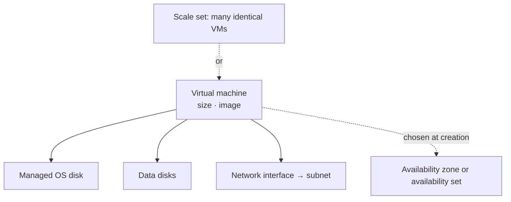
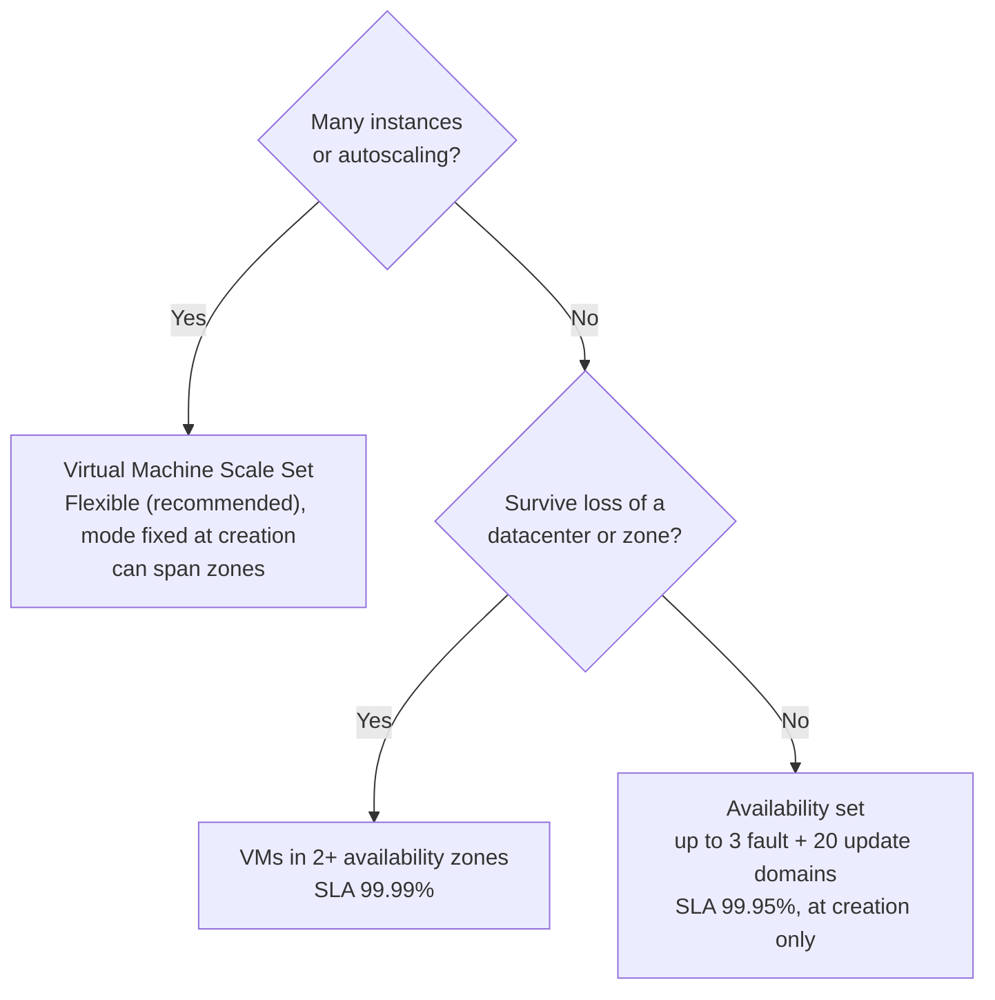

# Virtual Machines

> **Objective:** Create and configure virtual machines
> **Domain:** Deploy and manage Azure compute resources (20-25%)

## Sub-objectives covered

- Create a virtual machine
- Configure encryption at host for Azure virtual machines
- Move a virtual machine to another resource group, subscription, or region
- Manage virtual machine sizes
- Manage virtual machine disks
- Deploy virtual machines to availability zones and availability sets
- Deploy and configure an Azure Virtual Machine Scale Sets

## The administrative problem

An application needs a Windows or Linux server that you fully control. It must be the right size for its load,
keep its data safely, survive hardware failures, be moved when the organization reorganizes, and grow when demand
grows. Some of those choices are permanent the moment the server is created.

A virtual machine is the most flexible compute in Azure and the one administrators manage most
directly: you choose its size, its disks, where it runs, how it survives failures, and what it costs
while it runs.

Many VM decisions are **made at creation and can't simply be changed later**:

- whether it's in an availability set;
- which availability zone it's in;
- a scale set's orchestration mode;
- the virtual network it's attached to.

Other decisions can change, but only with a **restart or deallocation**: its size, its disk types,
encryption at host. Exam questions in this module turn on knowing which is which.

## In plain English

An Azure **virtual machine** is a server running on Microsoft's hosts. You choose:

- its **size**: how many virtual CPUs and how much memory;
- its **image**: which operating system;
- its **disks**: a managed **OS disk**, usually **data disks**, of a chosen type (Standard HDD, Standard SSD, Premium
  SSD and others);
- its **network**: a network interface in a subnet.

For availability, VMs can be spread across **availability zones** (separate datacenters in a region) or placed in an
**availability set** (separate racks and maintenance batches in one datacenter). A **Virtual Machine Scale Set**
manages many similar VMs together and can add or remove them automatically.

Some choices are fixed at creation, such as the zone or the availability set. Others, such as size or disk type, can
change but need a restart or a deallocation. **Encryption at host** encrypts data on the host, including temporary
disks and caches. And a VM can be **moved** to another resource group, subscription or region.

## Words you need to know

| Term | In plain English |
| --- | --- |
| **VM size** | The vCPU, memory and feature combination, such as a B-series or D-series size. |
| **Image** | The operating system template the VM is created from. |
| **OS disk / data disk** | Managed disks: the boot drive, and extra drives for applications and data. |
| **Temporary disk** | Fast host-local scratch storage that can lose its data. Not a managed disk. |
| **Deallocated** | Stopped from Azure so compute stops billing. Disks still bill. |
| **Availability zone** | A separate datacenter group in a region. A VM's zone is chosen at creation. |
| **Availability set** | Spreads VMs across fault domains (racks) and update domains (maintenance batches) in one datacenter. |
| **Virtual Machine Scale Set** | A group of VMs managed together, with optional autoscale. |
| **Encryption at host** | Encrypts VM data on the host, including temporary disks and disk caches. |
| **Resize** | Changing a VM's size. It needs a restart, and sometimes a deallocation. |

## Mental model



Before creating a VM, decide what can't change later: its zone or availability set, and its virtual network.
Everything else can be adjusted, at the cost of a restart. This is a conceptual teaching model, not a complete architecture.

**Azure translation**

| Everyday idea | Azure name |
| --- | --- |
| Renting a server instead of buying one | Virtual machine |
| Choosing the server model | VM size |
| A server's hard drives | Managed disks |
| Servers in different buildings | Availability zones |
| Servers on different racks in one building | Availability set |
| A fleet of identical servers that grows with demand | Virtual Machine Scale Set |

## Where it fits

The ten questions to ask about any resource ([0A-13](../0A-foundations/0A-13-how-resources-fit-together.md)), answered for the main resource in this lesson.

| Question | Virtual machine |
| --- | --- |
| What contains it? | A resource group. Its region, and its zone or availability set, are chosen at creation. |
| What does it depend on? | A network interface in a subnet, a managed OS disk, an image, and vCPU quota in the region. |
| What depends on it? | Load balancer backends, backup items, Site Recovery replicas, alert rules. |
| Who can manage it? | Virtual Machine Contributor or Contributor; signing in to the OS is a separate permission. |
| How is it networked? | Through its network interfaces; reach it with Bastion rather than an open RDP or SSH port. |
| How is it monitored? | Host metrics automatically; guest metrics and logs need the Azure Monitor Agent; VM insights. |
| How is it protected? | Encryption at host, NSGs, no public management ports, locks. |
| How is it recovered? | Azure Backup restores; Site Recovery fails over to another region. |
| What does it cost? | Compute while allocated (shut down inside the OS still bills); disks bill even when deallocated. |
| How is it removed safely? | Deleting the VM may leave its disks, NIC and public IP. Check for leftovers, or delete the resource group. |

See it with its neighbours on the [resource map](#/map/vm).

## How it works under the hood

### What a VM is made of

Creating a VM creates several resources, and they live separately:

| Resource | Notes |
| --- | --- |
| **Virtual machine** | Size (CPU and memory), image, admin credentials, availability options |
| **OS disk** | A managed disk; billed whether the VM runs or not |
| **Data disks** | Optional managed disks; also billed independently |
| **Temporary disk** | On the host, **not a managed disk**. Data can be lost on deallocation, redeploy or host maintenance. Never store anything you need there |
| **Network interface** | Attaches the VM to a subnet; the VM's virtual network can't be changed later |
| Public IP, network security group | Optional; the portal offers to create them |

**Billing follows the power state** ([00-01](../00-lab-safety/00-01-cost-guardrails-and-budgets.md)): a VM **stopped from inside the OS** still bills for
compute, and a **deallocated** VM doesn't. Disks bill in both states.

### Sizes

Sizes are grouped into families by purpose:

- **General purpose:** D-series, and **B-series**, which is burstable: it banks CPU credits while idle.
- **Compute optimized:** F-series.
- **Memory optimized:** E- and M-series.
- **Storage optimized:** L-series.
- **GPU:** N-series.
- **High-performance computing:** H-series.

The size also decides how many data disks you can attach, and whether the VM supports Premium storage.

**Resizing restarts the VM.** If the new size isn't available on the hardware cluster currently
hosting the VM, **deallocate it first** so Azure can place it anywhere. Deallocating releases dynamic IP
addresses; disks aren't affected. `Get-AzVMSize -ResourceGroupName <rg> -VMName <vm>` and
`az vm list-vm-resize-options` list the sizes available **without** deallocating.

For VMs in an **availability set**, a resize must fit the cluster hosting the set. If it doesn't, stop
**all** the VMs in the set, resize, and start them again.

### Disks

| Type | Use | OS disk? |
| --- | --- | --- |
| **Ultra Disk** | The most I/O-intensive workloads; performance adjustable without restart | **No** |
| **Premium SSD v2** | Low latency, high IOPS and throughput, independently tuned | **No** |
| **Premium SSD** | Production workloads | Yes; needs a size that supports Premium storage |
| **Standard SSD** | Web servers, light enterprise apps, dev and test | Yes |
| **Standard HDD** | Backup, non-critical, infrequent access | Yes, but **retiring as an OS disk on September 8, 2028** |

What questions turn on:

- Managed disks keep **three replicas**. LRS disks are durable within a zone; **ZRS** disks replicate
  across zones.
- **Expanding:**
  - A **data disk** can be expanded **without deallocating** the VM.
  - **Exception:** Standard HDD, Standard SSD and Premium SSD disks of **4 TiB or less** must be
    detached, with the VM deallocated, to grow **beyond** 4 TiB. Ultra and Premium SSD v2 are exempt.
  - After expanding, extend the partition inside the OS.
- **You can't shrink a managed disk.**
- **Changing a disk's type** (for example Standard SSD to Premium SSD) requires the VM to be **stopped**.
  The conversion itself is instant.
  - **Premium SSD v2 and Ultra Disk** have their own rules: you can't convert an OS disk to either, and
    some paths go through **snapshots**.
- Detaching a data disk doesn't delete it. It remains a separate, billed resource.

### Encryption at host

Every managed disk is already encrypted at rest with **server-side encryption (SSE)**, always on and
free. SSE **doesn't cover the temporary disk or the disk caches**. **Encryption at host** closes that
gap: the server hosting the VM encrypts the temp disk and caches, and data flows **encrypted** to
storage. It uses no VM CPU.

| | Server-side encryption | **Encryption at host** | Azure Disk Encryption |
| --- | --- | --- | --- |
| OS and data disks at rest | Yes | Yes | Yes |
| Temporary disk | No | **Yes** (platform-managed keys) | Yes |
| Caches | No | **Yes** | Yes |
| Uses the VM's CPU | No | **No** | Yes (BitLocker or DM-Crypt) |
| Status | Always on | **Recommended for new VMs** | **Retiring September 15, 2028** |

To use it:

1. **Register the feature** on the subscription once:
   `az feature register --namespace Microsoft.Compute --name EncryptionAtHost`. It takes a few minutes.
2. Enable it **at creation** (`--encryption-at-host true`), or on an existing VM **after deallocating**
   it: `Update-AzVM -EncryptionAtHost $true`.
3. Customer-managed keys come from a **disk encryption set** backed by Key Vault or Managed HSM.

Microsoft's direction is to move VMs **off** Azure Disk Encryption and onto encryption at host before
the 2028 retirement. VM sizes from version 5 onward (such as Dsv5) encrypt their temporary disks
automatically.

### Moving a VM

| Move to | How | Notes |
| --- | --- | --- |
| Another **resource group or subscription** | Standard resource move (01-03) | Move the VM **with its disks and NIC**; same tenant only; the resource ID changes |
| Another **region** | **Azure Resource Mover** | Moves the VM and its network and storage dependencies; can target a zone or availability set |
| Another **availability zone** in the same region | Azure Site Recovery or Microsoft's regional-to-zonal move | Not a resource move |
| Another **virtual network** | **Not possible directly** | Re-create the VM from a snapshot or copy of its OS disk |
| Another **tenant** | **Not possible with move** | Transfer the subscription, or copy disks and re-create |

The standard move API is limited to **800** resources per operation.

### Availability: sets, zones and scale sets



- **Fault domains** share power and a network switch. **Update domains** are rebooted together during
  planned maintenance, one at a time. An availability set has **up to 3 fault domains and 20 update
  domains**, fixed when you create it.
- **An existing VM can't be added to an availability set**, or moved between sets. Delete and re-create
  it, keeping its disks.
- **Availability sets don't use zones.** A zonal VM is pinned to the zone you choose at creation.
- **SLAs:** 99.95% across fault domains or an availability set; **99.99%** across availability zones.

### Virtual Machine Scale Sets

A scale set runs a group of VMs, distributes them across fault domains or zones, and can change their
number automatically.

| | **Flexible** (recommended) | **Uniform** |
| --- | --- | --- |
| Instances | Standard VMs; can mix sizes, and Spot with on-demand | Identical, from one model |
| Scale | Up to 1,000 | Larger, with placement groups |
| Zones and fault domains | Yes; can pin a VM to a zone or fault domain | Yes |
| Outbound internet | **No default outbound access**: configure it explicitly | Default outbound access |
| Attach an existing VM | Yes | No |

**The orchestration mode is fixed at creation.** Update domains don't exist in Flexible mode;
maintenance proceeds fault domain by fault domain.

**Scaling** can be manual (`az vmss scale --new-capacity`, `Update-AzVmss -SkuCapacity`), scheduled,
metric-based, or predictive. A metric-based **autoscale** setting holds profiles, and each profile
holds:

- **Instance limits:** **minimum**, **maximum** and **default**. Autoscale never goes below the minimum
  or above the maximum.
- **Rules:** a metric (such as Percentage CPU), an operator and threshold, a **duration** (how far back
  to look, such as 10 minutes), an action ("increase count by 1", "increase percent by 20", "decrease
  count to"), and a **cooldown** before the rule can act again.

How autoscale decides:

- It checks roughly every 30 to 60 seconds. It picks a **fixed-date** profile first, then a
  **recurring** one, then the **default**.
- If **any** scale-out rule triggers, it scales out, to the **largest** capacity any triggered rule
  asks for.
- It scales in **only if every scale-in rule triggers**.
- Every scale action is written to the **activity log**.

The portal always creates a scale set with an autoscaling profile, but it accepts an **initial
capacity of 0**: a scale set with no instances bills no VM compute.

## Configuration surface

```bash
# One-time: register encryption at host, then confirm "Registered"
az feature register --namespace Microsoft.Compute --name EncryptionAtHost
az feature show     --namespace Microsoft.Compute --name EncryptionAtHost --query properties.state

# A zonal VM with encryption at host, and a data disk
az vm create --resource-group "<rg>" --name "<vm>" --image Ubuntu2204 --size "<size>" \
  --zone 1 --encryption-at-host true --admin-username azureuser --generate-ssh-keys
az vm disk attach --resource-group "<rg>" --vm-name "<vm>" --name "<disk>" --new --size-gb 4 --sku StandardSSD_LRS

# Sizes available without deallocating, then resize (restarts the VM)
az vm list-vm-resize-options --resource-group "<rg>" --name "<vm>" -o table
az vm resize --resource-group "<rg>" --name "<vm>" --size "<new-size>"

# Autoscale for a scale set: limits, then rules
az monitor autoscale create --resource-group "<rg>" --resource "<vmss>" \
  --resource-type Microsoft.Compute/virtualMachineScaleSets --name autoscale --min-count 0 --max-count 2 --count 0
az monitor autoscale rule create --resource-group "<rg>" --autoscale-name autoscale \
  --condition "Percentage CPU > 70 avg 10m" --scale out 1
```

```powershell
# Enable encryption at host on an existing VM: deallocate first
Stop-AzVM -ResourceGroupName '<rg>' -Name '<vm>' -Force
Update-AzVM -VM (Get-AzVM -ResourceGroupName '<rg>' -Name '<vm>') -ResourceGroupName '<rg>' -EncryptionAtHost $true
```

| Setting | Documented default | Where | Exam angle |
| --- | --- | --- | --- |
| Availability set | — | Create only | Existing VMs can't join |
| Availability zone | — | Create only | 99.99% across zones |
| Scale set orchestration | **Flexible** recommended | Create only | Can't change later |
| Encryption at host | Off; feature must be registered | Create, or after deallocating | Covers temp disk and caches |
| Data disk expansion | — | Disk > Size + performance | Online for data disks; never shrink |
| Disk type change | — | Disk > Size + performance | VM must be stopped |
| Autoscale limits | Min, max, default | Scale set > Scaling | Scale in only when all scale-in rules agree |

## Worked example

**Requirement.** Two web VMs must keep serving if one datacenter in the region fails. The region supports
availability zones.

1. **Decide.** Surviving a datacenter means **availability zones**, not an availability set (which protects within one
   datacenter).
2. **Configure.** Create the VMs in **zone 1** and **zone 2** at creation time. An existing VM can't simply be moved
   into a zone by changing a setting.
3. **Observe.** Each VM reports its zone; zone-aware dependencies such as a Standard load balancer and public IP fit
   the design.
4. **Validate.** Check each VM's zone, size and disks, as below.

## Validate the result

```powershell
az vm show -g <rg> -n <vm> --query "{zone:zones[0], size:hardwareProfile.vmSize, eah:securityProfile.encryptionAtHost}" -o table
az vm show -d -g <rg> -n <vm> --query powerState -o tsv                 # VM running, or VM deallocated
az disk list -g <rg> --query "[].{name:name, sku:sku.name, size:diskSizeGB, state:diskState}" -o table
```

- A VM you stopped to save money shows **VM deallocated**, not just **VM stopped**.
- After a resize or disk change, confirm the new value *and* that the VM started again.
- After deleting a VM, list disks with `diskState` **Unattached**: those are still billing.

## Common failure modes

1. **"The size we want isn't in the list."** It isn't available on the current hardware cluster.
   Deallocate the VM to see every size in the region.
2. **"We resized and the public IP changed."** Deallocating released a dynamic IP. Use a static public IP
   if it must stay the same.
3. **"Data on D: (or /mnt) disappeared."** That's the temporary disk. It isn't persistent.
4. **"We need to add VM3 to the existing availability set."** Not possible. Re-create it in the set.
5. **"Make the disk smaller to save cost."** Disks can't shrink. Create a smaller disk and copy the data.
6. **"Changing the disk to Premium SSD is greyed out."** Stop the VM. The size must also support Premium
   storage.
7. **"Encryption at host can't be enabled."** The feature isn't registered on the subscription, or the VM
   is running. Register it, then deallocate.
8. **"The scale set doesn't scale in at night."** One of several scale-in rules isn't met. All of them must
   trigger.
9. **"New scale set instances can't reach the internet."** Flexible scale sets have no default outbound
   access. Add a NAT gateway, load balancer outbound rules or public IPs.
10. **"Move the VM to the other VNet."** Not supported. Re-create it from its disk in the target network.

## How this is tested

| Phrase in the question | What it steers you to |
| --- | --- |
| "survive a datacenter failure, 99.99%" | Availability zones |
| "protect against hardware failure and planned maintenance within a datacenter" | Availability set (fault and update domains) |
| "add an existing VM to an availability set" | Re-create it; it can't be added |
| "encrypt the temporary disk and caches, no VM CPU overhead" | Encryption at host |
| "replace Azure Disk Encryption for new VMs" | Encryption at host |
| "resize to a size not listed" | Deallocate, then resize |
| "increase a data disk without downtime" | Expand the data disk online |
| "change Standard SSD to Premium SSD" | Stop the VM, change the disk type |
| "move a VM to another region" | Azure Resource Mover |
| "move a VM to another VNet" | Re-create it |
| "scale automatically on CPU, never fewer than 2" | Scale set autoscale: minimum 2, CPU rules |
| "mix VM sizes and Spot in one group, recommended mode" | Flexible orchestration |

## Hands-on

See [03-02 lab](../../labs/03-compute/03-02-lab.md). It runs one small VM for about an hour, deallocating
it between parts, and creates a scale set with zero instances. Every resource carries the `az104-module`
tag, so its cost shows in your Module 0B cost view. Region moves are a walkthrough.

## Check yourself

1. A VM must change from D2s_v5 to a size that `az vm list-vm-resize-options` doesn't list. What do you
   do, what happens to its dynamic public IP, and what happens to its temporary disk?
2. Why does encryption at host require the VM to be deallocated, and what does it protect that SSE
   doesn't?
3. A 2 TiB Premium SSD data disk must grow to 6 TiB. Can you do it online? What about a 6 TiB disk growing
   to 8 TiB?
4. A scale set has two scale-in rules: CPU below 30%, and network-in below 10 MB. CPU is at 20% and
   network-in at 50 MB. Does it scale in? And if a scale-out rule asks for +2 while another asks for +20%
   of 20 instances?
5. You need three web VMs that survive a zone outage, with autoscale. Name the resource, the orchestration
   mode, and one thing you must configure that a Uniform scale set wouldn't need.

## Teach it back

Answer out loud or in writing, without notes, as if to someone who has never used Azure. Where you hesitate is what to re-read.

- Explain the difference between an availability set and availability zones using racks and buildings.
- Explain why a stopped VM can still bill, and what deallocation changes.
- Explain which VM decisions you can't change after creation.

## Key takeaways

- **Decided at creation:** availability set, zone, scale set orchestration mode, virtual network.
  **Change with a restart or deallocation:** size, disk type, encryption at host.
- **Deallocated** stops compute billing. The **temporary disk** isn't persistent.
- **Disks:** five types; Ultra and Premium SSD v2 can't be OS disks. Data disks **grow online**, but
  **never shrink**.
- **Encryption at host** adds temp-disk and cache encryption to SSE. It replaces **Azure Disk
  Encryption**, which retires in 2028.
- **Moves:** resource groups and subscriptions use the normal move; regions use **Resource Mover**; a
  different VNet means re-creating.
- **Availability sets** give 99.95% (3 FD, 20 UD); **zones** give 99.99%. **Flexible** scale sets are
  recommended, and autoscale **scales in only when every scale-in rule agrees**.

## Sources

- Microsoft Learn: [Study guide for Exam AZ-104](https://learn.microsoft.com/en-us/credentials/certifications/resources/study-guides/az-104)
- Microsoft Learn: [Sizes for virtual machines in Azure](https://learn.microsoft.com/en-us/azure/virtual-machines/sizes/overview)
- Microsoft Learn: [Resize a virtual machine](https://learn.microsoft.com/en-us/azure/virtual-machines/sizes/resize-vm)
- Microsoft Learn: [Troubleshoot allocation failures when you create or resize VMs](https://learn.microsoft.com/en-us/troubleshoot/azure/virtual-machines/windows/allocation-failure)
- Microsoft Learn: [States and billing status of Azure Virtual Machines](https://learn.microsoft.com/en-us/azure/virtual-machines/states-billing)
- Microsoft Learn: [Azure managed disks overview](https://learn.microsoft.com/en-us/azure/virtual-machines/managed-disks-overview)
- Microsoft Learn: [Azure managed disk types](https://learn.microsoft.com/en-us/azure/virtual-machines/disks-types)
- Microsoft Learn: [Expand virtual hard disks on a Linux VM](https://learn.microsoft.com/en-us/azure/virtual-machines/linux/expand-disks)
- Microsoft Learn: [Convert the disk type of an Azure managed disk](https://learn.microsoft.com/en-us/azure/virtual-machines/disks-convert-types)
- Microsoft Learn: [Overview of managed disk encryption options](https://learn.microsoft.com/en-us/azure/virtual-machines/disk-encryption-overview)
- Microsoft Learn: [Server-side encryption of Azure Disk Storage](https://learn.microsoft.com/en-us/azure/virtual-machines/disk-encryption)
- Microsoft Learn: [Enable encryption at host with the Azure CLI](https://learn.microsoft.com/en-us/azure/virtual-machines/linux/disks-enable-host-based-encryption-cli)
- Microsoft Learn: [Enable encryption at host with Azure PowerShell](https://learn.microsoft.com/en-us/azure/virtual-machines/windows/disks-enable-host-based-encryption-powershell)
- Microsoft Learn: [Options to move Azure resources](https://learn.microsoft.com/en-us/azure/resource-mover/select-options-to-move-resources)
- Microsoft Learn: [Move Azure VMs across regions with Resource Mover](https://learn.microsoft.com/en-us/azure/resource-mover/tutorial-move-region-virtual-machines)
- Microsoft Learn: [Azure virtual machine move and migration FAQ](https://learn.microsoft.com/en-us/troubleshoot/azure/virtual-machines/windows/move-vm-resources-faq)
- Microsoft Learn: [Availability sets overview](https://learn.microsoft.com/en-us/azure/virtual-machines/availability-set-overview)
- Microsoft Learn: [Orchestration modes for Virtual Machine Scale Sets](https://learn.microsoft.com/en-us/azure/virtual-machine-scale-sets/virtual-machine-scale-sets-orchestration-modes)
- Microsoft Learn: [Overview of autoscale with Virtual Machine Scale Sets](https://learn.microsoft.com/en-us/azure/virtual-machine-scale-sets/virtual-machine-scale-sets-autoscale-overview)
- Microsoft Learn: [Understand autoscale settings](https://learn.microsoft.com/en-us/azure/azure-monitor/autoscale/autoscale-understanding-settings)
- Microsoft Learn: [Tutorial: Automatically scale a scale set with the Azure CLI](https://learn.microsoft.com/en-us/azure/virtual-machine-scale-sets/tutorial-autoscale-cli)
