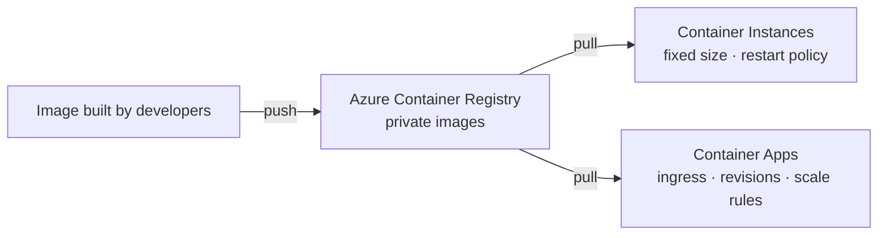
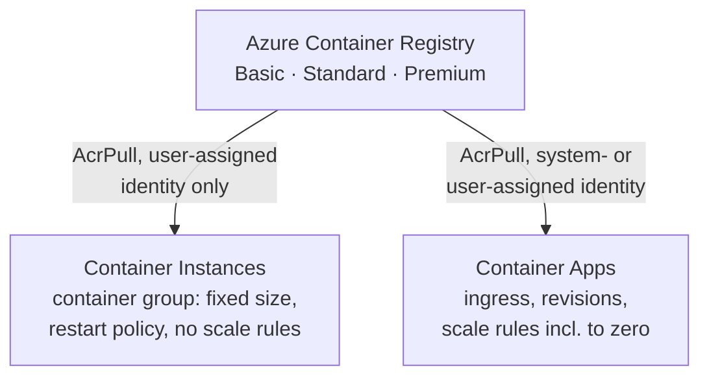

# Containers: Registry, Container Instances and Container Apps

> **Objective:** Provision and manage containers in the Azure portal
> **Domain:** Deploy and manage Azure compute resources (20-25%)

## Sub-objectives covered

- Create and manage an Azure Container Registry
- Provision a container by using Azure Container Instances
- Provision a container by using Azure Container Apps
- Manage sizing and scaling for containers, including Azure Container Instances and Azure Container Apps

## The administrative problem

A development team hands you an application packaged as a container image. You need a private place to keep their
images, a simple way to run a container for a nightly job, and a platform for a web API that should scale with traffic
and cost nothing when idle. You don't want to run servers or a Kubernetes cluster to do any of it.

A container packages an application with everything it needs to run. Azure gives an administrator
three pieces to manage, and AZ-104 asks about each:

- **Azure Container Registry (ACR)** stores the images: private, in your subscription, with Microsoft
  Entra access control.
- **Azure Container Instances (ACI)** runs a container, or a small group of them, with no servers or
  orchestrator to manage. You size it and it runs. It doesn't scale by rules.
- **Azure Container Apps (ACA)** runs containerized apps on a managed platform with **ingress**,
  **revisions** and **rule-based scaling, including to zero**.

AKS (Kubernetes) isn't in the current AZ-104 outline. The exam's container questions are about choosing
between ACI and Container Apps, sizing and scaling them, and letting them pull from a private registry.

## In plain English

A **container** packages an application with everything it needs to run, so it runs the same anywhere. The package
is an **image**; a running copy is a **container**.

Azure gives an administrator three pieces for AZ-104:

- **Azure Container Registry (ACR)** stores your images privately, in your subscription.
- **Azure Container Instances (ACI)** runs a container, or a small **container group**, on demand. You set the CPU and
  memory, and it runs. It doesn't scale by rules.
- **Azure Container Apps** runs containerized apps on a managed platform with **ingress** (a web endpoint),
  **revisions** (versions you can split traffic between) and **scale rules**, including scaling to zero.

Whatever runs the image must be allowed to **pull** it from the registry, usually through a managed identity with a
pull role, rather than the registry's shared admin account.

## Words you need to know

| Term | In plain English |
| --- | --- |
| **Container image** | A packaged application and its dependencies, stored in a registry. |
| **Container registry** | A private store for images. Azure Container Registry is Azure's. |
| **Login server** | The registry's address, <name>.azurecr.io. |
| **Container group** | One or more containers in ACI that share a host, network and lifecycle. |
| **Restart policy** | What ACI does when a container exits: Always, OnFailure or Never. |
| **Container app** | An app in Azure Container Apps, with ingress, revisions and scale rules. |
| **Revision** | An immutable version of a container app; traffic can be split between revisions. |
| **Scale rule** | A rule that adds or removes replicas, for example by HTTP traffic. Can scale to zero. |
| **Managed identity** | An identity Azure manages for a resource, used here to pull images without a password. |

## Mental model



The registry stores; the other two run. Choose between them by asking whether the workload needs to scale by
rules, receive web traffic through ingress, or roll out revisions. If not, Container Instances is the simpler fit. This is a conceptual teaching model, not a complete architecture.

**Azure translation**

| Everyday idea | Azure name |
| --- | --- |
| A sealed lunchbox with everything for the meal | Container image |
| A private pantry for the lunchboxes | Azure Container Registry |
| Heating one lunchbox on demand | Azure Container Instances |
| A canteen that opens more counters when the queue grows | Azure Container Apps |

## Where it fits

The ten questions to ask about any resource ([0A-13](../0A-foundations/0A-13-how-resources-fit-together.md)), answered for the main resource in this lesson.

| Question | Container registry |
| --- | --- |
| What contains it? | A resource group. The registry name is globally unique. |
| What does it depend on? | A tier: Basic, Standard or Premium. |
| What depends on it? | Container groups and container apps that pull its images. |
| Who can manage it? | Contributor for the registry; pull and push roles for images. |
| How is it networked? | A public login server, <name>.azurecr.io; private endpoints with Premium. |
| How is it monitored? | Registry metrics and resource logs. |
| How is it protected? | Admin user disabled; Microsoft Entra identities with pull roles. |
| How is it recovered? | Re-push or import images; geo-replication with Premium. |
| What does it cost? | A daily rate by tier, plus storage. |
| How is it removed safely? | Deleting the registry deletes every image in it: check what still pulls from it. |

See it with its neighbours on the [resource map](#/map/acr).

## How it works under the hood

### Registry, and the two ways to run what's in it



### Azure Container Registry

| Tier | Includes | Choose when |
| --- | --- | --- |
| **Basic** | Microsoft Entra authentication, webhooks, image delete; the least included storage and throughput | Learning, low volume |
| **Standard** | Same features as Basic, with more storage and throughput | Most production |
| **Premium** | The most storage and throughput, plus **geo-replication** and **private endpoints** | Multi-region, or private network access |

- The **login server** is `<name>.azurecr.io`. Registry names are globally unique, 5–50 alphanumeric
  characters.
- All tiers share the same APIs and have **zone redundancy** enabled by default in regions that support it.
- **Geo-replication** (Premium) keeps one registry, one name and one set of permissions, replicated to
  the regions you pick.
- **Importing** copies an image from another registry, such as Microsoft Container Registry or another
  ACR, without Docker: `az acr import`.
- **Builds** can run in Azure with **ACR Tasks** (`az acr build`), so you don't need Docker locally either.

**Access.** Prefer Microsoft Entra identities with **data-plane roles**:

| Role | Allows |
| --- | --- |
| **AcrPull** | Pull images. Give it to whatever runs the containers |
| **AcrPush** | Push and pull. Give it to build pipelines |
| **AcrDelete** | Delete images and tags |

These are data-plane roles: they don't manage the registry itself. On registries switched to **ABAC
repository permissions**, the legacy AcrPull, AcrPush and AcrDelete roles **aren't honoured**; use the
**Container Registry Repository** roles instead. The registry's **admin user** is a single shared
username and password, disabled by default. Avoid it outside quick tests.

### Azure Container Instances

The unit of deployment is the **container group**: containers scheduled together on one host, sharing a
**lifecycle**, **local network**, **IP address and DNS label**, and **volumes**. It's similar to a
Kubernetes pod.

- **Multi-container groups are Linux only.** Windows supports a single container per group.
- **Sizing:**
  - Each container sets a CPU and memory **request**, and optionally a higher **limit**.
  - The group is allocated the **sum of the requests**, and a group needs at least **1 CPU and 1 GB**.
  - Maximums depend on the region.
- **Restart policy**, for the whole group:
  - **Always** (default) suits services.
  - **OnFailure** or **Never** suit tasks that should run to completion. `Never` only prevents a restart
    after a successful exit.
  - A task's group ends in **Succeeded** or **Failed**.
- **Networking:** a public IP with an optional **DNS name label** (unique within the region), or deployment
  into a **virtual network** subnet.
- **Storage:** containers are **stateless**. To keep data, mount an **Azure Files** share (Linux
  containers, running as root, using the storage key). More than one volume needs a YAML file or a
  template.
- **Billing** is per second while the group runs.

**Scaling ACI means sizing or multiplying.** There are no autoscale rules. You set CPU and memory on the
group, and for more capacity you run more groups behind a load-balancing front end.

**Updating a container group:**

- Redeploy it with the same name. **All its containers restart**, and the IP can change, so use a DNS
  name label.
- **These properties can't be updated; delete and re-create the group:** OS type, **CPU, memory or GPU**,
  **restart policy**, network profile, availability zone.
- `az container export` writes the group's configuration to YAML as a starting point.

**Pulling from ACR** needs credentials or an identity. With a managed identity, ACI supports **only a
user-assigned identity** for the image pull. Assign it to the group (`--assign-identity`), name it as
the pull identity (`--acr-identity`), and give it **AcrPull** on the registry. Using the group's
system-assigned identity for the pull fails.

### Azure Container Apps

Container apps run inside a **Container Apps environment**: the shared boundary for networking and
logging. Each app has:

- **Ingress:**
  - **External** (from the internet) or **internal** (from inside the environment), on a **target port**.
  - HTTP is the default transport. **External TCP ingress requires a custom virtual network.**
- **Revisions:** immutable snapshots, created when you change the container or its scale settings.
  - **Single** revision mode (default): a new revision takes over once it's ready, with no downtime, and
    the old one is deprovisioned.
  - **Multiple** revision mode: several revisions stay active and you **split traffic** by percentage,
    which must total 100%. **Labels** give a revision its own stable URL.
  - Inactive revisions aren't billed, and the oldest are purged beyond 100.
- **Scaling**, per revision:

| Setting | Default | Range |
| --- | --- | --- |
| Minimum replicas | **0** (scale to zero) | 0 – 1,000 |
| Maximum replicas | **10** | 1 – 1,000 |

- **Scale rules:**
  - **HTTP** concurrent requests (default 10 per replica) and **TCP** concurrent connections.
  - **Custom** rules: CPU, memory, and event sources such as Service Bus, Event Hubs and Kafka.
  - **Any** rule that's met triggers scaling out.
- **Scale to zero:**
  - No usage charges while an app is at zero replicas.
  - Idle replicas can bill at a lower idle rate.
  - **CPU and memory rules can't scale to zero.** Set minimum replicas to 1 or more if the app must always
    answer instantly.
- With the CLI, adding a rule to an app that already has one **replaces** it.
- **Pulling from ACR:** a container app can use its **system-assigned** (or a user-assigned) managed
  identity with **AcrPull**. The portal adds the role for you.

### ACI or Container Apps?

| Need | Container Instances | Container Apps |
| --- | --- | --- |
| Run a task once, then stop | **Yes**: restart policy Never or OnFailure | Possible as a job; ACI is simpler |
| HTTP app with a public URL | Yes, a public IP and DNS label | **Yes**, managed ingress and HTTPS |
| Scale on traffic or events | **No** rule-based scaling | **Yes**, including **to zero** |
| Blue-green or A/B release | No | **Yes**: revisions and traffic splitting |
| Change CPU or memory | Delete and re-create the group | Edit and deploy a new revision |

## Configuration surface

```bash
# Registry: create, check the admin user, import an image without Docker
az acr create --resource-group "<rg>" --name "<registry>" --sku Basic
az acr show   --name "<registry>" --query adminUserEnabled
az acr import --name "<registry>" --source mcr.microsoft.com/azuredocs/aci-helloworld:latest --image hello:v1

# Container Instances: pull from ACR with a USER-ASSIGNED identity that has AcrPull
az container create --resource-group "<rg>" --name "<group>" --image "<registry>.azurecr.io/hello:v1" \
  --os-type Linux --cpu 1 --memory 1.5 --ports 80 --dns-name-label "<unique-label>" \
  --assign-identity "<uami-resource-id>" --acr-identity "<uami-resource-id>" --restart-policy Always

# Container Apps: scale to zero, HTTP rule, then pull from ACR with the system-assigned identity
az containerapp create --name "<app>" --resource-group "<rg>" --environment "<env>" \
  --image mcr.microsoft.com/k8se/quickstart:latest --ingress external --target-port 80 \
  --min-replicas 0 --max-replicas 3 --scale-rule-name http --scale-rule-type http --scale-rule-http-concurrency 10
az containerapp registry set --name "<app>" --resource-group "<rg>" --identity system --server "<registry>.azurecr.io"

# Revisions: switch to multiple mode and split traffic
az containerapp revision set-mode --name "<app>" --resource-group "<rg>" --mode multiple
az containerapp ingress traffic set --name "<app>" --resource-group "<rg>" --revision-weight "<rev1>=80" "<rev2>=20"
```

| Setting | Documented default | Where | Exam angle |
| --- | --- | --- | --- |
| ACR admin user | Disabled | Registry > Access keys | Prefer Entra identities with AcrPull |
| ACR geo-replication, private endpoints | Premium only | Registry > Replications, Networking | Tier decides the feature |
| ACI restart policy | **Always** | Create only | Never or OnFailure for tasks; change means re-create |
| ACI CPU and memory | — | Create only | Change means re-create |
| ACI image-pull identity | — | `--acr-identity` | User-assigned only |
| ACA minimum and maximum replicas | **0** and **10** | Scale | Up to 1,000 |
| ACA HTTP concurrency | **10** | Scale rule | Any rule triggers scale-out |
| ACA revision mode | **Single** | Revision management | Multiple for traffic splitting |

## Worked example

**Requirement.** A web API must scale with HTTP traffic and cost nothing overnight when nobody uses it. A separate
nightly job runs one container for ten minutes. Both use images from your private registry, without passwords.

1. **Decide.** Web traffic, scaling and scale to zero: **Container Apps**. A short job with a fixed size and no scaling:
   **Container Instances** with restart policy **Never** or **OnFailure**.
2. **Configure.** Give each one an identity with a pull role on the registry. For ACI, that must be a **user-assigned**
   managed identity; Container Apps can use either type.
3. **Observe.** The container app scales to zero replicas when idle; the container group runs and stops.
4. **Validate.** Check the registry's admin user, the container app's scale settings and the job's state, as below.

## Validate the result

```powershell
az acr show --name <registry> --query adminUserEnabled                         # false
az containerapp show --name <app> --resource-group <rg> `
  --query "{mode:properties.configuration.activeRevisionsMode, min:properties.template.scale.minReplicas, max:properties.template.scale.maxReplicas}" -o table
az container show --name <group> --resource-group <rg> --query "{state:instanceView.state, restart:restartPolicy}" -o table
```

- A minimum of **0** replicas is what lets the app scale to zero.
- A container group that pulled its image without registry credentials in its definition proves the identity works.
- Send requests to the app's URL and watch the replica count rise in its metrics.

## Common failure modes

1. **"The container group can't pull from ACR with its managed identity."** It's using the system-assigned
   identity. ACI image pulls need a **user-assigned** identity with AcrPull, passed with `--acr-identity`.
2. **"We changed the restart policy (or the CPU) and the update failed."** Those properties need the group
   deleted and re-created.
3. **"The task container keeps restarting."** The restart policy is Always, the default. Use OnFailure or
   Never for run-to-completion tasks.
4. **"The data written by the container is gone."** ACI is stateless. Mount an Azure Files volume.
5. **"The container group's IP changed after an update."** Not guaranteed to persist; use a DNS name label.
6. **"The Container App takes a few seconds to answer the first request."** It scaled to zero. Set minimum
   replicas to 1 if that start-up delay matters.
7. **"The app never scales to zero."** Its rule is CPU- or memory-based, or minimum replicas is above 0.
8. **"We added a second scale rule from the CLI and the first one disappeared."** The CLI replaces the rule
   set; define multiple rules together.
9. **"Traffic splitting isn't available."** The app is in single revision mode. Switch to multiple.
10. **"Geo-replication is greyed out."** It needs the Premium tier.

## How this is tested

| Phrase in the question | What it steers you to |
| --- | --- |
| "replicate the registry to several regions" or "private endpoint for the registry" | ACR **Premium** |
| "copy an image from Microsoft Container Registry without Docker" | `az acr import` |
| "least privilege for the app that pulls images" | **AcrPull** |
| "run a batch container that stops when done" | ACI, restart policy **Never** or **OnFailure** |
| "two containers sharing localhost and a volume" | One ACI **container group** (Linux) |
| "persist data from a container instance" | Mount **Azure Files** |
| "increase the CPU of a container group" | Delete and re-create it |
| "ACI pulls from ACR with managed identity" | **User-assigned** identity, AcrPull, `--acr-identity` |
| "scale on HTTP traffic and to zero when idle" | **Container Apps**, minimum replicas 0, HTTP rule |
| "send 20% of traffic to the new version" | Container Apps, **multiple** revision mode, traffic split |
| "app must never cold-start" | Container Apps minimum replicas ≥ 1 |

## Hands-on

See [03-03 lab](../../labs/03-compute/03-03-lab.md). It uses a Basic registry, two container groups that run
for minutes, and a container app that scales to zero, all deleted the same day.

## Check yourself

1. A container group must pull a private image from ACR with a managed identity, and the deployment fails
   with `InvalidImageRegistryIdentity`. Name two likely causes.
2. A nightly data job runs as a container group and must stop once it finishes, even on success. Which
   restart policy, and what state does the group end in?
3. You need to give a container group more memory. What happens to its IP address, and how do you keep a
   stable name for clients?
4. A container app has minimum replicas 0, maximum 5 and an HTTP rule of 10 concurrent requests. Describe
   what happens overnight, and at 9 a.m. when 45 concurrent requests arrive.
5. When would you pick Container Instances over Container Apps, even for an HTTP app?

## Teach it back

Answer out loud or in writing, without notes, as if to someone who has never used Azure. Where you hesitate is what to re-read.

- Explain the difference between an image, a registry and a running container.
- Explain when you'd pick Container Instances over Container Apps, and the reverse.
- Explain why the registry's admin user should stay disabled.

## Key takeaways

- **ACR:** Basic, Standard, Premium (geo-replication and private endpoints are Premium). Use Entra
  identities with **AcrPull** and **AcrPush**; leave the admin user off.
- **ACI:** a **container group** has a fixed size and a **restart policy**. Changing CPU, memory or the
  restart policy means **re-create**. There's no rule-based scaling. Pull from ACR with a **user-assigned**
  identity.
- **Container Apps:** **revisions** (single or multiple, with traffic splitting), **ingress**, and **scale
  rules** with minimum 0 and maximum 10 by default, scaling **to zero** on HTTP or event rules.
- Choose **ACI** for simple, fixed-size or run-once containers, and **Container Apps** for apps that need
  scaling and releases.

## Sources

- Microsoft Learn: [Study guide for Exam AZ-104](https://learn.microsoft.com/en-us/credentials/certifications/resources/study-guides/az-104)
- Microsoft Learn: [Introduction to Azure Container Registry](https://learn.microsoft.com/en-us/azure/container-registry/container-registry-intro)
- Microsoft Learn: [Azure Container Registry SKU features and limits](https://learn.microsoft.com/en-us/azure/container-registry/container-registry-skus)
- Microsoft Learn: [Azure Container Registry roles and permissions overview](https://learn.microsoft.com/en-us/azure/container-registry/container-registry-rbac-built-in-roles-overview)
- Microsoft Learn: [Authenticate with an Azure container registry](https://learn.microsoft.com/en-us/azure/container-registry/container-registry-authentication)
- Microsoft Learn: [Import container images to a container registry](https://learn.microsoft.com/en-us/azure/container-registry/container-registry-import-images)
- Microsoft Learn: [Geo-replication in Azure Container Registry](https://learn.microsoft.com/en-us/azure/container-registry/container-registry-geo-replication)
- Microsoft Learn: [Container groups in Azure Container Instances](https://learn.microsoft.com/en-us/azure/container-instances/container-instances-container-groups)
- Microsoft Learn: [Azure Container Instances states](https://learn.microsoft.com/en-us/azure/container-instances/container-state)
- Microsoft Learn: [Update containers in Azure Container Instances](https://learn.microsoft.com/en-us/azure/container-instances/container-instances-update)
- Microsoft Learn: [Mount an Azure file share in Azure Container Instances](https://learn.microsoft.com/en-us/azure/container-instances/container-instances-volume-azure-files)
- Microsoft Learn: [Container group fails to pull images from ACR by using managed identity](https://learn.microsoft.com/en-us/troubleshoot/azure/azure-container-instances/management/acr-image-pull-failures-managed-identity)
- Microsoft Learn: [Set scaling rules in Azure Container Apps](https://learn.microsoft.com/en-us/azure/container-apps/scale-app)
- Microsoft Learn: [Update and deploy changes in Azure Container Apps (revisions)](https://learn.microsoft.com/en-us/azure/container-apps/revisions)
- Microsoft Learn: [Traffic splitting in Azure Container Apps](https://learn.microsoft.com/en-us/azure/container-apps/traffic-splitting)
- Microsoft Learn: [Azure Container Apps image pull with managed identity](https://learn.microsoft.com/en-us/azure/container-apps/managed-identity-image-pull)
