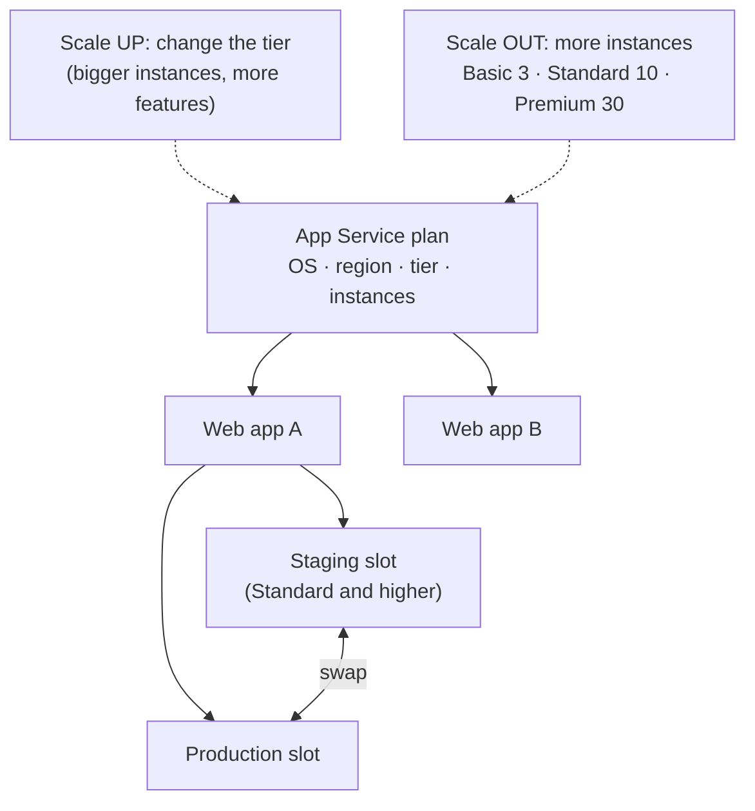

# Azure App Service

> **Objective:** Create and configure Azure App Service
> **Domain:** Deploy and manage Azure compute resources (20-25%)

## Sub-objectives covered

- Provision an App Service plan
- Configure scaling for an App Service plan
- Create an App Service
- Configure certificates and Transport Layer Security (TLS) for an App Service
- Map an existing custom DNS name to an App Service
- Configure backup for an App Service
- Configure networking settings for an App Service
- Configure deployment slots for an App Service

## Why this exists

App Service runs web apps and APIs without you managing servers. An administrator still decides a
lot:

- the **plan** the apps run on, and so what they cost and which features they get;
- how the plan **scales**;
- how users reach the app (**custom domain**, **TLS**, **access restrictions**);
- how the app reaches private resources (**VNet integration**);
- how it's **backed up**;
- how releases happen without downtime (**deployment slots**).

The single most useful thing to know for this module is that **features are unlocked by the plan's
tier**. Most "can we do X?" questions are really "is the plan's tier high enough?"

## How it works under the hood

### Plans, apps and slots



An **App Service plan** is a set of compute resources: an **operating system** (Windows or Linux), a
**region**, a **pricing tier**, and a number of **instances**. **Every app in the plan runs on all of
its instances and shares them.** To isolate an app's compute, move it to its own plan.

| Tier | Compute | Notable features | Max instances |
| --- | --- | --- | --- |
| **Free (F1), Shared (D1)** | Shared with other customers, CPU quotas | No TLS bindings; no SLA | — |
| **Basic** | Dedicated VMs | Custom domains with **SNI** TLS; **backups**; **VNet integration**; manual scale out | **3** |
| **Standard** | Dedicated | Everything in Basic, plus **autoscale**, **deployment slots** (5) and **IP-based** TLS | **10** |
| **Premium v2, v3, v4** | Dedicated, faster hardware | Everything in Standard, more slots, **automatic scaling** | **30** |
| **Isolated v2** | App Service Environment, in your virtual network | Network isolation | **100** |

How plans are billed:

- **Dedicated tiers are billed per instance**, whether or not the apps are busy.
- **Free** costs nothing. **Shared** bills each app for its CPU quota.
- Features themselves are free: custom domains, TLS, slots, backups.
- The exceptions are **IP-based TLS** connections, which bill hourly (SNI is free), and buying an App
  Service domain or certificate.
- Microsoft recommends **Standard or higher** for production. Before leaving the Free tier, a
  subscription with a spending limit must have the limit removed.

### Creating an app

An app is created **in a plan**. It takes the plan's OS and region, so an app and its plan share a
region. You choose:

- a **runtime stack** (such as .NET, Node.js, Python or Java), or a **container image**;
- a globally unique name, which becomes `https://<name>.azurewebsites.net`.

**Moving an app to another plan** is possible when both plans are in the same resource group, region
and operating system.

### Scaling the plan

**Scale up** means changing the **tier**, for bigger instances or extra features. **Scale out** means
changing the **instance count**. Both apply to **every app in the plan**, take seconds, and need no
code changes.

| Method | Tier | How |
| --- | --- | --- |
| **Manual scale out** | Basic and higher | Set the instance count |
| **Autoscale** (rule-based) | **Standard and higher** | Azure Monitor autoscale on the plan: minimum, maximum and default instances; rules on metrics such as CPU percentage; schedules. The same engine as scale sets (03-02) |
| **Automatic scaling** | **Premium v2, v3, v4** | No rules: App Service scales on HTTP load, with a **maximum burst** of up to 30 instances, and per-app minimum and maximum |

You can't scale down to a tier that lacks a feature in use. For example, an app with more than five
slots can't go to Standard.

### Custom domains

To map a domain you own, create **two DNS records** at your DNS provider, then add the domain in
**Custom domains**:

| Domain | Mapping record | Verification record |
| --- | --- | --- |
| Root (`contoso.com`) | **A** record `@` → the app's IP address | **TXT** `asuid` → the domain verification ID |
| Subdomain (`www.contoso.com`) | **CNAME** `www` → `<app>.azurewebsites.net` (or an A record) | **TXT** `asuid.www` → the verification ID |
| Wildcard (`*.contoso.com`) | **CNAME** `*` → `<app>.azurewebsites.net` | **TXT** `asuid` → the verification ID |

- The **`asuid` TXT record** proves you own the domain. Microsoft strongly recommends it to prevent
  **subdomain takeover**.
- Microsoft prefers a **CNAME** for subdomains: an app's IP can change if it's re-created or moved to
  another region or tier.
- Never create a CNAME **and** an A record for the same name.
- A domain works over HTTP as soon as it's mapped. HTTPS needs a certificate binding.

### Certificates and TLS

To serve HTTPS on a custom domain, bind a certificate to it. TLS bindings need **Basic or higher**; Free
and Shared can't have them.

| Source | Cost | Notes |
| --- | --- | --- |
| **App Service managed certificate** | **Free** | Issued and **renewed automatically**. **No wildcards**, **not exportable**, not in App Service Environments; an apex domain needs an A record |
| **App Service certificate** | Paid, yearly | Stored in **Key Vault**; supports **wildcards**; exportable |
| **Import from Key Vault** | Your certificate | PKCS#12 certificate kept in your key vault |
| **Upload a PFX** | Your certificate | With its password, for example from another CA |

Bindings and settings:

- **SNI SSL** (Basic and higher) shares an IP, allows many certificates, and is **free**.
- **IP-based SSL** (Standard and higher) gives the app a dedicated address, is billed hourly, and is only
  for clients that don't support SNI.
- **HTTPS Only** redirects HTTP to HTTPS.
- The **minimum TLS version** is set per app.
- **Mutual TLS** (client certificates) is available too.

### Backups

| | Automatic | Custom |
| --- | --- | --- |
| Tiers | Basic and higher | Basic and higher |
| Setup | **None** | A **storage account** and container (SAS-based access; **managed identity isn't supported**) |
| Frequency | **Hourly**, fixed | On demand, or scheduled every **2 hours** at the most (up to 12 a day) |
| Retention | **30 days**, fixed | 0–30 days, or indefinite |
| Size | 30 GB | **10 GB**, of which 4 GB can be a linked database |
| Downloadable | No | Yes, as blobs |

- You can **restore** over the existing app, to a **new app**, or to a **slot**. In **Basic**, only the
  production slot can be backed up and restored.
- A restore brings back content and app configuration, but **not** custom domains, TLS bindings, managed
  identities, network features, scale-out settings or slots. Re-apply those.
- Backing up **linked databases** in custom backups is being retired on **March 31, 2028**. Use each
  database's own backup.

### Networking

Inbound and outbound are separate features:

| Direction | Feature | What it does |
| --- | --- | --- |
| Inbound | **Access restrictions** | Allow or deny rules on IP ranges, **service endpoint** subnets, service tags or HTTP headers, evaluated in **priority order** (lowest number first); 403 if refused |
| Inbound | **Private endpoint** | A private IP in your virtual network; **public access can then be disabled** |
| Outbound | **Virtual network integration** | Lets the app reach resources in a VNet in the **same region**, and its peers. Needs **Basic or higher** and a dedicated subnet |
| Outbound | Hybrid connections, NAT gateway | Reach on-premises endpoints; give outbound traffic a fixed address |

What questions turn on:

- **Access restrictions only filter inbound traffic to the public endpoint.** Traffic through a
  **private endpoint isn't subject to them**; use an NSG for that.
- **The unmatched rule:**
  - With **no rules**, everything is allowed.
  - As soon as **one rule exists**, unmatched traffic is **denied**.
  - You can set the unmatched action explicitly.
  - The **main site** and the **advanced tools (scm/Kudu) site** have separate rule sets.
- **VNet integration is outbound only.** It doesn't make the app privately reachable; that's a private
  endpoint.
- To allow only a subnet, the subnet needs a **`Microsoft.Web` service endpoint**, plus an access
  restriction rule for it.

### Deployment slots

Slots are separate live apps with their own host names, such as `<app>-staging.azurewebsites.net`,
inside the same plan.

- Available in **Standard (5 slots)**, **Premium** and **Isolated**. No extra charge.
- **Swap** exchanges slots, usually staging into production:
  1. App Service applies the target slot's slot-specific settings to the source.
  2. It **warms up every instance**.
  3. Then it switches routing. No requests are dropped.
- **Roll back** by swapping the same two slots again.
- **Swap with preview** pauses after step 1 so you can test the source with production's settings, then
  **complete** or **cancel**. It isn't available when authentication is enabled on either slot.
- **Auto swap** swaps automatically after each deployment to a slot.
- **Settings that stay with their slot (sticky):**
  - App settings and connection strings marked **Deployment slot setting**.
  - Always slot-specific: **custom domains**, non-public certificates and TLS settings, **scale settings**,
    **IP restrictions**, Always On, diagnostic settings, CORS, private endpoints, and **VNet
    integration**.
- **Settings that move with the app:** general settings, app settings and connection strings **not**
  marked sticky, handler mappings, and public certificates.

## Configuration surface

```bash
# Plan and app
az appservice plan create --name "<plan>" --resource-group "<rg>" --sku B1
az webapp create --name "<app>" --resource-group "<rg>" --plan "<plan>"

# Scale up (tier) and out (instances)
az appservice plan update --name "<plan>" --resource-group "<rg>" --sku S1
az appservice plan update --name "<plan>" --resource-group "<rg>" --number-of-workers 2

# TLS settings
az webapp update --name "<app>" --resource-group "<rg>" --https-only true
az webapp config set --name "<app>" --resource-group "<rg>" --min-tls-version 1.2

# Access restriction: allow one range at priority 100 (everything else is then denied)
az webapp config access-restriction add --name "<app>" --resource-group "<rg>" \
  --rule-name office --action Allow --ip-address 203.0.113.0/24 --priority 100

# Slots: create, mark a setting sticky, swap with preview, then complete
az webapp deployment slot create --name "<app>" --resource-group "<rg>" --slot staging
az webapp config appsettings set --name "<app>" --resource-group "<rg>" --slot staging --slot-settings ENVIRONMENT=staging
az webapp deployment slot swap --name "<app>" --resource-group "<rg>" --slot staging --target-slot production --action preview
az webapp deployment slot swap --name "<app>" --resource-group "<rg>" --slot staging --target-slot production --action swap
```

| Setting | Documented default | Where | Exam angle |
| --- | --- | --- | --- |
| Unmatched access rule | Allow with no rules; **deny once a rule exists** | Networking > Access restriction | Separate rules for the scm site |
| HTTPS Only | not stated | Configuration | Redirects HTTP to HTTPS |
| Automatic backups | **On** in Basic and higher | Backups | Hourly, 30 days, not configurable |
| TLS binding type | SNI (free) | Custom domains > Add binding | IP-based needs Standard and bills hourly |
| Deployment slots | 0 in Basic, **5 in Standard** | Deployment slots | Swap warms up first |
| Autoscale | Off | Plan > Scale out | **Standard and higher** |

## Common failure modes

1. **"Add binding is unavailable."** The plan is Free or Shared. Scale up to Basic or higher.
2. **"The free managed certificate won't cover `*.contoso.com`."** Managed certificates don't support
   wildcards. Use an App Service certificate or your own.
3. **"Domain validation fails."** The `asuid` TXT record is missing or wrong, or the CNAME and A records
   conflict.
4. **"We can't add a staging slot,"** or **"autoscale is missing."** The plan is Basic. Both need Standard
   or higher.
5. **"After adding one allow rule, everyone else is blocked."** That's the implicit deny once a rule
   exists. Add rules for everyone who needs access, or set the unmatched action.
6. **"Access restrictions don't stop traffic through the private endpoint."** By design; filter it with an
   NSG on the private endpoint's subnet.
7. **"VNet integration is on but the app still isn't private."** Integration is outbound. Add a private
   endpoint and disable public access.
8. **"After the swap, production points at the staging database."** The connection string wasn't marked
   as a deployment slot setting.
9. **"The restored app lost its custom domain and certificate."** Those aren't restored. Re-apply them.
10. **"We can't scale down to Standard."** The app has more than five slots.

## How this is tested

| Phrase in the question | What it steers you to |
| --- | --- |
| "lowest cost tier that supports a custom domain with TLS" | **Basic** (SNI) |
| "staging environment with zero-downtime swap" | Deployment slots, **Standard or higher** |
| "scale on CPU automatically" | Autoscale, **Standard or higher** |
| "scale on HTTP load without writing rules" | **Automatic scaling**, Premium v2 or higher |
| "more than 10 instances" | Premium (30) or Isolated (100) |
| "free certificate that renews itself" | **App Service managed certificate** (no wildcard) |
| "wildcard certificate managed in Azure" | **App Service certificate** (paid) |
| "prove domain ownership" | **TXT `asuid`** record |
| "map www.contoso.com" | **CNAME** to `<app>.azurewebsites.net` (+ TXT) |
| "back up on a schedule and download the backup" | **Custom** backup to a storage account |
| "allow only the office IP range" | Access restriction allow rule (implicit deny for the rest) |
| "app must call a database in a VNet" | **VNet integration** (outbound) |
| "app must be reachable only from the VNet" | **Private endpoint**, public access disabled |
| "connection string must not follow the swap" | Mark it **deployment slot setting** |

## Hands-on

See [03-04 lab](../../labs/03-compute/03-04-lab.md). It runs a B1 plan, scaled up to S1 only for slots
and autoscale, for about an hour. Custom domains and managed certificates are a walkthrough unless you
own a domain.

## Check yourself

1. Three apps share a Standard plan with 2 instances. One app needs more CPU at peak. What happens to the
   others if you scale out to 4, and how would you isolate the busy app instead?
2. You must protect `shop.contoso.com` and `api.contoso.com` with the cheapest options. Which tier, which
   certificate, which binding type?
3. A web app has one access restriction: Allow 203.0.113.0/24, priority 100. A request arrives from
   198.51.100.7, and another arrives through a private endpoint. What happens to each?
4. Before a swap, staging has `FEATURE_X=on` (not sticky) and `DB=staging-db` (sticky). Production has
   `FEATURE_X=off` and `DB=prod-db` (sticky). What does production have after the swap?
5. Why can't the free managed certificate be used for `*.contoso.com`, and what would you buy instead?

## Key takeaways

- **The plan decides everything:** apps share its instances, and its **tier** unlocks features. SNI TLS,
  backups and VNet integration need **Basic**. Slots and autoscale need **Standard**. Automatic scaling
  needs **Premium**.
- **Scale up** changes the tier; **scale out** adds instances (Basic 3, Standard 10, Premium 30).
- **Custom domains** need a mapping record (A or CNAME) **plus** a TXT `asuid` verification record.
- **Free managed certificates** renew themselves but have **no wildcards and no export**. **SNI** is free;
  **IP-based** TLS bills hourly.
- **Backups:** automatic is hourly for 30 days with no setup; custom uses a storage account and can be
  downloaded.
- **Networking:** access restrictions filter **inbound** public traffic (implicit deny once a rule
  exists); **private endpoints** bypass them; **VNet integration is outbound only**.
- **Slots:** swaps warm up first. Mark settings **sticky** to keep them with their slot.

## Sources

- Microsoft Learn: [Study guide for Exam AZ-104](https://learn.microsoft.com/en-us/credentials/certifications/resources/study-guides/az-104)
- Microsoft Learn: [Manage an App Service plan](https://learn.microsoft.com/en-us/azure/app-service/app-service-plan-manage)
- Microsoft Learn: [What are Azure App Service plans?](https://learn.microsoft.com/en-us/azure/app-service/overview-hosting-plans)
- Microsoft Learn: [Scale up an app in Azure App Service](https://learn.microsoft.com/en-us/azure/app-service/manage-scale-up)
- Microsoft Learn: [Automatic scaling in Azure App Service](https://learn.microsoft.com/en-us/azure/app-service/manage-automatic-scaling)
- Microsoft Learn: [Plan and manage costs for Azure App Service](https://learn.microsoft.com/en-us/azure/app-service/overview-manage-costs)
- Microsoft Learn: [Azure App Service limits](https://learn.microsoft.com/en-us/azure/azure-resource-manager/management/azure-subscription-service-limits#azure-app-service-limits)
- Microsoft Learn: [Set up an existing custom domain in Azure App Service](https://learn.microsoft.com/en-us/azure/app-service/app-service-web-tutorial-custom-domain)
- Microsoft Learn: [Add and manage TLS/SSL certificates in Azure App Service](https://learn.microsoft.com/en-us/azure/app-service/configure-ssl-certificate)
- Microsoft Learn: [Enable HTTPS for a custom domain in Azure App Service](https://learn.microsoft.com/en-us/azure/app-service/configure-ssl-bindings)
- Microsoft Learn: [What is TLS/SSL in Azure App Service?](https://learn.microsoft.com/en-us/azure/app-service/overview-tls)
- Microsoft Learn: [Back up and restore your app in Azure App Service](https://learn.microsoft.com/en-us/azure/app-service/manage-backup)
- Microsoft Learn: [Azure App Service access restrictions](https://learn.microsoft.com/en-us/azure/app-service/overview-access-restrictions)
- Microsoft Learn: [Set up Azure App Service access restrictions](https://learn.microsoft.com/en-us/azure/app-service/app-service-ip-restrictions)
- Microsoft Learn: [App Service networking features](https://learn.microsoft.com/en-us/azure/app-service/networking-features)
- Microsoft Learn: [Integrate your app with an Azure virtual network](https://learn.microsoft.com/en-us/azure/app-service/overview-vnet-integration)
- Microsoft Learn: [Set up staging environments in Azure App Service](https://learn.microsoft.com/en-us/azure/app-service/deploy-staging-slots)
