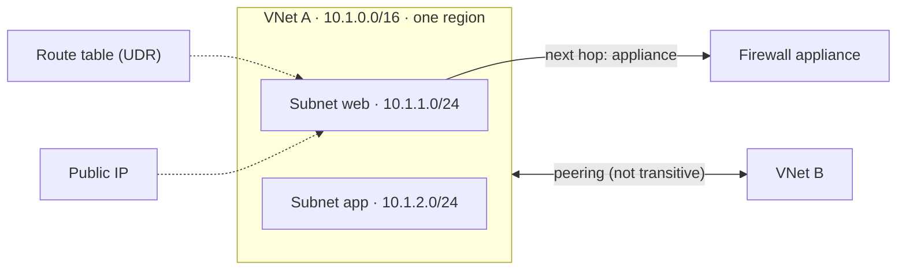
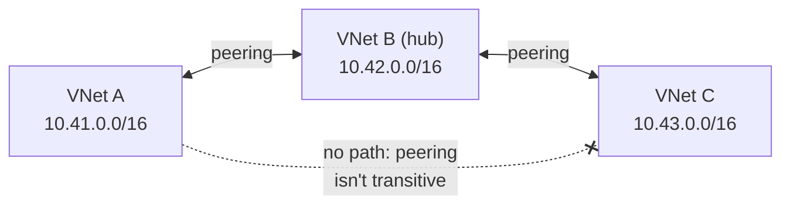

# Virtual Networks

> **Objective:** Configure and manage virtual networks in Azure
> **Domain:** Implement and manage virtual networking (15-20%)

## Sub-objectives covered

- Create and configure virtual networks and subnets
- Create and configure virtual network peering
- Configure public IP addresses
- Configure user-defined routes
- Troubleshoot network connectivity

## The administrative problem

Virtual machines and other resources need private addresses, need to talk to each other, sometimes need to be
reached from the internet, and sometimes must send their traffic through a security appliance first. Two teams' networks
must be connected. And when traffic doesn't arrive, you need to find out why without guessing.

Almost everything an administrator deploys sits in, or talks to, a virtual network: VMs, scale sets,
private endpoints, integrated App Service apps. A virtual network is a private, isolated, Layer 3
network in one Azure region.

This module covers five things you configure on one:

- its **addresses**;
- how it connects to other networks (**peering**);
- how it's reached from the internet (**public IPs**);
- how its traffic is steered (**user-defined routes**);
- how you find out why traffic doesn't flow (**Network Watcher**).

Filtering traffic with NSGs is module 04-02.

## In plain English

A **virtual network (VNet)** is your private network in one Azure region and one subscription. You give it an
**address space**, such as `10.1.0.0/16`, and divide it into **subnets**, such as `10.1.1.0/24` for web servers.
Resources get private IP addresses from their subnet.

- **Peering** connects two VNets so their resources talk over Microsoft's backbone, as if on one network. It isn't
  transitive: if A peers with B and B with C, A can't reach C through B.
- A **public IP address** is an internet-reachable address you attach to a NIC, load balancer or Bastion.
- **Routes** decide where traffic goes next. Azure creates **system routes** automatically; a **user-defined route
  (UDR)** in a route table overrides them, for example to send internet-bound traffic through a firewall appliance.
- **Network Watcher** has tools that test a specific flow and tell you what blocked it or where it went.

## Words you need to know

| Term | In plain English |
| --- | --- |
| **Virtual network (VNet)** | A private network in one region and one subscription. |
| **Address space** | The private IP range a VNet uses, written in CIDR notation such as 10.1.0.0/16. |
| **Subnet** | A slice of the VNet's address space where resources are placed. Azure reserves five addresses in each. |
| **Peering** | A connection between two VNets. Not transitive. |
| **Public IP address** | An internet-reachable address resource you attach to a NIC, load balancer or Bastion. |
| **System route** | A route Azure creates automatically in every subnet. |
| **User-defined route (UDR)** | A route you add in a route table to override the system routes. |
| **Next hop** | Where a route sends traffic next, such as the internet or a virtual appliance's IP. |
| **Network Watcher** | Azure's network diagnostic tools: IP flow verify, next hop, connection troubleshoot and more. |

## Mental model



Addresses first, then connections, then routes. Most connectivity problems are one of three things: overlapping
address spaces, a missing or one-sided peering, or a route sending traffic somewhere unexpected. This is a conceptual teaching model, not a complete architecture.

**Azure translation**

| Everyday idea | Azure name |
| --- | --- |
| A private office network | Virtual network |
| Floors or departments on that network | Subnets |
| A private corridor between two buildings | Peering |
| A street address the public can reach | Public IP address |
| A sign saying "all deliveries through security" | User-defined route to a firewall appliance |

## Where it fits

The ten questions to ask about any resource ([0A-13](../0A-foundations/0A-13-how-resources-fit-together.md)), answered for the main resource in this lesson.

| Question | Virtual network and subnet |
| --- | --- |
| What contains it? | A resource group; one region and one subscription. Subnets live in the VNet. |
| What does it depend on? | A non-overlapping private address space (overlap prevents peering). |
| What depends on it? | NICs, private endpoints, Bastion, load balancer backends and integrated apps in its subnets. |
| Who can manage it? | Network Contributor. |
| How is it networked? | Private addresses; peering to other VNets; public IPs on individual resources. |
| How is it monitored? | Network Watcher tools, effective routes, connection monitor, virtual network flow logs. |
| How is it protected? | NSGs on subnets and NICs (04-02), no public IPs by default, locks. |
| How is it recovered? | Redeploy from a template; keep the network design as code. |
| What does it cost? | No charge for the network itself; peering traffic and Standard public IPs are billed. |
| How is it removed safely? | Remove what's in its subnets first (or delete the resource group), and remove peerings on both sides. |

See it with its neighbours on the [resource map](#/map/vnet).

## How it works under the hood

### Virtual networks and subnets

- A virtual network lives in **one region and one subscription**, and spans that region's availability
  zones. Resources in it must be in the same region.
- It's **isolated by default**: nothing in another virtual network can reach it until you connect them.
  Resources in the same virtual network reach each other through Azure's system routes.
- Its **address space** is one or more CIDR ranges, normally private (RFC 1918: `10.0.0.0/8`,
  `172.16.0.0/12`, `192.168.0.0/16`). Plan ranges that **don't overlap** with networks you'll ever peer
  with or connect to.
- **Subnets** divide the address space. Their ranges can't overlap, and subnets are where you attach NSGs
  (04-02) and route tables.
- **Azure reserves five addresses in every subnet:** the first four and the last. In `192.168.1.0/24`:

| Address | Reserved for |
| --- | --- |
| `.0` | Network address |
| `.1` | Default gateway |
| `.2`, `.3` | Azure DNS mapping |
| `.255` | Broadcast |

- So a `/24` has **251** usable addresses. The smallest IPv4 subnet is **`/29`** (8 − 5 = **3** usable);
  the largest is `/2`. IPv6 subnets must be exactly **`/64`**.
- You can **resize** a subnet that has resources, as long as the new range still contains every address in
  use. A **delegated** subnet, such as one delegated to App Service, can't change its delegation while
  resources using it exist.
- **Private IPs** are dynamic by default; set one to static to keep it. A dynamic address is released when
  the NIC is deleted or moved to another subnet.

> **Dated change.** **Default outbound access** is being retired. Historically, a VM with no explicit
> outbound method got a Microsoft-owned public IP for internet access.
>
> With the API versions released **after March 31, 2026**, subnets in **new** virtual networks are
> **private by default**: `defaultOutboundAccess = false`. The portal already does this. VMs in them need
> an **explicit** outbound method: a **NAT gateway**, a **public IP** on the NIC, or **outbound rules on a
> Standard load balancer**. Existing virtual networks aren't changed. **Flexible** scale sets never had
> default outbound access (03-02).

### Peering

Peering connects two virtual networks so their resources talk over Microsoft's backbone using private
IPs.

- **Regional** or **global** (across regions). Across subscriptions and even across Microsoft Entra
  tenants.
- **Address spaces must not overlap.** Overlap blocks the peering.
- **Peering is two links.** The first shows **Initiated**. Once the second, reverse, link exists, both show
  **Connected**. If one link is deleted, the other shows **Disconnected**: delete it and re-create both.
- **Peering isn't transitive.** If A peers with B and B peers with C, **A can't reach C** through B. Peer A
  with C directly, or route through a hub appliance with user-defined routes.



Peering settings, on each link:

| Peering option | Effect |
| --- | --- |
| Allow access to the remote network | On by default; turning it off blocks traffic over the peering |
| **Allow forwarded traffic** | Accept traffic that didn't originate in the peered network, such as traffic forwarded by an appliance. Needed for hub-and-spoke designs |
| **Allow gateway transit** / **Use remote gateways** | Let a spoke use the hub's VPN or ExpressRoute gateway. **Use remote gateways** can be on for only **one** peering per network, and that network can't have its own gateway |

- **Resizing** a peered network's address space is supported with no downtime, but then select **Sync** on
  the peerings. Microsoft recommends syncing after every change.
- **You can't move a peered virtual network** to another resource group or subscription. Delete the
  peering, move, then re-create.
- New peering routes take a few minutes to appear in a NIC's **effective routes**, with the next hop
  **Virtual network peering**.

### Public IP addresses

> **Dated change.** **Basic SKU public IPs were retired on September 30, 2025.** Upgrade any that remain
> to **Standard**. Basic IPs attached to VPN gateways were given a later, separate timeline, so check that
> case against Microsoft's VPN Gateway guidance.

- **Standard** public IPs:
  - **static**, so the address doesn't change;
  - **zone-redundant** by default where the region supports zones;
  - **secure by default:** inbound traffic is **closed** until an NSG allows it.
- They're **billed whether or not they're attached**: delete the ones you don't use.
- You associate a public IP with a **NIC** (for a VM), a **load balancer frontend**, a **NAT gateway**, a
  **Bastion host**, or a **VPN gateway**.
- A **public IP prefix** reserves a contiguous block of public addresses in a region, for predictable
  allow-listing.

### Routing and user-defined routes

Every subnet has **system routes**: within the virtual network, to peered networks, to the internet
(`0.0.0.0/0`), and drops for some reserved ranges. **Custom routes** add to them: **user-defined routes**
in a **route table**, and **BGP** routes from a VPN or ExpressRoute gateway.

**Route tables:**

- A route table holds up to **400** routes by default.
- It's associated with **zero or more subnets**, and each subnet has **zero or one** route table.
- **Propagate gateway routes** controls whether BGP routes from gateways reach the subnets.

**Next hop types:**

| Next hop | Sends traffic to |
| --- | --- |
| **Virtual appliance** | A next hop IP address, typically a firewall VM (NVA). The NVA's NIC needs **IP forwarding** enabled, or packets are dropped |
| **Virtual network gateway** | The VPN gateway, for example forced tunnelling to on-premises |
| **Virtual network** | Within the virtual network |
| **Internet** | Out to the internet |
| **None** | **Drop** the traffic |

**How Azure picks a route:**

1. **Longest prefix match** wins. Traffic to `10.0.0.5` uses a `10.0.0.0/24` route over a `10.0.0.0/16`
   route.
2. On a **tie** of the same prefix: **user-defined**, then **BGP**, then **system**.
3. System routes for the **virtual network**, **peerings** and **service endpoints** are preferred even over
   more specific BGP routes, and **service endpoint routes can't be overridden**.

A UDR for `0.0.0.0/0` to an appliance or gateway is **forced tunnelling**. It can break RDP or SSH coming
from the internet, because replies take the new path.

### Troubleshooting connectivity with Network Watcher

**Network Watcher** is enabled automatically in a region when you create a virtual network there. Its
diagnostic tools answer specific questions:

| Question | Tool |
| --- | --- |
| Is this packet **allowed or denied** to or from a VM, and **which rule** decided? | **IP flow verify** |
| Same question for a VM, scale set or application gateway, by IP, prefix or service tag | **NSG diagnostics** |
| **Where does traffic to this IP go**: which next hop type, IP and route table? | **Next hop** |
| Which **routes** actually apply to this NIC? | **Effective routes** (on the NIC) |
| Which **security rules** apply to this NIC, subnet and NIC combined? | **Effective security rules** |
| Can this VM reach that endpoint right now, and how fast? | **Connection troubleshoot** (one-time) |
| What exactly is on the wire? | **Packet capture** |
| Why is the VPN gateway or connection failing? | **VPN troubleshoot** |

Continuous monitoring with **Connection monitor**, and logging, are module 05-01.

> **Dated change.** **NSG flow logs** can't be created after **June 30, 2025**, and retire on **September
> 30, 2027**. Use **virtual network flow logs**, which also evaluate Virtual Network Manager admin rules.

A sensible troubleshooting order: **effective routes** (is there a path?), then **next hop** (where does it
go?), then **IP flow verify** and **effective security rules** (is it allowed?), then **connection
troubleshoot** (does it actually connect?).

## Configuration surface

```bash
# A virtual network with one subnet; then a second subnet
az network vnet create --name "<vnet>" --resource-group "<rg>" --address-prefix 10.41.0.0/16 \
  --subnet-name web --subnet-prefixes 10.41.1.0/24
az network vnet subnet create --name data --vnet-name "<vnet>" --resource-group "<rg>" --address-prefixes 10.41.2.0/29

# Peering: one link from each side (full resource ID for the remote network)
az network vnet peering create --name a-to-b --vnet-name "<vnet-a>" --resource-group "<rg>" \
  --remote-vnet "<vnet-b-resource-id>" --allow-vnet-access
az network vnet peering sync --name a-to-b --vnet-name "<vnet-a>" --resource-group "<rg>"

# A Standard static public IP
az network public-ip create --name "<pip>" --resource-group "<rg>" --sku Standard --allocation-method Static

# A route table, a route, an association
az network route-table create --name "<rt>" --resource-group "<rg>"
az network route-table route create --route-table-name "<rt>" --resource-group "<rg>" --name to-nva \
  --address-prefix 10.42.0.0/16 --next-hop-type VirtualAppliance --next-hop-ip-address 10.41.1.100
az network vnet subnet update --name web --vnet-name "<vnet>" --resource-group "<rg>" --route-table "<rt>"

# Troubleshooting
az network nic show-effective-route-table --name "<nic>" --resource-group "<rg>" -o table
az network watcher show-next-hop --vm "<vm>" --resource-group "<rg>" --source-ip 10.41.1.4 --dest-ip 10.42.1.4
az network watcher test-ip-flow --vm "<vm>" --resource-group "<rg>" --direction Inbound --protocol TCP \
  --local 10.41.1.4:22 --remote 203.0.113.10:*
```

| Setting | Documented default | Where | Exam angle |
| --- | --- | --- | --- |
| Usable addresses per subnet | Size − 5 | Subnets | `/29` gives 3 |
| Private IP allocation | **Dynamic** | NIC > IP configurations | Static keeps the address |
| Default outbound access, new VNets | **Off** (API after March 31, 2026; portal already) | Subnet | Explicit outbound needed |
| Public IP SKU | **Standard** (Basic retired) | Public IP | Static, zone-redundant, closed inbound |
| Peering status | **Initiated** until the second link | Peerings | Connected needs both links |
| Route tables per subnet | 0 or 1 | Subnet | Up to 400 routes per table |
| Network Watcher | **Enabled automatically** per region | Network Watcher | Troubleshooting tools |

## Worked example

**Requirement.** VMs in the `web` subnet must send all internet-bound traffic through a firewall appliance at
`10.1.9.4` in the same VNet.

1. **Decide.** Overriding where traffic goes is a **user-defined route**: address prefix `0.0.0.0/0`, next hop type
   **Virtual appliance**, next hop address `10.1.9.4`.
2. **Configure.** Create a route table with that route and **associate it with the `web` subnet**. A route table that
   isn't associated with a subnet does nothing.
3. **Observe.** The appliance must be set up to forward traffic (IP forwarding on its NIC); otherwise traffic stops
   there.
4. **Validate.** Ask Network Watcher where a packet goes next, as below.

## Validate the result

```powershell
az network vnet subnet list -g <rg> --vnet-name <vnet> --query "[].{name:name, prefix:addressPrefix, rt:routeTable.id}" -o table
az network vnet peering list -g <rg> --vnet-name <vnet> --query "[].{name:name, state:peeringState}" -o table   # Connected
az network watcher show-next-hop -g <rg> --vm <vm> --source-ip <vm-private-ip> --dest-ip 8.8.8.8
az network nic show-effective-route-table -g <rg> -n <nic> -o table
```

- **Next hop** should return **VirtualAppliance** and `10.1.9.4` for internet-bound traffic.
- A peering is only usable when **both** sides show **Connected**.
- Effective routes need the VM running: they show what Azure actually applies, not what you meant to configure.

## Common failure modes

1. **"We can't peer the two networks."** Their address spaces overlap. Re-address one of them.
2. **"Peering status is stuck on Initiated."** Only one link exists. Create the reverse link.
3. **"Spoke A can't reach spoke C, although both peer with the hub."** Peering isn't transitive. Peer them
   directly, or route through a hub NVA (UDRs, IP forwarding, allow forwarded traffic).
4. **"After adding an address range, the peer can't reach the new subnet."** The peering wasn't synced.
5. **"A /29 subnet holds only three VMs."** Five addresses are reserved in every subnet.
6. **"New VMs can't reach the internet."** The subnet is private (the new default) and has no explicit
   outbound method. Add a NAT gateway or a public IP.
7. **"Traffic to the firewall VM disappears."** IP forwarding isn't enabled on the appliance's NIC.
8. **"Our UDR to 10.0.0.0/16 isn't used for 10.0.1.5."** A more specific route (for example `/24`) wins on
   longest prefix.
9. **"RDP stopped working after we added 0.0.0.0/0 to the firewall."** Forced tunnelling sends the replies to
   the appliance.
10. **"We can't move the virtual network."** It's peered. Remove the peering, move, re-create.

## How this is tested

| Phrase in the question | What it steers you to |
| --- | --- |
| "how many usable IPs in a /28" | 16 − 5 = **11** |
| "connect two VNets in different regions" | **Global** VNet peering |
| "peer two VNets with 10.0.0.0/16 each" | Not possible: overlapping address spaces |
| "spokes must reach each other through the hub" | Hub NVA + **UDRs**, **IP forwarding**, **allow forwarded traffic**; or direct peering |
| "spokes must use the hub's VPN gateway" | **Allow gateway transit** (hub) + **Use remote gateways** (spoke) |
| "force all internet traffic through a firewall" | UDR `0.0.0.0/0` → **Virtual appliance** |
| "drop traffic to a range" | UDR with next hop **None** |
| "which route is used" | **Longest prefix**, then UDR > BGP > system |
| "public IP that never changes" | **Standard**, static |
| "why can't the VM reach X: is it routing?" | **Next hop** / **effective routes** |
| "is it an NSG rule?" | **IP flow verify** / **effective security rules** |
| "log traffic for new deployments" | **Virtual network flow logs** (NSG flow logs are retiring) |

## Hands-on

See [04-01 lab](../../labs/04-networking/04-01-lab.md). It builds four virtual networks to show peering
states, overlap and non-transitivity, then uses one small VM to read effective routes and next hops before
and after a user-defined route.

## Check yourself

1. A subnet is `10.41.2.0/28`. How many VMs can it hold, and which addresses can't they use?
2. VNet A (`10.1.0.0/16`) peers with B (`10.2.0.0/16`); B peers with C (`10.3.0.0/16`). A VM in A pings
   `10.3.0.4`. What happens, and what are two ways to make it work?
3. A route table on subnet web has `10.2.0.0/16 → None` and `10.2.1.0/24 → Virtual appliance 10.1.1.100`.
   Where does traffic from web to `10.2.1.7` go? And to `10.2.5.7`?
4. Peering between A and B shows **Disconnected** on A. What happened, and how do you fix it?
5. A VM can't reach a database VM in a peered network. Name the Network Watcher tools you'd use, in order,
   and what each rules in or out.

## Teach it back

Answer out loud or in writing, without notes, as if to someone who has never used Azure. Where you hesitate is what to re-read.

- Explain address spaces and subnets using a building and its floors.
- Explain why peering A-B and B-C doesn't connect A and C.
- Explain what a user-defined route changes, and what has to be true for it to apply.

## Key takeaways

- A virtual network is **regional and isolated**. Subnets lose **5 addresses** each, so `/29` is the smallest
  at 3 usable.
- **New VNets have private subnets by default**: VMs need an explicit outbound method.
- **Peering:** no overlapping address spaces, **two links** (Initiated → Connected), **not transitive**, **Sync**
  after resizing.
- **Standard public IPs:** static, zone-redundant, closed inbound by default, billed while they exist. **Basic is
  retired.**
- **UDRs:** one route table per subnet; next hops are virtual appliance, gateway, virtual network, internet or
  None; **longest prefix**, then **UDR > BGP > system**.
- **Network Watcher:** effective routes and next hop for routing; IP flow verify and effective security rules
  for filtering; connection troubleshoot to test.

## Sources

- Microsoft Learn: [Study guide for Exam AZ-104](https://learn.microsoft.com/en-us/credentials/certifications/resources/study-guides/az-104)
- Microsoft Learn: [Azure Virtual Network FAQ](https://learn.microsoft.com/en-us/azure/virtual-network/virtual-networks-faq)
- Microsoft Learn: [Add, change, or delete a virtual network subnet](https://learn.microsoft.com/en-us/azure/virtual-network/virtual-network-manage-subnet)
- Microsoft Learn: [Private IP addresses](https://learn.microsoft.com/en-us/azure/virtual-network/ip-services/private-ip-addresses)
- Microsoft Learn: [Default outbound access in Azure](https://learn.microsoft.com/en-us/azure/virtual-network/ip-services/default-outbound-access)
- Microsoft Learn: [Azure virtual network peering](https://learn.microsoft.com/en-us/azure/virtual-network/virtual-network-peering-overview)
- Microsoft Learn: [Create, change, or delete a virtual network peering](https://learn.microsoft.com/en-us/azure/virtual-network/virtual-network-manage-peering)
- Microsoft Learn: [Troubleshoot virtual network peering problems](https://learn.microsoft.com/en-us/troubleshoot/azure/virtual-network/virtual-network-troubleshoot-peering-issues)
- Microsoft Learn: [Create, change, or delete an Azure public IP address](https://learn.microsoft.com/en-us/azure/virtual-network/ip-services/virtual-network-public-ip-address)
- Microsoft Learn: [Azure virtual network traffic routing](https://learn.microsoft.com/en-us/azure/virtual-network/virtual-networks-udr-overview)
- Microsoft Learn: [Create, change, or delete a route table](https://learn.microsoft.com/en-us/azure/virtual-network/manage-route-table)
- Microsoft Learn: [Diagnose a virtual machine routing problem](https://learn.microsoft.com/en-us/azure/virtual-network/diagnose-network-routing-problem)
- Microsoft Learn: [What is Azure Network Watcher?](https://learn.microsoft.com/en-us/azure/network-watcher/network-watcher-overview)
- Microsoft Learn: [IP flow verify overview](https://learn.microsoft.com/en-us/azure/network-watcher/ip-flow-verify-overview)
- Microsoft Learn: [Flow logging for network security groups (retirement)](https://learn.microsoft.com/en-us/azure/network-watcher/nsg-flow-logs-overview)
