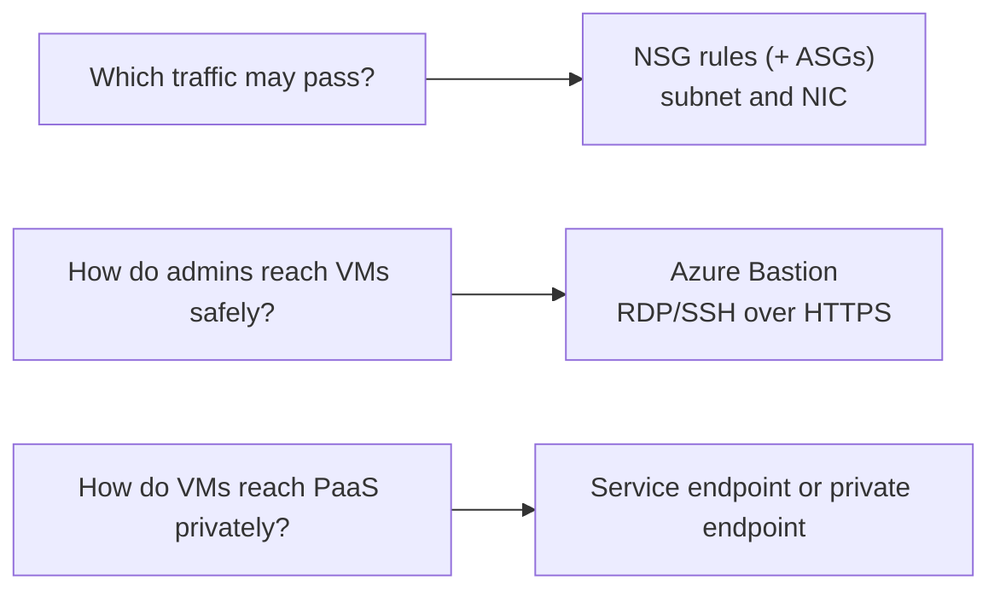
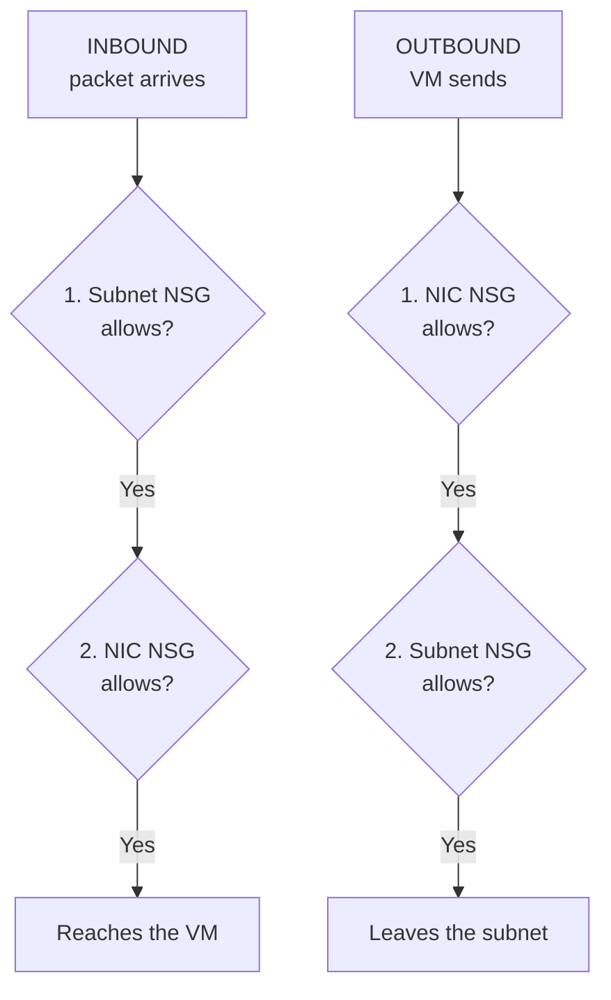

# Secure Access to Virtual Networks

> **Objective:** Configure secure access to virtual networks
> **Domain:** Implement and manage virtual networking (15-20%)

## Sub-objectives covered

- Create and configure network security groups (NSGs) and application security groups
- Evaluate effective security rules in NSGs
- Implement Azure Bastion
- Configure service endpoints for Azure platform as a service (PaaS)
- Configure private endpoints for Azure PaaS

## The administrative problem

Your VMs are on a network, and now you have to decide what is allowed through. Web servers should accept HTTPS
from the internet and nothing else. Administrators need to reach the VMs without exposing remote desktop or SSH to the
whole internet. And the VMs need to reach a storage account privately, without that account being open to everyone.

04-01 connected networks; this module controls **what is allowed through them**. Three separate
questions, three tools:

- **Which traffic may reach or leave a VM?** Network security groups, written in terms of roles with
  application security groups.
- **How do admins reach VMs without exposing RDP or SSH to the internet?** Azure Bastion.
- **How do VMs reach PaaS services such as Storage privately?** Service endpoints or private endpoints.

## In plain English

Three separate controls, for three separate questions:

- A **network security group (NSG)** is a list of allow and deny rules, checked in priority order, for traffic to and
  from a subnet or a network interface. **Application security groups (ASGs)** let a rule say "the web servers" instead
  of listing IP addresses.
- **Azure Bastion** lets administrators open RDP or SSH sessions to VMs through the Azure portal over HTTPS, so the VMs
  need no public IP and no open management port.
- **Service endpoints** and **private endpoints** let VMs reach PaaS services such as Storage privately. A service
  endpoint lets a subnet through the service's firewall; a private endpoint gives the service a private IP address in
  your network.

To know what actually applies, read the **effective security rules**: the combined result of every NSG on the path.

## Words you need to know

| Term | In plain English |
| --- | --- |
| **Network security group (NSG)** | Ordered allow and deny rules for traffic to and from subnets and network interfaces. |
| **Priority** | A rule's order, 100 to 4096. The lowest number that matches wins and processing stops. |
| **Default rules** | Rules every NSG has at priority 65000 and above, such as denying inbound from the internet. |
| **Service tag** | A named group of Azure IP ranges, such as Internet or AzureLoadBalancer, for use in rules. |
| **Application security group (ASG)** | A label you give to NICs, so rules can target "web servers" instead of IP addresses. |
| **Effective security rules** | The combined rules actually applied to a network interface from its subnet's and its own NSG. |
| **Azure Bastion** | A managed service for RDP and SSH to VMs through the portal, without public IPs on the VMs. |
| **Service endpoint** | Sends a subnet's traffic to a PaaS service with the subnet's identity, so the service firewall can allow it. |
| **Private endpoint** | A network interface with a private IP that connects to one specific PaaS resource. |

## Mental model



Match the question to the control. And when traffic is blocked, check the effective rules rather than the NSG you
think applies: a subnet NSG and a NIC NSG can both be on the path. This is a conceptual teaching model, not a complete architecture.

**Azure translation**

| Everyday idea | Azure name |
| --- | --- |
| A doorman with a list of who may enter, read top to bottom | Network security group |
| Name badges by job, such as "web team" | Application security groups |
| A supervised visitor entrance instead of an unlocked side door | Azure Bastion |
| A private corridor to a shop, versus opening a shop counter inside your office | Service endpoint versus private endpoint |

## Where it fits

The ten questions to ask about any resource ([0A-13](../0A-foundations/0A-13-how-resources-fit-together.md)), answered for the main resource in this lesson.

| Question | Network security group |
| --- | --- |
| What contains it? | A resource group, in the same region as the subnets and NICs it's associated with. |
| What does it depend on? | Nothing to exist; an association with a subnet or NIC to take effect. |
| What depends on it? | Every flow to and from the subnets and NICs it's associated with. |
| Who can manage it? | Network Contributor. |
| How is it networked? | Rules by priority, first match wins; default rules at 65000 and above. |
| How is it monitored? | Effective security rules, IP flow verify, virtual network flow logs. |
| How is it protected? | It is the protection: inbound from the internet is denied by default. |
| How is it recovered? | Redeploy the rules from a template. |
| What does it cost? | Free. |
| How is it removed safely? | Dissociate it from subnets and NICs, then delete it; check what traffic its rules were allowing. |

See it with its neighbours on the [resource map](#/map/nsg).

## How it works under the hood

### Network security groups

An NSG is a list of **allow and deny rules** for inbound and outbound traffic. You associate it with a
**subnet**, a **network interface**, or both. One NSG can be associated with many subnets and NICs.

| Rule property | Values |
| --- | --- |
| **Priority** | **100–4096.** Lowest number first; **processing stops at the first match** |
| Source and destination | Any, an IP or CIDR range, a **service tag** (such as `Internet`, `VirtualNetwork`, `Storage`), or an **application security group** |
| Port and protocol | Single ports, ranges or lists; TCP, UDP, ICMP or Any |
| Action | Allow or Deny |

NSGs are **stateful**: if a rule allows a connection in, the reply traffic is allowed back out without a
separate rule.

Every NSG has **default rules you can't delete**, at the lowest priorities:

| Direction | Priority | Rule | Effect |
| --- | --- | --- | --- |
| Inbound | 65000 | AllowVNetInBound | Allow from `VirtualNetwork` (includes peered networks) |
| Inbound | 65001 | AllowAzureLoadBalancerInBound | Allow load balancer health probes |
| Inbound | 65500 | **DenyAllInBound** | Deny everything else |
| Outbound | 65000 | AllowVnetOutBound | Allow to `VirtualNetwork` |
| Outbound | 65001 | **AllowInternetOutBound** | Allow to the internet |
| Outbound | 65500 | DenyAllOutBound | Deny everything else |

So by default, inbound traffic from the internet is denied, outbound traffic to the internet is allowed,
and traffic inside the virtual network flows both ways. Add your own rules at lower numbers to change
that.

### Evaluation order: subnet and NIC



- **Inbound:** the **subnet NSG first, then the NIC NSG**. **Outbound:** NIC first, then subnet.
- When both levels have an NSG, **both must allow** the traffic. A deny at either level wins.
- The same order applies to traffic **between VMs in the same subnet**: a subnet NSG that denies
  everything also stops VM-to-VM traffic inside that subnet.
- With **no NSG** on the subnet or the NIC, traffic isn't filtered by an NSG. Even so, a VM's **Standard
  public IP** is **closed to inbound internet traffic** until an NSG allows it.
- Microsoft's advice: associate an NSG at **one** level, subnet or NIC, not both, to avoid conflicting
  rules that are hard to troubleshoot.

### Application security groups

An **application security group (ASG)** is a named group of network interfaces, such as `asg-web` or
`asg-db`, that NSG rules can use as a **source or destination** instead of IP addresses. Rules then
follow the role, not the address:

| Priority | Source | Destination | Port | Action |
| --- | --- | --- | --- | --- |
| 100 | Internet | `asg-web` | 443 | Allow |
| 110 | `asg-web` | `asg-db` | 1433 | Allow |

- Add a VM to the role by adding its NIC to the ASG. **No rule changes** are needed as VMs come and go.
- A NIC can be in several ASGs.
- **All NICs in an ASG must be in the same virtual network**, and a rule that uses ASGs as both source and
  destination needs them in the same virtual network.

### Evaluating effective security rules

When there are two NSGs, a dozen rules and service tags, you need to know what **actually** applies:

| Tool | Answers |
| --- | --- |
| **NIC > Effective security rules** | The **combined** rules of the subnet NSG and the NIC NSG for that NIC, with service tags expanded to prefixes. The VM must be running |
| **Network Watcher > IP flow verify** | Is **this** packet (protocol, local and remote IP and port, direction) allowed or denied, and **which rule** decided |
| **Connection troubleshoot** | Can the VM reach a destination end to end, hop by hop |

```bash
az network nic list-effective-nsg --name "<nic>" --resource-group "<rg>"
az network watcher test-ip-flow --vm "<vm>" --resource-group "<rg>" --direction Inbound \
  --protocol TCP --local 10.42.1.4:22 --remote 203.0.113.10:50000
```

### Azure Bastion

Azure Bastion gives **RDP and SSH to VMs over TLS (port 443)** from the Azure portal or a native client,
using the VMs' **private** IPs. The VMs need **no public IP**, no agent, and no inbound RDP or SSH from
the internet.

| | Developer | Basic | Standard | Premium |
| --- | --- | --- | --- | --- |
| Hourly charge | **Free** | Paid | Paid | Paid |
| AzureBastionSubnet (**/26 or larger**) and Standard public IP | **Not needed** | Required | Required | Required (except private-only) |
| VMs in **peered** VNets | **No** | Yes | Yes | Yes |
| Concurrent connections | **One VM at a time** | Yes | Yes | Yes |
| Native client (az CLI), shareable links, IP-based connect, file transfer, custom ports | No | No | **Yes** | Yes |
| Host scaling | — | Fixed (2 instances) | **2–50 instances** | 2–50 |
| Session recording, private-only (no public IP) | No | No | No | **Yes** |

- **Developer** runs on shared infrastructure in **select regions**, and deploys automatically the first time
  you connect from the portal. It's for development and test only.
- Dedicated SKUs bill **hourly from the moment they're deployed**, whether or not anyone connects. Delete
  test deployments promptly.
- You can **upgrade** a SKU, which takes about 10 minutes, but **not downgrade**: that means delete and re-create.
- The target VM must allow inbound **22** (SSH) or **3389** (RDP) from the Bastion subnet. Using
  `VirtualNetwork` as the source covers it. If you put an NSG on the **AzureBastionSubnet** itself, Microsoft
  lists a full set of required rules; omit one and Bastion breaks.

### Service endpoints and private endpoints

Both keep traffic from your VNet to a PaaS service such as Storage on the **Microsoft backbone**. They do
it very differently:

| | **Service endpoint** | **Private endpoint** |
| --- | --- | --- |
| What you create | A setting on a **subnet** (for example `Microsoft.Storage`) | A **network interface with a private IP** in your subnet, mapped to **one resource** |
| Scope | The **whole service** type from that subnet | **One instance**, such as one storage account |
| Destination address | The service's **public** IP; only the **source** becomes your private IP | A **private** IP in your VNet |
| DNS change | **No** | **Yes**: a **private DNS zone** such as `privatelink.blob.core.windows.net` |
| Reachable from on-premises (VPN or ExpressRoute) and peered VNets | **No** (on-premises) | **Yes** |
| Can the service turn off public access? | No: it relies on the firewall rule | **Yes** |
| Data exfiltration protection | Limited | **Yes**: only the mapped resource is reachable |
| Cost | **Free** | Hourly per endpoint, plus data processed |

How each is configured:

- **Service endpoint:** enable it on the subnet, then add a **virtual network rule** for that subnet on the
  resource's firewall (02-01). Enabling it switches the subnet's source addresses for that service from
  public to private, and closes existing connections at that moment.
- **Private endpoint:** create it in a subnet, choose the resource and its **sub-resource** (for Storage,
  `blob`, `file`, `queue`, `table`, `web` or `dfs`), and integrate it with a **private DNS zone** linked to
  the VNet. Clients keep using the normal name (`account.blob.core.windows.net`), which now resolves to the
  private IP. Then you can **disable public network access** on the resource.

Most private-endpoint problems are **DNS problems**: the endpoint exists, but the name still resolves to the
public IP because the private DNS zone isn't linked to the client's VNet, or on-premises DNS doesn't forward
to Azure.

## Configuration surface

```bash
# NSG with an ASG-based rule, associated with a subnet
az network asg create --name asg-web --resource-group "<rg>"
az network nsg create --name nsg-web --resource-group "<rg>"
az network nsg rule create --nsg-name nsg-web --resource-group "<rg>" --name allow-https-web \
  --priority 100 --direction Inbound --access Allow --protocol Tcp \
  --source-address-prefixes Internet --destination-asgs asg-web --destination-port-ranges 443
az network vnet subnet update --vnet-name "<vnet>" --name web --resource-group "<rg>" --network-security-group nsg-web
az network nic ip-config update --nic-name "<nic>" --name ipconfig1 --resource-group "<rg>" --application-security-groups asg-web

# Service endpoint
az network vnet subnet update --vnet-name "<vnet>" --name web --resource-group "<rg>" --service-endpoints Microsoft.Storage

# Private endpoint for a storage account's blob service, with private DNS
az network private-endpoint create --name pe-blob --resource-group "<rg>" --vnet-name "<vnet>" --subnet endpoints \
  --private-connection-resource-id "<storage-account-id>" --group-id blob --connection-name pe-blob-conn
az network private-dns zone create --name privatelink.blob.core.windows.net --resource-group "<rg>"
az network private-dns link vnet create --zone-name privatelink.blob.core.windows.net --resource-group "<rg>" \
  --name link-vnet --virtual-network "<vnet>" --registration-enabled false
az network private-endpoint dns-zone-group create --endpoint-name pe-blob --resource-group "<rg>" \
  --name default --private-dns-zone privatelink.blob.core.windows.net --zone-name blob
```

| Setting | Documented default | Where | Exam angle |
| --- | --- | --- | --- |
| Inbound from internet | **Denied** (DenyAllInBound 65500) | NSG default rules | Add an allow rule below 65500 |
| Outbound to internet | **Allowed** (AllowInternetOutBound 65001) | NSG default rules | Deny it with your own rule |
| Rule priority range | 100–4096 | NSG rule | Lowest number wins |
| Bastion subnet | **AzureBastionSubnet, /26 or larger** | VNet | Not needed for Developer |
| Bastion SKU change | Upgrade only | Bastion > Configuration | Downgrade means re-create |
| Private endpoint DNS | Private DNS zone integration | Private endpoint > DNS configuration | Name must resolve to the private IP |

## Worked example

**Requirement.** Web VMs accept HTTPS from the internet only. Database VMs accept SQL (TCP 1433) only from the web
VMs. Nobody may open RDP from the internet.

1. **Decide.** Traffic filtering is an **NSG**; "only from the web VMs" without IP lists is an **ASG**; admin access
   without open RDP is **Bastion**.
2. **Configure.** ASGs `asg-web` and `asg-db` on the NICs. Rules: allow 443 from **Internet** to `asg-web`; allow 1433
   from `asg-web` to `asg-db`. Rely on the default inbound deny for everything else. Deploy Bastion for admins.
3. **Observe.** HTTPS reaches the web VMs; SQL from anywhere else is dropped.
4. **Validate.** Ask Network Watcher about specific flows, as below.

## Validate the result

```powershell
az network nic list-effective-nsg -g <rg> -n <nic>
az network watcher test-ip-flow -g <rg> --vm <db-vm> --direction Inbound --protocol TCP `
  --local <db-ip>:1433 --remote <web-ip>:60000                     # Allow, naming the rule
az network watcher test-ip-flow -g <rg> --vm <db-vm> --direction Inbound --protocol TCP `
  --local <db-ip>:1433 --remote 203.0.113.10:60000                 # Deny, naming the rule
```

- **IP flow verify** returns Allow or Deny *and the rule that decided it*: that's the validation, not the rule list.
- For a private endpoint, `nslookup <account>.blob.core.windows.net` from a VM in the VNet must return a **private** IP.
- For Bastion, connect to a VM with no public IP from the portal.

## Common failure modes

1. **"We allowed port 80 on the NIC's NSG but it's still blocked."** The subnet NSG denies it, and inbound is
   evaluated subnet first. Both must allow.
2. **"A deny rule at priority 200 doesn't block traffic."** An allow rule at a lower number, such as 150, matched
   first.
3. **"VMs in the same subnet stopped talking."** A subnet NSG rule now denies the traffic; intra-subnet traffic is
   filtered too.
4. **"The ASG rule was rejected."** The NICs or ASGs are in different virtual networks.
5. **"Effective security rules is empty."** The VM is stopped. It shows rules only for a running VM's NIC.
6. **"Bastion can't reach VMs in the peered spoke."** The SKU is Developer, which doesn't support peering.
7. **"We need to connect with the native SSH client through Bastion."** That needs Standard or Premium.
8. **"We can't downgrade Bastion to save money."** Downgrades aren't supported; delete and re-create.
9. **"The private endpoint exists, but the app still connects to the public IP."** DNS: the private DNS zone isn't
   linked to the VNet, or the client uses DNS that doesn't resolve the `privatelink` zone.
10. **"On-premises servers can't use the storage service endpoint."** Service endpoints don't extend to
    on-premises. Use a private endpoint.

## How this is tested

| Phrase in the question | What it steers you to |
| --- | --- |
| "allow HTTPS to web servers without listing IPs" | NSG rule with an **ASG** destination |
| "which rule is blocking this connection" | **IP flow verify** (or effective security rules) |
| "rules applied to a VM from both its subnet and NIC" | **Effective security rules** |
| "RDP/SSH without public IPs on the VMs" | **Azure Bastion** |
| "free Bastion for a dev VM" | **Developer** SKU (one VM at a time, no peering) |
| "Bastion for VMs in peered VNets" | Basic or higher |
| "connect with the native client / shareable link / file transfer" | **Standard** or higher |
| "record Bastion sessions" | **Premium** |
| "restrict a storage account to a subnet, at no cost" | **Service endpoint** + VNet firewall rule |
| "reach the storage account from on-premises over VPN privately" | **Private endpoint** |
| "disable the storage account's public endpoint" | **Private endpoint**, then disable public network access |
| "prevent data exfiltration to other storage accounts" | **Private endpoint** (instance-scoped) |
| "private endpoint works by IP but not by name" | Private DNS zone integration |

## Hands-on

See [04-02 lab](../../labs/04-networking/04-02-lab.md). It runs one small VM for about 45 minutes, uses free
Bastion Developer, and keeps a private endpoint for about 15 minutes. Dedicated Bastion SKUs are a walkthrough.

## Check yourself

1. A subnet NSG allows TCP 22 from `VirtualNetwork` at priority 300. The NIC NSG has no custom rules. Can a VM in a
   peered VNet SSH in? Can an internet client?
2. You have rules: 100 deny TCP 3389 from Internet; 200 allow TCP 3389 from 203.0.113.0/24. What happens to RDP from
   203.0.113.5, and how would you fix it?
3. A team wants to add new web VMs without editing NSG rules. What do you configure, and what constraint applies to
   where those VMs live?
4. Bastion Developer works for VM1 in VNet-A but not for VM2 in a peered VNet-B. Why, and what's the cheapest fix?
5. A storage account must be reachable from a subnet **and** from on-premises, privately, with its public endpoint
   disabled. Service endpoint or private endpoint, and what else must you configure for names to resolve?

## Teach it back

Answer out loud or in writing, without notes, as if to someone who has never used Azure. Where you hesitate is what to re-read.

- Explain how an NSG decides, using a list read from the top until the first match.
- Explain why you'd check effective security rules instead of one NSG.
- Explain the difference between a service endpoint and a private endpoint in one sentence each.

## Key takeaways

- **NSG rules:** priority **100–4096**, lowest first, **first match wins**. **Default rules** allow VNet traffic,
  allow outbound internet, and **deny inbound internet**.
- **Inbound: subnet NSG then NIC NSG; outbound: NIC then subnet. Both must allow.**
- **ASGs** let rules target roles instead of IPs. Their NICs must share a virtual network.
- **Effective security rules** show the combined result; **IP flow verify** names the deciding rule.
- **Bastion:** RDP/SSH over 443 with no public IPs on VMs. **Developer** is free (one VM, no peering).
  **Standard** adds native client and more. **Premium** adds recording. Upgrade only.
- **Service endpoint:** free, subnet-wide, public destination IP, no on-premises access. **Private endpoint:** a
  private IP for **one** resource, works from on-premises, **needs private DNS**, and lets you disable public access.

## Sources

- Microsoft Learn: [Study guide for Exam AZ-104](https://learn.microsoft.com/en-us/credentials/certifications/resources/study-guides/az-104)
- Microsoft Learn: [Azure network security groups overview](https://learn.microsoft.com/en-us/azure/virtual-network/network-security-groups-overview)
- Microsoft Learn: [How network security groups filter network traffic](https://learn.microsoft.com/en-us/azure/virtual-network/network-security-group-how-it-works)
- Microsoft Learn: [Troubleshoot NSG misconfigurations blocking traffic](https://learn.microsoft.com/en-us/troubleshoot/azure/virtual-network/virtual-network-troubleshoot-nsg-blocking-traffic)
- Microsoft Learn: [Application security groups](https://learn.microsoft.com/en-us/azure/virtual-network/application-security-groups)
- Microsoft Learn: [Network interface: view effective security rules](https://learn.microsoft.com/en-us/azure/virtual-network/virtual-network-network-interface#view-effective-security-rules)
- Microsoft Learn: [IP flow verify overview](https://learn.microsoft.com/en-us/azure/network-watcher/ip-flow-verify-overview)
- Microsoft Learn: [What is Azure Bastion?](https://learn.microsoft.com/en-us/azure/bastion/bastion-overview)
- Microsoft Learn: [Choose the right Azure Bastion SKU](https://learn.microsoft.com/en-us/azure/bastion/bastion-sku-comparison)
- Microsoft Learn: [View or upgrade an Azure Bastion SKU](https://learn.microsoft.com/en-us/azure/bastion/upgrade-sku)
- Microsoft Learn: [Configure NSG rules for Azure Bastion](https://learn.microsoft.com/en-us/azure/bastion/bastion-nsg)
- Microsoft Learn: [Quickstart: Deploy Azure Bastion from the Azure portal](https://learn.microsoft.com/en-us/azure/bastion/quickstart-host-portal)
- Microsoft Learn: [Virtual network service endpoints](https://learn.microsoft.com/en-us/azure/virtual-network/virtual-network-service-endpoints-overview)
- Microsoft Learn: [What is a private endpoint?](https://learn.microsoft.com/en-us/azure/private-link/private-endpoint-overview)
- Microsoft Learn: [Azure Private Endpoint DNS configuration](https://learn.microsoft.com/en-us/azure/private-link/private-endpoint-dns)
- Microsoft Learn: [Integrate Azure services with virtual networks: compare private endpoints and service endpoints](https://learn.microsoft.com/en-us/azure/virtual-network/vnet-integration-for-azure-services#compare-private-endpoints-and-service-endpoints)
- Microsoft Learn: [Azure Private Link FAQ](https://learn.microsoft.com/en-us/azure/private-link/private-link-faq)
