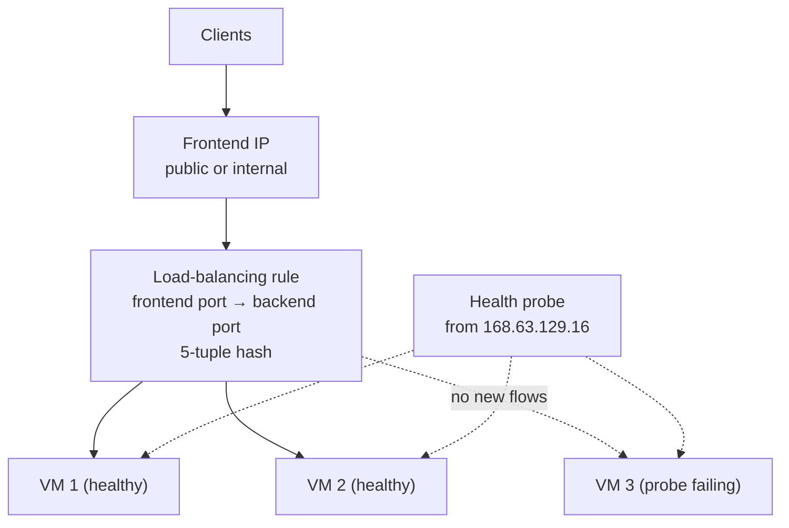

# Name Resolution and Load Balancing

> **Objective:** Configure name resolution and load balancing
> **Domain:** Implement and manage virtual networking (15-20%)

## Sub-objectives covered

- Configure Azure DNS
- Configure an internal or public load balancer
- Troubleshoot load balancing

## Why this exists

Two jobs that every application needs:

- **Names.** Users and services find things by name. Azure DNS hosts your **public** zones, so the
  internet can resolve `www.contoso.com`, and your **private** zones, so VMs can resolve each other by
  name inside your networks.
- **Spreading load.** One VM is a single point of failure. **Azure Load Balancer** puts one address in
  front of several VMs, sends each new flow to a healthy one, and stops sending traffic to any that fail
  their health probe.

## How it works under the hood

### Azure DNS: public zones

Azure DNS is an **authoritative** DNS service: it answers for the zones you host. It **isn't a domain
registrar**. To make a domain you bought elsewhere resolve through Azure:

1. Create the **DNS zone** in Azure, named after the domain, such as `contoso.com`.
2. At your **registrar**, replace the domain's name servers with the **four Azure name servers** shown in
   the zone's NS record. This is **delegation**.

Azure creates the zone's **SOA** and apex **NS** records itself. You can't remove the Azure name servers
from that NS record set.

Records are grouped into **record sets**: all the records with the same name and type. Supported types
are A, AAAA, CAA, CNAME, MX, NS, PTR, SOA, SRV and TXT. The default TTL is 3600 seconds.

- **CNAME records** can't be at the **zone apex** (`@`), and a CNAME record set holds **only one** record.
- **Alias records** (A, AAAA or CNAME) point at an **Azure resource**: a public IP address, Traffic Manager,
  Azure CDN, Front Door, a Static Web App, or another record set in the zone. They:
  - **follow the resource's IP** automatically when it changes;
  - become **empty** if the resource is deleted, which prevents **dangling** records;
  - **work at the apex**, which is how `contoso.com` itself points at a load-balanced app.
- **Public zones can't resolve private addresses** for your VNets. That's what private zones are for.

### Azure DNS: private zones

A **private DNS zone** (such as `internal.contoso.com`) is resolvable **only from virtual networks linked to
it**.

- **Virtual network links:**
  - A **resolution** link lets the VNet query the zone.
  - A **registration** link, with **auto-registration** on, also creates **A records** for the VNet's VMs
    automatically. They're kept current as VMs are created, re-addressed, stopped or deleted.
- Auto-registration covers **VMs only**, their **primary NIC only**, and doesn't create PTR records.
  Internal load balancers and other resources need manual records.
- **A VNet can have only one registration zone.** It can resolve up to 1,000 zones, and a zone can have up to
  100 registration links.
- VNets linked to the same zone resolve each other's names **without being peered**. Peering is only needed
  for the traffic itself.
- **Resolution order:** with the VNet's default (Azure-provided) DNS, linked private zones are checked
  first, then Azure's public resolution.
  - A **custom DNS server** on the VNet **bypasses** private zones. It must forward those queries to
    **168.63.129.16**, or you use **Azure DNS Private Resolver**.
- Avoid `.local` as a zone name: not every operating system supports it.

### Azure Load Balancer



Azure Load Balancer works at **Layer 4** (TCP and UDP). It doesn't terminate TLS or read HTTP; the backend
VM sees the client's original source IP. Its parts:

| Component | What it is |
| --- | --- |
| **Frontend IP configuration** | A **public** IP (public load balancer) or a **private** IP from a subnet (**internal** load balancer) |
| **Backend pool** | The VMs or scale-set instances that receive traffic, added by NIC or by IP address, all in **one** virtual network |
| **Health probe** | TCP, HTTP or HTTPS check on each backend. HTTP and HTTPS need a **200 OK**; for TCP, any response counts |
| **Load-balancing rule** | Maps a frontend port to a backend port on a pool, with a probe. **Inbound only**. Default distribution is a **5-tuple hash**; **session persistence** can use 2-tuple (client IP) or 3-tuple (client IP and protocol) |
| **Inbound NAT rule** | Forwards one frontend port to **one specific** backend instance |
| **Outbound rule** | Gives backend instances outbound SNAT to the internet |
| **HA ports** | One rule for **all ports and protocols**, on an **internal** Standard load balancer, for network virtual appliances |

When a backend fails its probe, it gets **no new connections**. Established TCP connections continue until
they end or time out.

**Standard is the SKU; Basic was retired on September 30, 2025.** Standard:

- is **secure by default**: inbound flows are **closed unless an NSG allows them**, while traffic from inside
  the VNet to an internal load balancer is allowed;
- supports availability zones (zone-redundant frontends), HTTPS probes, outbound rules and HA ports;
- has a **99.99%** SLA;
- for a public frontend, needs a **Standard** public IP.

Limits worth knowing:

- A rule can't span two virtual networks.
- A **backend VM can't reach its own internal load balancer's frontend**: that outbound flow fails.
- Rules don't carry ICMP (ping), except through HA ports on an internal load balancer.
- A private endpoint can't be a backend.

### Public or internal

| | **Public** load balancer | **Internal** load balancer |
| --- | --- | --- |
| Frontend | Standard public IP | Private IP in a subnet |
| Reached from | The internet | The VNet, peered VNets, on-premises over VPN or ExpressRoute |
| Typical use | Internet-facing web tier | Internal tiers (app, database), NVAs with HA ports |
| Outbound internet for backends | Through **outbound rules** | Not provided; use a NAT gateway or other explicit method |

### Troubleshooting load balancing

Start from the two metrics in **Load balancer > Insights** or **Metrics**:

| Metric | Measures | Low value means |
| --- | --- | --- |
| **Data Path Availability** | A TCP ping to each frontend port with a rule, every 25 seconds, through to a healthy backend | Clients can't get through the frontend |
| **Health Probe Status** | Each backend's probe result, sampled every minute | Backends are failing their probes |

When backends show as **down**, check in this order:

1. **Is the VM running**, and the application **listening on the probe port**?
2. **Does an NSG block the probe?** Probes come from **168.63.129.16**, covered by the **AzureLoadBalancer**
   service tag. The default rule `AllowAzureLoadBalancerInBound` (65001) allows them, so a **custom deny at a
   higher priority** is the usual cause. **Effective security rules** (04-02) show it.
3. **Does the guest OS firewall block it?**
4. **Do the probe protocol and path match the app?** An HTTP probe on a non-HTTP port fails; a path that
   returns anything but 200 fails.
5. **Ghosted pool members:** NICs left in the pool after their VM was deleted or deallocated.

If probes are healthy but **clients still can't connect** to a **Standard** load balancer, the NSG doesn't
allow the **client traffic itself**. Secure by default means you must allow it explicitly.

## Configuration surface

```bash
# Public DNS zone, records, and an alias at the apex pointing at a public IP
az network dns zone create --resource-group "<rg>" --name contoso.com
az network dns record-set a add-record --resource-group "<rg>" --zone-name contoso.com --record-set-name www --ipv4-address 203.0.113.10
az network dns record-set cname set-record --resource-group "<rg>" --zone-name contoso.com --record-set-name shop --cname www.contoso.com
az network dns record-set a create --resource-group "<rg>" --zone-name contoso.com --name "@" --target-resource "<public-ip-id>"

# Private DNS zone with auto-registration
az network private-dns zone create --resource-group "<rg>" --name internal.contoso.com
az network private-dns link vnet create --resource-group "<rg>" --zone-name internal.contoso.com \
  --name link-vnet --virtual-network "<vnet>" --registration-enabled true

# Standard public load balancer: frontend, pool, probe, rule
az network lb create --resource-group "<rg>" --name lb-web --sku Standard --public-ip-address pip-lb \
  --frontend-ip-name fe-web --backend-pool-name be-web
az network lb probe create --resource-group "<rg>" --lb-name lb-web --name probe-http --protocol Http --port 80 --path /
az network lb rule create --resource-group "<rg>" --lb-name lb-web --name rule-http --protocol Tcp \
  --frontend-port 80 --backend-port 80 --frontend-ip-name fe-web --backend-pool-name be-web --probe-name probe-http
```

| Setting | Documented default | Where | Exam angle |
| --- | --- | --- | --- |
| Record set TTL | 3600 seconds | Record set | Lower before a planned change |
| CNAME at the apex | Not allowed | Record set | Use an **alias** record |
| Auto-registration | Off on a link | Private zone > Virtual network links | One registration zone per VNet |
| Load balancer SKU | **Standard** (Basic retired) | Create | Secure by default |
| Distribution mode | **5-tuple hash** | Rule > Session persistence | Client IP for stickiness |
| Probe | TCP, HTTP or HTTPS | Health probes | HTTP needs 200 OK |

## Common failure modes

1. **"We created the zone in Azure but the internet still sees the old records."** The registrar still points at
   the old name servers. Delegate to the four Azure name servers.
2. **"CNAME at the root of contoso.com is rejected."** CNAMEs can't be at the apex. Use an alias record or an A
   record.
3. **"After the public IP changed, the site broke."** An A record held the old IP. An alias record follows the
   resource.
4. **"VMs in VNet-B can't resolve names in the private zone."** VNet-B isn't linked to the zone.
5. **"Auto-registration can't be enabled on a second zone."** A VNet can have only one registration zone.
6. **"Private names stopped resolving after we set a custom DNS server."** Custom DNS bypasses private zones; forward
   to 168.63.129.16 or use DNS Private Resolver.
7. **"All backends are probed down."** A custom NSG deny blocks 168.63.129.16, nothing listens on the probe port,
   or the probe protocol or path is wrong.
8. **"Probes are healthy, but clients can't connect through the Standard load balancer."** No NSG rule allows the
   client traffic; Standard is closed by default.
9. **"A backend VM can't connect to the internal load balancer's IP."** Calling your own internal load balancer
   frontend from a backend VM isn't supported.
10. **"Ping to the load balancer's IP fails."** Load-balancing rules don't carry ICMP. Test with TCP instead.

## How this is tested

| Phrase in the question | What it steers you to |
| --- | --- |
| "make Azure DNS answer for the domain bought elsewhere" | Create the zone, then update the **NS records at the registrar** |
| "point the apex (contoso.com) at the load balancer's public IP" | **Alias A record** to the public IP |
| "DNS must update automatically if the IP changes" | **Alias** record |
| "VMs must register their names automatically" | Private zone link with **auto-registration** |
| "VNets in different regions resolve each other by name, not peered" | Link both VNets to the same **private zone** |
| "distribute internet traffic to VMs on port 443" | **Public** Standard load balancer + rule + probe |
| "distribute traffic for an internal app tier" | **Internal** load balancer |
| "RDP to one specific VM behind the load balancer" | **Inbound NAT rule** |
| "users must keep hitting the same backend" | Session persistence: **client IP** |
| "load-balance every port for a firewall appliance" | **HA ports** on an internal Standard load balancer |
| "backends show unhealthy" | Probe port, path and protocol; **NSG allowing AzureLoadBalancer**; guest firewall |
| "Standard LB, healthy probes, no client traffic" | **NSG allowing the client traffic** |

## Hands-on

See [04-03 lab](../../labs/04-networking/04-03-lab.md). It runs two small VMs behind a Standard load balancer
for about an hour, with a public and a private DNS zone. It needs no Bastion: commands run on the VMs through
`az vm run-command`.

## Check yourself

1. You bought `fabrikam.com` from a registrar and created the zone in Azure DNS with records. `nslookup
   www.fabrikam.com` still returns the old address. What step is missing?
2. Why does Azure recommend an **alias** record rather than an A record for an app behind a public load balancer, and
   what happens to that alias if the public IP is deleted?
3. VNet-A is linked to `internal.contoso.com` with auto-registration. VNet-B is linked without it. Which VMs get
   records automatically, and can VMs in VNet-B resolve them?
4. Two backends are healthy and a third shows down. Only the third VM's NIC has an NSG, and it holds a custom rule at
   priority 300 denying all inbound traffic on port 80. Explain why only the third fails its HTTP probe, and give two
   ways to fix it.
5. A Standard public load balancer's probes are all healthy, but users time out. What's the most likely missing
   configuration?

## Key takeaways

- **Azure DNS hosts zones; your registrar delegates them** with Azure's four NS records. **No CNAME at the apex**:
  use an **alias**, which also tracks IP changes and avoids dangling records.
- **Private zones** resolve only for **linked** VNets. **Auto-registration** adds VM A records, with one registration
  zone per VNet. Custom DNS servers must forward to **168.63.129.16**.
- **Load balancer = frontend + backend pool + health probe + rule** (plus NAT and outbound rules). Layer 4, 5-tuple
  hash. **Standard** only (Basic retired), **secure by default**.
- **Public** for internet traffic, **internal** for private tiers. **HA ports** are internal-only.
- **Troubleshooting:** Data Path Availability and Health Probe Status; then probes from **168.63.129.16** (NSG and
  guest firewall), the app listening, and the probe protocol and path matching.

## Sources

- Microsoft Learn: [Study guide for Exam AZ-104](https://learn.microsoft.com/en-us/credentials/certifications/resources/study-guides/az-104)
- Microsoft Learn: [Overview of DNS zones and records](https://learn.microsoft.com/en-us/azure/dns/dns-zones-records)
- Microsoft Learn: [Delegation of DNS zones with Azure DNS](https://learn.microsoft.com/en-us/azure/dns/dns-domain-delegation)
- Microsoft Learn: [Azure DNS alias records overview](https://learn.microsoft.com/en-us/azure/dns/dns-alias)
- Microsoft Learn: [How Azure DNS works with other Azure services](https://learn.microsoft.com/en-us/azure/dns/dns-for-azure-services)
- Microsoft Learn: [Manage DNS records and record sets using the Azure CLI](https://learn.microsoft.com/en-us/azure/dns/dns-operations-recordsets-cli)
- Microsoft Learn: [What is Azure Private DNS?](https://learn.microsoft.com/en-us/azure/dns/private-dns-overview)
- Microsoft Learn: [Azure Private DNS zone overview and limits](https://learn.microsoft.com/en-us/azure/dns/private-dns-privatednszone)
- Microsoft Learn: [Private DNS autoregistration](https://learn.microsoft.com/en-us/azure/dns/private-dns-autoregistration)
- Microsoft Learn: [What is a virtual network link?](https://learn.microsoft.com/en-us/azure/dns/private-dns-virtual-network-links)
- Microsoft Learn: [Azure Load Balancer components](https://learn.microsoft.com/en-us/azure/load-balancer/components)
- Microsoft Learn: [Azure Load Balancer algorithm](https://learn.microsoft.com/en-us/azure/load-balancer/concepts)
- Microsoft Learn: [Azure Load Balancer SKUs](https://learn.microsoft.com/en-us/azure/load-balancer/skus)
- Microsoft Learn: [Secure your Azure Load Balancer deployment](https://learn.microsoft.com/en-us/azure/load-balancer/secure-load-balancer)
- Microsoft Learn: [Troubleshoot Load Balancer resource health and inbound availability](https://learn.microsoft.com/en-us/troubleshoot/azure/load-balancer/troubleshoot-rhc)
- Microsoft Learn: [Troubleshoot health probe failures in Azure Load Balancer](https://learn.microsoft.com/en-us/troubleshoot/azure/load-balancer/troubleshoot-load-balancer-health-probe-failures)
