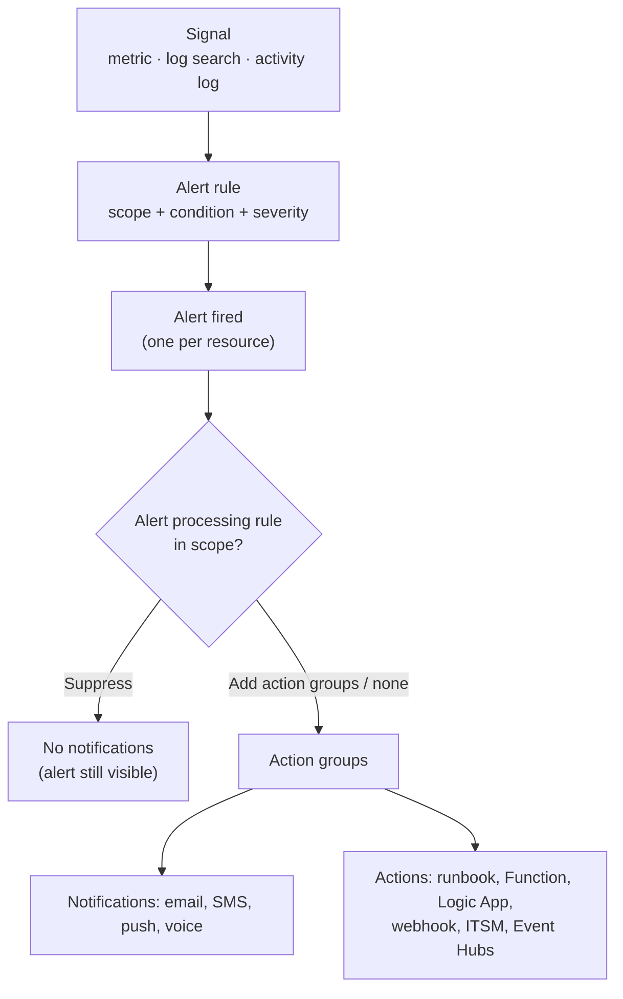

# Monitoring Resources in Azure

> **Objective:** Monitor resources in Azure
> **Domain:** Monitor and maintain Azure resources (10-15%)

## Sub-objectives covered

- Interpret metrics in Azure Monitor
- Configure log settings in Azure Monitor
- Query and analyze logs in Azure Monitor
- Set up alert rules, action groups, and alert processing rules in Azure Monitor
- Configure and interpret monitoring of virtual machines, storage accounts, and networks by using Azure Monitor Insights
- Use Azure Network Watcher and Connection monitor

## Why this exists

Azure Monitor is where an administrator finds out what's happening, ideally before users do. It keeps
two kinds of data:

- **Metrics:** numbers sampled over time (CPU percentage, transactions per minute). Light, fast, ideal for
  charts and near-real-time alerts.
- **Logs:** records with many fields (who changed what, which request failed). Stored in a **Log Analytics
  workspace** and queried with **KQL**.

On top of that data sit **alerts**, **Insights** (ready-made monitoring for VMs, storage and networks) and,
for networks specifically, **Network Watcher**. The exam asks what's collected **automatically**, what you
must **configure**, and which tool answers which question.

## How it works under the hood

### What's collected automatically, and what isn't

| Data | Collected | Where it lives | Retention |
| --- | --- | --- | --- |
| **Platform metrics** (CPU, transactions…) | **Automatically**, every minute | Azure Monitor Metrics | **93 days** |
| **Activity log** (subscription events: who did what, service health) | **Automatically** | Activity log | 90 days in the portal; send to a workspace for longer (no ingestion charge) |
| **Resource logs** (operations inside a resource) | **Only after you create a diagnostic setting** | Where the setting sends them | As configured at the destination |
| **Guest OS data** (VM performance counters, events, syslog) | **Only with the Azure Monitor Agent and a data collection rule** | Log Analytics workspace, Azure Monitor Metrics | Workspace retention |

- The **Azure Monitor Agent (AMA)** is the agent. It's configured by **data collection rules (DCRs)**, which say
  what to collect and where to send it. One VM can have several DCRs, and one DCR can serve many VMs.
- The **Log Analytics agent was retired in August 2024.**

### Interpreting metrics

**Metrics explorer** charts any metric of any resource:

- **Aggregation:** Average, Minimum, Maximum, Sum, Count. The right one depends on the metric: Sum suits
  transaction counts, Average suits CPU.
- **Time range and granularity:** platform metrics are kept 93 days, and one chart shows up to **30 days**.
- **Filtering and splitting:** for metrics with **dimensions**, filter on a value or **split** into one line per
  value, such as storage Transactions split by API name or response type.
- **Pin** charts to dashboards, or create an alert rule straight from a chart.

A VM's platform metrics (CPU, disk, network) come from the host. **Guest OS performance counters**, such as free
space on each logical disk, need the Azure Monitor Agent with a data collection rule. If they're missing from
metrics explorer, that's why.

### Configuring log settings

A **diagnostic setting** sends a resource's resource logs, and optionally its metrics, to one or more
**destinations**:

| Destination | Use |
| --- | --- |
| **Log Analytics workspace** | Query with KQL, alert on logs, use in workbooks |
| **Storage account** | Cheap archive and audit retention |
| **Event hub** | Stream to a SIEM or other external tool |
| Partner solution | Selected third-party services |

You choose the **log categories** to send. Each resource can have more than one diagnostic setting. The
**subscription's activity log** has its own diagnostic setting. Metrics exported through a diagnostic setting
are **flattened**: they lose their dimensions.

**Log Analytics workspace retention:**

- Tables keep data for **30 days by default**, some for 90, and **31 days are included** in the ingestion price.
- **Analytics retention** extends up to **2 years**, and **total retention** (including low-cost long-term
  retention) up to **12 years**. Data in long-term retention is read back with **search jobs**.
- **Table plans:** **Analytics** (full, fast queries), **Basic** (cheaper ingestion, 30 days of queries) and
  **Auxiliary** (lowest cost, for verbose or audit data).

### Querying logs with KQL

Log Analytics queries use the **Kusto Query Language**. A query starts with a **table** and pipes it through
operators:

```kusto
// Who deleted what in the last day? (activity log sent to the workspace)
AzureActivity
| where TimeGenerated > ago(1d)
| where OperationNameValue endswith "DELETE" and ActivityStatusValue == "Success"
| project TimeGenerated, Caller, ResourceGroup, _ResourceId
| order by TimeGenerated desc

// Which VMs stopped sending heartbeats in the last 15 minutes?
Heartbeat
| summarize LastSeen = max(TimeGenerated) by Computer
| where LastSeen < ago(15m)

// Average guest CPU per VM, in 5-minute bins, charted (VM insights data)
InsightsMetrics
| where Namespace == "Processor" and Name == "UtilizationPercentage"
| summarize AvgCpu = avg(Val) by bin(TimeGenerated, 5m), Computer
| render timechart
```

| Operator | Does |
| --- | --- |
| `where` | Filters rows |
| `project` | Chooses columns |
| `extend` | Adds calculated columns |
| `summarize … by` | Aggregates (`count()`, `avg()`, `max()`, `dcount()`) per group |
| `bin()` | Buckets time for trends |
| `order by` / `sort by`, `take` / `limit` | Sorts; returns a sample |
| `render` | Charts the result |
| `ago()` | Relative time: `ago(1h)`, `ago(7d)` |

Common tables: `AzureActivity` (activity log), `Heartbeat` (agent check-ins), `InsightsMetrics` (VM insights
performance), `Perf`, `Event` and `Syslog` (guest data from DCRs), and `AzureDiagnostics` or resource-specific
tables such as `StorageBlobLogs` for resource logs.

### Alerts



**Alert rules** combine **what** to watch (scope: one or more resources), the **signal**, the **condition** and a
**severity** from **Sev0** (critical) to **Sev4** (verbose).

| Rule type | Watches | Typical use |
| --- | --- | --- |
| **Metric** | A platform or custom metric | CPU above 80% for 10 minutes |
| **Log search** | The result of a **KQL query**, on a schedule | Error count in logs; anything needing logic |
| **Activity log** | Activity log events, including **Service Health** and **Resource Health** | A VM was deleted; an Azure service incident affects you |

- A rule over several resources evaluates and fires **per resource**.
- **Stateful** alerts ("automatically resolve") move to **Resolved** when the condition clears. **Stateless**
  alerts fire again each time the condition is met.
- Fired alerts are kept for **30 days**.

**Action groups** are reusable lists of who and what to call:

- **Notifications:** email, SMS, Azure app push, voice.
- **Actions:** Automation runbooks, Azure Functions, Logic Apps, webhooks and secure webhooks, ITSM, Event Hubs.

One action group serves many alert rules.

**Alert processing rules** (formerly "action rules") act on alerts **after they fire**, across a scope, from one
resource up to a whole subscription:

- **Suppression** removes all action groups from matching alerts, for example during a **maintenance window**.
  The alerts still appear in the portal, and suppression **beats** adding action groups.
- **Apply action groups** adds action groups to matching alerts, including alerts that **don't come from an alert
  rule**, such as Azure Backup alerts.
- **Filters** (resource type, severity, alert rule name and more) combine with AND. Up to five values per filter
  combine with OR.
- **Schedule:** always on, one-time, or recurring (for example nights and weekends).
- They don't affect **Service Health** alerts.

### Insights

Insights are curated monitoring experiences built on the data above:

| Insight | Setup | Shows |
| --- | --- | --- |
| **VM insights** | Enable per VM, or at scale with **Azure Policy** initiatives. It installs the **Azure Monitor Agent** with a DCR (prefix `MSVMI-`) that sends guest performance counters to the **`InsightsMetrics`** table | Guest performance charts and workbooks across VMs; optionally **processes and dependencies** (the Map) |
| **Storage insights** | Nothing to install: it's built on the storage accounts' metrics | **Capacity, performance and availability** across storage accounts in one view |
| **Network insights** | **No configuration** | **Topology**, network **health and metrics**, **connectivity** (Connection monitor), **traffic** (flow logs, traffic analytics), and the diagnostic toolkit |

> **Dated change.** The VM insights **Map** experience and its **Dependency agent** retire on **June 30, 2028**.
> Guest performance monitoring with the Azure Monitor Agent continues.

### Network Watcher and Connection monitor

**Network Watcher** is **enabled automatically**, at no charge, in each region where you create a virtual
network. Its regional instance lives in the **`NetworkWatcherRG`** resource group, one per region per subscription.

| Tool | Answers | Needs the Network Watcher **agent extension**? |
| --- | --- | --- |
| **Topology** | What's connected to what | No |
| **Connection monitor** | **Continuous**: is A still reaching B, with what latency and loss? | **Yes** (Azure VMs); on-premises needs **Azure Arc + Azure Monitor Agent** |
| **Connection troubleshoot** | **One-time**: can A reach B right now, and where does it fail? | **Yes** |
| **IP flow verify**, **NSG diagnostics**, **effective security rules** | Is this traffic allowed, and by which rule? (04-02) | No |
| **Next hop**, **effective routes** | Where does this packet go? (04-01) | No |
| **Packet capture** | What's on the wire? | **Yes** |
| **VPN troubleshoot** | Why is the gateway or connection unhealthy? | No |
| **Flow logs** (VNet flow logs) + **traffic analytics** | What traffic actually flowed? | No |

**Connection monitor** sets up continuous tests:

- **Sources:** Azure VMs or scale sets with the agent extension, or Arc-enabled on-premises machines.
- **Destinations:** VMs, IP addresses, FQDNs, URLs, Microsoft 365 endpoints.
- **Test configurations:** **TCP, ICMP or HTTP**, with port, frequency and thresholds.
- **Test groups** combine sources, destinations and test configurations.

It reports **% checks failed** and **round-trip time** per test, draws the path hop by hop, can flag the **blocking
rule**, and can raise alerts. Creating one in the portal installs the extensions for you. Limits: 100 connection
monitors per region per subscription; 20 test groups and 100 sources and destinations per monitor.
**Connection monitor (classic) is deprecated**: migrate to the current one.

## Configuration surface

```bash
# Send the subscription activity log to a workspace (no ingestion charge for activity log data)
az monitor diagnostic-settings subscription create --name activity-to-law --location "<region>" \
  --workspace "<workspace-resource-id>" --logs '[{"category":"Administrative","enabled":true}]'

# A resource's logs to a workspace
az monitor diagnostic-settings create --name to-law --resource "<resource-id>" \
  --workspace "<workspace-resource-id>" --logs '[{"categoryGroup":"allLogs","enabled":true}]'

# Action group, metric alert, and an alert processing rule that suppresses during maintenance
az monitor action-group create --resource-group "<rg>" --name ag-ops --short-name ops \
  --action email admin "<address>"
az monitor metrics alert create --resource-group "<rg>" --name cpu-high --scopes "<vm-id>" \
  --condition "avg Percentage CPU > 80" --window-size 5m --evaluation-frequency 1m \
  --severity 2 --action ag-ops
az monitor alert-processing-rule create --resource-group "<rg>" --name maintenance \
  --scopes "/subscriptions/<sub>/resourceGroups/<rg>" --rule-type RemoveAllActionGroups
```

| Setting | Documented default | Where | Exam angle |
| --- | --- | --- | --- |
| Platform metrics | Collected; **93 days** | Metrics explorer | 30 days per chart |
| Resource logs | **Not collected** | Diagnostic settings | Choose categories and destinations |
| Workspace retention | **30 days** (31 included in price) | Workspace > Usage and estimated costs | Up to 2 years analytics, 12 total |
| Alert auto-resolve | Option on the rule | Alert rule > Details | Stateful vs stateless |
| Alert processing rule schedule | **Always** | Alert processing rule | One-time or recurring windows |
| Network Watcher | **Enabled automatically** per region | Network Watcher | NetworkWatcherRG |

## Common failure modes

1. **"Free space per drive is missing for our VMs."** That's a guest OS counter. Install the Azure Monitor Agent with
   a DCR, for example by enabling VM insights.
2. **"There are no logs for our storage account in the workspace."** Resource logs need a diagnostic setting that
   sends them there.
3. **"The metric chart won't show 60 days."** One chart shows up to 30 days of the 93 kept. Use two charts, or route
   metrics to a workspace for longer trends.
4. **"We need logs kept for 3 years and queryable occasionally."** Set the table's total retention to 3 years; read
   old data back with search jobs.
5. **"We disabled every alert rule for maintenance and missed an outage elsewhere."** Use an **alert processing
   rule** scoped to the maintained resources, with a schedule, instead.
6. **"Backup alerts never notify anyone."** They don't come from an alert rule; route them with an alert processing
   rule that adds an action group.
7. **"The alert keeps emailing every few minutes."** It's stateless. Enable auto-resolve to make it stateful.
8. **"Connection monitor shows no data from the VM."** The Network Watcher agent extension isn't installed. Create
   the monitor in the portal, which installs it.
9. **"Our on-premises servers can't be Connection monitor sources."** They need Azure Arc and the Azure Monitor
   Agent; the legacy agent isn't supported.
10. **"VM insights Map is gone."** It retires June 30, 2028; plan for the Azure Monitor Agent's performance data
    without it.

## How this is tested

| Phrase in the question | What it steers you to |
| --- | --- |
| "how long are platform metrics kept" | **93 days** |
| "collect a resource's logs into Log Analytics" | **Diagnostic setting** |
| "send logs to a SIEM" | Diagnostic setting to an **event hub** |
| "cheapest long-term archive of logs" | Diagnostic setting to a **storage account**, or long-term workspace retention |
| "collect guest OS performance counters from VMs" | **Azure Monitor Agent + data collection rule** (or VM insights) |
| "find who deleted a resource" | **Activity log** / `AzureActivity` |
| "count failed requests per hour from logs" | **KQL**: `where` + `summarize count() by bin(TimeGenerated, 1h)` |
| "alert when CPU > 80% for 15 minutes" | **Metric** alert rule |
| "alert when a resource is deleted" | **Activity log** alert rule |
| "alert on a pattern found in logs" | **Log search** alert rule |
| "email, SMS and run a runbook when an alert fires" | **Action group** |
| "stop notifications during a maintenance window" | **Alert processing rule**, suppression, with a schedule |
| "route alerts that have no alert rule (Backup) to the ops team" | **Alert processing rule** adding an action group |
| "continuously monitor latency between a VM and an endpoint" | **Connection monitor** |
| "one-time test: why can't VM A reach VM B on 1433" | **Connection troubleshoot** (or IP flow verify) |

## Hands-on

See [05-01 lab](../../labs/05-monitor/05-01-lab.md). It runs one small VM for about 90 minutes with a Log Analytics
workspace, a metric alert, an alert processing rule and a connection monitor.

## Check yourself

1. A storage account's metrics are visible but its blob read operations don't appear in Log Analytics. What's missing,
   and which table will they land in?
2. You must keep sign-in-related diagnostic logs for 7 years at the lowest cost, queryable a few times a year. Which
   two options fit, and what's the trade-off between them?
3. Write the KQL to count `AzureActivity` delete operations per resource group over the last 7 days.
4. During Saturday's patching, alerts for 40 VMs in `rg-app` should still be recorded but notify no one. Alerts for
   other resource groups must keep notifying. What do you create, and with which settings?
5. Users report intermittent slowness between a VM and an on-premises server. Which tool gives you a continuous
   latency and loss history, and what does the on-premises side need?

## Key takeaways

- **Automatic:** platform metrics (93 days) and the activity log. **Configure:** resource logs (diagnostic settings)
  and guest data (**Azure Monitor Agent + DCR**).
- **Diagnostic settings** send to a **workspace**, **storage** or an **event hub**. Workspace retention is 30 days by
  default, up to 2 years analytics and 12 years total.
- **KQL:** a table, then `where`, `project`, `summarize … by bin()`, `render`.
- **Alerts:** rule (metric, log search, activity log), then **action group** (notify and act). **Alert processing
  rules** suppress or add action groups after firing, on a schedule.
- **Insights:** VM insights (AMA, `InsightsMetrics`; Map retiring 2028), storage insights (capacity, performance,
  availability), network insights (no setup).
- **Network Watcher** is automatic per region. **Connection monitor** is continuous and needs the agent extension;
  connection troubleshoot is one-time.

## Sources

- Microsoft Learn: [Study guide for Exam AZ-104](https://learn.microsoft.com/en-us/credentials/certifications/resources/study-guides/az-104)
- Microsoft Learn: [Azure Monitor Metrics overview](https://learn.microsoft.com/en-us/azure/azure-monitor/metrics/data-platform-metrics)
- Microsoft Learn: [Analyze metrics with metrics explorer](https://learn.microsoft.com/en-us/azure/azure-monitor/metrics/analyze-metrics)
- Microsoft Learn: [Azure Monitor data sources and data collection methods](https://learn.microsoft.com/en-us/azure/azure-monitor/fundamentals/data-sources)
- Microsoft Learn: [Azure Monitor activity log](https://learn.microsoft.com/en-us/azure/azure-monitor/fundamentals/activity-log)
- Microsoft Learn: [Diagnostic settings in Azure Monitor](https://learn.microsoft.com/en-us/azure/azure-monitor/data-collection/diagnostic-settings)
- Microsoft Learn: [Manage data retention in a Log Analytics workspace](https://learn.microsoft.com/en-us/azure/azure-monitor/logs/data-retention-configure)
- Microsoft Learn: [Azure Monitor Logs table plans](https://learn.microsoft.com/en-us/azure/azure-monitor/logs/data-platform-logs#table-plans)
- Microsoft Learn: [Kusto Query Language tutorial](https://learn.microsoft.com/en-us/kusto/query/tutorials/learn-common-operators)
- Microsoft Learn: [What are Azure Monitor alerts?](https://learn.microsoft.com/en-us/azure/azure-monitor/alerts/alerts-overview)
- Microsoft Learn: [Choose the right type of alert rule](https://learn.microsoft.com/en-us/azure/azure-monitor/alerts/alerts-types)
- Microsoft Learn: [Create or edit a metric alert rule](https://learn.microsoft.com/en-us/azure/azure-monitor/alerts/alerts-create-metric-alert-rule)
- Microsoft Learn: [Action groups](https://learn.microsoft.com/en-us/azure/azure-monitor/alerts/action-groups)
- Microsoft Learn: [Alert processing rules](https://learn.microsoft.com/en-us/azure/azure-monitor/alerts/alerts-processing-rules)
- Microsoft Learn: [Monitor virtual machines: collect data](https://learn.microsoft.com/en-us/azure/azure-monitor/vm/monitor-virtual-machine-data-collection)
- Microsoft Learn: [Enable VM insights using Azure Policy](https://learn.microsoft.com/en-us/azure/azure-monitor/vm/vminsights-enable-policy)
- Microsoft Learn: [Azure Monitor Insights overview](https://learn.microsoft.com/en-us/azure/azure-monitor/visualize/insights-overview)
- Microsoft Learn: [Network insights](https://learn.microsoft.com/en-us/azure/network-watcher/network-insights-overview)
- Microsoft Learn: [What is Azure Network Watcher?](https://learn.microsoft.com/en-us/azure/network-watcher/network-watcher-overview)
- Microsoft Learn: [Network Watcher FAQ](https://learn.microsoft.com/en-us/azure/network-watcher/frequently-asked-questions)
- Microsoft Learn: [Connection monitor overview](https://learn.microsoft.com/en-us/azure/network-watcher/connection-monitor-overview)
