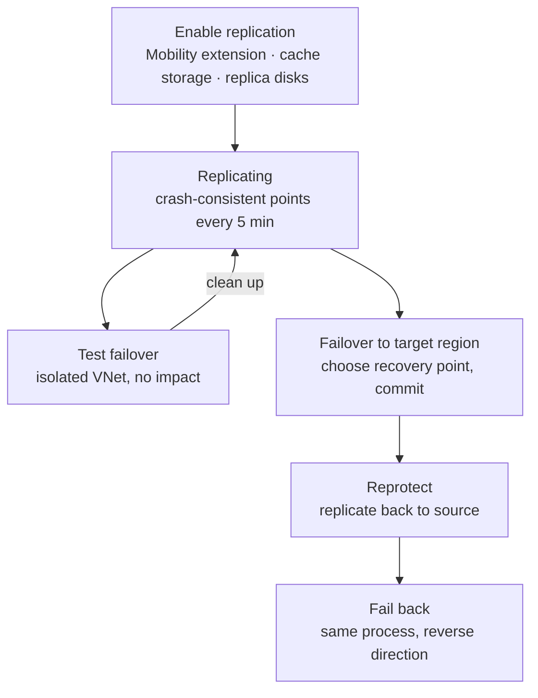

# Backup and Recovery

> **Objective:** Implement backup and recovery
> **Domain:** Monitor and maintain Azure resources (10-15%)

## Sub-objectives covered

- Create a Recovery Services vault
- Create an Azure Backup vault
- Create and configure a backup policy
- Perform backup and restore operations by using Azure Backup
- Configure Azure Site Recovery for Azure resources
- Perform a failover to a secondary region by using Site Recovery
- Configure and interpret reports and alerts for backups

## Why this exists

Two different questions, two different services:

- **"I lost data, or need it as it was last Tuesday."** That's **Azure Backup**: point-in-time copies kept in a
  **vault**, restored when needed. Its recovery point objective is measured in **hours**.
- **"The whole region is down; keep the workload running."** That's **Azure Site Recovery**: **continuous
  replication** of VMs to another region, then **failover**. Its recovery points are minutes apart.

Most scenario questions are decided by which of the two the requirement describes, then by which **vault**,
**policy** or **failover** step fits.

## How it works under the hood

### Two vault types

| | **Recovery Services vault** | **Backup vault** |
| --- | --- | --- |
| Protects | **Azure VMs**, SQL Server and SAP HANA in Azure VMs, **Azure Files**, on-premises machines (MARS agent, Azure Backup Server, DPM) | **Azure Disks**, **Azure Blobs**, Azure Database for PostgreSQL, AKS (listed as preview in the Backup FAQ) |
| Also used by | **Azure Site Recovery** | — |
| Storage redundancy | LRS, **GRS (default)** or ZRS; set **before** protecting any item | LRS, GRS or ZRS; set at **creation** |

Common to both:

- Up to **500 vaults** per subscription.
- **Soft delete** is **on by default**. Deleted backup data stays recoverable for **14 more days at no cost**.
  **Enhanced soft delete** lets you set the retention and make soft delete **always on**, after which it can't be
  turned off.
- **Cross Region Restore (CRR)**, for GRS Recovery Services vaults:
  - It lets you restore in the **paired region** whenever you choose, without waiting for Microsoft to declare an
    outage.
  - It costs extra, can take up to **48 hours** to make items available, and **can't be reverted** once protection
    starts.
- The backed-up data is stored in Microsoft-managed storage, **isolated** from your subscription.

**The redundancy trap:** once a Recovery Services vault protects its first item, its storage redundancy is
**locked**. Changing LRS to GRS later means a new vault and new backups.

### Backup policies for VMs

A policy defines **when** backups run and **how long** recovery points are kept. A VM is protected by a vault in
**its own region**, and one policy can cover up to **100 VMs**.

| | **Standard** | **Enhanced** |
| --- | --- | --- |
| Frequency | Once a day (or weekly) | **Every 4, 6, 8, 12 or 24 hours** (or daily, weekly) |
| Instant restore snapshots | **1–5 days** (default 2) | **1–30 days** (default 7), zone-redundant |
| Required for | — | **Premium SSD v2, Ultra Disks**, and Trusted Launch VMs in the portal |
| Switch later | Can migrate to Enhanced | **Can't go back** to Standard |

Retention is set per tier: **daily, weekly, monthly, yearly**. For example, the Enhanced defaults are 180 days,
12 weeks, 60 months and 10 years.

Each backup has two phases:

1. A **snapshot**, kept in your subscription for fast **instant restore**. The snapshots live in a resource group
   that Azure Backup creates if you don't name one.
2. A **transfer to the vault**, for long retention.

**On-demand backups** have their own retention, which you set when you trigger them.

### Backup and restore operations

Protecting a VM: in the vault (or on the VM's **Backup** page), choose the VM and a policy. The first backup runs
on schedule, or **Backup now** runs one immediately.

**Restore options for an Azure VM:**

| Option | What happens |
| --- | --- |
| **Create a new VM** | A basic VM from the recovery point, in the **same region**, with a name, resource group and VNet you choose |
| **Restore disks** | Managed disks, plus a **template** to build a customized VM or attach the disks elsewhere |
| **Replace existing** | The VM's disks are replaced. The VM must still exist; Azure snapshots it first and keeps the original disks |
| **Cross Region Restore** | Create a VM or restore disks in the **paired region**, from **vault-tier** points (snapshots aren't replicated) |
| **File recovery** | Mount a recovery point as drives with a downloaded script, and copy individual files back |

**Stopping protection** has two flavours:

- **Retain backup data:** no new backups, and the existing recovery points are kept and billed.
- **Delete backup data:** with soft delete on, the data is **soft-deleted for 14 days** first.

A vault **can't be deleted** while it holds backup data, including soft-deleted data.

### Azure Site Recovery (Azure to Azure)



**Enabling replication** for a VM (VM > **Disaster recovery**, or from the vault):

- Choose the **target region**, plus the target resource group, VNet and availability options. Site Recovery can
  create these for you.
- Site Recovery installs the **Mobility service extension** on the VM.
- **Disk writes** go to a **cache storage account in the source region**, then to **replica managed disks** in the
  target region.
- The VM's **temporary disk** isn't replicated.

The **replication policy**:

| Setting | Default | Notes |
| --- | --- | --- |
| Crash-consistent recovery points | **Every 5 minutes** | Fixed; can't be changed |
| **Recovery point retention** | **1 day** | Longer retention means more storage |
| **App-consistent snapshot frequency** | **Off** | Uses VSS on Windows; set it below the retention period |

**Multi-VM consistency** puts VMs in a replication group that shares recovery points, for multi-tier apps. It
affects performance, so use it only when needed. **Recovery plans** group VMs to fail over together, in order,
with optional scripts.

**Failing over:**

| Operation | Use | Effect |
| --- | --- | --- |
| **Test failover** | Drills and validation | Creates VMs in the target in a network **you** choose, ideally isolated. **Doesn't affect replication or production.** Then **clean up** |
| **Failover** | A real outage, or a planned move | Brings up VMs in the target from a recovery point (latest, latest processed, latest app-consistent, or custom). Then **commit** |
| **Reprotect** | After failover | VMs in the target start **unprotected**; reprotect replicates them back to the source region |
| **Failback** | Return home | Fail over in the reverse direction once reprotected. It takes about as long as the original failover |

### Reports and alerts for backups

**Alerts:** Azure Backup raises **built-in Azure Monitor alerts**, with **no alert rule to create**:

| Built-in alert | Severity | Examples | Can be turned off? |
| --- | --- | --- | --- |
| **Security** | **Sev 0** | Backup data deleted; **soft delete disabled** | **No** |
| **Job failure** | Sev 1 | Backup or restore failed | Yes (on by default) |

- To be **notified**, create an **alert processing rule** with an **action group** (05-01). That's the routing
  path, because these alerts don't come from an alert rule you own.
- For custom logic, write **log search alerts** on vault diagnostic data, **metric alerts** on backup health
  metrics, or Resource Graph queries.
- **Classic backup alerts were deprecated on March 31, 2026.** Use the Azure Monitor alerts.

**Reports:**

- **Backup reports** show jobs, backup items, policy adherence, usage and storage over time.
- They need each vault's **diagnostic settings** sending its backup events (Core Azure Backup, Addon Azure Backup
  Jobs, Policy, Storage, Protected Instance) to a **Log Analytics workspace**, in **resource-specific** mode.
- You view them, with built-in alerts and protection status, in the portal's **Resiliency** hub under
  **Monitoring + Reporting**.
- The same data is queryable with KQL, for example in the `AddonAzureBackupJobs` table.

## Configuration surface

```bash
# A Recovery Services vault, redundancy set BEFORE protecting anything
az backup vault create --resource-group "<rg>" --name "<vault>" --location "<region>"
az backup vault backup-properties set --resource-group "<rg>" --name "<vault>" --backup-storage-redundancy LocallyRedundant

# Protect a VM with a policy, then look at the jobs
az backup protection enable-for-vm --resource-group "<rg>" --vault-name "<vault>" --vm "<vm-name-or-id>" --policy-name DefaultPolicy
az backup job list --resource-group "<rg>" --vault-name "<vault>" -o table

# Built-in alerts: keep job-failure alerts on, classic alerts off
az backup vault backup-properties set --resource-group "<rg>" --name "<vault>" --classic-alerts Disable --alerts-for-job-failures Enable
```

```kusto
// Backup jobs that failed in the last 7 days (vault diagnostics, resource-specific mode)
AddonAzureBackupJobs
| where TimeGenerated > ago(7d) and JobStatus == "Failed"
| project TimeGenerated, BackupItemUniqueId, JobOperation, JobFailureCode
```

| Setting | Documented default | Where | Exam angle |
| --- | --- | --- | --- |
| Vault storage redundancy | **GRS** | Vault > Properties | Locked after the first protected item |
| Soft delete | **On**, 14 days | Vault > Properties > Security | Blocks vault deletion while items are soft-deleted |
| Standard policy | Daily; 30-day daily retention; 2-day snapshots | Backup policies | One backup a day |
| Enhanced policy snapshots | 7 days (1–30) | Backup policies | Every 4–24 hours |
| ASR recovery point retention | **1 day** | Replication policy | App-consistent snapshots off by default |
| Built-in job-failure alerts | **On** | Vault > Properties > Monitoring settings | Route with an alert processing rule |

## Common failure modes

1. **"We need GRS now, but the vault is LRS."** Redundancy locked when the first item was protected. Create a new GRS
   vault and protect the items there.
2. **"The vault can't be deleted."** It still holds backup data, including **soft-deleted** items for up to 14 days.
   Disable soft delete **before** deleting backup data in labs and tests.
3. **"We need backups every 4 hours."** The Standard policy can't do it; use **Enhanced**.
4. **"Premium SSD v2 disks won't back up."** They need the **Enhanced** policy.
5. **"Replace existing failed: the VM was deleted."** Replace needs the VM to exist. Use **Create new** or **Restore
   disks**.
6. **"Cross Region Restore shows nothing yet."** Items can take up to 48 hours to appear in the secondary region after
   enabling it.
7. **"Nobody got emailed about the failed backup."** Built-in alerts need an **alert processing rule with an action
   group** to notify anyone.
8. **"Backup reports are empty."** Vault diagnostic settings aren't sending to a workspace, or they use Azure
   diagnostics mode instead of resource-specific mode.
9. **"After failover, the VMs aren't protected."** They never are until you **reprotect**.
10. **"The test failover VM can reach production."** The test failover network wasn't isolated. Use a separate VNet
    for drills.

## How this is tested

| Phrase in the question | What it steers you to |
| --- | --- |
| "back up Azure VMs" or "Azure file shares" | **Recovery Services vault** |
| "back up managed disks" or "blobs" | **Backup vault** |
| "restore in the paired region without waiting for a declared outage" | **GRS + Cross Region Restore** |
| "multiple backups per day" or "Premium SSD v2" | **Enhanced** policy |
| "recover deleted backups for two weeks" | **Soft delete** (on by default) |
| "recover one file from a VM backup" | **File recovery** |
| "restore and customize the VM before creating it" | **Restore disks** (with the template) |
| "keep the workload running if the region fails" | **Azure Site Recovery** |
| "validate DR without affecting production" | **Test failover** into an isolated VNet |
| "after failover, protect the VMs again" | **Reprotect** |
| "VMs of a multi-tier app must fail over together, in order" | **Recovery plan** |
| "email the team when a backup fails" | Alert processing rule + action group (built-in alerts) |
| "report on backup usage and job success over months" | **Backup reports** (vault diagnostic settings to Log Analytics) |

## Hands-on

See [05-02 lab](../../labs/05-monitor/05-02-lab.md). It protects a VM with Azure Backup, restores disks, configures
backup alerts and reports, replicates the VM with Site Recovery and runs a **test failover**. A real failover is
optional. It's the highest-cost lab in the Academy, and its teardown order matters.

## Check yourself

1. A company protects 200 Azure VMs and 50 managed disks, and wants Azure Files backups. Which vaults do they need, and
   how many policies at minimum for the VMs?
2. Your vault is LRS and already protects VMs. Audit now requires restores in the paired region. What must you do, and
   what will it cost you in setup time?
3. A Premium SSD v2 VM needs backups every 6 hours with 14 days of fast restores. Which policy, and which settings?
4. Distinguish **Restore disks**, **Create new VM** and **Replace existing**: when does each fit, and which one fails if
   the original VM is gone?
5. Order these Site Recovery steps for a real regional outage, and say which happens only in drills: reprotect,
   commit, failover, test failover, clean up, fail back.

## Key takeaways

- **Recovery Services vault:** VMs, SQL/SAP in VMs, Azure Files, on-premises, and Site Recovery. **Backup vault:**
  Disks, Blobs, PostgreSQL. Set **redundancy first**: it **locks** at the first protected item (default **GRS**).
- **Soft delete** is on by default (14 days, free). It protects you, and it **blocks vault deletion** until purged.
- **Standard** policy: daily, 1–5 day snapshots. **Enhanced**: every 4–24 hours, up to 30-day snapshots, required for
  newer disk types; there's no way back to Standard.
- **Restore:** new VM, disks (+ template), replace existing (VM must exist), cross region (vault tier), file recovery.
- **Site Recovery:** Mobility extension, source cache storage, replica disks; crash-consistent points every 5 minutes,
  1-day retention by default. **Test failover** is isolated and harmless. **Failover** is followed by **commit**,
  **reprotect** and **fail back**.
- **Alerts:** built-in Azure Monitor alerts (security Sev 0, job failures Sev 1), notified through **alert processing
  rules**. **Reports:** vault diagnostic settings to Log Analytics.

## Sources

- Microsoft Learn: [Study guide for Exam AZ-104](https://learn.microsoft.com/en-us/credentials/certifications/resources/study-guides/az-104)
- Microsoft Learn: [Recovery Services vaults overview](https://learn.microsoft.com/en-us/azure/backup/backup-azure-recovery-services-vault-overview)
- Microsoft Learn: [Create and configure a Recovery Services vault](https://learn.microsoft.com/en-us/azure/backup/backup-create-recovery-services-vault)
- Microsoft Learn: [Backup vaults overview](https://learn.microsoft.com/en-us/azure/backup/backup-vault-overview)
- Microsoft Learn: [Azure Backup FAQ: supported vaults](https://learn.microsoft.com/en-us/azure/backup/backup-azure-backup-faq)
- Microsoft Learn: [Support matrix for Azure Backup](https://learn.microsoft.com/en-us/azure/backup/backup-support-matrix)
- Microsoft Learn: [Reliability in Azure Backup](https://learn.microsoft.com/en-us/azure/reliability/reliability-backup)
- Microsoft Learn: [Back up an Azure VM by using the Enhanced policy](https://learn.microsoft.com/en-us/azure/backup/backup-azure-vms-enhanced-policy)
- Microsoft Learn: [Instant restore capability](https://learn.microsoft.com/en-us/azure/backup/backup-instant-restore-capability)
- Microsoft Learn: [Quickstart: Back up a virtual machine in Azure](https://learn.microsoft.com/en-us/azure/backup/quick-backup-vm-portal)
- Microsoft Learn: [How to restore Azure VM data in Azure portal](https://learn.microsoft.com/en-us/azure/backup/backup-azure-arm-restore-vms)
- Microsoft Learn: [Recover files from Azure virtual machine backup](https://learn.microsoft.com/en-us/azure/backup/backup-azure-restore-files-from-vm)
- Microsoft Learn: [Soft delete for Azure Backup](https://learn.microsoft.com/en-us/azure/backup/backup-azure-security-feature-cloud)
- Microsoft Learn: [Delete a Recovery Services vault](https://learn.microsoft.com/en-us/azure/backup/backup-azure-delete-vault)
- Microsoft Learn: [Azure to Azure disaster recovery architecture](https://learn.microsoft.com/en-us/azure/site-recovery/azure-to-azure-architecture)
- Microsoft Learn: [Run a test failover (disaster recovery drill)](https://learn.microsoft.com/en-us/azure/site-recovery/site-recovery-test-failover-to-azure)
- Microsoft Learn: [Fail over and fail back Azure VMs between regions](https://learn.microsoft.com/en-us/azure/site-recovery/azure-to-azure-tutorial-failover-failback)
- Microsoft Learn: [Common questions about Azure-to-Azure disaster recovery](https://learn.microsoft.com/en-us/azure/site-recovery/azure-to-azure-common-questions)
- Microsoft Learn: [Monitoring and reporting solutions for Azure Backup](https://learn.microsoft.com/en-us/azure/backup/monitoring-and-alerts-overview)
- Microsoft Learn: [Manage Azure Monitor based alerts for Azure Backup](https://learn.microsoft.com/en-us/azure/backup/backup-azure-monitoring-alerts)
- Microsoft Learn: [Diagnostic events for Azure Backup](https://learn.microsoft.com/en-us/azure/backup/backup-azure-diagnostic-events)
