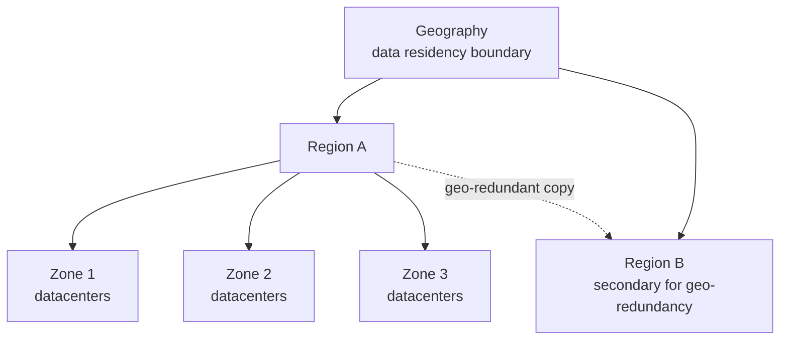

# Azure Regions and Availability

> **Foundation primer.** Not an exam objective by itself: it explains what the AZ-104 lessons assume.

## The problem

A datacenter can lose power, flood or burn. A law can require that customer data stays inside one country. Users on
another continent complain that the app is slow. Each of those is a question about **where** your resources run,
and Azure answers it with regions and availability zones.

## In plain English

Azure is built from datacenters grouped into **regions**: a region is a geographic area with a set of datacenters,
such as West Europe or Canada Central. Every resource you create lives in a region you choose, and regions sit
inside **geographies**, which act as data residency boundaries.

Many regions are split into **availability zones**: separate groups of datacenters, each with its own power,
cooling and networking, close enough for a fast connection but far enough apart that a local outage shouldn't hit
two zones at once. A region that supports zones has at least three.

Some regions are paired with another region in the same geography, and a few services use those pairs for
geo-redundancy. Many newer regions aren't paired and rely on zones instead.

## Words you need to know

| Term | In plain English |
| --- | --- |
| **Region** | A geographic area containing a set of Azure datacenters. You pick one for almost every resource. |
| **Geography** | A data residency boundary, such as Europe or Canada, containing one or more regions. |
| **Availability zone** | A separate group of datacenters inside a region, with independent power, cooling and networking. |
| **Zonal** | Pinned to one zone you choose, such as a VM in zone 2. |
| **Zone-redundant** | Spread across zones by Azure, such as ZRS storage. |
| **Region pair** | Two regions Microsoft associates for some geo-replication; you can't choose your own pairs. |
| **Nonpaired region** | A region with no pair, usually relying on availability zones. |

## Mental model

This is a teaching model; the number of zones and whether a region is paired vary by region.

| Everyday idea | Azure name |
| --- | --- |
| A city where you rent space | A region |
| Separate buildings in that city | Availability zones |
| Keeping copies in three buildings | Zone-redundant (ZRS storage, zone-redundant load balancer frontends) |
| Choosing one building | Zonal (a VM in zone 1) |
| Keeping a copy in another city | Geo-redundant (GRS storage, Site Recovery) |

## Where this shows up in AZ-104

- **Storage redundancy:** LRS, ZRS, GRS and GZRS are choices about zones and regions ([02-02 Storage Accounts](../02-storage/02-02-storage-accounts.md)).
- **VM availability:** zones versus availability sets ([03-02 Virtual Machines](../03-compute/03-02-virtual-machines.md)).
- **Networking:** a virtual network lives in one region; Standard public IPs can be zone-redundant ([04-01 Virtual Networks](../04-networking/04-01-virtual-networks.md)).
- **Disaster recovery:** Site Recovery replicates VMs to another region ([05-02 Backup and Recovery](../05-monitor/05-02-backup-and-recovery.md)).
- **Lab setup:** pick a home region that offers zones and the VM sizes the labs use ([00-00 Module Overview: Lab Topology and Conventions](../00-lab-safety/00-00-module-overview.md)).

## Check yourself

1. A rule says data must not leave Canada. Which concept answers it: region, geography or zone?
2. What's the difference between a zonal VM and a zone-redundant storage account?
3. Your chosen region isn't paired. Does that rule out cross-region protection?

## Teach it back

- Explain to a manager why "we run in Azure" doesn't mean "we survive a datacenter fire".
- Draw a region with three zones and place two VMs so one zone failure leaves one running.

## Key takeaways

- Every resource lives in a region you choose; regions sit in geographies that act as residency boundaries.
- Availability zones are separate datacenters inside a region; regions with zones have at least three.
- Zonal means pinned to a zone; zone-redundant means spread by Azure.
- Many newer regions aren't paired; not every service supports zones in every region.

## Sources

- Microsoft Learn: [What are Azure regions?](https://learn.microsoft.com/en-us/azure/reliability/regions-overview)
- Microsoft Learn: [What are availability zones?](https://learn.microsoft.com/en-us/azure/reliability/availability-zones-overview)
- Microsoft Learn: [Azure region pairs and nonpaired regions](https://learn.microsoft.com/en-us/azure/reliability/regions-paired)
- Microsoft Learn: [Azure regions list](https://learn.microsoft.com/en-us/azure/reliability/regions-list)
