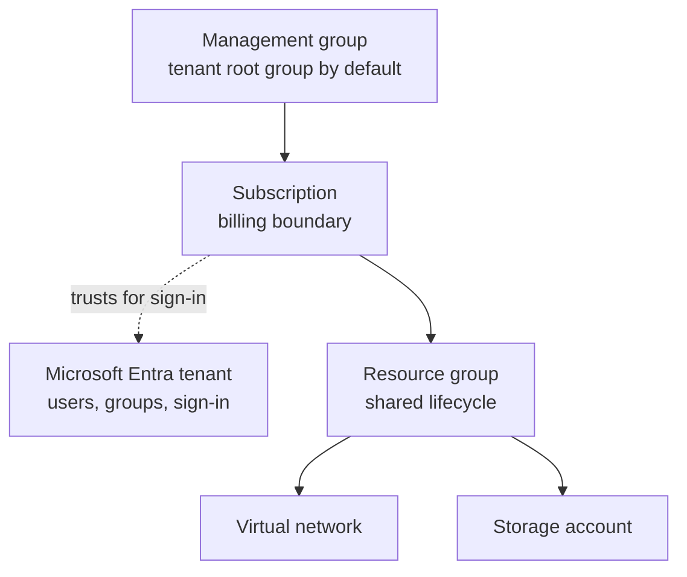

# Tenants, Subscriptions and Resource Groups

> **Foundation primer.** Not an exam objective by itself: it explains what the AZ-104 lessons assume.

## The problem

Before anything else can happen in Azure, three questions need answers. **Who** is the organization, and how do
people sign in? **Who pays** for what gets created? And how do you keep the resources of one project together, so
you can manage, secure and eventually delete them as a unit?

## In plain English

The **tenant** is your organization's identity directory, Microsoft Entra ID: every user, group and app identity
lives there, and it's what people sign in against.

A **subscription** is a billing and management container. Every resource is created in a subscription, and its
charges roll up to that subscription's bill. A subscription trusts exactly one tenant to sign people in; one tenant
can have many subscriptions.

A **resource group** is a container inside a subscription for resources that share a lifecycle: you deploy,
manage and delete them together. Each resource belongs to exactly one resource group.

When an organization has many subscriptions, **management groups** sit above them so policies and access can be
assigned once and flow down. A management group tree can be up to six levels deep, not counting the root and the
subscriptions.

## Words you need to know

| Term | In plain English |
| --- | --- |
| **Tenant** | Your organization's Microsoft Entra directory: users, groups, app identities and sign-in. |
| **Subscription** | A billing and management container for resources. It trusts exactly one tenant. |
| **Resource group** | A container for resources that share a lifecycle. Deleting it deletes everything in it. |
| **Management group** | A folder of subscriptions (and other management groups) for applying governance once. |
| **Scope** | The level a setting applies at: management group, subscription, resource group or resource. |
| **Inheritance** | Settings at a higher scope, such as role assignments and policies, apply to everything below. |

## Mental model

Arrows show containment: a role assignment or policy at one level is inherited by everything below it. Tags are the
exception: they aren't inherited. The dotted line is trust, not containment. This is a teaching model; [0A-13 How Azure Resources Fit Together](0A-13-how-resources-fit-together.md)
adds the network and compute pieces.

| Everyday idea | Azure name |
| --- | --- |
| The company's staff directory | Microsoft Entra tenant |
| A cost center with its own bill | Subscription |
| A project folder you can archive in one go | Resource group |
| A division-wide rule binder | Management group |

## Where this shows up in AZ-104

- **Assigning roles at different scopes** is choosing a level in this tree ([01-02 Azure Role-Based Access Control](../01-identities-governance/01-02-azure-rbac.md)).
- **Policy, locks, tags, resource groups, subscriptions and management groups** are a whole functional group ([01-03 Subscriptions and Governance](../01-identities-governance/01-03-subscriptions-and-governance.md)).
- **Every lab** creates its own resource group so teardown is one delete ([00-00 Your Lab Subscription and Conventions](../00-lab-safety/00-00-module-overview.md)).

## Check yourself

1. Can one resource be in two resource groups? Can a resource be in a different region from its resource group?
2. Reader is assigned at a management group. A new resource group is created in a subscription below it. Can the reader see it?
3. A resource group has the tag CostCenter=42. Does a VM created in it get that tag?

## Teach it back

- Explain tenant, subscription and resource group using a company, its budgets and its project folders.
- Explain why deleting a resource group is both the best cleanup tool and a dangerous one.

## Key takeaways

- The tenant is identity; the subscription is billing and management; the resource group is lifecycle.
- A subscription trusts one tenant; a tenant can have many subscriptions.
- Each resource lives in exactly one resource group; deleting the group deletes its resources.
- Access and policy inherit down the scopes; tags don't.

## Sources

- Microsoft Learn: [What is Azure Resource Manager?](https://learn.microsoft.com/en-us/azure/azure-resource-manager/management/overview)
- Microsoft Learn: [Azure resource management fundamentals](https://learn.microsoft.com/en-us/entra/architecture/secure-resource-management)
- Microsoft Learn: [What are Azure management groups?](https://learn.microsoft.com/en-us/azure/governance/management-groups/overview)
