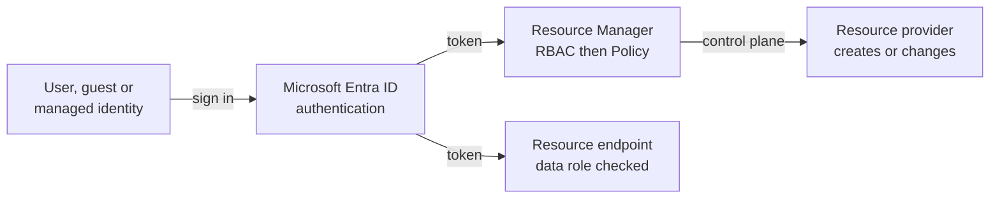

# Identity, Authentication and Authorization

> **Foundation primer.** Not an exam objective by itself: it explains what the AZ-104 lessons assume.

## The problem

Every request to Azure has to answer two questions before anything happens. **Who is asking?** And **are they
allowed to do this, here?** Get the first wrong and anyone can walk in; get the second wrong and the right person
can do the wrong thing, or the wrong person can read your data.

## In plain English

An **identity** is an account that represents someone or something: a person, a guest from another company, or an
application. **Authentication** proves the identity is who it claims to be, for example a password plus a
multifactor prompt. **Authorization** then decides what that identity may do.

People are users and guests. Applications and Azure services use **workload identities**: a service principal, or
a **managed identity** that Azure creates and rotates for a resource so no password is stored anywhere.

Azure has two separate authorization systems. **Microsoft Entra roles** control the directory: users, groups,
licences. **Azure roles** (Azure RBAC) control resources: subscriptions and everything in them. Neither grants
anything in the other.

There's a second split. Managing a resource (create, configure, delete) is the **control plane**. Using what's
inside it (reading a blob, signing in to a VM) is the **data plane**. An Owner of a storage account can manage it
but, by default, can't read its blobs through Microsoft Entra authorization without a data role.

## Words you need to know

| Term | In plain English |
| --- | --- |
| **Identity** | An account that represents a person, guest or application. |
| **Security principal** | Any identity you can grant access to: user, group, service principal or managed identity. |
| **Authentication** | Proving who you are. |
| **Authorization** | Deciding what you may do. |
| **Guest user** | Someone from another organization, invited into your tenant (B2B collaboration). |
| **Service principal** | An application's identity in your tenant. |
| **Managed identity** | An identity Azure creates for a resource, with credentials Azure manages; system-assigned or user-assigned. |
| **Control plane / data plane** | Managing a resource versus using the data or service inside it. |

## Mental model

Think of an office building. Reception checks your badge (authentication). The badge opens only the floors and rooms
you're allowed into (authorization at a scope). The safe inside a room has its own lock (the data plane).

| Everyday idea | Azure name |
| --- | --- |
| Checking a badge at reception | Authentication by Microsoft Entra ID |
| Which doors a badge opens | Azure role assignment at a scope |
| Who can hire staff and print badges | Microsoft Entra roles, such as User Administrator |
| A badge issued to a machine, renewed automatically | Managed identity |
| The safe's own lock | Data plane authorization (data roles, keys, SAS) |

This is a teaching model; [01-02 Azure Role-Based Access Control](../01-identities-governance/01-02-azure-rbac.md) adds role definitions, scopes and inheritance precisely.

## Where this shows up in AZ-104

- Users, groups, guests and self-service password reset ([01-01 Microsoft Entra Users and Groups](../01-identities-governance/01-01-entra-users-and-groups.md)).
- Azure roles, scopes and interpreting assignments ([01-02 Azure Role-Based Access Control](../01-identities-governance/01-02-azure-rbac.md)).
- Storage authorization: data roles, keys and SAS ([02-01 Configuring Access to Storage](../02-storage/02-01-storage-access.md)).
- Managed identities pulling container images ([03-03 Containers: Registry, Container Instances and Container Apps](../03-compute/03-03-containers.md)).

## Check yourself

1. A Global Administrator can't see any subscription. Which authorization system are they missing?
2. An app's managed identity must read blobs in one account. Control plane role or data plane role?
3. What's the difference between authentication and authorization, in one sentence each?

## Teach it back

- Explain the badge, doors and safe analogy, then map each part to its Azure name.
- Explain why giving someone Owner on a storage account doesn't automatically let them read its blobs.

## Key takeaways

- Authentication proves who; authorization decides what, where.
- Microsoft Entra roles govern the directory; Azure roles govern resources; neither implies the other.
- Managing a resource (control plane) and using its data (data plane) are authorized separately.
- Managed identities give Azure resources an identity without stored passwords.

## Sources

- Microsoft Learn: [Understand Azure role definitions](https://learn.microsoft.com/en-us/azure/role-based-access-control/role-definitions)
- Microsoft Learn: [What are managed identities for Azure resources?](https://learn.microsoft.com/en-us/entra/identity/managed-identities-azure-resources/overview)
- Microsoft Learn: [Azure control plane and data plane](https://learn.microsoft.com/en-us/azure/azure-resource-manager/management/control-plane-and-data-plane)
- Microsoft Learn: [Azure resource management fundamentals](https://learn.microsoft.com/en-us/entra/architecture/secure-resource-management)
