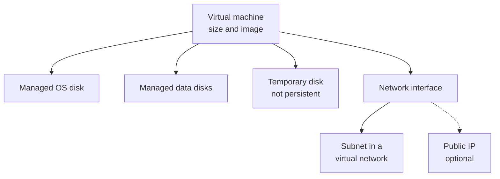

# Virtual Machines and Virtualization

> **Foundation primer.** Not an exam objective by itself: it explains what the AZ-104 lessons assume.

## The problem

An application needs a Windows or Linux server: a certain amount of CPU and memory, a disk that keeps its data, and
a network address. On-premises that means buying a machine. In Azure it means describing the server you want and
having it in minutes, and then remembering that it keeps costing money while it's allocated.

## In plain English

**Virtualization** lets one physical computer, the host, run many isolated **virtual machines**. Each VM believes it
has its own processors, memory, disks and network adapter; a layer of software called the hypervisor shares the real
hardware between them.

An Azure VM is infrastructure as a service. You choose the **size** (how many virtual CPUs and how much memory), the
**image** (which operating system), the **disks** and the **network**. Microsoft runs the hosts; you run the operating
system, including its updates.

A VM isn't one resource. It's a small group: the VM itself, a **managed OS disk**, usually **data disks**, a
**network interface** in a subnet, and optionally a **public IP**. Most VMs also get a **temporary disk** on the host,
which is fast but loses its data when the VM moves to another host.

The VM's state decides the bill. Shutting it down from inside the operating system leaves it **Stopped** but still
allocated, and compute keeps billing. Only **Stopped (deallocated)**, from the portal or the CLI, releases the
compute; the disks keep billing either way.

## Words you need to know

| Term | In plain English |
| --- | --- |
| **Host** | The physical server in Microsoft's datacenter that runs VMs. |
| **Hypervisor** | Software on the host that shares its hardware between isolated VMs. |
| **VM size** | The amount of virtual CPU and memory (and other limits) a VM gets, such as a B-series size. |
| **Image** | The operating system template a VM starts from. |
| **OS disk / data disk** | Persistent managed disks: one for the operating system, more for applications and data. |
| **Temporary disk** | Local scratch space on the host; its data can be lost on maintenance, redeploy or deallocation. |
| **Deallocated** | Stopped and released from the host: compute billing stops, disks still bill. |

## Mental model

| Everyday idea | Azure name |
| --- | --- |
| The physical server in the rack | Host (Microsoft's) |
| A rented computer | Virtual machine |
| Its model: cores and memory | VM size |
| Its hard drives | Managed OS and data disks |
| A scratch drive wiped when you move desks | Temporary disk |
| Its network card | Network interface (NIC) |

This is a teaching model: [03-02 Virtual Machines](../03-compute/03-02-virtual-machines.md) covers sizes, disks, encryption, availability and scale sets.

## Where this shows up in AZ-104

- Creating, sizing, moving and protecting VMs and their disks ([03-02 Virtual Machines](../03-compute/03-02-virtual-machines.md)).
- Placing VMs in networks and filtering their traffic ([04-01 Virtual Networks](../04-networking/04-01-virtual-networks.md), [04-02 Secure Access to Virtual Networks](../04-networking/04-02-secure-access.md)).
- Monitoring and backing them up ([05-01 Monitoring Resources in Azure](../05-monitor/05-01-monitor-resources.md), [05-02 Backup and Recovery](../05-monitor/05-02-backup-and-recovery.md)).

## Check yourself

1. A VM shut down from inside Windows shows Stopped. Is it still billing for compute?
2. Which disk would you never put a database's data files on, and why?
3. Name the resources that usually exist alongside one VM.

## Teach it back

- Explain virtualization using a building of rented offices that share the same power and plumbing.
- Explain the difference between Stopped and Stopped (deallocated) to someone paying the bill.

## Key takeaways

- A VM is rented virtual hardware; you manage its operating system.
- A VM is several resources: VM, disks, NIC, and often a public IP.
- Managed disks persist; the temporary disk doesn't.
- Only deallocation stops compute billing; disks always bill.

## Sources

- Microsoft Learn: [Virtual machines in Azure](https://learn.microsoft.com/en-us/azure/virtual-machines/overview)
- Microsoft Learn: [Azure managed disks overview](https://learn.microsoft.com/en-us/azure/virtual-machines/managed-disks-overview)
- Microsoft Learn: [Virtual networks and virtual machines in Azure](https://learn.microsoft.com/en-us/azure/virtual-network/network-overview)
