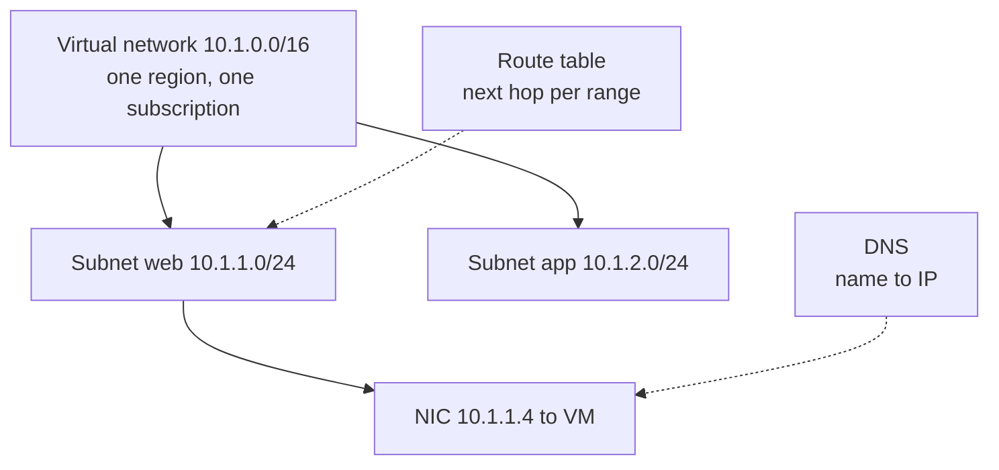

# Networking: IP Addresses, Subnets, Routing and DNS

> **Foundation primer.** Not an exam objective by itself: it explains what the AZ-104 lessons assume.

## The problem

Servers need addresses to find each other, a way to decide where each packet goes, and names that people can
remember. In Azure you design all of that yourself, and a mistake made on day one, such as an address range that
overlaps the office network, is expensive to undo.

## In plain English

An **IP address** identifies a network interface. **Private** addresses (10.x.x.x, 172.16-31.x.x, 192.168.x.x) are
used inside networks; **public** addresses are reachable from the internet.

Address ranges are written in **CIDR notation**: `10.1.0.0/16` means "the first 16 bits are fixed". The smaller the
number after the slash, the larger the range: a /16 holds 65,536 addresses, a /24 holds 256.

A **virtual network** (VNet) is your private network in one Azure region and one subscription, with an address space
you choose. You divide it into **subnets** and place resources in them. Azure keeps five addresses in every subnet
for itself, so a /24 leaves 251 for you.

**Routing** decides the next hop for each packet. Azure adds system routes so subnets in a VNet can reach each other
and the internet; **user-defined routes** override them, for example to send traffic through a firewall appliance.

**DNS** turns names into addresses. Azure provides DNS inside every VNet; Azure DNS can also host your own public
and private zones.

## Words you need to know

| Term | In plain English |
| --- | --- |
| **IP address** | The number that identifies a network interface. |
| **Private / public IP** | Used inside networks / reachable from the internet. |
| **CIDR** | Range notation: address plus how many leading bits are fixed (/16, /24). |
| **Address space** | The ranges a virtual network owns. Peered networks can't overlap. |
| **Subnet** | A slice of a virtual network's address space. Azure reserves five addresses in each. |
| **Route / next hop** | Where traffic for a destination range is sent next. |
| **User-defined route (UDR)** | A route you add in a route table to override Azure's system routes. |
| **DNS** | The service that resolves names such as www.contoso.com to IP addresses. |

## Mental model

| Everyday idea | Azure name |
| --- | --- |
| A company's internal network | Virtual network |
| Floors of the office | Subnets |
| A desk's phone extension | Private IP on a NIC |
| A public phone number | Public IP address |
| Signposts at junctions | Routes and route tables |
| The phone book | DNS |

| CIDR | Addresses | Usable in an Azure subnet |
| --- | --- | --- |
| /24 | 256 | 251 |
| /26 | 64 | 59 |
| /28 | 16 | 11 |

This is a teaching model; [04-01 Virtual Networks](../04-networking/04-01-virtual-networks.md) covers peering, public IPs and user-defined routes in detail.

## Where this shows up in AZ-104

- Virtual networks, subnets, peering, public IPs and routes ([04-01 Virtual Networks](../04-networking/04-01-virtual-networks.md)).
- Filtering traffic with NSGs and private access to PaaS ([04-02 Secure Access to Virtual Networks](../04-networking/04-02-secure-access.md)).
- Azure DNS and load balancing ([04-03 Name Resolution and Load Balancing](../04-networking/04-03-dns-and-load-balancing.md)).
- Storage firewalls that allow specific subnets ([02-01 Configuring Access to Storage](../02-storage/02-01-storage-access.md)).

## Check yourself

1. How many addresses can you use in a /27 subnet in Azure?
2. A VM in West Europe must connect to a VNet in North Europe. Can its NIC be in that VNet?
3. What decides whether traffic to 0.0.0.0/0 goes to the internet or to a firewall appliance?

## Teach it back

- Explain CIDR to a colleague using the idea of fixed and free digits.
- Explain why choosing non-overlapping address spaces matters before you build anything.

## Key takeaways

- A virtual network lives in one region and one subscription; resources must match both to connect.
- Subnets slice the address space; Azure reserves five addresses per subnet.
- Routes decide next hops; user-defined routes override system routes.
- DNS resolves names; Azure provides it inside VNets and hosts your zones.

## Sources

- Microsoft Learn: [Azure Virtual Network concepts and best practices](https://learn.microsoft.com/en-us/azure/virtual-network/concepts-and-best-practices)
- Microsoft Learn: [Plan virtual networks](https://learn.microsoft.com/en-us/azure/virtual-network/virtual-network-vnet-plan-design-arm)
- Microsoft Learn: [Virtual network traffic routing](https://learn.microsoft.com/en-us/azure/virtual-network/virtual-networks-udr-overview)
- Microsoft Learn: [Azure Virtual Network FAQ](https://learn.microsoft.com/en-us/azure/virtual-network/virtual-networks-faq)
- Microsoft Learn: [What is Azure DNS?](https://learn.microsoft.com/en-us/azure/dns/dns-overview)
