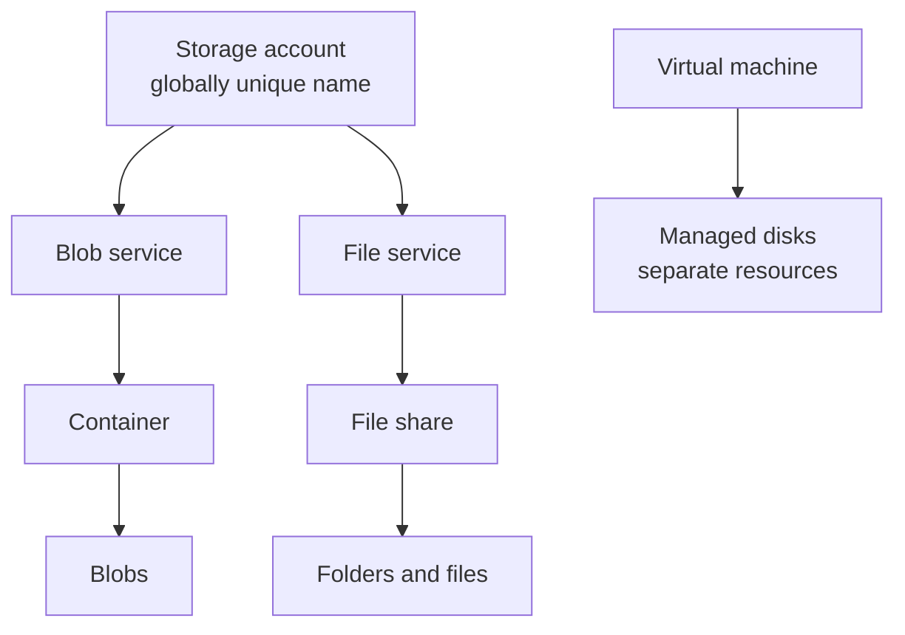

# Storage and Persistent Data

> **Foundation primer.** Not an exam objective by itself: it explains what the AZ-104 lessons assume.

## The problem

Data has to outlive the things that create it. A VM can be deleted, an app redeployed, a server replaced, and the
files, backups and logs must still be there, protected from loss and reachable only by the right people.

## In plain English

**Persistent** storage keeps data until you delete it; temporary storage doesn't. Azure gives administrators two
main kinds of persistent storage.

A **storage account** is a named container for data services: **blobs** (files of any kind stored as objects in
containers, reached over HTTPS), **file shares** (Azure Files, mounted like a network drive), queues and tables. Its
name must be unique across all of Azure, 3 to 24 lowercase letters and numbers, because it becomes part of web
addresses such as `https://<name>.blob.core.windows.net`.

A **managed disk** is a VM's drive. Azure manages the storage behind it; you choose only the type and size, and you
don't create a storage account for it.

Azure always keeps several copies of your data. **Redundancy** settings choose where those copies are: one
datacenter, three availability zones, or a second region too. Redundancy protects against hardware and site
failures, not against someone deleting the data: a deletion is copied as well. That's what soft delete, versioning
and backup are for.

## Words you need to know

| Term | In plain English |
| --- | --- |
| **Persistent storage** | Storage that keeps data until you delete it. |
| **Storage account** | A uniquely named container for blobs, files, queues and tables, with its own settings and endpoints. |
| **Blob / container** | A file stored as an object, and the folder-like container that holds blobs. |
| **File share** | An Azure Files share that clients mount over SMB or NFS. |
| **Managed disk** | A VM's persistent drive; Azure manages the storage behind it. |
| **Redundancy** | How many copies Azure keeps and where: LRS, ZRS, GRS, GZRS. |
| **Endpoint** | The web address a storage service is reached at. |
| **Access tier** | Hot, cool, cold or archive: cheaper storage in exchange for costlier or slower access. |

## Mental model

| Everyday idea | Azure name |
| --- | --- |
| A warehouse with a street address | Storage account and its endpoints |
| Boxes on shelves, fetched by label | Blobs in containers |
| A shared office drive | Azure Files share |
| A computer's own hard drive | Managed disk |
| Photocopies kept in other buildings | Redundancy (ZRS, GRS) |

This is a teaching model; [02-02 Storage Accounts](../02-storage/02-02-storage-accounts.md) covers account types, redundancy and encryption.

## Where this shows up in AZ-104

- Access to storage: firewalls, SAS, keys, identity ([02-01 Configuring Access to Storage](../02-storage/02-01-storage-access.md)).
- Accounts, redundancy, replication, encryption and data tools ([02-02 Storage Accounts](../02-storage/02-02-storage-accounts.md)).
- Containers, shares, tiers, soft delete, versioning and lifecycle ([02-03 Azure Files and Blob Storage](../02-storage/02-03-files-and-blobs.md)).
- VM disks ([03-02 Virtual Machines](../03-compute/03-02-virtual-machines.md)).

## Check yourself

1. Is `Contoso_Data` a valid storage account name? Why not?
2. Does geo-redundant storage protect you from an administrator deleting a container?
3. Do you need a storage account to give a VM a data disk?

## Teach it back

- Explain the difference between a storage account and a managed disk to someone who has used only a laptop.
- Explain why redundancy and backup solve different problems.

## Key takeaways

- A storage account holds blobs, files, queues and tables under a globally unique name.
- Blobs are objects reached by URL; Azure Files are shares you mount.
- Managed disks are VM drives with no storage account to manage.
- Redundancy copies everything, including deletions; recovery features handle mistakes.

## Sources

- Microsoft Learn: [Storage account overview](https://learn.microsoft.com/en-us/azure/storage/common/storage-account-overview)
- Microsoft Learn: [Introduction to Azure Storage](https://learn.microsoft.com/en-us/azure/storage/common/storage-introduction)
- Microsoft Learn: [Azure Storage redundancy](https://learn.microsoft.com/en-us/azure/storage/common/storage-redundancy)
- Microsoft Learn: [Azure managed disks overview](https://learn.microsoft.com/en-us/azure/virtual-machines/managed-disks-overview)
