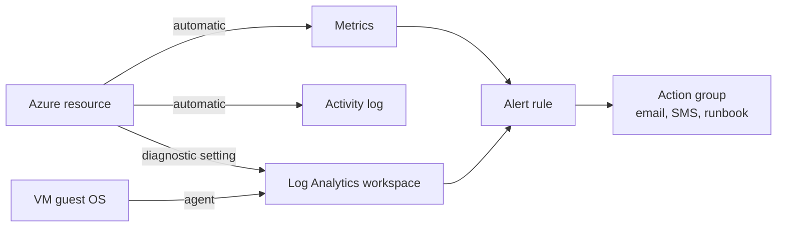

# Monitoring: Metrics and Logs

> **Foundation primer.** Not an exam objective by itself: it explains what the AZ-104 lessons assume.

## The problem

At 2 a.m. a VM sits at 100% CPU and nobody notices until customers complain. The next morning an auditor asks who
deleted a storage account last week. The first problem needs a number watched in real time; the second needs a
record kept and searchable. An administrator needs both, set up before anything goes wrong.

## In plain English

**Azure Monitor** is the platform that collects and analyzes monitoring data. It keeps two kinds.

**Metrics** are numbers sampled over time: CPU percentage, transactions per minute, available memory. Most Azure
resources send **platform metrics** automatically, with no setup, and they are ideal for charts and fast alerts.

**Logs** are records with many fields: who did what, which request failed, with what error. They're stored in a
**Log Analytics workspace** and searched with a query language, **KQL**. The **activity log**, which records
management operations on resources (create, update, delete), is collected automatically. A resource's own detailed
logs are collected only after you create a **diagnostic setting** that sends them somewhere. Data from inside a VM's
operating system needs an agent.

**Alert rules** watch metrics or logs and fire when a condition is met; **action groups** decide who is notified and
what runs.

## Words you need to know

| Term | In plain English |
| --- | --- |
| **Azure Monitor** | Azure's platform for collecting, analyzing and alerting on monitoring data. |
| **Metric** | A number sampled over time, such as CPU percentage. |
| **Log** | A record with many fields, stored in a workspace and queried with KQL. |
| **Activity log** | The automatic record of management operations: who changed what, and when. |
| **Resource log** | A resource's own detailed log, collected only through a diagnostic setting. |
| **Diagnostic setting** | A rule that sends a resource's logs (and metrics) to a workspace, storage account or event hub. |
| **Log Analytics workspace** | Where logs are stored and queried. |
| **Alert rule / action group** | A condition to watch / who to notify and what to run when it fires. |

## Mental model

| Everyday idea | Azure name |
| --- | --- |
| A car's dashboard gauges | Metrics |
| The car's service log book | Logs in a workspace |
| The building's visitor book | Activity log |
| Turning on a camera you want recordings from | Diagnostic setting |
| The warning light and who gets called | Alert rule and action group |

This is a teaching model; [05-01 Monitoring Resources in Azure](../05-monitor/05-01-monitor-resources.md) covers each part in detail.

## Where this shows up in AZ-104

- Metrics, log settings, KQL, alerts, Insights and Network Watcher ([05-01 Monitoring Resources in Azure](../05-monitor/05-01-monitor-resources.md)).
- Backup alerts and reports ([05-02 Backup and Recovery](../05-monitor/05-02-backup-and-recovery.md)).
- Load balancer health metrics ([04-03 Name Resolution and Load Balancing](../04-networking/04-03-dns-and-load-balancing.md)).

## Check yourself

1. Which is collected without any setup: a storage account's transaction metric, or its blob read logs?
2. Where would you look to find who deleted a VM yesterday?
3. What sends an SMS when an alert fires?

## Teach it back

- Explain metrics versus logs using a car's dashboard and its service book.
- Explain why a diagnostic setting has to exist before an incident, not after.

## Key takeaways

- Metrics are numbers over time; platform metrics are automatic.
- Logs are detailed records in a workspace, queried with KQL.
- The activity log is automatic; resource logs need a diagnostic setting.
- Alert rules watch the data; action groups act on it.

## Sources

- Microsoft Learn: [Azure Monitor overview](https://learn.microsoft.com/en-us/azure/azure-monitor/overview)
- Microsoft Learn: [Azure Monitor activity log](https://learn.microsoft.com/en-us/azure/azure-monitor/essentials/activity-log)
- Microsoft Learn: [Azure control plane and data plane](https://learn.microsoft.com/en-us/azure/azure-resource-manager/management/control-plane-and-data-plane)
