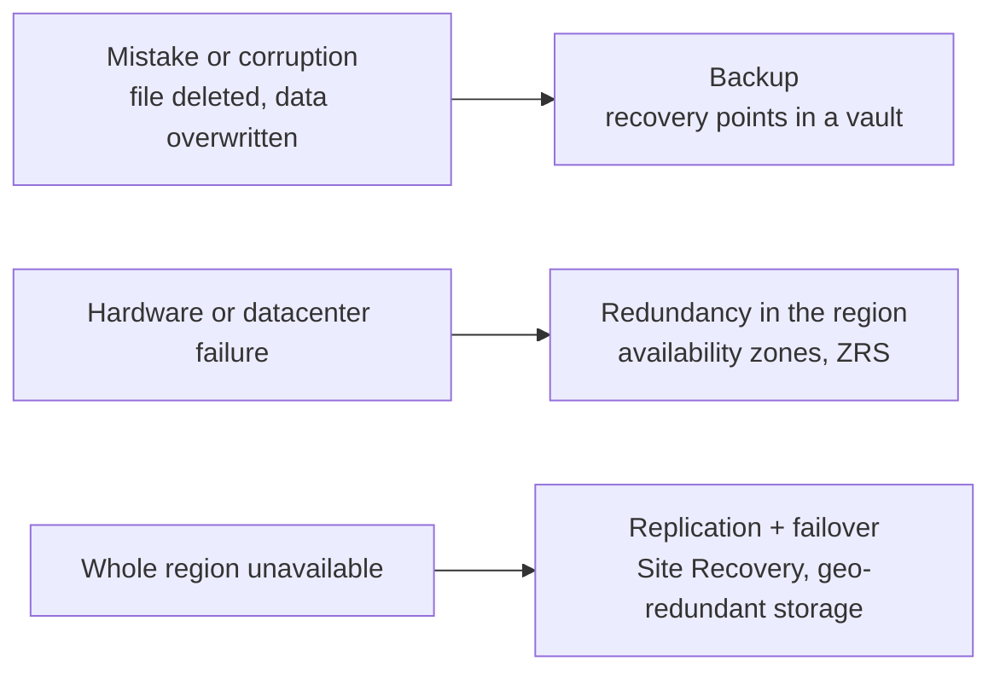

# Backup, Recovery and Resilience

> **Foundation primer.** Not an exam objective by itself: it explains what the AZ-104 lessons assume.

## The problem

Things go wrong in three very different ways. Someone deletes or overwrites data by mistake. A piece of hardware,
or a whole datacenter, fails. Or an entire region becomes unavailable. An administrator has to decide, before any
of it happens, how much data the business can afford to lose and how long it can afford to be down, and then pick
the protection that matches each kind of failure.

## In plain English

**Resilience** means the workload keeps running when part of the platform fails. You get it by keeping more than
one copy of things in more than one place: several VMs instead of one, storage that replicates across availability
zones, a load balancer that stops sending traffic to an instance that fails.

**Backup** means you can go back in time. A backup is a copy of data *as it was* at a moment, kept somewhere
separate, so you can restore it after a deletion, a corruption or a ransomware attack. Replication alone doesn't do
this: if you delete a file, a replica deletes it too.

**Disaster recovery** means you can run the workload *somewhere else* when its home region is down. Azure Site
Recovery keeps a near-current copy of a VM replicating to another region and lets you fail over to it.

Two numbers describe what the business needs:

- **RPO** (recovery point objective): how much recent data you can lose, measured in time. A nightly backup means up
  to a day of changes can be lost.
- **RTO** (recovery time objective): how long you can be down before the workload is back.

## Words you need to know

| Term | In plain English |
| --- | --- |
| **Resilience** | Keeping a workload running through a failure, usually with redundant copies. |
| **Redundancy** | More than one copy of something, so losing one copy doesn't lose the service or the data. |
| **Backup** | A point-in-time copy kept separately, so you can restore data as it was. |
| **Recovery point** | One restorable copy, taken at a known time. |
| **RPO** | Recovery point objective: the most recent data you can afford to lose, measured in time. |
| **RTO** | Recovery time objective: how long you can be down before service is back. |
| **Replication** | Continuously copying data or a VM to another place, so the copy stays near-current. |
| **Failover** | Switching a workload to run from its replica, typically in another region. |
| **Vault** | The Azure resource that holds backups and replication settings: a Recovery Services vault or a Backup vault. |
| **Soft delete** | Deleted items are kept for a retention period and can be recovered before they're gone for good. |

## Mental model

Each kind of failure has its own answer, and none of them covers the others. Zone-redundant storage survives a
datacenter fire but faithfully replicates an accidental delete. A nightly backup restores yesterday's file but won't
keep the application running while a region is down. This is a teaching model;
[05-02 Backup and Recovery](../05-monitor/05-02-backup-and-recovery.md) covers the services in detail.

| Everyday idea | Azure name |
| --- | --- |
| A photo album of how things looked on each date | Recovery points in a vault |
| A spare generator in the same building | Redundancy across availability zones |
| A second office in another city, kept in sync | Site Recovery replication to another region |
| The recycle bin | Soft delete |

## Where this shows up in AZ-104

- Vaults, backup policies, backup and restore, Site Recovery and failover, backup reports and alerts
  ([05-02 Backup and Recovery](../05-monitor/05-02-backup-and-recovery.md)).
- Storage redundancy options ([02-02 Storage Accounts](../02-storage/02-02-storage-accounts.md)) and soft delete,
  versioning and snapshots for blobs and file shares ([02-03 Azure Files and Blob Storage](../02-storage/02-03-files-and-blobs.md)).
- Availability zones, availability sets and scale sets for VMs ([03-02 Virtual Machines](../03-compute/03-02-virtual-machines.md)).
- App Service backups ([03-04 Azure App Service](../03-compute/03-04-app-service.md)).

## Check yourself

1. Storage is zone-redundant. A user deletes a blob by mistake. Does zone redundancy bring it back? What would?
2. The business says "we can lose at most one hour of data". Is that an RPO or an RTO?
3. A region is unavailable for a day. Which helps you keep the VM running: last night's backup, or Site Recovery?

## Teach it back

- Explain the difference between backup, redundancy and disaster recovery using a family's photos, a spare tyre and a
  holiday home.
- Explain why replication is not a backup.

## Key takeaways

- Backup goes back in time; redundancy and replication keep things running.
- Pick protection per failure: a mistake, a datacenter, a region.
- RPO is how much data you can lose; RTO is how long you can be down.
- Soft delete is the safety net for deletions; a vault holds backups and replication settings.

## Sources

- Microsoft Learn: [What is the Azure Backup service?](https://learn.microsoft.com/en-us/azure/backup/backup-overview)
- Microsoft Learn: [About Site Recovery](https://learn.microsoft.com/en-us/azure/site-recovery/site-recovery-overview)
- Microsoft Learn: [What are availability zones?](https://learn.microsoft.com/en-us/azure/reliability/availability-zones-overview)
- Microsoft Learn: [Azure Storage redundancy](https://learn.microsoft.com/en-us/azure/storage/common/storage-redundancy)
