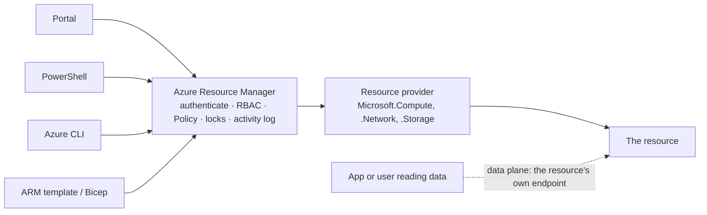

# Azure Resource Manager

> **Foundation primer.** Not an exam objective by itself: it explains what the AZ-104 lessons assume.

## The problem

An administrator can create a VM by clicking in the portal, by running a PowerShell cmdlet, by typing an Azure CLI
command or by deploying a template. If each of those tools talked to Azure in its own way, they would behave
differently, and access control, policy and auditing would each need four implementations. Something has to sit in
the middle so that every request, from every tool, is checked and handled the same way.

## In plain English

**Azure Resource Manager** is that middle layer: the deployment and management service for Azure. Every request to
create, change or delete a resource goes to Resource Manager first, whichever tool sent it. Resource Manager:

1. **authenticates** the caller (who is this?) and **authorizes** the request against their Azure role assignments
   (may they do this here?);
2. checks **Azure Policy** and **resource locks**;
3. records the operation in the **activity log**;
4. hands the request to the **resource provider** that does the work, such as `Microsoft.Compute` for a VM.

Because everything goes through one API, what you can do in the portal you can also do in PowerShell, the CLI, the
REST API or a template, with the same result.

This is the **control plane**: managing resources. Using what's inside a resource, such as reading a blob or
signing in to a VM, is the **data plane**, and those requests go to the resource's own endpoint instead. That is why
a resource lock that stops someone deleting a storage account doesn't stop them deleting the blobs inside it.

## Words you need to know

| Term | In plain English |
| --- | --- |
| **Azure Resource Manager** | The single management service every tool talks to when it creates, changes or deletes a resource. |
| **Control plane** | Managing resources: create, configure, delete. Sent to Resource Manager at management.azure.com. |
| **Data plane** | Using a resource's contents or service, such as reading a blob. Sent to the resource's own endpoint. |
| **Resource ID** | A resource's full address: subscription, resource group, provider namespace, type and name. |
| **Declarative** | Describing the end state you want ("this VM should exist") rather than the steps to build it. |
| **Deployment** | One run of a template against a scope, recorded with its inputs and result. |
| **Activity log** | The record of control-plane operations: who did what, to which resource, and when. |

## Mental model



One front door for management, with the same checks on every request; a separate door for the data. This is a
teaching model; [03-01 ARM Templates and Bicep](../03-compute/03-01-arm-and-bicep.md) builds on it.

A resource ID spells out where a resource sits, which is why the same name can exist in two resource groups:

```text
/subscriptions/<subscription-id>/resourceGroups/rg-web/providers/Microsoft.Network/virtualNetworks/vnet-web
```

| Everyday idea | Azure name |
| --- | --- |
| A building's single reception desk that checks every visitor | Azure Resource Manager |
| The visitor log at reception | Activity log |
| A postal address down to the apartment | Resource ID |
| An architect's drawing of the finished house | A declarative template |

## Where this shows up in AZ-104

- Reading, changing, deploying, exporting and converting templates
  ([03-01 ARM Templates and Bicep](../03-compute/03-01-arm-and-bicep.md)).
- Role assignments are checked by Resource Manager, while data roles govern the data plane
  ([01-02 Azure Role-Based Access Control](../01-identities-governance/01-02-azure-rbac.md),
  [02-01 Configuring Access to Storage](../02-storage/02-01-storage-access.md)).
- Policy, locks and moving resources between groups and subscriptions
  ([01-03 Subscriptions and Governance](../01-identities-governance/01-03-subscriptions-and-governance.md)).
- The activity log as a monitoring source ([05-01 Monitoring Resources in Azure](../05-monitor/05-01-monitor-resources.md)).

## Check yourself

1. You create a VM in the portal and a colleague creates one with the Azure CLI. Do both requests pass the same Azure
   Policy checks?
2. A storage account has a CanNotDelete lock. Can a user with access still delete blobs inside it? Why?
3. Name the parts of a resource ID, from the outside in.

## Teach it back

- Explain Resource Manager using a building reception desk and its visitor log.
- Explain the difference between the control plane and the data plane with one example of each.

## Key takeaways

- Every management request, from every tool, goes through Azure Resource Manager.
- Resource Manager authenticates, applies RBAC, Policy and locks, logs the operation, then hands it to a resource
  provider.
- Managing a resource (control plane) and using its data (data plane) are separate paths with separate permissions.
- Templates describe the end state declaratively; Resource Manager works out how to get there.

## Sources

- Microsoft Learn: [What is Azure Resource Manager?](https://learn.microsoft.com/en-us/azure/azure-resource-manager/management/overview)
- Microsoft Learn: [Azure control plane and data plane](https://learn.microsoft.com/en-us/azure/azure-resource-manager/management/control-plane-and-data-plane)
- Microsoft Learn: [Azure resource providers and types](https://learn.microsoft.com/en-us/azure/azure-resource-manager/management/resource-providers-and-types)
