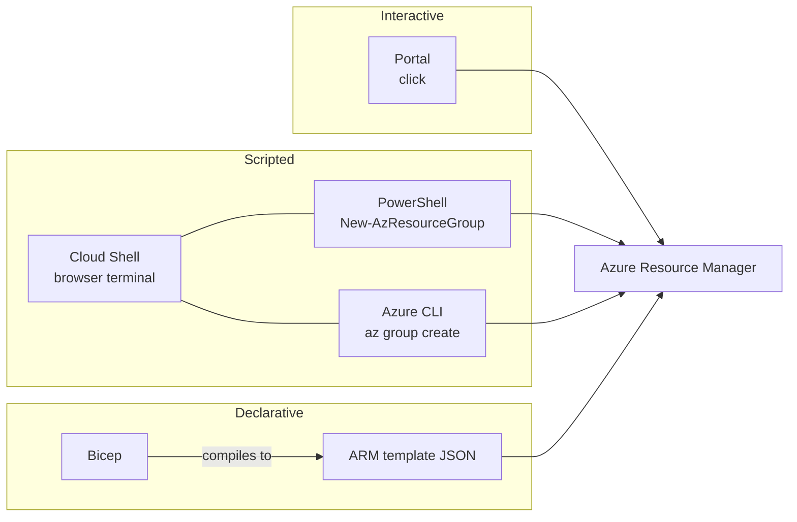

# Portal, Cloud Shell, PowerShell, Azure CLI, ARM and Bicep

> **Foundation primer.** Not an exam objective by itself: it explains what the AZ-104 lessons assume.

## The problem

The AZ-104 audience profile expects experience with the Azure portal, PowerShell, the Azure CLI, and ARM templates or
Bicep files. A beginner meets all of them in the first week and can't yet tell which one to reach for, or why a lab
shows the same task three ways. They are not competing products: they are different doors into the same service.

## In plain English

Every tool below sends its requests to **Azure Resource Manager** ([0A-11](0A-11-azure-resource-manager.md)), so they
can all do the same things. They differ in how you work:

- **Azure portal**: the website. Best for exploring, for one-off changes, and for seeing a resource's settings laid out.
  Easy to start, hard to repeat exactly.
- **Azure Cloud Shell**: a terminal in the browser, already signed in, with Azure PowerShell and the Azure CLI
  installed. Choose Bash or PowerShell. An **ephemeral session** needs no storage account, but its files are deleted
  when the session ends; mounting a storage account keeps your `$HOME` between sessions.
- **Azure PowerShell** (the `Az` modules): cmdlets named verb-noun, such as `New-AzResourceGroup`. Returns objects you
  can pipe and filter.
- **Azure CLI**: commands that start with `az`, such as `az group create`. Returns JSON you can filter with `--query`.
- **ARM templates** (JSON) and **Bicep files**: describe the resources you want, then deploy that description. Best
  when the same thing must be built again, reviewed or kept in source control. Bicep compiles to an ARM template.

## Words you need to know

| Term | In plain English |
| --- | --- |
| **Azure portal** | The website for managing Azure. |
| **Cloud Shell** | A browser terminal that is already signed in and has the Azure tools installed. |
| **Ephemeral session** | A Cloud Shell session with no storage account: fastest to start, and nothing you save persists. |
| **Azure PowerShell** | The Az PowerShell modules: cmdlets such as Get-AzVM and New-AzResourceGroup. |
| **Azure CLI** | The az command-line tool: commands such as az vm list and az group create. |
| **Infrastructure as code** | Describing resources in files that can be versioned, reviewed and deployed again. |
| **ARM template** | A JSON file describing resources for Resource Manager to deploy. |
| **Bicep** | A simpler language for the same thing; it compiles to an ARM template before deployment. |
| **Context** | Which account and subscription your PowerShell or CLI session is currently working in. |

## Mental model



Pick by the job: the portal to look and learn, a command to do something now and record what you did, a template to
build the same thing again. Cloud Shell isn't a fourth language: it's a convenient place to run PowerShell or the CLI.
This is a teaching model; [03-01 ARM Templates and Bicep](../03-compute/03-01-arm-and-bicep.md) teaches the templates.

The same task, three ways:

```powershell
# Azure PowerShell
New-AzResourceGroup -Name rg-demo -Location <region>
```

```bash
# Azure CLI
az group create --name rg-demo --location <region>
```

Portal: **Resource groups** > **Create** > choose the subscription, a name and a region > **Review + create**.

Before you run anything, check where it will land: `Get-AzContext` in PowerShell, `az account show` in the CLI. Most
"I created it in the wrong place" mistakes are a wrong subscription context.

| Everyday idea | Azure name |
| --- | --- |
| Using an app by tapping around | Azure portal |
| Typing instructions you can save and repeat | PowerShell or Azure CLI |
| A terminal you can open from any browser | Cloud Shell |
| A blueprint the builder follows | ARM template or Bicep file |

## Where this shows up in AZ-104

- Every lab gives PowerShell or CLI commands and portal paths ([00-00 Your Lab Subscription and Conventions](../00-lab-safety/00-00-module-overview.md)).
- Interpreting, modifying, deploying, exporting and converting templates ([03-01 ARM Templates and Bicep](../03-compute/03-01-arm-and-bicep.md)).
- AzCopy and Storage Explorer, two more data tools ([02-02 Storage Accounts](../02-storage/02-02-storage-accounts.md)).

## Check yourself

1. You must build the same three resources in five subscriptions, identically. Which tool fits best, and why?
2. You saved a script in an ephemeral Cloud Shell session yesterday. Is it still there today?
3. Which command shows the subscription your Azure CLI session will create resources in?

## Teach it back

- Explain why the portal, PowerShell, the CLI and templates can all do the same things.
- Explain when you'd choose a template over a script.

## Key takeaways

- All the tools talk to Azure Resource Manager, so they can do the same things.
- The portal is for exploring; commands are for doing and recording; templates are for repeating.
- Cloud Shell is a signed-in terminal; an ephemeral session keeps nothing.
- Check your context (account and subscription) before every change.

## Sources

- Microsoft Learn: [What is Azure Cloud Shell?](https://learn.microsoft.com/en-us/azure/cloud-shell/overview)
- Microsoft Learn: [Get started with Azure Cloud Shell ephemeral sessions](https://learn.microsoft.com/en-us/azure/cloud-shell/get-started/ephemeral)
- Microsoft Learn: [What is Azure Resource Manager?](https://learn.microsoft.com/en-us/azure/azure-resource-manager/management/overview)
- Microsoft Learn: [What is Bicep?](https://learn.microsoft.com/en-us/azure/azure-resource-manager/bicep/overview)
