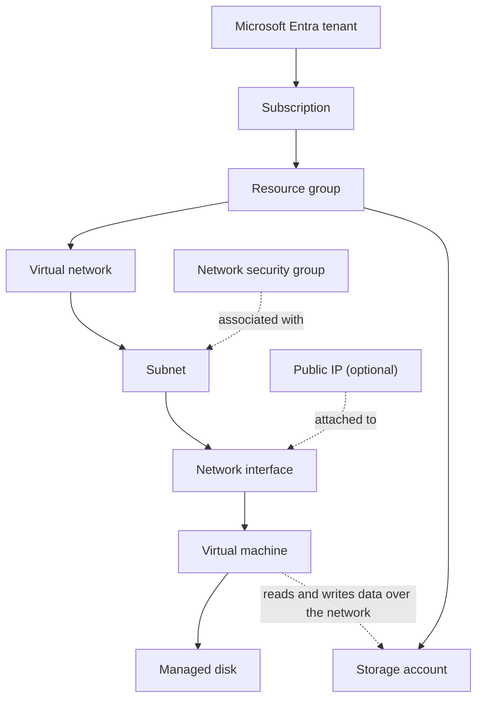

# How Azure Resources Fit Together

> **Foundation primer.** Not an exam objective by itself: it explains what the AZ-104 lessons assume.

## The problem

Almost nothing in Azure works alone. A virtual machine needs a network interface, which needs a subnet, which lives in
a virtual network, which lives in a resource group in a subscription that trusts a tenant. Change, secure, monitor or
delete one piece without knowing what it is attached to, and something else breaks, keeps billing, or stays exposed.
Most AZ-104 troubleshooting questions are really questions about these relationships.

## In plain English

Two different relationships connect resources, and it helps to keep them apart:

- **Containment**: what a resource *lives in*. A VM lives in a resource group, in a subscription. Containment decides
  which role assignments, policies and locks reach it, whose bill it lands on, and what disappears when a container is
  deleted.
- **Dependency**: what a resource *needs to work*. A VM needs a network interface and an OS disk; a network interface
  needs a subnet. Dependencies decide what breaks when something changes, and the order things can be created and
  deleted.

They don't always line up. A network interface can sit in a different resource group from its VM and its virtual
network, yet it must be in the **same region and subscription** as both. A storage account's data is used over the
network by a VM, but neither contains the other.

## Words you need to know

| Term | In plain English |
| --- | --- |
| **Containment** | Which container a resource lives in: tenant, management group, subscription, resource group. |
| **Dependency** | Another resource this one needs in order to work, such as a VM needing a network interface. |
| **Network interface (NIC)** | The resource that connects a VM to a subnet and holds its private IP. |
| **Blast radius** | Everything affected when one thing changes or is deleted. |
| **Orphaned resource** | Something left behind, often still billing, after the thing that used it was deleted. |
| **Region** | Where a resource physically runs. Connected resources such as a VM, its NIC and its virtual network must share one. |

## Mental model

Solid arrows read top to bottom as "contains" or "is connected through"; dotted lines are attachments and network use.
This is a **conceptual teaching model**, not a complete architecture: real deployments add load balancers, private
endpoints, Bastion, monitoring and backup around the same core. The [resource map](#/map) lets you click any of these
pieces and see the same ten questions answered for it.

### Ten questions to ask about any resource

Every lesson in this Academy answers these for the resources it teaches, in a section called **Where it fits**:

1. **What contains it?** Resource group, subscription, region.
2. **What does it depend on?** What must exist first.
3. **What depends on it?** What breaks if you change or delete it.
4. **Who can manage it?** Which roles, at which scope.
5. **How is it networked?** Public, private, or not at all.
6. **How is it monitored?** Metrics, logs, insights.
7. **How is it protected?** Access, network rules, encryption, locks.
8. **How is it recovered?** Backup, soft delete, replication, redeploying from a template.
9. **What does it cost?** And whether it bills while idle.
10. **How is it removed safely?** In what order, and what gets left behind.

### Worked example: one virtual machine

| Question | For the VM in the diagram |
| --- | --- |
| Contains it | The resource group, in the subscription. Its region was chosen at creation. |
| Depends on | A network interface in a subnet of a virtual network in the same region and subscription; a managed OS disk; an image. |
| Depends on it | Anything sending traffic to it; backup items; alert rules scoped to it. |
| Who manages it | Azure roles such as Virtual Machine Contributor at its scope or above. Signing in to its operating system is a separate permission. |
| Networked | Through its network interface: a private IP from the subnet, optionally a public IP. |
| Monitored | Host metrics automatically; guest metrics and logs need the Azure Monitor Agent. |
| Protected | NSGs on the subnet or NIC, no open management ports, disk encryption. |
| Recovered | Azure Backup restores; Site Recovery fails it over to another region. |
| Costs | Compute while it's allocated; its disks bill even when it's deallocated. |
| Removed safely | Deleting the VM doesn't necessarily delete its disks, NIC and public IP. Check for leftovers, or delete the whole resource group. |

| Everyday idea | Azure name |
| --- | --- |
| The building, floor and room a desk sits in | Containment: subscription, resource group, region |
| The power and network cables a desk needs | Dependencies: NIC, subnet, disk |
| Equipment left plugged in after someone moves out | Orphaned resources |

## Where this shows up in AZ-104

- Creating VMs, moving them between resource groups, subscriptions and regions, and managing their disks
  ([03-02 Virtual Machines](../03-compute/03-02-virtual-machines.md)).
- Virtual networks, subnets, NICs and routing ([04-01 Virtual Networks](../04-networking/04-01-virtual-networks.md)) and
  where NSGs attach ([04-02 Secure Access to Virtual Networks](../04-networking/04-02-secure-access.md)).
- Scopes for roles, policy and locks ([01-02 Azure Role-Based Access Control](../01-identities-governance/01-02-azure-rbac.md),
  [01-03 Subscriptions and Governance](../01-identities-governance/01-03-subscriptions-and-governance.md)).
- Teardown order in every lab ([00-02 Teardown and Verification](../00-lab-safety/00-02-teardown-checklist-template.md)).

## Check yourself

1. A NIC is in resource group A and its VM is in resource group B. Is that allowed? Can the NIC be in a different
   region from the VM?
2. You delete a VM. Name two resources that might still exist and still bill.
3. An NSG blocks traffic to a VM. Name the two places that NSG could be associated.

## Teach it back

- Draw the diagram above from memory and explain the difference between a solid and a dotted line.
- Pick any resource from a lab and answer the ten questions out loud.

## Key takeaways

- Containment decides inheritance, billing and what a delete removes; dependency decides what breaks.
- A NIC, its VM and its virtual network must share a region and a subscription, but can sit in different resource groups.
- Ask the ten questions before you change or delete anything.
- Deleting a VM can leave disks, NICs and public IPs behind; deleting the resource group removes everything in it.

## Sources

- Microsoft Learn: [Virtual networks and virtual machines in Azure](https://learn.microsoft.com/en-us/azure/virtual-network/network-overview)
- Microsoft Learn: [Create, change, or delete a network interface](https://learn.microsoft.com/en-us/azure/virtual-network/virtual-network-network-interface)
- Microsoft Learn: [What is Azure Resource Manager?](https://learn.microsoft.com/en-us/azure/azure-resource-manager/management/overview)
- Microsoft Learn: [Azure managed disks overview](https://learn.microsoft.com/en-us/azure/virtual-machines/managed-disks-overview)
